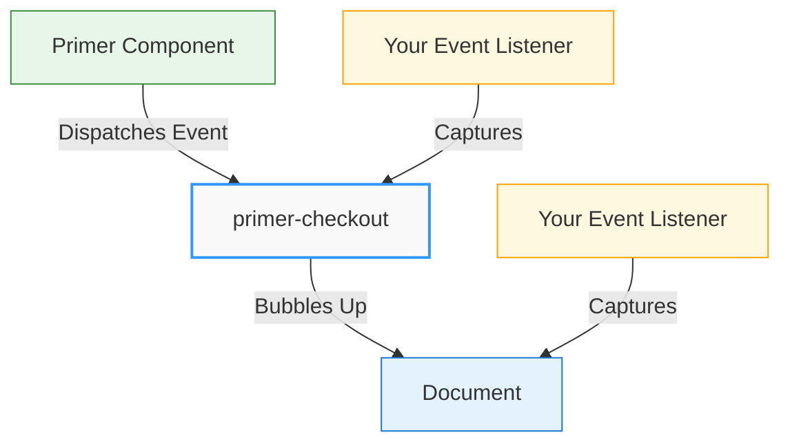

# Events Guide

Primer Checkout uses an event-driven architecture that allows you to monitor and respond to the payment lifecycle. This guide explains how to work with events, understand their payloads, and implement best practices for event handling.

:::tip Practical Event Guide
This guide focuses on **how to use** Primer events and callbacks with practical examples and patterns for implementing event-driven payment flows.
:::

## Understanding Event-Driven Architecture

Primer Checkout communicates state changes, user interactions, and payment results through custom DOM events. This approach provides several benefits:

1. **Decoupled Integration**: Your application code doesn't need direct references to internal SDK state
2. **Flexible Handling**: Events can be captured at any level of the DOM hierarchy
3. **Standard Pattern**: Uses browser-native event APIs familiar to all web developers
4. **Framework Agnostic**: Works consistently across vanilla JavaScript, React, Vue, Svelte, and other frameworks

### How Events Work

When significant actions occur within Primer Checkout (state changes, validation results, payment completion), the SDK dispatches custom events that bubble up through the DOM. You can listen for these events and respond accordingly.



## Event Listening Approaches

Primer events can be captured in two ways: at the component level or at the document level. Both approaches are valid, and your choice depends on your application architecture.

### Component-Level Listening

Listen for events directly on the `primer-checkout` component:

```javascript
const checkout = document.querySelector('primer-checkout');

checkout.addEventListener('primer:state-change', (event) => {
  const { isProcessing, isSuccessful, error } = event.detail;
  // Handle state changes
});
```

**When to use:**

- You want to scope listeners to specific checkout instances
- You prefer organizing event handlers per component
- You need to manage multiple checkout flows on different pages

### Document-Level Listening

Listen for events at the document level where all Primer events bubble:

```javascript
document.addEventListener('primer:state-change', (event) => {
  const { isProcessing, isSuccessful, error } = event.detail;
  // Handle state changes
});

document.addEventListener('primer:card-success', (event) => {
  const result = event.detail.result;
  // Handle card success
});

document.addEventListener('primer:card-error', (event) => {
  const errors = event.detail.errors;
  // Handle card errors
});
```

**When to use:**

- You prefer centralized event handling
- You want to ensure you catch all events regardless of component location
- Your application has a single checkout flow
- You're implementing global analytics or error tracking

:::tip Choosing an Approach
Both approaches are equally valid and will receive the same events. Choose the pattern that best fits your application's architecture and your team's preferences.
:::

### Ensuring Components Exist

When using component-level listening, ensure the component exists in the DOM before attaching listeners:

```javascript
// ✅ CORRECT: Wait for component to exist
document.addEventListener('DOMContentLoaded', () => {
  const checkout = document.querySelector('primer-checkout');
  if (checkout) {
    checkout.addEventListener('primer:state-change', handleStateChange);
  }
});

// ❌ WRONG: May run before component is rendered
const checkout = document.querySelector('primer-checkout');
checkout.addEventListener('primer:state-change', handleStateChange); // May fail
```

## Core Events

Core events relate to the overall checkout state and lifecycle.

### `primer:ready`

Dispatched when the Primer SDK is fully initialized and ready for use.

**Event Detail:**

The event detail contains the PrimerJS instance with methods like `onPaymentComplete`, `onPaymentStart`, `onPaymentPrepare`, `refreshSession()`, and `getPaymentMethods()`.

**Usage:**

```javascript
const checkout = document.querySelector('primer-checkout');

checkout.addEventListener('primer:ready', (event) => {
  const primer = event.detail;
  console.log('✅ Primer SDK ready');

  // Configure payment completion handler
  primer.onPaymentComplete = ({ payment, status, error }) => {
    if (status === 'success') {
      console.log('✅ Payment successful', payment);
      // Redirect to confirmation page, show success message, etc.
    } else if (status === 'pending') {
      console.log('⏳ Payment pending', payment);
      // Show pending state, explain next steps to user
    } else if (status === 'error') {
      console.error('❌ Payment failed', error);
      // Show error message, allow retry
    }
  };
});
```

**When to use:**

- Setting up the `onPaymentComplete` callback
- Accessing PrimerJS instance methods
- Performing actions that require a fully initialized SDK

### `primer:state-change`

Dispatched whenever the checkout state changes (processing, success, error, etc.).

**Event Detail:**

The event detail contains SDK state including `isProcessing`, `isSuccessful`, `isLoading`, `error`, and `failure` properties.

**Usage:**

```javascript
checkout.addEventListener('primer:state-change', (event) => {
  const { isProcessing, isSuccessful, error, failure } = event.detail;

  if (isProcessing) {
    // Show loading spinner
    console.log('⏳ Processing payment...');
    document.getElementById('spinner').style.display = 'block';
  } else if (isSuccessful) {
    // Show success message
    console.log('✅ Payment successful!');
    document.getElementById('success-message').style.display = 'block';
  } else if (error || failure) {
    // Show error message
    const errorMessage = error?.message || failure?.message;
    console.error('❌ Payment failed:', errorMessage);
    document.getElementById('error-message').textContent = errorMessage;
    document.getElementById('error-message').style.display = 'block';
  }
});
```

**When to use:**

- Showing/hiding loading indicators
- Displaying success or error messages
- Tracking payment flow state in analytics
- Managing UI states during payment processing

### `primer:methods-update`

Dispatched when available payment methods are loaded and ready.

**Event Detail:**

The event detail contains an `InitializedPayments` instance with methods like `toArray()` and `size()`.

**Usage:**

```javascript
checkout.addEventListener('primer:methods-update', (event) => {
  const paymentMethods = event.detail.toArray();

  console.log('Available payment methods:', paymentMethods);

  // Example: Dynamically render payment method buttons
  const container = document.getElementById('payment-methods');
  paymentMethods.forEach((method) => {
    const element = document.createElement('primer-payment-method');
    element.setAttribute('type', method.type);
    container.appendChild(element);
  });
});
```

**When to use:**

- Dynamically rendering payment methods based on availability
- Filtering or sorting payment method display
- Implementing custom payment method selection UI
- Logging available methods for debugging

:::tip Payment Method Container Alternative
For most use cases involving payment method layout and filtering, the `primer-payment-method-container` component provides a simpler declarative approach without requiring event listeners. See the [Payment Method Container SDK Reference](/sdk-reference/Components/payment-method-container-doc) for details.
:::

## Card Events

Card events are specific to card payment form interactions and validation.

### `primer:card-success`

Dispatched when a card form is successfully validated and submitted.

**Event Detail:**

The event detail contains a `result` object with payment submission data.

**Usage:**

```javascript
checkout.addEventListener('primer:card-success', (event) => {
  const result = event.detail.result;
  console.log('✅ Card form submitted successfully', result);

  // Example: Show success message
  document.getElementById('card-success-message').style.display = 'block';

  // Example: Disable form to prevent duplicate submissions
  document.querySelector('primer-card-form').setAttribute('disabled', 'true');
});
```

**When to use:**

- Confirming successful card form submission
- Disabling the form after successful submission
- Showing intermediate success messages
- Triggering analytics events

### `primer:card-error`

Dispatched when card validation fails or submission encounters an error.

**Event Detail:**

The event detail contains an `errors` array with validation error objects including `field`, `name`, and `error` properties.

**Usage:**

```javascript
checkout.addEventListener('primer:card-error', (event) => {
  const errors = event.detail.errors;
  console.error('❌ Card validation errors:', errors);

  // Example: Display error messages
  const errorContainer = document.getElementById('card-errors');
  errorContainer.innerHTML = '';

  errors.forEach((error) => {
    const errorElement = document.createElement('div');
    errorElement.className = 'error-message';
    errorElement.textContent = `${error.field}: ${error.error}`;
    errorContainer.appendChild(errorElement);
  });

  // Example: Focus on first invalid field
  if (errors.length > 0) {
    const firstErrorField = errors[0].field;
    // Implement focus logic based on field name
  }
});
```

**When to use:**

- Displaying validation error messages to users
- Implementing custom error UI
- Logging validation errors for debugging
- Triggering error analytics

### `primer:card-network-change`

Dispatched when the card network (Visa, Mastercard, etc.) is detected or changes based on the card number input.

**Event Detail:**

The event detail contains `detectedCardNetwork`, `selectableCardNetworks`, and `isLoading` properties for card network detection.

**Usage:**

```javascript
checkout.addEventListener('primer:card-network-change', (event) => {
  const { detectedCardNetwork, selectableCardNetworks, isLoading } =
    event.detail;

  if (isLoading) {
    console.log('🔍 Detecting card network...');
    return;
  }

  if (detectedCardNetwork) {
    const network = detectedCardNetwork.network;
    console.log('💳 Card network detected:', network);

    // Example: Update UI with card brand logo
    const brandLogo = document.getElementById('card-brand-logo');
    brandLogo.src = `/images/card-brands/${network}.svg`;
    brandLogo.alt = network;

    // Example: Show network-specific messaging
    if (network === 'amex') {
      document.getElementById('amex-notice').style.display = 'block';
    } else {
      document.getElementById('amex-notice').style.display = 'none';
    }
  }
});
```

**When to use:**

- Showing card brand logos
- Displaying network-specific information or requirements
- Implementing network-based UI changes
- Tracking card network usage in analytics

## Triggerable Events

Triggerable events are events that YOU dispatch to control SDK behavior, as opposed to listener events which are dispatched BY the SDK for you to observe.

### Understanding Event Types

Primer Checkout events fall into two categories:

**Listener Events**: Events dispatched BY the Primer SDK that your application listens to:

- `primer:ready` - SDK initialization complete
- `primer:state-change` - Checkout state changes
- `primer:methods-update` - Payment methods loaded
- `primer:card-success` - Card form validation successful
- `primer:card-error` - Card form validation errors
- `primer:card-network-change` - Card network detected

**Triggerable Events**: Events YOU dispatch TO the SDK to trigger specific behaviors:

- `primer:card-submit` - Trigger card form submission programmatically

### `primer:card-submit`

Trigger card form submission programmatically from anywhere in your application.

**Event Detail:**

The event detail contains an optional `source` property to identify the trigger source.

**Usage:**

The checkout component listens for this event at the document level, so you can dispatch it from anywhere in your application without needing to reference the card form element directly.

```javascript
// Trigger card form submission from anywhere in your application
document.dispatchEvent(
  new CustomEvent('primer:card-submit', {
    bubbles: true,
    composed: true,
    detail: { source: 'custom-button' },
  }),
);
```

**When to use:**

- Creating custom payment buttons outside the card form
- Building multi-step checkout flows with external controls
- Integrating with third-party UI components
- Triggering submission from JavaScript logic

**Complete Example: External Submit Button**

```html
<primer-checkout client-token="your-client-token">
  <primer-main slot="main">
    <div slot="payments">
      <primer-card-form>
        <div slot="card-form-content">
          <primer-input-card-number></primer-input-card-number>
          <primer-input-card-expiry></primer-input-card-expiry>
          <primer-input-cvv></primer-input-cvv>
          <!-- No submit button inside the form -->
        </div>
      </primer-card-form>

      <!-- External submit button outside the card form -->
      <button id="external-submit" class="custom-pay-button">Pay Now</button>
    </div>
  </primer-main>
</primer-checkout>

<script>
  // Set up external button
  document.getElementById('external-submit').addEventListener('click', () => {
    // Dispatch event to document - checkout listens at document level
    document.dispatchEvent(
      new CustomEvent('primer:card-submit', {
        bubbles: true,
        composed: true,
        detail: { source: 'external-button' },
      }),
    );
  });

  // Listen for submission results
  const checkout = document.querySelector('primer-checkout');

  checkout.addEventListener('primer:card-success', (event) => {
    console.log('✅ Card form submitted successfully');
  });

  checkout.addEventListener('primer:card-error', (event) => {
    console.log('❌ Validation errors:', event.detail.errors);
  });
</script>
```

**Important notes:**

- The `bubbles: true` and `composed: true` properties are required for the event to propagate correctly
- Always include a meaningful `source` parameter to help with debugging and tracking
- The checkout component handles the event at the document level and forwards it internally
- This pattern works regardless of where your submit button is located in the DOM

## Best Practices

### 1. Use Named Functions for Event Handlers

Named functions make it easier to debug and remove event listeners:

```javascript
// ✅ GOOD: Named function
function handleStateChange(event) {
  const { isProcessing, isSuccessful, error } = event.detail;
  // Handle state changes
}

checkout.addEventListener('primer:state-change', handleStateChange);

// Easy to remove later
checkout.removeEventListener('primer:state-change', handleStateChange);

// ❌ AVOID: Anonymous function
checkout.addEventListener('primer:state-change', (event) => {
  // Harder to debug and remove
});
```

### 2. Always Check Event Detail Exists

Events may have different payload structures based on context:

```javascript
checkout.addEventListener('primer:state-change', (event) => {
  // ✅ GOOD: Safe property access
  if (event.detail?.error) {
    console.error('Error:', event.detail.error.message);
  }

  // ❌ AVOID: Unsafe access
  console.error(event.detail.error.message); // May throw if error is undefined
});
```

### 3. Triggering Events Properly

When dispatching triggerable events like `primer:card-submit`, always include the required properties:

```javascript
// ✅ GOOD: Proper event dispatch with required properties
document.dispatchEvent(
  new CustomEvent('primer:card-submit', {
    bubbles: true, // Required: allows event to bubble up through DOM
    composed: true, // Required: allows event to cross shadow DOM boundaries
    detail: { source: 'custom-button' }, // Recommended: identify trigger source
  }),
);

// ❌ AVOID: Missing required properties
document.dispatchEvent(
  new CustomEvent('primer:card-submit', {
    detail: { source: 'custom-button' },
  }),
); // Won't work - missing bubbles and composed
```

### 4. Clean Up Event Listeners

Remove event listeners when components unmount to prevent memory leaks:

```javascript
// React example
useEffect(() => {
  const checkout = document.querySelector('primer-checkout');

  const handleStateChange = (event) => {
    // Handle event
  };

  checkout?.addEventListener('primer:state-change', handleStateChange);

  // Cleanup on unmount
  return () => {
    checkout?.removeEventListener('primer:state-change', handleStateChange);
  };
}, []);
```

### 5. Implement Proper Error Handling

Always handle error scenarios gracefully:

```javascript
checkout.addEventListener('primer:state-change', (event) => {
  try {
    const { error, failure } = event.detail;

    if (error || failure) {
      // Show user-friendly error message
      showErrorMessage(error?.message || failure?.message);

      // Log detailed error for debugging
      console.error('Payment error details:', { error, failure });

      // Optionally report to error tracking service
      reportError(error || failure);
    }
  } catch (err) {
    console.error('Error handling state change:', err);
  }
});
```

### 6. Combine Events for Complete Payment Flow

Use multiple event listeners together for a complete payment experience:

```javascript
const checkout = document.querySelector('primer-checkout');

// Initialize SDK and set up payment handler
checkout.addEventListener('primer:ready', (event) => {
  const primer = event.detail;

  primer.onPaymentComplete = ({ payment, status, error }) => {
    if (status === 'success') {
      window.location.href = '/order/confirmation';
    } else if (status === 'error') {
      showErrorMessage(error.message);
    }
  };
});

// Track payment processing state
checkout.addEventListener('primer:state-change', (event) => {
  const { isProcessing } = event.detail;

  if (isProcessing) {
    showLoadingSpinner();
  } else {
    hideLoadingSpinner();
  }
});

// Handle card-specific errors
checkout.addEventListener('primer:card-error', (event) => {
  const errors = event.detail.errors;
  displayCardValidationErrors(errors);
});
```

## Common Use Cases

### Analytics Tracking

Track payment flow through events:

```javascript
document.addEventListener('primer:ready', () => {
  analytics.track('Checkout Initialized');
});

document.addEventListener('primer:state-change', (event) => {
  if (event.detail.isSuccessful) {
    analytics.track('Payment Successful');
  } else if (event.detail.error) {
    analytics.track('Payment Failed', {
      error: event.detail.error.message,
    });
  }
});

document.addEventListener('primer:card-network-change', (event) => {
  if (event.detail.detectedCardNetwork) {
    analytics.track('Card Network Detected', {
      network: event.detail.detectedCardNetwork.network,
    });
  }
});
```

### Custom Loading States

Implement custom loading indicators:

```javascript
let loadingTimeout;

checkout.addEventListener('primer:state-change', (event) => {
  const { isProcessing } = event.detail;

  if (isProcessing) {
    // Show loading immediately
    document.getElementById('loading-overlay').classList.add('active');

    // Show "still processing" message after 5 seconds
    loadingTimeout = setTimeout(() => {
      document.getElementById('long-processing-message').style.display =
        'block';
    }, 5000);
  } else {
    // Hide loading
    document.getElementById('loading-overlay').classList.remove('active');
    document.getElementById('long-processing-message').style.display = 'none';

    // Clear timeout
    if (loadingTimeout) {
      clearTimeout(loadingTimeout);
    }
  }
});
```

### Form State Management

Manage form interactivity based on checkout state:

```javascript
checkout.addEventListener('primer:state-change', (event) => {
  const { isProcessing, isSuccessful } = event.detail;
  const submitButton = document.querySelector('primer-card-form-submit');

  if (isProcessing) {
    // Disable submission during processing
    submitButton?.setAttribute('disabled', 'true');
    submitButton.textContent = 'Processing...';
  } else if (isSuccessful) {
    // Keep disabled after success
    submitButton?.setAttribute('disabled', 'true');
    submitButton.textContent = 'Payment Complete';
  } else {
    // Re-enable for retry
    submitButton?.removeAttribute('disabled');
    submitButton.textContent = 'Pay Now';
  }
});
```

## Anti-Patterns to Avoid

### ❌ Don't Poll for State Changes

```javascript
// ❌ WRONG: Polling is inefficient
setInterval(() => {
  const checkout = document.querySelector('primer-checkout');
  // Check state somehow
}, 1000);

// ✅ CORRECT: Use events
checkout.addEventListener('primer:state-change', (event) => {
  // React to state changes
});
```

### ❌ Don't Ignore Event Cleanup

```javascript
// ❌ WRONG: Memory leak in SPA
function initCheckout() {
  const checkout = document.querySelector('primer-checkout');
  checkout.addEventListener('primer:state-change', handleStateChange);
  // No cleanup when page/component changes
}

// ✅ CORRECT: Clean up when done
function initCheckout() {
  const checkout = document.querySelector('primer-checkout');
  const handleStateChange = (event) => {
    /* ... */
  };

  checkout.addEventListener('primer:state-change', handleStateChange);

  // Return cleanup function
  return () => {
    checkout.removeEventListener('primer:state-change', handleStateChange);
  };
}
```

### ❌ Don't Modify Event Objects

```javascript
// ❌ WRONG: Modifying event data
checkout.addEventListener('primer:state-change', (event) => {
  event.detail.isProcessing = false; // Don't mutate
});

// ✅ CORRECT: Create new objects if needed
checkout.addEventListener('primer:state-change', (event) => {
  const state = { ...event.detail };
  // Work with your copy
});
```

## Summary

Primer Checkout's event-driven architecture provides:

- **Flexible Integration**: Listen at component or document level based on your needs
- **Complete Lifecycle Coverage**: Events for initialization, state changes, validation, and completion
- **Framework Agnostic**: Standard DOM events work everywhere
- **Detailed Payloads**: Rich event data for comprehensive state management

By following the patterns and best practices in this guide, you can build robust payment flows that handle all checkout scenarios gracefully.

For more information on basic setup and initialization, see the [Getting Started Guide](/guides/getting-started).
