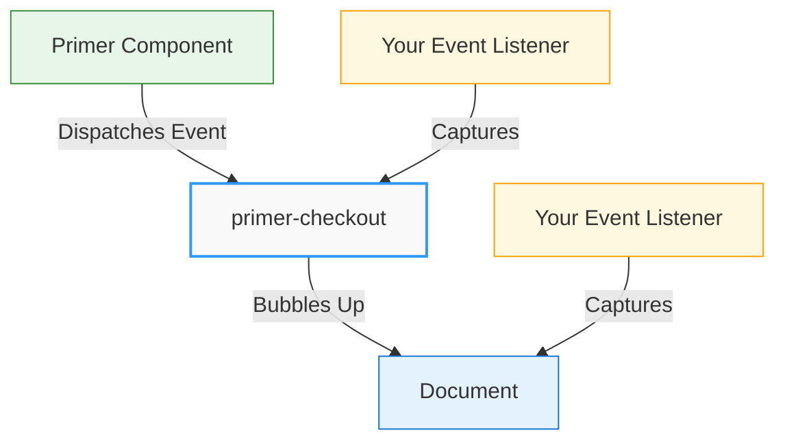

# Events Guide

Primer Checkout uses an event-driven architecture that allows you to monitor and respond to the payment lifecycle. This guide explains how to work with events, understand their payloads, and implement best practices for event handling.

:::tip Practical Event Guide
This guide focuses on **how to use** Primer events and callbacks with practical examples and patterns for implementing event-driven payment flows.
:::

## Understanding Event-Driven Architecture

Primer Checkout communicates state changes, user interactions, and payment results through custom DOM events. This approach provides several benefits:

1. **Decoupled Integration**: Your application code doesn't need direct references to internal SDK state
2. **Flexible Handling**: Events can be captured at any level of the DOM hierarchy
3. **Standard Pattern**: Uses browser-native event APIs familiar to all web developers
4. **Framework Agnostic**: Works consistently across vanilla JavaScript, React, Vue, Svelte, and other frameworks

### How Events Work

When significant actions occur within Primer Checkout (state changes, validation results, payment completion), the SDK dispatches custom events that bubble up through the DOM. You can listen for these events and respond accordingly.



## Event Listening Approaches

Primer events can be captured in two ways: at the component level or at the document level. Both approaches are valid, and your choice depends on your application architecture.

### Component-Level Listening

Listen for events directly on the `primer-checkout` component:

```javascript
const checkout = document.querySelector('primer-checkout');

checkout.addEventListener('primer:state-change', (event) => {
  const { isProcessing, isSuccessful, primerJsError, paymentFailure } =
    event.detail;
  // Handle state changes
});
```

**When to use:**

- You want to scope listeners to specific checkout instances
- You prefer organizing event handlers per component
- You need to manage multiple checkout flows on different pages

### Document-Level Listening

Listen for events at the document level where all Primer events bubble:

```javascript
document.addEventListener('primer:state-change', (event) => {
  const { isProcessing, isSuccessful, primerJsError, paymentFailure } =
    event.detail;
  // Handle state changes
});

document.addEventListener('primer:payment-success', (event) => {
  const { paymentSummary, paymentMethodType } = event.detail;
  // Handle payment success
});

document.addEventListener('primer:payment-failure', (event) => {
  const { error, paymentMethodType } = event.detail;
  // Handle payment failure
});

document.addEventListener('primer:card-success', (event) => {
  const result = event.detail.result;
  // Handle card success
});

document.addEventListener('primer:card-error', (event) => {
  const errors = event.detail.errors;
  // Handle card errors
});
```

**When to use:**

- You prefer centralized event handling
- You want to ensure you catch all events regardless of component location
- Your application has a single checkout flow
- You're implementing global analytics or error tracking

:::tip Choosing an Approach
Both approaches are equally valid and will receive the same events. Choose the pattern that best fits your application's architecture and your team's preferences.
:::

### Ensuring Components Exist

When using component-level listening, ensure the component exists in the DOM before attaching listeners:

```javascript
// ✅ CORRECT: Wait for component to exist
document.addEventListener('DOMContentLoaded', () => {
  const checkout = document.querySelector('primer-checkout');
  if (checkout) {
    checkout.addEventListener('primer:state-change', handleStateChange);
  }
});

// ❌ WRONG: May run before component is rendered
const checkout = document.querySelector('primer-checkout');
checkout.addEventListener('primer:state-change', handleStateChange); // May fail
```

## Core Events

Core events relate to the overall checkout state and lifecycle.

### `primer:ready`

Dispatched when the Primer SDK is fully initialized and ready for use.

**Event Detail:**

The event detail contains the PrimerJS instance with methods like `onPaymentSuccess`, `onPaymentFailure`, `onPaymentStart`, `onPaymentPrepare`, `refreshSession()`, `getPaymentMethods()`, and `setCardholderName()`.

:::note Changed in v0.7.0
The `onPaymentComplete` callback has been split into `onPaymentSuccess` and `onPaymentFailure` for clearer separation of concerns. The old unified callback is deprecated.
:::

**Usage:**

```javascript
const checkout = document.querySelector('primer-checkout');

checkout.addEventListener('primer:ready', (event) => {
  const primer = event.detail;
  console.log('✅ Primer SDK ready');

  // Configure payment success handler
  primer.onPaymentSuccess = ({ payment, paymentMethodType }) => {
    console.log('✅ Payment successful', payment.id);
    console.log('💳 Method:', paymentMethodType);

    // Access available payment data (PII-filtered)
    if (payment.paymentMethodData?.last4Digits) {
      console.log('Last 4:', payment.paymentMethodData.last4Digits);
    }

    // Redirect to confirmation page or show success message
    window.location.href = `/order/confirmation?id=${payment.orderId}`;
  };

  // Configure payment failure handler
  primer.onPaymentFailure = ({ error, payment, paymentMethodType }) => {
    console.error('❌ Payment failed', error.message);
    console.error('Error code:', error.code);

    // Log diagnostics ID for support
    if (error.diagnosticsId) {
      console.error('Diagnostics ID:', error.diagnosticsId);
    }

    // Show error message and allow retry
    showErrorMessage(error.message);
  };

  // Pre-fill cardholder name (v0.7.1+)
  // Useful for improving UX by reducing manual data entry
  const userProfile = getUserProfile(); // Your user data source
  if (userProfile.fullName) {
    primer.setCardholderName(userProfile.fullName);
  }
});
```

**When to use:**

- Setting up `onPaymentSuccess` and `onPaymentFailure` callbacks
- Accessing PrimerJS instance methods
- Pre-filling cardholder name from user profile data
- Performing actions that require a fully initialized SDK

### `primer:state-change`

Dispatched whenever the checkout state changes (processing, success, error, etc.).

**Event Detail:**

The event detail contains SDK state including `isProcessing`, `isSuccessful`, `isLoading`, `primerJsError`, and `paymentFailure` properties.

:::note Changed in v0.7.0
State error fields have been renamed for clarity:

- `error` → `primerJsError` (SDK-level errors)
- `failure` → `paymentFailure` (payment-level failures)
  :::

**Usage:**

```javascript
checkout.addEventListener('primer:state-change', (event) => {
  const { isProcessing, isSuccessful, primerJsError, paymentFailure } =
    event.detail;

  if (isProcessing) {
    console.log('⏳ Processing payment...');
  } else if (isSuccessful) {
    console.log('✅ Payment successful!');
  } else if (primerJsError || paymentFailure) {
    const errorMessage =
      primerJsError?.message || paymentFailure?.message || 'An error occurred';
    console.error('❌ Payment failed:', errorMessage);

    // Log error code for debugging
    if (paymentFailure?.code) {
      console.error('Error code:', paymentFailure.code);
    }
  }
});
```

**When to use:**

- Showing/hiding loading indicators
- Displaying success or error messages
- Tracking payment flow state in analytics
- Managing UI states during payment processing

### `primer:methods-update`

Dispatched when available payment methods are loaded and ready.

**Event Detail:**

The event detail contains an `InitializedPayments` instance with methods like `toArray()` and `size()`.

**Usage:**

```javascript
checkout.addEventListener('primer:methods-update', (event) => {
  const paymentMethods = event.detail.toArray();

  console.log('Available payment methods:', paymentMethods);
  console.log('Total methods:', paymentMethods.length);

  // Access individual method details
  paymentMethods.forEach((method) => {
    console.log('Method type:', method.type);
  });
});
```

**When to use:**

- Dynamically rendering payment methods based on availability
- Filtering or sorting payment method display
- Implementing custom payment method selection UI
- Logging available methods for debugging

:::tip Payment Method Container Alternative
For most use cases involving payment method layout and filtering, the `primer-payment-method-container` component provides a simpler declarative approach without requiring event listeners. See the [Payment Method Container SDK Reference](/sdk-reference/Components/payment-method-container-doc) for details.
:::

## Payment Lifecycle Events

:::note New in v0.7.0
Payment lifecycle events provide granular tracking of payment processing stages with detailed data payloads.
:::

Payment lifecycle events allow you to track the complete payment flow from initiation to completion. These events work alongside callbacks and state change events to provide comprehensive payment monitoring.

### `primer:payment-start`

Dispatched when payment processing begins, immediately after the user initiates a payment.

**Event Detail:**

The event detail is `undefined` for this event. Use it as a trigger signal only.

**Usage:**

```javascript
document.addEventListener('primer:payment-start', () => {
  console.log('💳 Payment processing started');

  // Track payment initiation
  analytics.track('Payment Started');
});
```

**When to use:**

- Show loading indicators immediately when payment starts
- Disable form inputs to prevent duplicate submissions
- Track payment initiation in analytics
- Update UI to reflect processing state

### `primer:payment-success`

Dispatched when a payment completes successfully.

**Event Detail:**

The event detail contains a `PaymentSuccessData` object with the following structure:

```typescript
{
  paymentSummary: PaymentSummary; // PII-filtered payment data
  paymentMethodType: string; // e.g., 'PAYMENT_CARD', 'PAYPAL'
  timestamp: number; // Unix timestamp of success
}
```

**PaymentSummary Structure:**

The `PaymentSummary` object provides access to non-sensitive payment information. **Important: PII (Personally Identifiable Information) is filtered** from this object to ensure sensitive data isn't exposed in browser events.

Available fields:

- `id`: Payment ID
- `orderId`: Merchant order ID
- `paymentMethodType`: Type of payment method used
- `paymentMethodData`: Object containing non-sensitive card data
  - `last4Digits`: Last 4 digits of card number (if applicable)
  - `network`: Card network (Visa, Mastercard, etc.)
  - `paymentMethodType`: Payment method type

Filtered fields (not available):

- `cardholderName`: Cardholder name is filtered for PII protection

**Usage:**

```javascript
document.addEventListener('primer:payment-success', (event) => {
  const { paymentSummary, paymentMethodType, timestamp } = event.detail;

  console.log('✅ Payment successful!');
  console.log('Payment ID:', paymentSummary.id);
  console.log('Order ID:', paymentSummary.orderId);
  console.log('Method:', paymentMethodType);
  console.log('Timestamp:', new Date(timestamp));

  // Access available payment method data
  if (paymentSummary.paymentMethodData?.last4Digits) {
    console.log('Last 4 digits:', paymentSummary.paymentMethodData.last4Digits);
    console.log('Network:', paymentSummary.paymentMethodData.network);
  }

  // Track successful payment in analytics
  analytics.track('Payment Successful', {
    paymentId: paymentSummary.id,
    orderId: paymentSummary.orderId,
    method: paymentMethodType,
    last4: paymentSummary.paymentMethodData?.last4Digits,
  });

  // Redirect to confirmation page
  window.location.href = `/order/confirmation?id=${paymentSummary.orderId}`;
});
```

**When to use:**

- Display success messages with payment details
- Track successful payments in analytics
- Redirect to confirmation pages
- Update order status in your application
- Show receipt information

:::warning PII Protection
The `PaymentSummary` object filters sensitive information like cardholder names. Only use the provided non-sensitive fields for display and analytics.
:::

### `primer:payment-failure`

Dispatched when a payment fails or encounters an error.

**Event Detail:**

The event detail contains a `PaymentFailureData` object with the following structure:

```typescript
{
  error: {
    code: string;           // Error code (e.g., 'CARD_DECLINED')
    message: string;        // User-friendly error message
    diagnosticsId?: string; // Optional diagnostics ID for support
    data?: any;            // Optional additional error data
  };
  paymentSummary?: PaymentSummary;  // Optional, may be undefined
  paymentMethodType: string;
  timestamp: number;
}
```

**Error Structure:**

- `code`: Machine-readable error code for programmatic handling
- `message`: Human-readable error message suitable for display
- `diagnosticsId`: Unique identifier for troubleshooting with Primer support
- `data`: Additional context-specific error information

**Usage:**

```javascript
document.addEventListener('primer:payment-failure', (event) => {
  const { error, paymentSummary, paymentMethodType, timestamp } = event.detail;

  console.error('❌ Payment failed');
  console.error('Error code:', error.code);
  console.error('Error message:', error.message);

  if (error.diagnosticsId) {
    console.error('Diagnostics ID:', error.diagnosticsId);
  }

  // Track payment failure in analytics
  analytics.track('Payment Failed', {
    errorCode: error.code,
    errorMessage: error.message,
    diagnosticsId: error.diagnosticsId,
    method: paymentMethodType,
    timestamp: new Date(timestamp),
  });

  // Send to error tracking service
  if (error.diagnosticsId) {
    errorTracker.capturePaymentFailure({
      diagnosticsId: error.diagnosticsId,
      code: error.code,
      paymentMethodType,
    });
  }
});
```

**When to use:**

- Display error messages to users
- Implement retry logic
- Track payment failures in analytics
- Send error reports to monitoring services
- Log diagnostics IDs for support cases
- Handle specific error codes with custom logic

## Vault Events

:::note New in v0.7.0
Vault events enable you to track and manage saved payment methods in real-time.
:::

### `primer:vault:methods-update`

Dispatched when vaulted payment methods are loaded, updated, or when the vault state changes.

**Event Detail:**

The event detail contains a `VaultMethodsUpdateData` object with the following structure:

```typescript
{
  vaultedPayments: InitializedVaultedPayments; // Vault API instance
  timestamp: number; // Unix timestamp
}
```

**InitializedVaultedPayments API:**

The `vaultedPayments` object provides methods to access saved payment methods:

- `toArray()`: Returns array of `VaultedPaymentMethodSummary` objects
- `get(id: string)`: Gets a specific vaulted payment method by ID
- `size()`: Returns the number of saved payment methods

**VaultedPaymentMethodSummary Structure:**

Each vaulted payment method contains:

- `id`: Unique identifier for the vaulted payment method
- `analyticsId`: Analytics tracking identifier
- `paymentMethodType`: Type of payment method (e.g., 'PAYMENT_CARD', 'ADYEN_STRIPE_ACH')
- `paymentInstrumentType`: Instrument type
- `paymentInstrumentData`: Object with PII-filtered payment instrument details
  - `last4Digits`: Last 4 digits of card (cards only)
  - `network`: Card network like VISA, MASTERCARD (cards only)
  - `accountNumberLastFourDigits`: Last 4 of account number (ACH only)
  - `bankName`: Bank name (ACH only)
  - `accountType`: CHECKING or SAVINGS (ACH only)
  - `email`: Email address (wallet methods like PayPal)
- `userDescription`: Optional user-provided description

:::warning PII Protection
Sensitive fields like cardholder names, expiration dates, and full account numbers are filtered out for security. Only safe identifiers are exposed.
:::

**Usage:**

```javascript
document.addEventListener('primer:vault:methods-update', (event) => {
  const { vaultedPayments, timestamp } = event.detail;

  console.log('💳 Vault methods updated');
  console.log('Total saved methods:', vaultedPayments.size());

  // Get all saved payment methods
  const methods = vaultedPayments.toArray();

  methods.forEach((method) => {
    console.log('Method ID:', method.id);
    console.log('Type:', method.paymentMethodType);

    if (method.paymentInstrumentData) {
      console.log('Last 4:', method.paymentInstrumentData.last4Digits);
      console.log('Network:', method.paymentInstrumentData.network);
    }
  });

  // Track vault updates in analytics
  analytics.track('Vault Methods Updated', {
    count: methods.length,
    timestamp,
  });
});
```

**When to use:**

- Display saved payment methods to users
- Update vault UI when methods are added or removed
- Track vault usage in analytics
- Implement saved payment method selection
- Show payment method counts or summaries

## Card Events

Card events are specific to card payment form interactions and validation.

### `primer:card-success`

Dispatched when a card form is successfully validated and submitted.

**Event Detail:**

The event detail contains a `result` object with payment submission data.

**Usage:**

```javascript
checkout.addEventListener('primer:card-success', (event) => {
  const result = event.detail.result;
  console.log('✅ Card form submitted successfully', result);
});
```

**When to use:**

- Confirming successful card form submission
- Disabling the form after successful submission
- Showing intermediate success messages
- Triggering analytics events

### `primer:card-error`

Dispatched when card validation fails or submission encounters an error.

**Event Detail:**

The event detail contains an `errors` array with validation error objects including `field`, `name`, and `error` properties.

**Usage:**

```javascript
checkout.addEventListener('primer:card-error', (event) => {
  const errors = event.detail.errors;
  console.error('❌ Card validation errors:', errors);

  // Log each error
  errors.forEach((error) => {
    console.error(`${error.field}: ${error.error}`);
  });
});
```

**When to use:**

- Displaying validation error messages to users
- Implementing custom error UI
- Logging validation errors for debugging
- Triggering error analytics

### `primer:card-network-change`

Dispatched when the card network (Visa, Mastercard, etc.) is detected or changes based on the card number input.

**Event Detail:**

The event detail contains `detectedCardNetwork`, `selectableCardNetworks`, and `isLoading` properties for card network detection.

**Usage:**

```javascript
checkout.addEventListener('primer:card-network-change', (event) => {
  const { detectedCardNetwork, selectableCardNetworks, isLoading } =
    event.detail;

  if (isLoading) {
    console.log('🔍 Detecting card network...');
    return;
  }

  if (detectedCardNetwork) {
    const network = detectedCardNetwork.network;
    console.log('💳 Card network detected:', network);

    // Track card network detection
    analytics.track('Card Network Detected', { network });
  }
});
```

**When to use:**

- Showing card brand logos
- Displaying network-specific information or requirements
- Implementing network-based UI changes
- Tracking card network usage in analytics

## Triggerable Events

Triggerable events are events that YOU dispatch to control SDK behavior, as opposed to listener events which are dispatched BY the SDK for you to observe.

### Understanding Event Types

Primer Checkout events fall into two categories:

**Listener Events**: Events dispatched BY the Primer SDK that your application listens to:

- `primer:ready` - SDK initialization complete
- `primer:state-change` - Checkout state changes
- `primer:methods-update` - Payment methods loaded
- `primer:card-success` - Card form validation successful
- `primer:card-error` - Card form validation errors
- `primer:card-network-change` - Card network detected

**Triggerable Events**: Events YOU dispatch TO the SDK to trigger specific behaviors:

- `primer:card-submit` - Trigger card form submission programmatically

### `primer:card-submit`

Trigger card form submission programmatically from anywhere in your application.

**Event Detail:**

The event detail contains an optional `source` property to identify the trigger source.

**Usage:**

The checkout component listens for this event at the document level, so you can dispatch it from anywhere in your application without needing to reference the card form element directly.

```javascript
// Trigger card form submission from anywhere in your application
document.dispatchEvent(
  new CustomEvent('primer:card-submit', {
    bubbles: true,
    composed: true,
    detail: { source: 'custom-button' },
  }),
);
```

**When to use:**

- Creating custom payment buttons outside the card form
- Building multi-step checkout flows with external controls
- Integrating with third-party UI components
- Triggering submission from JavaScript logic

**Complete Example: External Submit Button**

```html
<primer-checkout client-token="your-client-token">
  <primer-main slot="main">
    <div slot="payments">
      <primer-card-form>
        <div slot="card-form-content">
          <primer-input-card-number></primer-input-card-number>
          <primer-input-card-expiry></primer-input-card-expiry>
          <primer-input-cvv></primer-input-cvv>
          <!-- No submit button inside the form -->
        </div>
      </primer-card-form>

      <!-- External submit button outside the card form -->
      <button id="external-submit" class="custom-pay-button">Pay Now</button>
    </div>
  </primer-main>
</primer-checkout>

<script>
  // Set up external button
  document.getElementById('external-submit').addEventListener('click', () => {
    // Dispatch event to document - checkout listens at document level
    document.dispatchEvent(
      new CustomEvent('primer:card-submit', {
        bubbles: true,
        composed: true,
        detail: { source: 'external-button' },
      }),
    );
  });

  // Listen for submission results
  const checkout = document.querySelector('primer-checkout');

  checkout.addEventListener('primer:card-success', (event) => {
    console.log('✅ Card form submitted successfully');
  });

  checkout.addEventListener('primer:card-error', (event) => {
    console.log('❌ Validation errors:', event.detail.errors);
  });
</script>
```

**Important notes:**

- The `bubbles: true` and `composed: true` properties are required for the event to propagate correctly
- Always include a meaningful `source` parameter to help with debugging and tracking
- The checkout component handles the event at the document level and forwards it internally
- This pattern works regardless of where your submit button is located in the DOM

## Programmatic Control Methods

:::tip New in v0.7.1
Beyond events, the PrimerJS instance provides direct methods for programmatic control of checkout components.
:::

### Setting Cardholder Name Programmatically

The `setCardholderName()` method allows you to programmatically set the cardholder name field value. This is useful for pre-filling data from user profiles, auto-completing from previous transactions, or synchronizing with external form data.

**Basic Usage:**

```javascript
const checkout = document.querySelector('primer-checkout');

checkout.addEventListener('primer:ready', (event) => {
  const primerJS = event.detail;

  // Pre-fill cardholder name from user profile
  primerJS.setCardholderName('John Doe');
});
```

**Real-World Example: Auto-Fill from User Profile**

```javascript
// Assume you have user data from your authentication system
const currentUser = {
  firstName: 'Jane',
  lastName: 'Smith',
  email: 'jane.smith@example.com',
};

const checkout = document.querySelector('primer-checkout');

checkout.addEventListener('primer:ready', (event) => {
  const primerJS = event.detail;

  // Combine first and last name for cardholder field
  const fullName = `${currentUser.firstName} ${currentUser.lastName}`;
  primerJS.setCardholderName(fullName);

  console.log(`✅ Pre-filled cardholder name: ${fullName}`);
});
```

**Important Timing Considerations:**

- Must be called **after** the `primer:ready` event fires
- Must be called **after** card hosted inputs have rendered
- Calling too early will log a warning but won't throw an error
- Safe to call multiple times if needed (e.g., when user data updates)

**Use Cases:**

- **Returning Customers**: Auto-fill from stored user profile data
- **Multi-Step Checkout**: Sync data from previous checkout steps
- **Account Integration**: Use data from authenticated user sessions
- **Form Synchronization**: Keep cardholder name in sync with billing address name

**Example: Conditional Pre-fill**

```javascript
checkout.addEventListener('primer:ready', (event) => {
  const primerJS = event.detail;

  // Only pre-fill if user is logged in
  const user = getAuthenticatedUser();
  if (user?.fullName) {
    primerJS.setCardholderName(user.fullName);
  }
});
```

## Summary

Primer Checkout's event-driven architecture provides:

- **Flexible Integration**: Listen at component or document level based on your needs
- **Complete Lifecycle Coverage**: Events for initialization, state changes, validation, and completion
- **Payment Lifecycle Events**: Granular tracking with `primer:payment-start`, `primer:payment-success`, and `primer:payment-failure`
- **Vault Management**: Real-time updates for saved payment methods via `primer:vault:methods-update`
- **Specialized Callbacks**: Dedicated `onPaymentSuccess` and `onPaymentFailure` callbacks for cleaner error handling
- **Framework Agnostic**: Standard DOM events work everywhere
- **Detailed Payloads**: Rich event data for comprehensive state management
- **PII Protection**: Sensitive data is filtered from browser events to ensure security

This guide demonstrates the core patterns for working with Primer Checkout's event-driven architecture.

For more information on basic setup and initialization, see the [Getting Started Guide](/guides/getting-started).
