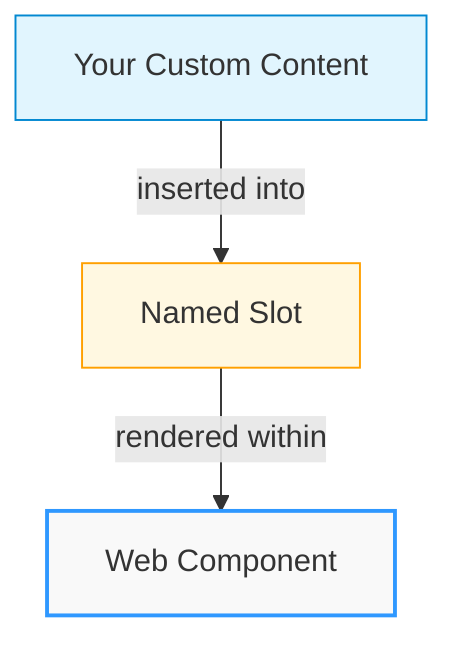
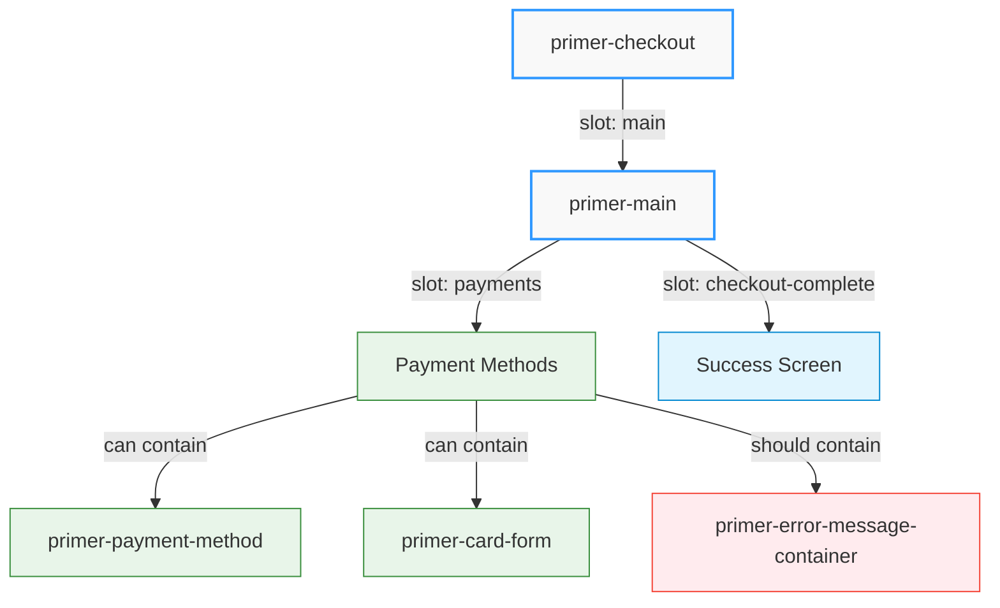
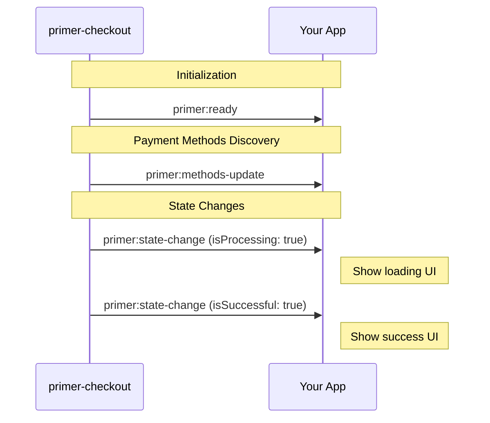

# Layout Customizations Guide

Primer Checkout provides a flexible, slot-based architecture that allows you to customize the checkout layout while maintaining the core payment functionality. This guide explains the fundamental concepts behind layout customization and how to implement your own checkout experience.

## Understanding Slot-Based Architecture

Primer Checkout uses **slots** as the primary mechanism for layout customization. Slots are named placeholders in components where you can insert your own content.



### What Are Slots?

Slots are designated areas within Web Components where custom content can be inserted. Each slot has a specific name that determines where the content will appear.

```html
<!-- This content will be inserted into the "main" slot of primer-checkout -->
<div slot="main">Your custom content goes here</div>
```

When a component renders, it replaces each slot with the content you provide. If you don't provide content for a slot, the component often uses default content instead.

:::info Key Concept
Slots allow you to customize specific parts of a component without having to recreate the entire component's functionality.
:::

## Component Hierarchy and Available Slots

The checkout layout follows a hierarchical structure with slots at each level:



<details>
<summary><strong>1. &lt;primer-checkout&gt; Component</strong></summary>

The root component that initializes the SDK and provides the checkout context.

**Available Slots:**

- `main` - The main content area for the checkout experience

```html
<primer-checkout client-token="your-token">
  <div slot="main">
    <!-- Your custom checkout UI -->
  </div>
</primer-checkout>
```

</details>

<details>
<summary><strong>2. &lt;primer-main&gt; Component (Optional)</strong></summary>

A pre-built component that manages checkout states and provides additional slots for customization.

**Available Slots:**

- `payments` - Contains payment method components
- `checkout-complete` - Content shown on successful payment

```html
<primer-checkout client-token="your-token">
  <primer-main slot="main">
    <div slot="payments">
      <!-- Your payment methods layout -->
    </div>
    <div slot="checkout-complete">
      <!-- Your success screen -->
    </div>
  </primer-main>
</primer-checkout>
```

:::info Error Handling
Error states are managed by the parent `<primer-checkout>` component, not by `<primer-main>`. If you need custom error handling, implement it directly in the `main` slot of `<primer-checkout>` without using `<primer-main>`.
:::

</details>

## Customization Approaches

You can customize the checkout layout in two main ways:

### Approach 1: Using `<primer-main>` with Custom Slots

This approach allows you to customize specific parts of the checkout while relying on `<primer-main>` to handle state management:

```html
<primer-checkout client-token="your-token">
  <primer-main slot="main">
    <div slot="payments">
      <h2>Select Payment Method</h2>
      <primer-payment-method type="PAYMENT_CARD"></primer-payment-method>
      <primer-payment-method type="PAYPAL"></primer-payment-method>
    </div>
  </primer-main>
</primer-checkout>
```

:::tip Benefits of This Approach

- `<primer-main>` handles state transitions (loading, success, error)
- You only need to provide content for the slots you want to customize
- Default content is used for any slots you don't provide
  :::

### Approach 2: Fully Custom Implementation

For complete control, you can bypass `<primer-main>` entirely and provide your own implementation:

```html
<primer-checkout client-token="your-token">
  <div slot="main" id="custom-checkout">
    <!-- Your completely custom checkout implementation -->
    <div id="payment-methods">
      <primer-payment-method type="PAYMENT_CARD"></primer-payment-method>

      <!-- Option 1: Use the pre-built error container component for payment failures -->
      <primer-error-message-container></primer-error-message-container>

      <!-- Option 2: Or create your own error display element -->
      <div id="my-custom-error" class="custom-error-message"></div>
    </div>
  </div>
</primer-checkout>
```

:::warning Implementation Responsibility
When using this approach:

- You must handle state management yourself through events
- You have complete freedom over the layout and user flow
- You're responsible for showing/hiding appropriate content based on checkout state
- You need to handle payment failure display, either with the `<primer-error-message-container>` component or by implementing custom error handling with events
  :::

## Why Slot Names Matter

Slot names are crucial for several reasons:

1. **Component Targeting** - Names tell the component exactly where to insert your content
2. **Default Content** - Components can provide default content for slots that aren't filled
3. **Preventing Accidental Rendering** - Content without a matching slot won't be displayed
4. **Multiple Insertion Points** - Different named slots allow multiple insertion points

Using the wrong slot name or omitting it entirely can lead to content not appearing where expected.

## Event-Driven State Management

When implementing a custom layout without `<primer-main>`, you'll need to listen for events to manage checkout states.

For comprehensive information on all available events, event payloads, and best practices, see the [Events Guide](/guides/events-guide).

:::note Changed in v0.7.0
State fields have been renamed: `error` → `primerJsError` and `failure` → `paymentFailure`.
:::

```javascript
document
  .querySelector('primer-checkout')
  .addEventListener('primer:state-change', (event) => {
    const state = event.detail;

    // Handle different checkout states
    if (state.isProcessing) {
      // Show loading indicator
    } else if (state.isSuccessful) {
      // Show success message
    } else if (state.primerJsError || state.paymentFailure) {
      // Show error message
      const errorMessage =
        state.primerJsError?.message || state.paymentFailure?.message;
      // Display error to user
    }
  });
```



<details>
<summary><strong>Key events to listen for</strong></summary>

- `primer:state-change` - Fired when checkout state changes
- `primer:methods-update` - Fired when available payment methods are loaded
- `primer:ready` - Fired when the SDK is ready
</details>

## Configuring Payment Methods

When customizing the payment method layout, you can include specific payment methods:

```html
<div slot="payments">
  <primer-payment-method type="PAYMENT_CARD"></primer-payment-method>
  <primer-payment-method type="PAYPAL"></primer-payment-method>
</div>
```

The `type` attribute specifies which payment method to display. If a payment method isn't available in your configuration, it simply won't render.

### Important: Avoiding Duplicate Card Forms

:::caution Common Mistake
When customizing your checkout layout, be careful not to render duplicate card forms. This commonly happens when:

1. You create a custom card form using `<primer-card-form>`
2. You also include `<primer-payment-method type="PAYMENT_CARD">` in your layout
   :::

```html
<!-- ❌ INCORRECT: Will result in duplicate card forms -->
<div slot="payments">
  <!-- Custom card form -->
  <primer-card-form>
    <!-- Custom card form content -->
  </primer-card-form>

  <!-- This will render ANOTHER card form -->
  <primer-payment-method type="PAYMENT_CARD"></primer-payment-method>
</div>
```

If you're using a custom card form implementation, you should **not** include the `PAYMENT_CARD` payment method in your layout.

### Declarative Payment Method Filtering (Recommended)

The `primer-payment-method-container` component provides a declarative way to organize payment methods:

```html
<!-- Sectioned layout example -->
<div slot="payments">
  <!-- Quick pay options -->
  <primer-payment-method-container
    include="APPLE_PAY,GOOGLE_PAY"
  ></primer-payment-method-container>

  <!-- Alternative methods -->
  <primer-payment-method-container
    exclude="PAYMENT_CARD,APPLE_PAY,GOOGLE_PAY"
  ></primer-payment-method-container>

  <!-- Card form -->
  <primer-payment-method type="PAYMENT_CARD"></primer-payment-method>
</div>
```

This approach automatically filters available payment methods without requiring event listeners or manual state management. See the [Payment Method Container SDK Reference documentation](/sdk-reference/Components/payment-method-container-doc) for complete usage guide.

### Alternative: Event-Driven Dynamic Rendering

You can also dynamically render payment methods by listening to the `primer:methods-update` event:

<details>
<summary><strong>Example: Dynamic Payment Method Rendering</strong></summary>

```javascript
checkout.addEventListener('primer:methods-update', (event) => {
  const availableMethods = event.detail.toArray();
  const container = document.getElementById('payment-methods');

  // Create payment method elements based on available methods
  availableMethods.forEach((method) => {
    const element = document.createElement('primer-payment-method');
    element.setAttribute('type', method.type);
    container.appendChild(element);
  });
});
```

</details>

This approach ensures you only display payment methods that are actually available.

<details>
<summary><strong>Filtering to avoid duplicate card forms</strong></summary>

**Important:** If you're using a custom card form, you should filter out the `PAYMENT_CARD` type to avoid duplicate card forms:

```javascript
checkout.addEventListener('primer:methods-update', (event) => {
  let availableMethods = event.detail.toArray();
  const container = document.getElementById('payment-methods');

  // If using a custom card form, filter out PAYMENT_CARD
  if (document.querySelector('primer-card-form')) {
    availableMethods = availableMethods.filter(
      (method) => method.type !== 'PAYMENT_CARD',
    );
  }

  // Create payment method elements based on filtered methods
  availableMethods.forEach((method) => {
    const element = document.createElement('primer-payment-method');
    element.setAttribute('type', method.type);
    container.appendChild(element);
  });
});
```

</details>

## Styling Custom Layouts

When styling custom layouts, use CSS custom properties for consistency:

```css
.payment-section {
  padding: var(--primer-space-medium);
  border-radius: var(--primer-radius-small);
  background-color: var(--primer-color-background-outlined-default);
}

.payment-section h2 {
  color: var(--primer-color-text-primary);
  font-family: var(--primer-typography-title-large-font);
  font-size: var(--primer-typography-title-large-size);
}
```

Using these properties ensures your custom layout maintains visual consistency with the checkout components.

## Handling Payment Failure Messages in Custom Layouts

When implementing custom layouts, you have two options for displaying payment failure messages:

1. Use the pre-built `<primer-error-message-container>` component
2. Implement custom error handling using the SDK events

### Option 1: Using the Error Message Container Component

The `<primer-error-message-container>` provides a convenient way to display payment failures without writing custom code:

```html
<!-- Approach 1: Using primer-main with custom content -->
<primer-checkout client-token="your-token">
  <primer-main slot="main">
    <div slot="payments">
      <!-- Your payment methods -->
      <primer-payment-method type="PAYMENT_CARD"></primer-payment-method>

      <!-- Include error message container for payment failure display -->
      <primer-error-message-container></primer-error-message-container>
    </div>
  </primer-main>
</primer-checkout>

<!-- Approach 2: Fully custom implementation -->
<primer-checkout client-token="your-token">
  <div slot="main" id="custom-checkout">
    <!-- Your completely custom checkout implementation -->
    <div id="payment-methods">
      <primer-payment-method type="PAYMENT_CARD"></primer-payment-method>

      <!-- Include error message container for payment failure messages -->
      <primer-error-message-container></primer-error-message-container>
    </div>
  </div>
</primer-checkout>
```

If using the error message container, for optimal user experience, place it:

1. Prominently where it will be visible after a payment attempt
2. Where users will naturally look for feedback after submitting payment
3. Within the same visual context as the payment method it relates to

### Option 2: Custom Payment Failure Handling

You can also implement your own payment failure handling using the SDK callbacks and events.

:::note Changed in v0.7.0
The callback API has been updated. Use `onPaymentSuccess` and `onPaymentFailure` instead of `onPaymentComplete`. State fields have been renamed to `primerJsError` and `paymentFailure`.
:::

```javascript
const checkout = document.querySelector('primer-checkout');

// Option 1: Use split success/failure callbacks for payment completion
checkout.addEventListener('primer:ready', (event) => {
  const primer = event.detail;

  primer.onPaymentSuccess = ({ payment, paymentMethodType }) => {
    // Hide error container on success
    document.getElementById('my-custom-error').style.display = 'none';

    // Redirect to success page or show success UI
    window.location.href = `/order/confirmation?id=${payment.orderId}`;
  };

  primer.onPaymentFailure = ({ error, payment, paymentMethodType }) => {
    // Display the payment failure using your own UI
    const customErrorElement = document.getElementById('my-custom-error');
    customErrorElement.textContent = error.message;
    customErrorElement.style.display = 'block';

    // Log for debugging
    console.error('Payment failed:', {
      code: error.code,
      message: error.message,
      diagnosticsId: error.diagnosticsId,
    });
  };
});

// Option 2: Listen for checkout state changes
checkout.addEventListener('primer:state-change', (event) => {
  const { primerJsError, paymentFailure } = event.detail;

  if (primerJsError || paymentFailure) {
    // Display the failure using your own UI
    const customErrorElement = document.getElementById('my-custom-error');
    const errorMessage = primerJsError?.message || paymentFailure?.message;
    customErrorElement.textContent = errorMessage;
    customErrorElement.style.display = 'block';
  } else {
    // Hide error when not present
    document.getElementById('my-custom-error').style.display = 'none';
  }
});
```

This approach gives you complete control over payment failure presentation but requires you to implement the error handling logic yourself.

:::info Important Distinction
The `<primer-error-message-container>` specifically handles payment failures that occur after form submission, not card validation errors. Card validation is handled by the input components themselves and prevents form submission until valid.
:::

For more information about the error message container, see the [Error Message Container Component](/sdk-reference/Components/error-message-container-doc) documentation.

## Best Practices for Layout Customization

:::tip Best Practices Summary

1. **Use Named Slots Correctly** - Always use the correct slot names to ensure content appears where expected
2. **Listen for Relevant Events** - Handle checkout state through event listeners
3. **Maintain Visual Consistency** - Use CSS custom properties for styling
4. **Design Responsively** - Ensure your layout works on all device sizes
5. **Test Thoroughly** - Validate behavior across different payment methods and scenarios
6. **Prevent Component Flash** - Use CSS or JavaScript techniques to hide content until components are defined
7. **Handle Payment Failures** - Either use the `<primer-error-message-container>` component or implement custom payment failure handling using events
   :::

For detailed information on available components and their slots, refer to the component SDK Reference documentation:

- [Checkout Component](/sdk-reference/Components/primer-checkout-doc)
- [Main Component](/sdk-reference/Components/primer-main-doc)
- [Payment Method Component](/sdk-reference/Components/payment-method-doc)
- [Error Message Container](/sdk-reference/Components/error-message-container-doc)
