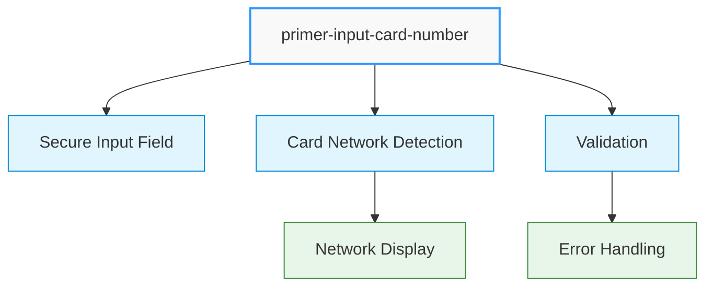
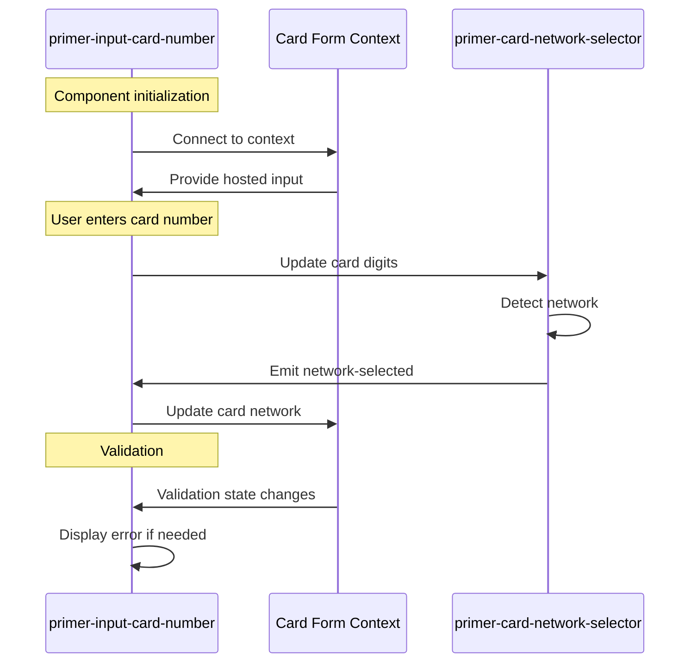
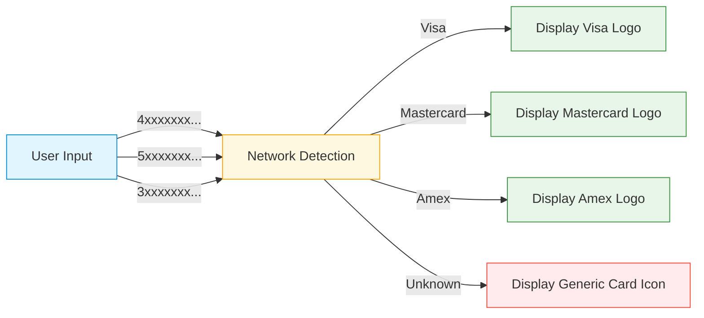

# Card Number Input Component

## \<primer-input-card-number\>

The Card Number Input component provides a secure, PCI-compliant field for collecting payment card numbers. It automatically detects and displays the card network (like Visa, Mastercard) as the user types, and supports validation.



This component extends the abstract card input class used by all card form inputs, providing consistent behavior and styling.

## Usage

The Card Number Input component must be used within a `primer-card-form` container:

```html
<primer-card-form>
  <primer-input-card-number></primer-input-card-number>
</primer-card-form>
```

## Properties

| Attribute     | Type     | Default               | Description                                |
| ------------- | -------- | --------------------- | ------------------------------------------ |
| `label`       | `string` | "Card Number"         | The label displayed above the input        |
| `placeholder` | `string` | "4111 1111 1111 1111" | Placeholder text shown when input is empty |
| `aria-label`  | `string` | "Card Number"         | Accessibility label for screen readers     |

### Property Behavior

<div class="property-behavior">

- **`label`**: If not explicitly set, uses the localized default value ("Card Number"). If set to an empty string `""`, reverts to the default.
- **`placeholder`**: If not explicitly set, uses the default value ("4111 1111 1111 1111"). If explicitly set to an empty string `""`, no placeholder will be displayed.
- **`aria-label`**: If not explicitly set, uses the value of `label`. If explicitly set to an empty string `""`, reverts to the value of `label`.

</div>

## Technical Implementation



The Card Number Input component:

1. **Connects to the card form context** to access validation state and hosted inputs
2. **Uses `display: contents`** to seamlessly integrate with parent layout without creating a new box in the DOM
3. **Automatically handles validation** by detecting errors from the card form context
4. **Includes a card network selector** component that automatically identifies card types
5. **Updates the card form context** when card network changes are detected

## DOM Structure

:::caution Important
The `<primer-card-network-selector>` component is not meant to be used independently. It's designed specifically to work within the `<primer-input-card-number>` component and will not function properly as a standalone component.
:::

The component renders the following DOM structure:

```html
<primer-input-wrapper>
  <primer-input-label slot="label">Card Number</primer-input-label>
  <div slot="input" class="card-number-container">
    <div id="cardNumber">
      <!-- Secure input field rendered here -->
    </div>
    <div class="network-selector-container">
      <primer-card-network-selector></primer-card-network-selector>
    </div>
  </div>
  <!-- Error message appears here when validation fails -->
</primer-input-wrapper>
```

## Events

This component doesn't emit custom events directly, but it listens for the `network-selected` event from the `primer-card-network-selector` component and updates the card form context accordingly.

## CSS Custom Properties

| Property               | Description                                                                 |
| ---------------------- | --------------------------------------------------------------------------- |
| `--primer-space-small` | Spacing between the card number input and network selector (default: `8px`) |

## Examples

<div class="tabs-container">
<div class="tabs">
<div class="tab basic active">Basic Usage</div>
<div class="tab custom">Custom Labels</div>
<div class="tab no-placeholder">No Placeholder</div>
<div class="tab complete">Complete Form</div>
</div>

<div class="tab-content basic active">

```html
<primer-card-form>
  <primer-input-card-number></primer-input-card-number>
</primer-card-form>
```

</div>

<div class="tab-content custom">

```html
<primer-card-form>
  <primer-input-card-number
    label="Credit Card Number"
    placeholder="Enter your card number"
    aria-label="Your credit card number"
  >
  </primer-input-card-number>
</primer-card-form>
```

</div>

<div class="tab-content no-placeholder">

```html
<primer-card-form>
  <primer-input-card-number label="Card Number" placeholder="">
  </primer-input-card-number>
</primer-card-form>
```

</div>

<div class="tab-content complete">

```html
<primer-card-form>
  <div slot="card-form-content">
    <primer-input-card-number></primer-input-card-number>
    <div style="display: flex; gap: 8px;">
      <primer-input-card-expiry></primer-input-card-expiry>
      <primer-input-cvv></primer-input-cvv>
    </div>
    <primer-input-card-holder-name></primer-input-card-holder-name>
    <button type="submit">Pay Now</button>
  </div>
</primer-card-form>
```

</div>
</div>

## Card Network Detection



The component automatically detects the card network (Visa, Mastercard, American Express, etc.) as the user enters the card number. When a network is detected:

1. The card network selector displays the appropriate card logo
2. The card form context is updated with the detected network
3. Input formatting adjusts according to the card type (e.g., different spacing for Amex)

## Key Considerations

:::info Component Dependencies

- The Card Number Input component must be placed inside a `primer-card-form` component
- It automatically includes a card network selector that shows detected card types
  :::

:::tip Implementation Details

- Input validation happens automatically when the form is submitted
- Validation errors are displayed below the input field when they occur
- The component uses a flex layout to position the card number input and network selector side by side
- The `network-selector-container` has a higher z-index to ensure proper visibility
  :::

:::caution Important Restriction
The `<primer-card-network-selector>` component is not meant to be used outside of `<primer-input-card-number>` and will not work as a standalone component
:::
