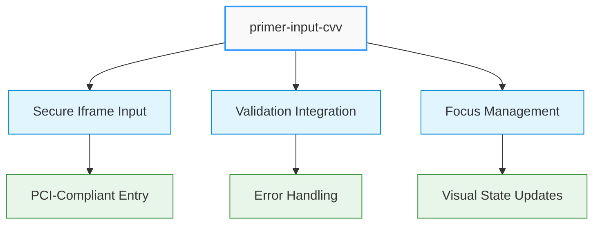
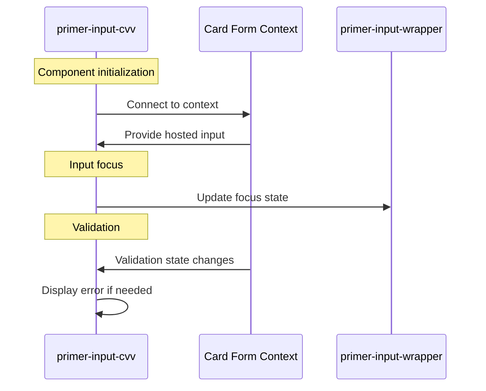

# CVV Input Component

## \<primer-input-cvv\>

The CVV Input component provides a secure, PCI-compliant field for collecting payment card security codes (CVV/CVC). It integrates with the card form validation system and maintains a consistent user experience.



This component extends the `AbstractCardInputComponent` class and uses a secure iframe-based input for PCI compliance.

## Usage

The CVV Input component must be used within a `primer-card-form` container:

```html
<primer-card-form>
  <primer-input-cvv></primer-input-cvv>
</primer-card-form>
```

## Properties

| Property      | Attribute     | Type     | Default | Description                                |
| ------------- | ------------- | -------- | ------- | ------------------------------------------ |
| `label`       | `label`       | `string` | "CVV"   | The label displayed above the input        |
| `placeholder` | `placeholder` | `string` | "123"   | Placeholder text shown when input is empty |
| ``            | `aria-label`  | `string` | "CVV"   | Accessibility label for screen readers     |

### Property Behavior

<div class="property-behavior">

- **`label`**: If not explicitly set, uses the localized default value ("CVV"). If set to an empty string `""`, reverts to the default.
- **`placeholder`**: If not explicitly set, uses the default value ("123"). When explicitly set to an empty string `""`, no placeholder will be displayed.
- **`aria-label`**: If not explicitly set, uses the value of `label`. If explicitly set to an empty string `""`, reverts to using the `label` value.

</div>

## Technical Implementation



The CVV Input component:

1. **Connects to the card form context** to access validation state and hosted inputs
2. **Uses `display: contents`** to seamlessly integrate with parent layout without creating a new box in the DOM
3. **Automatically handles validation** by detecting errors from the card form context

## Events

This component doesn't emit custom events directly. Card validation events are handled through the parent `primer-card-form` component. Internal focus and blur events are captured to manage visual states.

## DOM Structure

The component renders the following DOM structure:

```html
<primer-input-wrapper>
  <primer-input-label slot="label">CVV</primer-input-label>
  <div slot="input" id="cvv">
    <!-- Secure iframe-based input rendered here -->
  </div>
  <!-- Error message appears here when validation fails -->
</primer-input-wrapper>
```

## Examples

```html
<primer-card-form>
  <primer-input-cvv></primer-input-cvv>
</primer-card-form>
```

```html
<primer-card-form>
  <primer-input-cvv
    label="Security Code"
    placeholder="CVV"
    aria-label="Your card's security code"
  >
  </primer-input-cvv>
</primer-card-form>
```

```html
<primer-card-form>
  <div slot="card-form-content">
    <primer-input-card-number></primer-input-card-number>
    <div style="display: flex; gap: 8px;">
      <primer-input-card-expiry></primer-input-card-expiry>
      <primer-input-cvv></primer-input-cvv>
    </div>
    <button type="submit">Pay Now</button>
  </div>
</primer-card-form>
```

## Key Considerations

:::info Component Dependencies

- The CVV Input component must be placed inside a `primer-card-form` component
- For best UI experience, consider pairing this component with `primer-input-card-expiry` in a flex layout
  :::

:::tip Implementation Details

- Input validation happens automatically when the form is submitted
- Validation errors are displayed below the input field when they occur
- The component handles focus events internally to update the wrapper's visual state
  :::

:::caution Security Note
The CVV input is rendered in a secure iframe to prevent exposure of sensitive payment details, ensuring PCI compliance
:::
