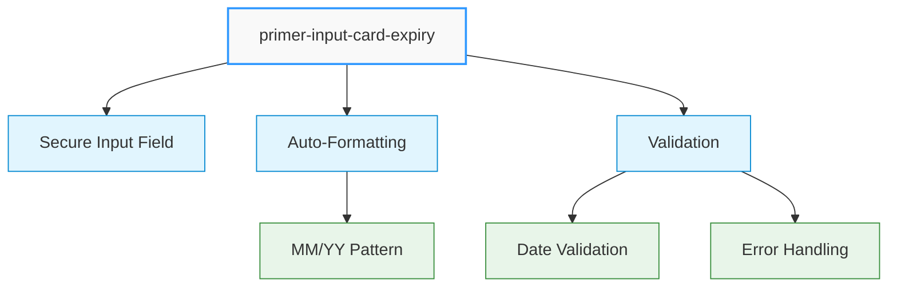
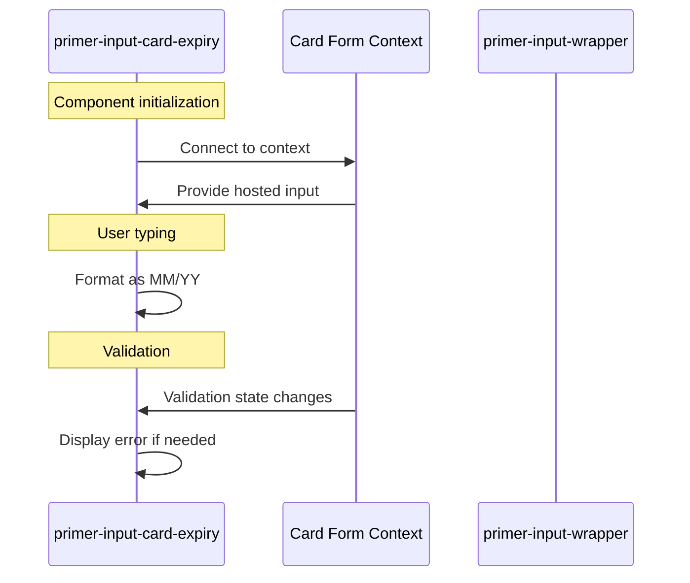
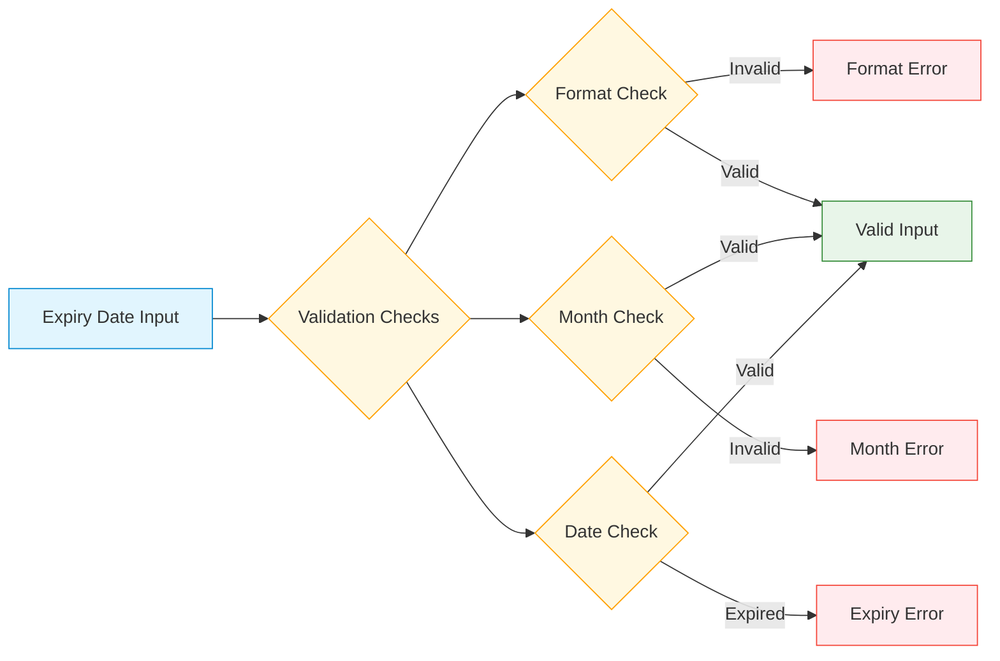

# Card Expiry Input Component

## \<primer-input-card-expiry\>

The Card Expiry Input component provides a secure, PCI-compliant field for collecting payment card expiration dates. It formats the input automatically as MM/YY and integrates with the card form validation system.



This component extends the abstract card input class used by all card form inputs, providing consistent behavior and styling.

## Usage

The Card Expiry Input component must be used within a `primer-card-form` container:

```html
<primer-card-form>
  <primer-input-card-expiry></primer-input-card-expiry>
</primer-card-form>
```

## Properties

| Attribute     | Type     | Default       | Description                                |
| ------------- | -------- | ------------- | ------------------------------------------ |
| `label`       | `string` | "Expiry Date" | The label displayed above the input        |
| `placeholder` | `string` | "MM/YY"       | Placeholder text shown when input is empty |
| `aria-label`  | `string` | "Expiry Date" | Accessibility label for screen readers     |

### Property Behavior

<div class="property-behavior">

- **`label`**: If not explicitly set, uses the localized default value ("Expiry Date"). If set to an empty string `""`, reverts to the default.
- **`placeholder`**: If not explicitly set, uses the localized default value ("MM/YY"). If explicitly set to an empty string `""`, no placeholder will be displayed.
- **`aria-label`**: If not explicitly set, uses the value of `label`. If explicitly set to an empty string `""`, reverts to the value of `label`.

</div>

## Technical Implementation



The Card Expiry Input component:

1. **Connects to the card form context** to access validation state and hosted inputs
2. **Uses `display: contents`** to seamlessly integrate with parent layout without creating a new box in the DOM
3. **Automatically handles validation** by detecting errors from the card form context
4. **Formats user input** into the MM/YY pattern as the user types

## CSS Custom Properties

| Property                                   | Description                           |
| ------------------------------------------ | ------------------------------------- |
| `--primer-color-text-negative`             | Error message text color              |
| `--primer-color-border-outlined-error`     | Input border color in error state     |
| `--primer-color-background-outlined-error` | Input background color in error state |
| `--primer-width-error`                     | Input border width in error state     |
| `--primer-typography-error-font`           | Error message font family             |
| `--primer-typography-error-size`           | Error message font size               |
| `--primer-typography-error-weight`         | Error message font weight             |
| `--primer-typography-error-line-height`    | Error message line height             |
| `--primer-typography-error-letter-spacing` | Error message letter spacing          |

## DOM Structure

The component renders the following DOM structure:

```html
<primer-input-wrapper>
  <primer-input-label slot="label">Expiry Date</primer-input-label>
  <div slot="input" id="expiry">
    <!-- Secure input field rendered here -->
  </div>
  <!-- Error message appears here when validation fails -->
</primer-input-wrapper>
```

## Examples

```html
<primer-card-form>
  <primer-input-card-expiry></primer-input-card-expiry>
</primer-card-form>
```

```html
<primer-card-form>
  <primer-input-card-expiry
    label="Expiration Date"
    placeholder="Month/Year"
    aria-label="Your card's expiration date"
  >
  </primer-input-card-expiry>
</primer-card-form>
```

```html
<primer-card-form>
  <div slot="card-form-content">
    <primer-input-card-number></primer-input-card-number>
    <div style="display: flex; gap: 8px;">
      <primer-input-card-expiry></primer-input-card-expiry>
      <primer-input-cvv></primer-input-cvv>
    </div>
    <button type="submit">Pay Now</button>
  </div>
</primer-card-form>
```

## Validation



The component validates the expiry date format and checks that:

- The date is correctly formatted as MM/YY
- The month is valid (01-12)
- The date is not in the past

Validation errors are automatically displayed when:

- The form is submitted with invalid data
- The user enters an invalid date format
- The expiry date has passed

## Key Considerations

:::info Component Dependencies

- The Card Expiry Input component must be placed inside a `primer-card-form` component
- For best UI experience, consider pairing this component with `primer-input-cvv` in a flex layout
  :::

:::tip Implementation Details

- Input validation happens automatically when the form is submitted
- Validation errors are displayed below the input field when they occur
- The input automatically inserts the slash (/) between month and year as the user types
  :::
