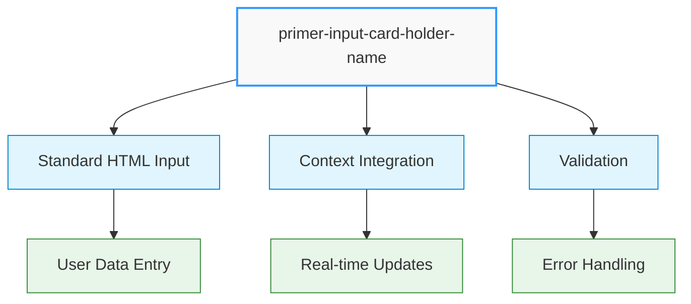
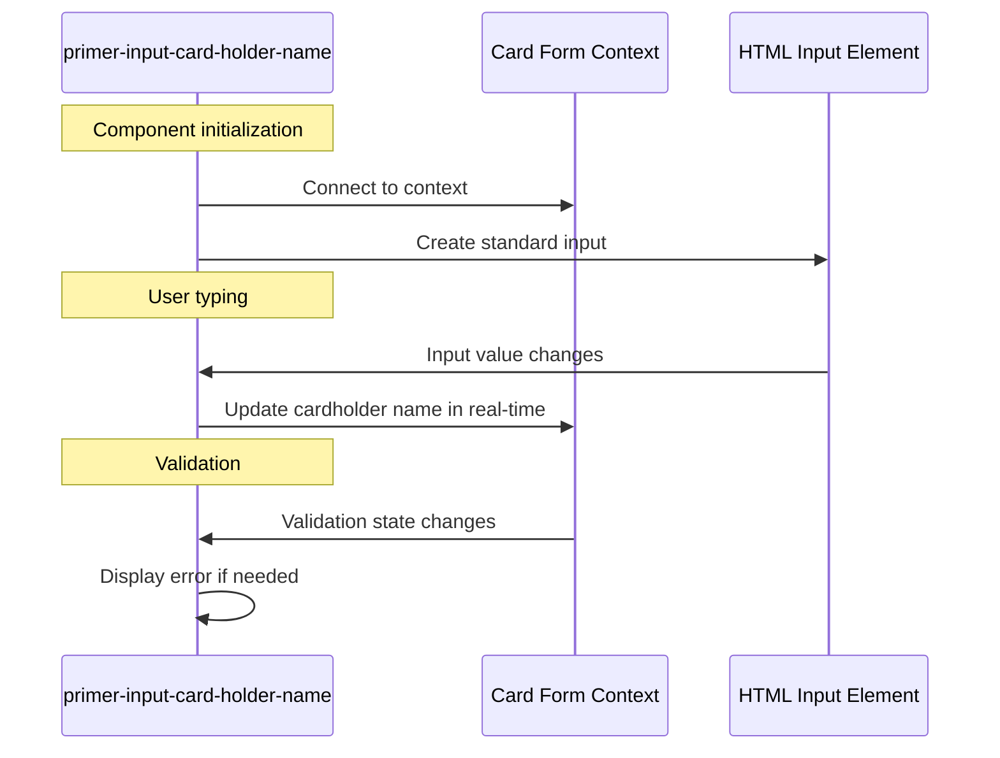
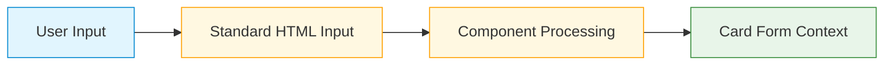

# Cardholder Name Input Component

## \<primer-input-card-holder-name\>

The Cardholder Name Input component provides a field for collecting the cardholder's name on a payment form. In the current implementation, this component renders a standard input field rather than a secure iframe, though this will change in future releases.



This component extends the abstract card input class used by all card form inputs, providing consistent behavior and styling.

## Usage

The Cardholder Name Input component must be used within a `primer-card-form` container:

```html
<primer-card-form>
  <primer-input-card-holder-name></primer-input-card-holder-name>
</primer-card-form>
```

## Properties

| Attribute     | Type     | Default           | Description                                |
| ------------- | -------- | ----------------- | ------------------------------------------ |
| `label`       | `string` | "Cardholder Name" | The label displayed above the input        |
| `placeholder` | `string` | "Name on card"    | Placeholder text shown when input is empty |
| `aria-label`  | `string` | "Cardholder Name" | Accessibility label for screen readers     |

### Property Behavior

<div class="property-behavior">

- **`label`**: If not explicitly set, uses the localized default value ("Cardholder Name"). If set to an empty string `""`, reverts to the default.
- **`placeholder`**: If not explicitly set, uses the localized default value ("Name on card"). If explicitly set to an empty string `""`, no placeholder will be displayed.
- **``**: If not explicitly set, uses the value of `label`. If explicitly set to an empty string `""`, reverts to the value of `label`.

</div>

## Technical Implementation



The Cardholder Name Input component:

1. **Connects to the card form context** to access validation state and update cardholder name data
2. **Uses `display: contents`** to seamlessly integrate with parent layout without creating a new box in the DOM
3. **Currently uses a standard HTML input** instead of a secure iframe (will change in future versions)
4. **Automatically updates the card form context** as the user types, sending each input value
5. **Automatically handles validation** by detecting errors from the card form context

## CSS Custom Properties

| Property                                   | Description                           |
| ------------------------------------------ | ------------------------------------- |
| `--primer-color-text-negative`             | Error message text color              |
| `--primer-color-border-outlined-error`     | Input border color in error state     |
| `--primer-color-background-outlined-error` | Input background color in error state |
| `--primer-width-error`                     | Input border width in error state     |
| `--primer-typography-error-font`           | Error message font family             |
| `--primer-typography-error-size`           | Error message font size               |
| `--primer-typography-error-weight`         | Error message font weight             |
| `--primer-typography-error-line-height`    | Error message line height             |
| `--primer-typography-error-letter-spacing` | Error message letter spacing          |

## DOM Structure

The component renders the following DOM structure:

```html
<primer-input-wrapper>
  <primer-input-label slot="label">Cardholder Name</primer-input-label>
  <div slot="input" id="cardFormName">
    <!-- Standard HTML input rendered here (not a secure iframe) -->
  </div>
  <!-- Error message appears here when validation fails -->
</primer-input-wrapper>
```

## Examples

```html
<primer-card-form>
  <primer-input-card-holder-name></primer-input-card-holder-name>
</primer-card-form>
```

```html
<primer-card-form>
  <primer-input-card-holder-name
    label="Name on Card"
    placeholder="Enter your full name"
    aria-label="Full name as it appears on your card"
  >
  </primer-input-card-holder-name>
</primer-card-form>
```

```html
<primer-card-form>
  <div slot="card-form-content">
    <primer-input-card-holder-name></primer-input-card-holder-name>
    <primer-input-card-number></primer-input-card-number>
    <div style="display: flex; gap: 8px;">
      <primer-input-card-expiry></primer-input-card-expiry>
      <primer-input-cvv></primer-input-cvv>
    </div>
    <button type="submit">Pay Now</button>
  </div>
</primer-card-form>
```

## Data Handling



Unlike the secure card details (number, expiry, CVV), the cardholder name:

1. Is not considered sensitive payment data under PCI DSS requirements
2. Is currently collected using a standard HTML input element rather than a secure iframe
3. Is passed to the card form context in real-time as the user types

:::caution Future Implementation Change
In future iterations, the cardholder name input will be migrated to a secure iframe implementation to improve autocomplete functionality. Developers **should not** rely on the current implementation using a standard HTML input, as this will change in upcoming releases.
:::

This migration will ensure consistent behavior across all input fields and provide better support for browser autocomplete features.

## Key Considerations

:::info Component Dependencies

- The Cardholder Name Input component must be placed inside a `primer-card-form` component
- Input validation happens automatically when the form is submitted
  :::

:::tip Implementation Details

- Validation errors are displayed below the input field when they occur
- The component updates the card form context in real-time with each character the user types
  :::

:::warning Implementation Stability
While this component currently uses a standard HTML input field, it will be migrated to a secure iframe in future versions, so do not build dependencies on its current implementation
:::
