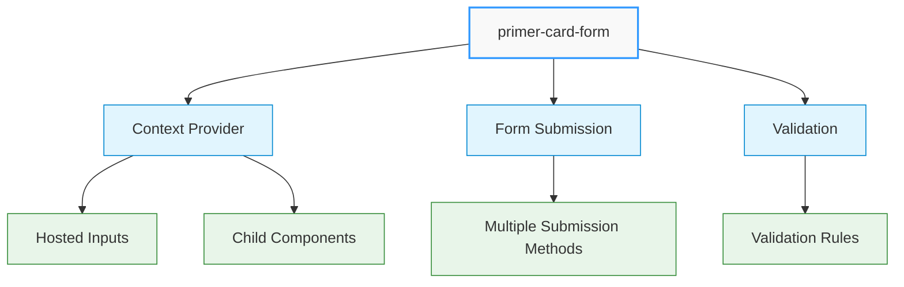
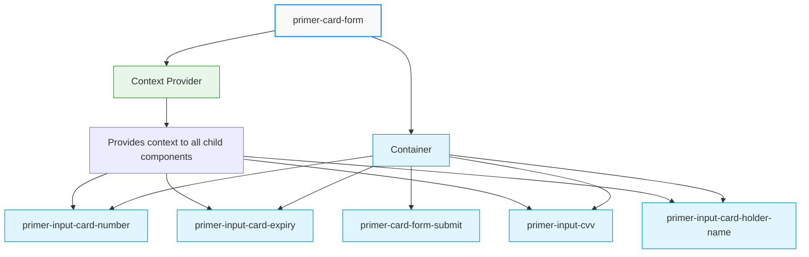
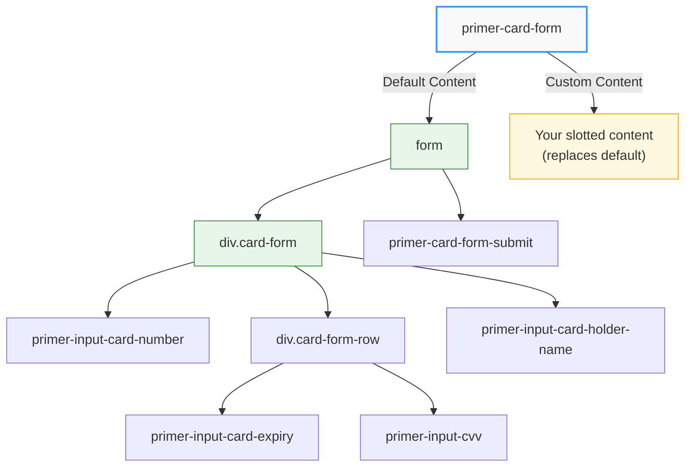
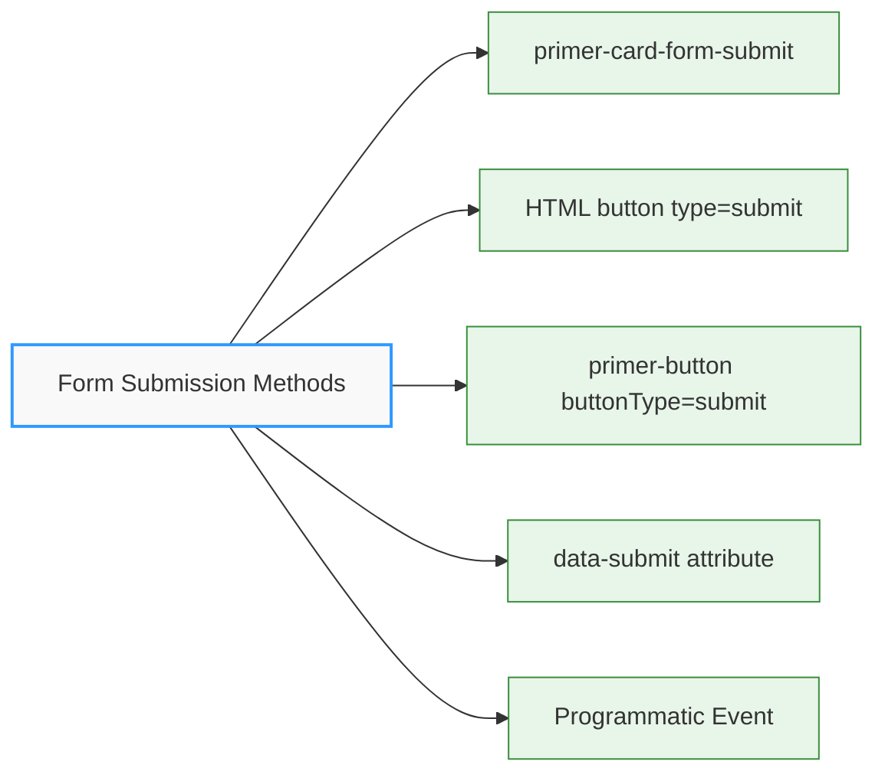
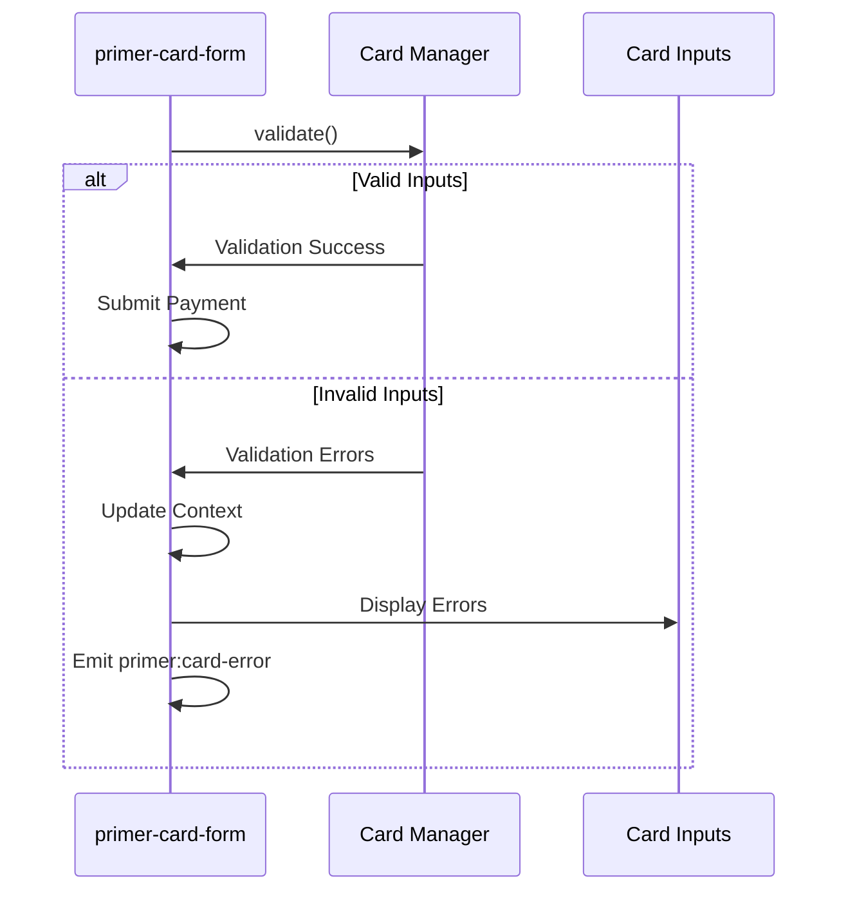

# Card Form Component

## \<primer-card-form\>

The `CardForm` component serves as a container for card input components. It handles payment card form submission, validation, and provides context to child components through a context provider system.



## Component Architecture

The Card Form component functions as both a container and a context provider. It manages the following:

1. **Context Provision**: Creates and provides a context that contains:

   - Secure hosted input elements for card data
   - Validation state management
   - Form state information
   - Submission handlers

2. **Form Management**: Handles HTML form creation, submission events, and validation flows

3. **Component Orchestration**: Coordinates all card input components to work together seamlessly

4. **Layout Options**: Provides both default and customizable layouts through the slot system

## Component Hierarchy

The Card Form component has a specific relationship with its child components:



The relationship is structured as follows:

1. **Parent-Child Relationship**: All card input components must be children of the `primer-card-form`, either:

   - Through the default layout (when no custom content is provided)
   - Through custom content in the `card-form-content` slot

2. **Context-Consumer Relationship**: All card input components consume the context provided by `primer-card-form`:

   - Input fields receive hosted input instances
   - Components receive validation state
   - Components can update shared card form data

3. **Coordination Role**: The card form coordinates all aspects of the payment form, including:
   - Creation of secure input fields
   - Validation of card data
   - Submission to payment processors
   - Error handling and reporting

## Technical Implementation

The Card Form component:

1. **Creates a context provider** that supplies hosted input elements to child components
2. **Uses `display: contents`** to seamlessly integrate with parent layout without creating a new box in the DOM
3. **Manages hosted inputs** by creating them through the Payment Card manager
4. **Handles form submission** through multiple detection methods (native buttons, custom buttons, and direct events)
5. **Provides default layout** when no custom content is provided

## Usage

The CardForm component can be used in two ways:

<div class="tabs-container">
<div class="tabs">
<div class="tab default active">Default Layout</div>
<div class="tab custom">Custom Layout</div>
</div>

<div class="tab-content default active">

```html
<primer-card-form></primer-card-form>
```

This renders a complete card form with:

- Card number input
- Expiry date input
- CVV input
- Cardholder name input
- Submit button

</div>

<div class="tab-content custom">

```html
<primer-card-form disabled>
  <div slot="card-form-content">
    <primer-input-card-holder-name></primer-input-card-holder-name>
    <primer-input-card-number></primer-input-card-number>
    <div style="display: flex; gap: 8px;">
      <primer-input-card-expiry></primer-input-card-expiry>
      <primer-input-cvv></primer-input-cvv>
    </div>
    <button type="submit">Pay Now</button>
  </div>
</primer-card-form>
```

</div>
</div>

## DOM Structure



When no custom content is provided, the component renders the following DOM structure:

```html
<form>
  <div class="card-form">
    <primer-input-card-number></primer-input-card-number>
    <div class="card-form-row">
      <primer-input-card-expiry></primer-input-card-expiry>
      <primer-input-cvv></primer-input-cvv>
    </div>
    <primer-input-card-holder-name></primer-input-card-holder-name>
  </div>
  <primer-card-form-submit></primer-card-form-submit>
</form>
```

With custom content, your slotted content replaces the default structure.

## Properties

| Name       | Type      | Description                                               | Default |
| ---------- | --------- | --------------------------------------------------------- | ------- |
| `disabled` | `Boolean` | When true, disables the card form and prevents submission | `false` |

## Slots

| Name                | Description                                                                                     |
| ------------------- | ----------------------------------------------------------------------------------------------- |
| `card-form-content` | Custom content slot for the card form. When provided, it replaces the default card form layout. |

## Events

| Event Name            | Type            | Description                                              | Event Detail             |
| --------------------- | --------------- | -------------------------------------------------------- | ------------------------ |
| `primer:card-submit`  | **Triggerable** | **Triggers card form submission programmatically**       | **CardSubmitPayload**    |
| `primer:card-success` | Listener        | Fired when the form is successfully submitted            | CardSubmitSuccessPayload |
| `primer:card-error`   | Listener        | Fired when there are validation errors during submission | CardSubmitErrorsPayload  |

### Event Payload Interfaces

#### CardSubmitPayload (Triggerable Event)

```typescript
interface CardSubmitPayload {
  source?: string; // Optional identifier of the trigger source
}
```

#### CardSubmitSuccessPayload

```typescript
interface CardSubmitSuccessPayload {
  result: unknown; // The successful submission result
}
```

#### CardSubmitErrorsPayload

```typescript
interface CardSubmitErrorsPayload {
  errors: unknown | InputValidationError[];
}
```

## Disabled State

The `disabled` attribute prevents card form submission and makes the form non-interactive:

```html
<!-- Disabled card form -->
<primer-card-form disabled></primer-card-form>

<!-- Conditionally disabled in JavaScript -->
<primer-card-form id="card-form"></primer-card-form>
<script>
  const cardForm = document.getElementById('card-form');

  // Disable during processing
  if (isProcessing) {
    cardForm.setAttribute('disabled', '');
  } else {
    cardForm.removeAttribute('disabled');
  }
</script>
```

When disabled:

- Form submission is prevented
- Submit button becomes non-interactive
- Input fields remain functional for data entry
- Visual feedback is provided through the submit button

## Form Submission

The CardForm component handles form submission automatically. You can trigger form submission in multiple ways:



<details>
<summary><strong>1. Using the primer-card-form-submit component (Recommended)</strong></summary>

```html
<primer-card-form-submit></primer-card-form-submit>
```

This is the recommended approach as it provides localized button text and consistent styling.

</details>

<details>
<summary><strong>2. Using a native HTML button</strong></summary>

```html
<button type="submit">Pay Now</button>
```

</details>

<details>
<summary><strong>3. Using a primer-button component</strong></summary>

```html
<primer-button buttonType="submit">Pay Now</primer-button>
```

</details>

<details>
<summary><strong>4. Using the data-submit attribute</strong></summary>

```html
<button data-submit>Pay Now</button>
<!-- or -->
<primer-button data-submit>Pay Now</primer-button>
```

</details>

<details>
<summary><strong>5. Programmatically via primer:card-submit Event</strong></summary>

You can trigger card form submission programmatically by dispatching a `primer:card-submit` event. The checkout component listens for this event at the document level, so you can dispatch it from anywhere in your application without needing to reference the card form element.

```javascript
// Trigger card form submission from anywhere in your application
document.dispatchEvent(
  new CustomEvent('primer:card-submit', {
    bubbles: true,
    composed: true,
    detail: { source: 'external-button' },
  }),
);
```

:::important Event Propagation
The `bubbles: true` and `composed: true` properties are required. These properties allow the event to propagate correctly through the DOM and across shadow DOM boundaries, ensuring the checkout component can capture the event regardless of where it's dispatched.
:::

**Advanced Example: Custom Submit Button with Event Handling**

```html
<primer-card-form>
  <div slot="card-form-content">
    <primer-input-card-number></primer-input-card-number>
    <primer-input-card-expiry></primer-input-card-expiry>
    <primer-input-cvv></primer-input-cvv>
    <button type="button" id="custom-submit" class="custom-pay-button">
      Pay Now
    </button>
  </div>
</primer-card-form>

<script>
  // Set up custom submit button
  document.getElementById('custom-submit').addEventListener('click', () => {
    // Dispatch to document - checkout listens at document level
    document.dispatchEvent(
      new CustomEvent('primer:card-submit', {
        bubbles: true,
        composed: true,
        detail: { source: 'custom-pay-button' },
      }),
    );
  });

  // Handle submission results
  const checkout = document.querySelector('primer-checkout');

  checkout.addEventListener('primer:card-success', (event) => {
    console.log('Payment successful:', event.detail.result);
    // Handle success
  });

  checkout.addEventListener('primer:card-error', (event) => {
    console.log('Validation errors:', event.detail.errors);
    // Handle errors
  });
</script>
```

:::tip Using the Source Parameter
Include a meaningful `source` identifier in the event detail. This helps with debugging and allows you to handle submissions differently based on the trigger source. The checkout component captures this event at the document level and forwards it internally to the card form.
:::

</details>

## Validation

The CardForm component automatically handles validation of all card input fields. Validation occurs when:

1. The form is submitted
2. Individual fields trigger validation events



Validation errors are automatically passed to the respective input components to display appropriate error messages. The validation process:

1. Calls the `validate()` method on the card manager
2. If validation fails, updates the context with validation errors
3. Dispatches a `primer:card-error` event with the errors
4. Child components receive the errors and display appropriate messages

## Context Provider

The CardForm component serves as a context provider for all child input components. It provides:

:::info Key Context Items

- **Hosted Inputs**: Secure iframe-based inputs for card number, expiry, and CVV
- **Setter Methods**: Functions to update cardholder name and card network
- **Validation State**: Current validation errors for each input
- **Submission Methods**: Functions to submit the card payment
  :::

This context mechanism ensures secure handling of sensitive payment data.

## Child Components

The CardForm component is designed to work with the following child components:

- [`primer-input-card-number`](/components/card-form/input-card-number): For entering the card number
- [`primer-input-card-expiry`](/components/card-form/input-card-expiry): For entering the card expiry date
- [`primer-input-cvv`](/components/card-form/input-cvv): For entering the card CVV/security code
- [`primer-input-card-holder-name`](/components/card-form/input-card-holder-name): For entering the cardholder's name
- [`primer-card-form-submit`](/components/card-form/card-form-submit): A submit button component (used in the default layout)

### Child Component Dependencies

All card form input components have a mandatory dependency on the `primer-card-form` context. They will not function correctly if used outside this context, as they require:

1. Access to secure hosted inputs
2. The validation system
3. Card data aggregation for submission

## Examples

<details>
<summary><strong>Complete Checkout Flow with CardForm</strong></summary>

```html
<primer-checkout clientToken="your-client-token" options="{options}">
  <primer-main slot="main">
    <div slot="payments">
      <primer-card-form>
        <div slot="card-form-content">
          <primer-input-card-holder-name></primer-input-card-holder-name>
          <primer-input-card-number></primer-input-card-number>
          <div style="display: flex; gap: 8px;">
            <primer-input-card-expiry></primer-input-card-expiry>
            <primer-input-cvv></primer-input-cvv>
          </div>
          <button type="submit">Complete Payment</button>
        </div>
      </primer-card-form>
    </div>
  </primer-main>
</primer-checkout>
```

</details>

<details>
<summary><strong>Handling Form Submission Events</strong></summary>

```javascript
const checkout = document.querySelector('primer-checkout');

// Listen for successful submissions
checkout.addEventListener('primer:card-success', (event) => {
  console.log('Payment successful!', event.detail.result);
  // Handle successful payment (e.g., show confirmation, redirect)
});

// Listen for validation errors
checkout.addEventListener('primer:card-error', (event) => {
  console.error('Validation errors:', event.detail.errors);
  // Handle errors (e.g., scroll to error, show notification)
});
```

</details>

## CSS Custom Properties

The CardForm component uses the following CSS custom properties for styling:

| Property                | Description                                      |
| ----------------------- | ------------------------------------------------ |
| `--primer-space-small`  | Spacing between inline elements (default: `8px`) |
| `--primer-space-medium` | Spacing between block elements (default: `16px`) |

## Co-branded Card Schemes Support

The `<primer-card-form>` component has been built to support co-branded card schemes like Cartes Bancaires (CB) natively. When the card networks detect a co-branded card, the network switcher will display automatically. No additional configuration is needed on the Primer.js side.

## Key Considerations

:::caution Important

- The CardForm component must be used within a `primer-checkout` component
- All card input components must be placed inside a CardForm component to function properly
- CardForm automatically manages the hosted input elements for secure card data collection
- When disabled, the form prevents submission but input fields remain functional
  :::

:::tip Implementation Notes

- The component uses `display: contents` to avoid creating additional DOM structure
- When no custom content is provided, a default form layout is rendered
- Submit buttons are detected based on their attributes (type="submit" or data-submit)
- The `disabled` attribute is passed to the card form submit button through context
  :::
