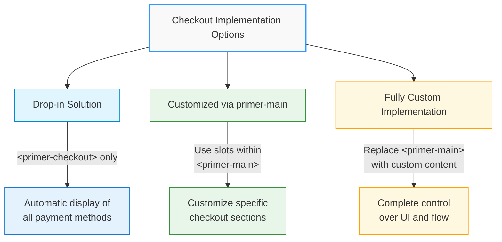
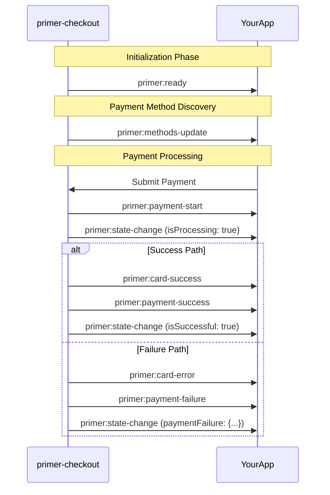
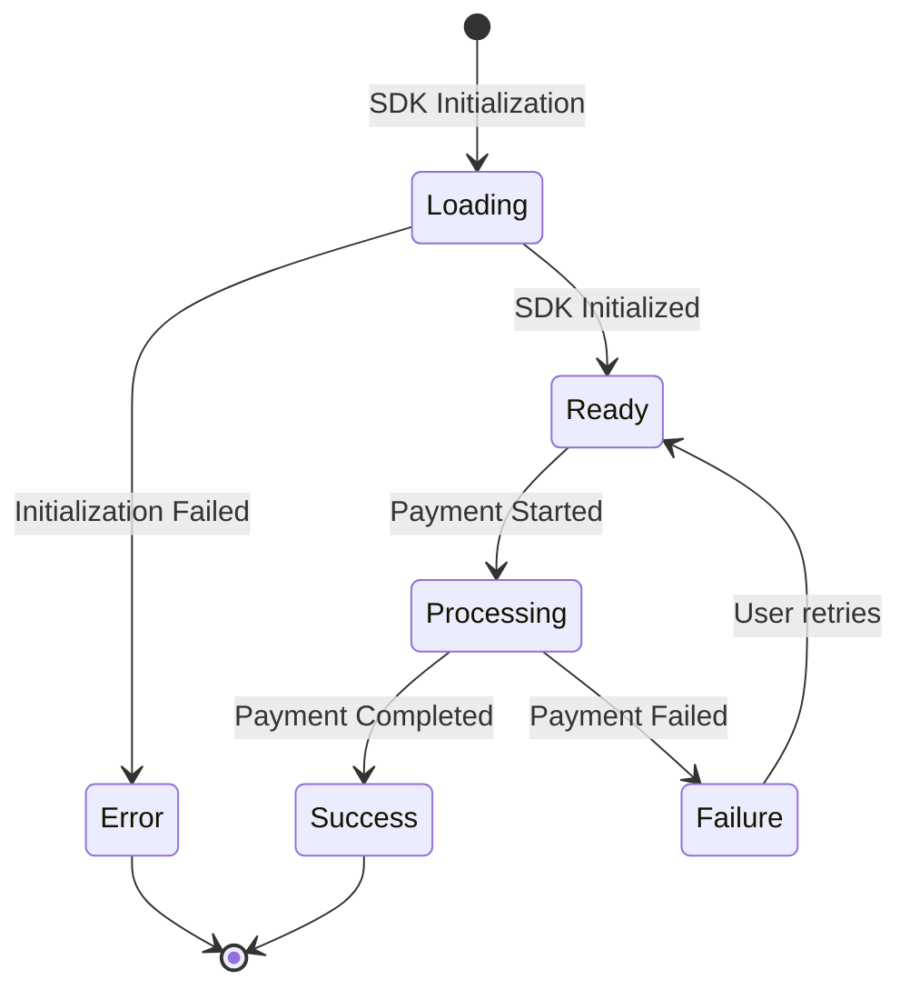

# Checkout Component

## \<primer-checkout\>

The `Checkout` component serves as the main container for all Primer payment components. It initializes the Primer SDK, manages the checkout state, and provides context to child components. This component can be used as a simple drop-in solution or as a foundation for a highly customized checkout experience.

:::warning Single Instance Limitation
Currently, only one instance of `<primer-checkout>` can be used per application. Multiple checkout configurations on a single page are not supported in the current version. This limitation may be addressed in future releases as we progress with engine rewrites.
:::

## Usage

The Checkout component can be used in three ways:



### 1. As a Drop-in Solution

Simply add the component with a client token to render a complete, ready-to-use checkout experience:

```html
<primer-checkout client-token="your-client-token"></primer-checkout>
```

This minimal implementation automatically displays all available payment methods with default styling and behavior.

### 2. With Customized primer-main Component

Use the optional `primer-main` component with slots to customize specific parts of the checkout experience:

```html
<primer-checkout client-token="your-client-token">
  <primer-main slot="main">
    <!-- Custom payment method layout -->
    <div slot="payments">
      <primer-payment-method type="PAYMENT_CARD"></primer-payment-method>
      <primer-payment-method type="PAYPAL"></primer-payment-method>
    </div>

    <!-- Custom completion screen -->
    <div slot="checkout-complete">
      <h2>Thank you for your purchase!</h2>
    </div>
  </primer-main>
</primer-checkout>
```

### 3. With Fully Custom Implementation

Replace the `primer-main` component entirely with your own custom implementation:

```html
<primer-checkout client-token="your-client-token">
  <!-- Custom implementation without using primer-main -->
  <div slot="main" id="custom-checkout">
    <h2>Select Payment Method</h2>
    <div class="payment-options">
      <primer-payment-method type="PAYMENT_CARD"></primer-payment-method>
    </div>
  </div>
</primer-checkout>
```

For comprehensive layout customization options, see the [Layout Customizations Guide](/guides/layout-customizations-guide).

## Properties

| Attribute         | Type      | Description                                                                     | Default |
| ----------------- | --------- | ------------------------------------------------------------------------------- | ------- |
| `client-token`    | `String`  | Required. The client token obtained from your Primer backend integration.       | `''`    |
| `options`         | `Object`  | Optional. Configuration options for the Primer SDK.                             | `{}`    |
| `custom-styles`   | `String`  | Optional. Stringified JSON object containing CSS custom properties for styling. | `''`    |
| `loader-disabled` | `Boolean` | Optional. When true, disables the default loading spinner.                      | `false` |

## SDK Options

The primer-checkout component accepts a comprehensive set of configuration options.

- **How to configure:** See the [Options Guide](/guides/options-guide) for usage patterns, React/JSX considerations, and setAttribute() requirements
- **What options are available:** See the [SDK Options Reference](/sdk-reference/sdk-options-reference) for a complete list of all options
- **Event handling:** For checkout completion/failure events, see the [Events Guide](/guides/events-guide)

:::tip Start Here
Start with the Options Guide to understand how to configure the SDK, then reference the SDK Options Reference for specific options.
:::

## Slots

| Name   | Description                                                                                                                                                                                                                                                  |
| ------ | ------------------------------------------------------------------------------------------------------------------------------------------------------------------------------------------------------------------------------------------------------------ |
| `main` | Main content slot for checkout components. If no content is provided, a default `<primer-main>` component is rendered with all available payment methods. You can provide either a `<primer-main>` component or your own custom implementation in this slot. |

## Events

The Checkout component dispatches various events throughout the payment lifecycle. These events can be captured at either the component level or the document level, as they bubble and cross shadow DOM boundaries.

For complete technical reference including event types and payloads, see the [Events & Callbacks Reference](/sdk-reference/events-callbacks). For usage examples, integration patterns, and best practices, see the [Events Guide](/guides/events-guide).

### Key Events

| Event Name                    | Description                                                             |
| ----------------------------- | ----------------------------------------------------------------------- |
| `primer:ready`                | Dispatched when SDK is fully initialized and ready                      |
| `primer:methods-update`       | Dispatched when available payment methods are updated                   |
| `primer:vault:methods-update` | Dispatched when vaulted payment methods are loaded or updated           |
| `primer:state-change`         | Dispatched when SDK state changes (loading, processing, success, error) |
| `primer:card-network-change`  | Dispatched when card network is detected or changed                     |
| `primer:card-submit`          | Triggerable event to submit the card form programmatically              |
| `primer:card-success`         | Dispatched when card form submission succeeds                           |
| `primer:card-error`           | Dispatched when card form validation errors occur                       |
| `primer:payment-start`        | Dispatched when payment creation begins                                 |
| `primer:payment-success`      | Dispatched when payment completes successfully                          |
| `primer:payment-failure`      | Dispatched when payment fails with error details                        |

:::note New in v0.7.0
Added payment lifecycle events (`primer:payment-start`, `primer:payment-success`, `primer:payment-failure`) and vault management events (`primer:vault:methods-update`).
:::



## States

The Checkout component manages several states:



1. **Loading state**: During SDK initialization
2. **Error state**: When SDK initialization fails
3. **Ready state**: When SDK is initialized and ready to process payments
4. **Processing state**: During payment processing
5. **Success state**: When payment is completed successfully
6. **Failure state**: When payment processing fails

## CSS Custom Properties

Primer Checkout uses CSS Custom Properties (CSS Variables) to maintain a consistent design language across components. These tokens provide a standardized way to customize the appearance of your UI components.

You can apply tokens in two ways:

1. Using CSS Custom Properties directly in your stylesheets
2. Using JSON properties through the `custom-styles` attribute

<details>
<summary><strong>CSS Usage Example</strong></summary>

```css
/* Apply styling to all checkout components */
:root {
  --primer-color-brand: #2f98ff;
  --primer-radius-base: 4px;
  --primer-typography-brand: Inter, sans-serif;
  --primer-space-base: 4px;
  --primer-size-base: 4px;
  --primer-color-loader: #2f98ff;
  --primer-color-focus: #2f98ff;
}
```

</details>

<details>
<summary><strong>JSON Usage Example</strong></summary>

```html
<primer-checkout
  custom-styles='{"primerColorBrand":"#2f98ff","primerRadiusBase":"4px","primerTypographyBrand":"Inter, sans-serif","primerSpaceBase":"4px","primerSizeBase":"4px","primerColorLoader":"#2f98ff","primerColorFocus":"#2f98ff"}'
></primer-checkout>
```

</details>

:::tip
Choose the approach that best fits your project structure. The CSS approach offers more flexibility with selectors and media queries, while the JSON approach keeps styling concerns directly with the component instance.
:::

## Technical Implementation

The Checkout component:

1. **Initializes the Primer SDK** using the provided client token
2. **Manages locale settings** based on the options or falls back to browser default
3. **Provides context to child components** through various controllers
4. **Renders a default main component** when no content is provided
5. **Handles loading and error states** automatically

## Examples

<details>
<summary><strong>Basic Drop-in Implementation</strong></summary>

The simplest implementation with default behavior and styling:

```html
<primer-checkout client-token="your-client-token"></primer-checkout>
```

</details>

<details>
<summary><strong>Using primer-main with Customization</strong></summary>

```html
<primer-checkout client-token="your-client-token" options='{"locale":"en-GB"}'>
  <primer-main slot="main">
    <!-- Customize payment methods display -->
    <div slot="payments">
      <primer-payment-method type="PAYMENT_CARD"></primer-payment-method>
    </div>
  </primer-main>
</primer-checkout>
```

</details>

<details>
<summary><strong>Fully Custom Implementation</strong></summary>

```html
<primer-checkout client-token="your-client-token">
  <!-- Custom implementation without primer-main -->
  <div slot="main" class="custom-checkout">
    <h2>Complete Your Purchase</h2>
    <primer-payment-method type="PAYMENT_CARD"></primer-payment-method>
  </div>
</primer-checkout>
```

</details>

<details>
<summary><strong>With Custom Styling</strong></summary>

```html
<primer-checkout
  client-token="your-client-token"
  options='{"locale":"en-GB"}'
  custom-styles='{"primerColorBrand":"#4a6cf7","primerTypographyBrand":"Inter, sans-serif","primerRadiusBase":"4px","primerSpaceBase":"8px","primerSizeBase":"4px","primerColorLoader":"#4a6cf7","primerColorFocus":"#2f98ff"}'
>
  <primer-main slot="main"></primer-main>
</primer-checkout>
```

</details>

<details>
<summary><strong>With API Version and Card Options</strong></summary>

```html
<primer-checkout
  client-token="your-client-token"
  options='{"locale":"en-GB","card":{"cardholderName":{"required":true}}}'
>
  <primer-main slot="main"></primer-main>
</primer-checkout>
```

</details>

<details>
<summary><strong>Disabling All Payment Methods Globally</strong></summary>

```html
<!-- Disable all payment methods through global configuration -->
<primer-checkout
  client-token="your-client-token"
  options='{"disabledPayments":true}'
>
  <primer-main slot="main"></primer-main>
</primer-checkout>

<!-- Using JavaScript -->
<script>
  const checkout = document.querySelector('primer-checkout');
  checkout.options = {
    disabledPayments: true,
  };
</script>
```

</details>

<details>
<summary><strong>Complete Checkout with Event Handling</strong></summary>

```html
<primer-checkout
  id="checkout"
  client-token="your-client-token"
  options='{"locale":"en-GB"}'
>
  <primer-main slot="main">
    <div slot="payments">
      <!-- Custom payment methods layout -->
    </div>
    <div slot="checkout-complete">
      <h2>Thank you for your purchase!</h2>
      <p>Your order has been confirmed.</p>
    </div>
  </primer-main>
</primer-checkout>

<script>
  const checkout = document.getElementById('checkout');

  // Listen for SDK initialization and configure callbacks
  checkout.addEventListener('primer:ready', (event) => {
    console.log('Primer Checkout initialized');
    const primerJS = event.detail;

    // Configure payment lifecycle callbacks
    primerJS.onPaymentStart = () => {
      console.log('Payment creation started');
    };

    primerJS.onPaymentSuccess = (data) => {
      console.log('Payment completed successfully:', data);
      // Access payment summary, payment ID, and other details
    };

    primerJS.onPaymentFailure = (data) => {
      console.error('Payment failed:', data.error);
      // Handle payment failure with error details
    };
  });

  // Listen for payment methods loading
  checkout.addEventListener('primer:methods-update', (event) => {
    const paymentMethods = event.detail;
    console.log('Available payment methods:', paymentMethods.toArray());
  });

  // Listen for payment lifecycle events
  checkout.addEventListener('primer:payment-start', () => {
    console.log('Payment started via event');
  });

  checkout.addEventListener('primer:payment-success', (event) => {
    const { paymentSummary, paymentMethodType } = event.detail;
    console.log('Payment success event:', paymentSummary);
  });

  checkout.addEventListener('primer:payment-failure', (event) => {
    const { error, paymentMethodType } = event.detail;
    console.error('Payment failure event:', error);
  });

  // Listen for checkout state changes
  checkout.addEventListener('primer:state-change', (event) => {
    const state = event.detail;
    if (state.isSuccessful) {
      console.log('Payment state: successful');
    } else if (state.isProcessing) {
      console.log('Payment state: processing');
    } else if (state.primerJsError) {
      console.error('SDK Error:', state.primerJsError.message);
    } else if (state.paymentFailure) {
      console.error('Payment Failure:', state.paymentFailure.message);
    }
  });
</script>
```

</details>

<details>
<summary><strong>Dynamically Setting Attributes and Options in JavaScript</strong></summary>

```html
<primer-checkout id="checkout">
  <primer-main slot="main"></primer-main>
</primer-checkout>

<script>
  const checkout = document.getElementById('checkout');

  // ✅ Set client-token using setAttribute()
  checkout.setAttribute('client-token', 'your-client-token');

  // ✅ Set custom styles using setAttribute()
  const customStyles = {
    primerColorBrand: '#4a6cf7',
    primerTypographyBrand: 'Inter, sans-serif',
  };
  checkout.setAttribute('custom-styles', JSON.stringify(customStyles));

  // ✅ Set options directly as a property (not an attribute)
  checkout.options = {
    locale: 'en-GB',
    card: {
      cardholderName: {
        required: true,
      },
    },
  };
</script>
```

</details>

## Locale Support

The Checkout component supports internationalization through the `locale` option. Set the desired locale in the options object:

```html
<primer-checkout client-token="your-client-token" options='{"locale":"fr-FR"}'>
  <primer-main slot="main"></primer-main>
</primer-checkout>
```

The full list of supported locales can be found in the [Localization and languages
section](https://primer.io/docs/payments/universal-checkout/drop-in/customize-checkout/web#localization-and-languages).

:::note
If an unsupported locale is provided, the component will fall back to the default 'en-GB' locale with a warning message in the console.
:::

:::warning
At present Primer Checkout only supports left-to-right (LTR) languages.
:::

## Loader Disabled Option

You can disable the default loading spinner that appears during SDK initialization by using the `loader-disabled` attribute:

```html
<primer-checkout client-token="your-client-token" loader-disabled>
  <primer-main slot="main"></primer-main>
</primer-checkout>
```

This is useful when you want to implement your own custom loading indicator or when integrating the checkout into a page that already has a loader.

## Key Considerations

:::info Summary of Key Points

- The Checkout component functions as a complete checkout solution out of the box, requiring only a client token
- Currently, only one instance of `<primer-checkout>` can be used per application (this limitation may be addressed in future releases)
- Without custom layout, the component automatically displays all available payment methods
- The `primer-main` component is optional - you can provide your own custom implementation in the `main` slot
- When using a custom implementation instead of `primer-main`, you'll need to listen to checkout events to handle different checkout states
- For custom layouts, use the `main` slot to provide your own content configuration
- The component automatically handles loading states and error messages
- All Primer payment components must be used within the Checkout component
- Unsupported locales will fall back to 'en-GB' with a console warning
- When using the `options` property directly in JavaScript, you can pass it as an object; when using it as an HTML attribute, it must be a stringified JSON object
- The `custom-styles` attribute accepts a stringified JSON object with camelCase property names that map to kebab-case CSS variables
- **Important**: Most attributes (`client-token`, `custom-styles`, `loader-disabled`) must be set using `setAttribute()` in JavaScript, not direct property assignment. The `options` property is an exception and should be set directly as a property.
  :::

For advanced customization, refer to the [Layout Customizations Guide](/guides/layout-customizations-guide).
