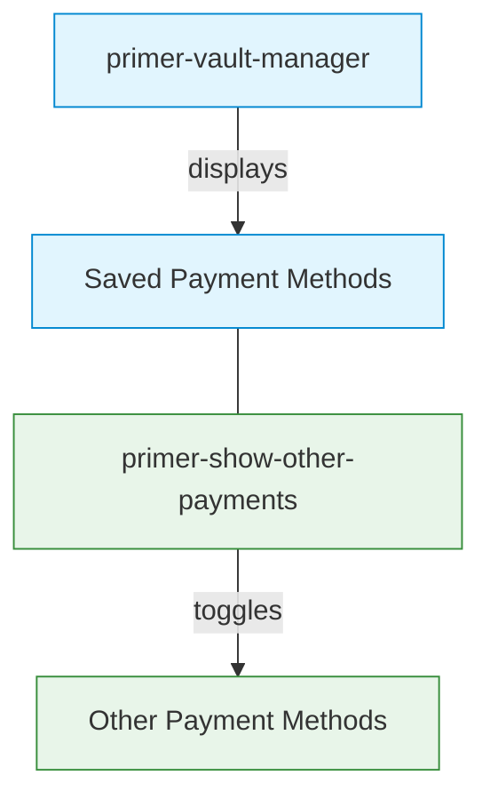

# Show Other Payments Component

## \<primer-show-other-payments\>

The `ShowOtherPayments` component provides a collapsible container that toggles the visibility of alternative payment methods when vaulted payment methods are available. It helps optimize the checkout interface by prioritizing saved payment methods while still providing access to other payment options.

## Usage

The Show Other Payments component is automatically integrated with the default checkout layout when the vault feature is enabled. When using a custom layout, it needs to be explicitly included.



### Component Purpose

This component serves to declutter the checkout interface by:

1. Automatically collapsing alternative payment methods when saved methods are available
2. Providing a clear toggle button to view additional payment options
3. Automatically expanding other payment methods when no saved methods exist

## Slots

| Name                                | Description                                                                                                            |
| ----------------------------------- | ---------------------------------------------------------------------------------------------------------------------- |
| `other-payments`                    | Container slot for alternative payment methods that will be made collapsible                                           |
| `show-other-payments-toggle-button` | Custom content slot for the toggle button. When provided, it replaces the default "Show other payment methods" button. |

### Toggle Button Slot

The Show Other Payments component allows you to customize the toggle button by providing your own button element via the `show-other-payments-toggle-button` slot. This gives you full control over the button's appearance while maintaining the collapse/expand functionality.

```html
<primer-show-other-payments>
  <button slot="show-other-payments-toggle-button" type="button">
    View More Payment Options
  </button>
  <div slot="other-payments">
    <primer-payment-method type="PAYMENT_CARD"></primer-payment-method>
    <primer-payment-method type="PAYPAL"></primer-payment-method>
  </div>
</primer-show-other-payments>
```

**Button Requirements:**

For the component to recognize your custom button as a toggle button, it must have:

- `type="button"` - Standard HTML button type (prevents form submission)

:::tip Automatic Behavior
When you provide a custom button via the `show-other-payments-toggle-button` slot, the built-in toggle button is automatically hidden. No additional configuration is needed.
:::

**Advanced Example: Custom Styled Toggle Button**

```html
<primer-show-other-payments>
  <button
    slot="show-other-payments-toggle-button"
    type="button"
    style="
      background: transparent;
      border: 2px solid #0288d1;
      color: #0288d1;
      padding: 10px 20px;
      border-radius: 6px;
      font-weight: 500;
      cursor: pointer;
    "
  >
    🔍 Show Alternative Payment Methods
  </button>
  <div slot="other-payments" class="payment-methods-list">
    <primer-payment-method type="PAYMENT_CARD"></primer-payment-method>
    <primer-payment-method type="PAYPAL"></primer-payment-method>
    <primer-payment-method type="GOOGLE_PAY"></primer-payment-method>
  </div>
</primer-show-other-payments>
```

**Using with primer-button Component:**

```html
<primer-show-other-payments>
  <primer-button
    slot="show-other-payments-toggle-button"
    type="button"
    variant="secondary"
  >
    Show More Payment Methods
  </primer-button>
  <div slot="other-payments">
    <primer-payment-method type="PAYMENT_CARD"></primer-payment-method>
    <primer-payment-method type="PAYPAL"></primer-payment-method>
  </div>
</primer-show-other-payments>
```

:::note Toggle Behavior
The toggle button automatically handles the expand/collapse state of the payment methods container. When clicked, it will show or hide the payment methods in the `other-payments` slot.
:::

### Tracking Toggle State

The component dispatches a `primer:show-other-payments-toggled` event when the toggle state changes. Use this to update button labels dynamically or implement custom UI logic.

**Event Details:**

- **Event Name**: `primer:show-other-payments-toggled`
- **Event Data**: `event.detail.expanded` (Boolean - `true` when expanded, `false` when collapsed)
- **When Dispatched**: On each toggle button click

**React Example: Dynamic Button Label**

```jsx
import { useRef, useState, useEffect } from 'react';

function CheckoutWithToggle() {
  const checkoutRef = useRef(null);
  const [isExpanded, setIsExpanded] = useState(false);

  useEffect(() => {
    const checkout = checkoutRef.current;
    if (!checkout) return;

    const handleToggle = (e) => setIsExpanded(e.detail.expanded);
    checkout.addEventListener(
      'primer:show-other-payments-toggled',
      handleToggle,
    );

    return () =>
      checkout.removeEventListener(
        'primer:show-other-payments-toggled',
        handleToggle,
      );
  }, []);

  return (
    <primer-checkout ref={checkoutRef} client-token='your-client-token'>
      <primer-main slot='main'>
        <div slot='payments'>
          <primer-vault-manager></primer-vault-manager>
          <primer-show-other-payments>
            <button slot='show-other-payments-toggle-button' type='button'>
              {isExpanded ? 'Hide' : 'Show'} Other Payment Methods
            </button>
            <div slot='other-payments'>
              <primer-payment-method type='PAYMENT_CARD'></primer-payment-method>
              <primer-payment-method type='PAYPAL'></primer-payment-method>
            </div>
          </primer-show-other-payments>
        </div>
      </primer-main>
    </primer-checkout>
  );
}
```

**Vanilla JavaScript Example:**

```javascript
const checkout = document.querySelector('primer-checkout');
const toggleButton = document.querySelector(
  '[slot="show-other-payments-toggle-button"]',
);

checkout.addEventListener('primer:show-other-payments-toggled', (event) => {
  const isExpanded = event.detail.expanded;
  toggleButton.textContent = isExpanded
    ? 'Hide Other Payment Methods'
    : 'Show Other Payment Methods';
  toggleButton.setAttribute('aria-expanded', isExpanded);
});
```

## Technical Implementation

The Show Other Payments component:

1. **Consumes the Vault Manager context** to access information about saved payment methods
2. **Conditionally renders** a collapsible container based on vault state
3. **Manages expansion state** based on the presence of vaulted payment methods
4. **Utilizes the Collapsable component** for smooth transitions and animations
5. **Handles loading states** to ensure proper rendering sequence

## Examples

<details>
<summary><strong>Basic Implementation (Default Layout)</strong></summary>

When using the default layout, the Show Other Payments component is automatically integrated:

```html
<primer-checkout
  client-token="your-client-token"
  options='{"vault": {"enabled": true}}'
>
</primer-checkout>
```

The component will automatically handle the toggling of alternative payment methods based on vault state.

</details>

<details>
<summary><strong>Custom Layout Implementation</strong></summary>

When using a custom layout, you need to explicitly include the component:

```html
<primer-checkout
  client-token="your-client-token"
  options='{"vault": {"enabled": true}}'
>
  <primer-main slot="main">
    <div slot="payments">
      <!-- Display vault manager for saved payment methods -->
      <primer-vault-manager></primer-vault-manager>

      <!-- Wrap other payment methods in the show-other-payments component -->
      <primer-show-other-payments>
        <div slot="other-payments" class="payment-methods-list">
          <primer-payment-method type="PAYMENT_CARD"></primer-payment-method>
          <primer-payment-method type="PAYPAL"></primer-payment-method>
          <!-- Add other payment methods as needed -->
        </div>
      </primer-show-other-payments>
    </div>
  </primer-main>
</primer-checkout>
```

This example demonstrates how to manually integrate the component in a custom layout while maintaining the desired user experience.

</details>

## States

The component handles several distinct states:

1. **Vault Manager Loading**: Renders nothing while vault data is loading
2. **No Vault or Vault Disabled**: Renders content without collapse functionality (direct passthrough)
3. **Vault with No Saved Methods**: Renders expanded collapsible container
4. **Vault with Saved Methods**: Renders collapsed collapsible container

## Key Considerations

:::info Summary of Key Points

- The Show Other Payments component helps manage checkout UI complexity when using the vault feature
- It is automatically integrated in the default layout, but needs explicit inclusion in custom layouts
- The component works in conjunction with the Vault Manager component
- It automatically expands when no saved payment methods are available
- The collapse/expand behavior provides a cleaner checkout interface while maintaining access to all payment options
- Custom toggle buttons can be provided via the `show-other-payments-toggle-button` slot with full styling control
  :::

## Related Documentation

For more information on related components and functionality:

- [Vault Manager Component](/sdk-reference/Components/vault-manager-doc)
- [Payment Method Component](/sdk-reference/Components/payment-method-doc)
- [Main Component](/sdk-reference/Components/primer-main-doc)
