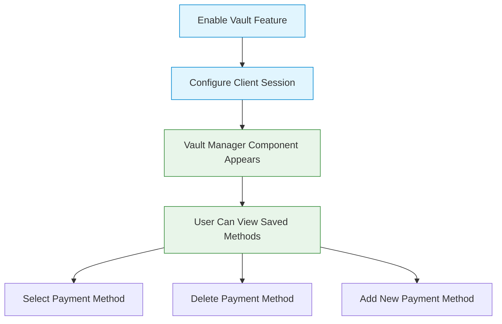
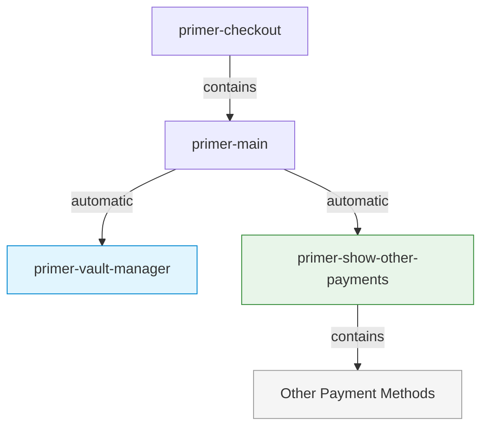
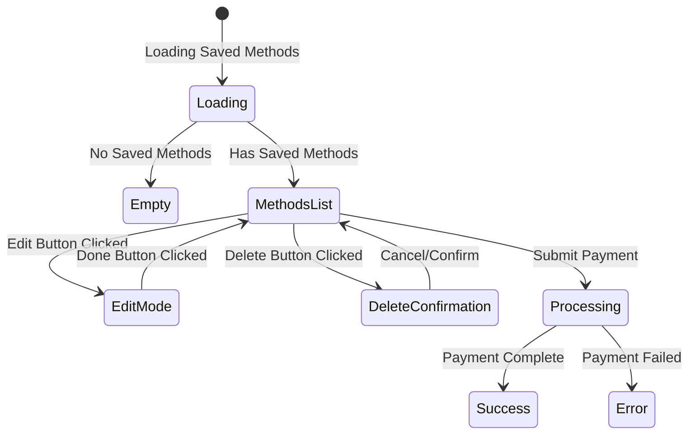
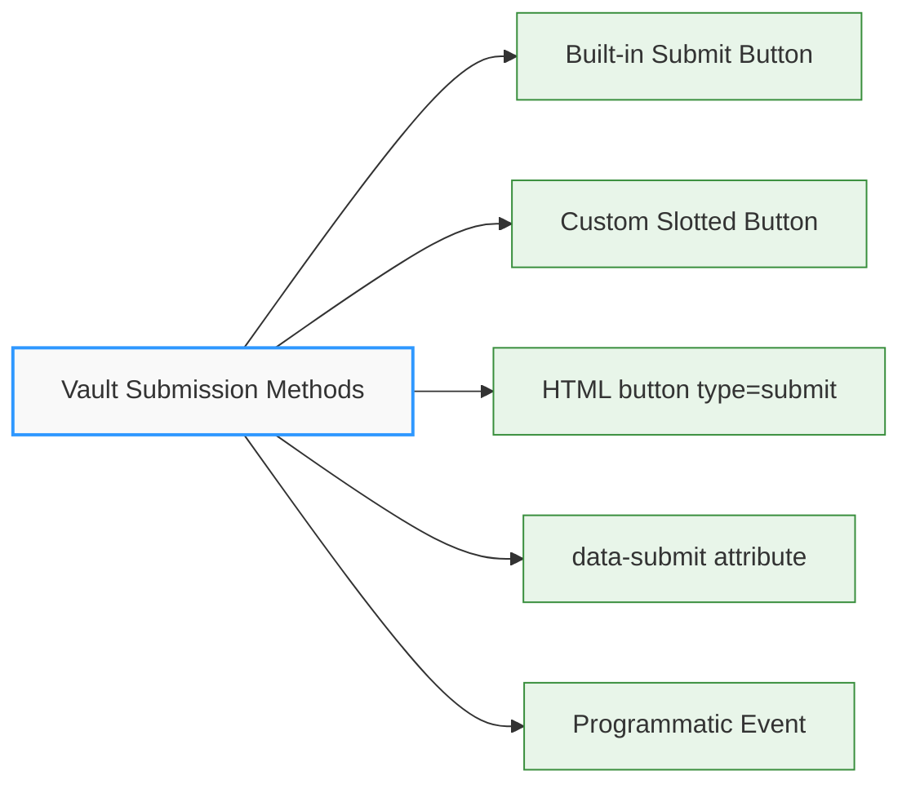

# Vault Manager Component

## \<primer-vault-manager\>

The `VaultManager` component displays and manages saved payment methods for returning customers. It provides a user interface for viewing, selecting, and managing vaulted payment methods, including the ability to delete saved payment methods. This component enhances the checkout experience for returning customers by enabling them to reuse their previously saved payment information.

## Usage

The Vault Manager component is automatically integrated with the Checkout component when the vault feature is enabled. It does not need to be manually added to your implementation when using the default layout.



### Enabling the Vault Manager

To enable the Vault Manager component, you need to:

1. Configure the `vault` option in the Primer Checkout component:

```html
<primer-checkout
  client-token="your-client-token"
  options='{"vault": {"enabled": true}}'
>
</primer-checkout>
```

2. Ensure your client session is properly configured to handle vaulted payment methods. Refer to the [Save Payment Methods documentation](https://primer.io/docs/payment-services/save-payment-methods) for detailed configuration requirements.

## Default Layout and Other Payment Methods

When using the default layout with the vault feature enabled:

1. The `<primer-vault-manager>` component automatically displays saved payment methods
2. The `<primer-show-other-payments>` component automatically wraps and collapses other payment methods
3. This creates a streamlined checkout flow that prioritizes saved payment methods while still providing access to alternatives



For more details on the Show Other Payments component, see the [Show Other Payments Component documentation](show-other-payments-doc).

## States and Views

The Vault Manager component manages several different views depending on the current state:



1. **Loading state**: While fetching saved payment methods
2. **Empty state**: When no saved payment methods exist
3. **Methods List**: Displays available payment methods with submit button
4. **Edit Mode**: Allows users to delete payment methods
5. **Delete Confirmation**: Confirms before deleting a payment method
6. **Processing state**: During payment processing

## Features

### Payment Method Management

The Vault Manager component provides a comprehensive interface for managing saved payment methods:

- **View saved payment methods**: Displays a list of all saved payment methods with relevant details
- **Edit mode**: Toggle between view and edit modes to manage saved payment methods
- **Delete payment methods**: Remove saved payment methods with confirmation
- **Select and use**: Choose a saved payment method for the current transaction
- **Error handling**: Clear display of error messages with ability to dismiss

### CVV Recapture

For enhanced security, the Vault Manager can be configured to require CVV verification for saved card payments. To enable CVV recapture, refer to the [Save Payment Methods documentation](https://primer.io/docs/payment-services/save-payment-methods).

## Technical Implementation

The Vault Manager component:

1. **Accesses vaulted payment methods** through the Vault Manager Context
2. **Manages state** for viewing, editing, and deleting payment methods
3. **Handles animations** for smooth transitions between states
4. **Communicates with the SDK** to process payments and delete saved methods
5. **Provides error handling** for various failure scenarios

## Examples

<details>
<summary><strong>Basic Implementation with Vault Enabled</strong></summary>

Enable vault features in the Checkout component:

```html
<primer-checkout
  client-token="your-client-token"
  options='{"vault": {"enabled": true}}'
>
</primer-checkout>
```

The Vault Manager will automatically appear when saved payment methods are available.

</details>

<details>
<summary><strong>When Used With Custom Layout</strong></summary>

When implementing a custom layout, you need to manually include both the Vault Manager and Show Other Payments components:

```html
<primer-checkout
  client-token="your-client-token"
  options='{"vault": {"enabled": true}}'
>
  <primer-main slot="main">
    <div slot="payments">
      <!-- Manually add the vault manager -->
      <primer-vault-manager></primer-vault-manager>

      <!-- Manually add the show-other-payments component to maintain the optimal UX -->
      <primer-show-other-payments>
        <div slot="other-payments" class="payment-methods-list">
          <primer-payment-method type="PAYMENT_CARD"></primer-payment-method>
          <primer-payment-method type="PAYPAL"></primer-payment-method>
          <!-- Add other payment methods as needed -->
        </div>
      </primer-show-other-payments>
    </div>
  </primer-main>
</primer-checkout>
```

This example demonstrates how to maintain the same user experience as the default layout while using a custom implementation. If you prefer not to use the Show Other Payments component in your custom layout, you can simply omit it and display payment methods directly.

</details>

## Slots

| Name            | Description                                                                                                    |
| --------------- | -------------------------------------------------------------------------------------------------------------- |
| `submit-button` | Custom content slot for the submit button. When provided, it replaces the default vault payment submit button. |

### Submit Button Slot

The Vault Manager component allows you to customize the submit button by providing your own button element via the `submit-button` slot. This gives you full control over the button's appearance while maintaining the vault payment functionality.

```html
<primer-vault-manager>
  <button slot="submit-button" type="submit">Pay with Saved Card</button>
</primer-vault-manager>
```

**Button Requirements:**

For the vault manager to recognize your custom button as a submit button, it must have **one of these attributes**:

- `type="submit"` - Standard HTML submit button type
- `data-submit` - Custom attribute for non-button elements

:::tip Automatic Behavior
When you provide a custom button via the `submit-button` slot, the built-in submit button is automatically hidden. No additional configuration is needed.
:::

## Form Submission

The Vault Manager component handles form submission automatically. You can trigger vault payment submission in multiple ways:



<details>
<summary><strong>1. Using the built-in submit button (Default)</strong></summary>

The Vault Manager includes a default submit button that is automatically displayed:

```html
<primer-vault-manager></primer-vault-manager>
```

This button is shown by default and hidden automatically when you provide a custom button via the `submit-button` slot.

</details>

<details>
<summary><strong>2. Using a custom slotted button</strong></summary>

Replace the built-in button with your own custom button:

```html
<primer-vault-manager>
  <button slot="submit-button" type="submit">Pay with Saved Card</button>
</primer-vault-manager>
```

The custom button must have `type="submit"` or `data-submit` attribute.

</details>

<details>
<summary><strong>3. Using a primer-button component</strong></summary>

You can use Primer's button component in the slot:

```html
<primer-vault-manager>
  <primer-button slot="submit-button" type="submit">
    Complete Payment
  </primer-button>
</primer-vault-manager>
```

</details>

<details>
<summary><strong>4. Programmatically via primer:vault-submit Event</strong></summary>

You can trigger vault payment submission programmatically by dispatching a `primer:vault-submit` event. The checkout component listens for this event at the document level, so you can dispatch it from anywhere in your application.

```javascript
// Trigger vault payment submission from anywhere
document.dispatchEvent(
  new CustomEvent('primer:vault-submit', {
    bubbles: true,
    composed: true,
    detail: { source: 'external-button' },
  }),
);
```

:::important Event Propagation
The `bubbles: true` and `composed: true` properties are required. These properties allow the event to propagate correctly through the DOM and across shadow DOM boundaries.
:::

**Advanced Example: External Submit Button**

```html
<primer-checkout
  client-token="your-client-token"
  options='{"vault": {"enabled": true}}'
>
  <primer-main slot="main">
    <div slot="payments">
      <primer-vault-manager></primer-vault-manager>
    </div>
  </primer-main>
</primer-checkout>

<!-- External button anywhere on the page -->
<button id="external-submit">Pay Now</button>

<script>
  // Set up external submit button
  document.getElementById('external-submit').addEventListener('click', () => {
    document.dispatchEvent(
      new CustomEvent('primer:vault-submit', {
        bubbles: true,
        composed: true,
        detail: { source: 'external-checkout-button' },
      }),
    );
  });

  // Handle payment results
  document.addEventListener('primer:payment-success', (event) => {
    console.log('Payment successful:', event.detail);
  });

  document.addEventListener('primer:payment-failure', (event) => {
    console.error('Payment failed:', event.detail);
  });
</script>
```

:::tip Using the Source Parameter
Include a meaningful `source` identifier in the event detail. This helps with debugging and allows you to track different submission triggers.
:::

</details>

## Tracking Payment Method Selection

The Vault Manager dispatches events to track payment method selection and processing state. Use these to enable/disable custom submit buttons or implement custom UI logic.

**Key Events:**

- **`primer:vault:selection-change`** - Dispatched when a payment method is selected or deselected
  - `event.detail.paymentMethodId` (string | null) - ID of selected payment method, or `null` when deselected
  - `event.detail.timestamp` (number) - Timestamp of selection change

- **`primer:state-change`** - Dispatched when SDK processing state changes
  - `event.detail.isProcessing` (boolean) - `true` when payment is processing

**React Example:**

```jsx
import { useRef, useState, useEffect } from 'react';

function CheckoutWithVault() {
  const checkoutRef = useRef(null);
  const [selectedPaymentMethodId, setSelectedPaymentMethodId] = useState(null);
  const [isProcessing, setIsProcessing] = useState(false);

  useEffect(() => {
    const checkout = checkoutRef.current;
    if (!checkout) return;

    const handleSelection = (e) =>
      setSelectedPaymentMethodId(e.detail.paymentMethodId);
    const handleStateChange = (e) => setIsProcessing(e.detail.isProcessing);

    checkout.addEventListener('primer:vault:selection-change', handleSelection);
    checkout.addEventListener('primer:state-change', handleStateChange);

    return () => {
      checkout.removeEventListener(
        'primer:vault:selection-change',
        handleSelection,
      );
      checkout.removeEventListener('primer:state-change', handleStateChange);
    };
  }, []);

  return (
    <primer-checkout ref={checkoutRef} client-token='your-client-token'>
      <primer-main slot='main'>
        <div slot='payments'>
          <primer-vault-manager>
            <button
              slot='submit-button'
              type='submit'
              disabled={!selectedPaymentMethodId || isProcessing}
            >
              {isProcessing ? 'Processing...' : 'Pay with Saved Card'}
            </button>
          </primer-vault-manager>
        </div>
      </primer-main>
    </primer-checkout>
  );
}
```

**Vanilla JavaScript Example:**

```javascript
const checkout = document.querySelector('primer-checkout');
const submitButton = document.querySelector('[slot="submit-button"]');

let selectedPaymentMethodId = null;
let isProcessing = false;

checkout.addEventListener('primer:vault:selection-change', (e) => {
  selectedPaymentMethodId = e.detail.paymentMethodId;
  submitButton.disabled = !selectedPaymentMethodId || isProcessing;
});

checkout.addEventListener('primer:state-change', (e) => {
  isProcessing = e.detail.isProcessing;
  submitButton.disabled = !selectedPaymentMethodId || isProcessing;
});
```

## Key Considerations

:::info Summary of Key Points

- The Vault Manager component is automatically integrated when the vault feature is enabled
- In the default layout, other payment methods are automatically collapsed using the Show Other Payments component
- When implementing a custom layout, you must manually add both components to maintain the same user experience
- Proper client session configuration is essential for the vault feature to work correctly
- CVV recapture can be enabled for enhanced security with saved card payments
- The component automatically handles different states: loading, empty, edit mode, and delete confirmation
- Error handling is built in with clear user feedback
- Custom submit buttons can be provided via the `submit-button` slot with full styling control
  :::

## Headless Vault Implementation {#headless-vault-implementation}

:::info New in v0.11.0
The headless vault flow allows you to build completely custom vault UIs while retaining full vault functionality. Use the `primerJS.vault.*` namespace for programmatic control.
:::

Headless vault mode hides the default vault UI components and provides full programmatic control through the `primerJS.vault` API. This enables custom vault interfaces that match your brand and workflow requirements.

### Configuration

Enable headless vault mode by setting `vault.headless: true` in your options:

```javascript
const checkout = document.querySelector('primer-checkout');
checkout.setAttribute('client-token', 'your-client-token');

checkout.options = {
  vault: {
    enabled: true,
    headless: true, // Hide default vault UI
    showEmptyState: false,
  },
};
```

### Complete Implementation Example

This example demonstrates a full headless vault implementation supporting both Cards and PayPal payment methods:

```html
<primer-checkout client-token="your-client-token">
  <primer-main slot="main">
    <div slot="payments">
      <!-- Custom vault UI container -->
      <div id="custom-vault-container"></div>
      <div id="cvv-container"></div>
      <button id="pay-button" disabled>Pay Now</button>

      <!-- Other payment methods remain available -->
      <primer-card-form></primer-card-form>
    </div>
  </primer-main>
</primer-checkout>

<script>
  const checkout = document.querySelector('primer-checkout');

  // Configure headless vault
  checkout.options = {
    vault: {
      enabled: true,
      headless: true,
      showEmptyState: false,
    },
  };

  // State management
  let selectedMethodId = null;
  let cvvInputInstance = null;
  let isProcessing = false;

  checkout.addEventListener('primer:ready', (event) => {
    const primerJS = event.detail;
    const payButton = document.getElementById('pay-button');
    const vaultContainer = document.getElementById('custom-vault-container');
    const cvvContainer = document.getElementById('cvv-container');

    // Handle vaulted methods updates
    primerJS.onVaultedMethodsUpdate = async ({
      vaultedPayments,
      cvvRecapture,
    }) => {
      const methods = vaultedPayments.toArray();

      // Clear and rebuild vault UI
      vaultContainer.innerHTML = '';
      cvvContainer.innerHTML = '';
      cvvInputInstance = null;

      if (methods.length === 0) {
        vaultContainer.innerHTML = '<p>No saved payment methods</p>';
        payButton.disabled = true;
        return;
      }

      // Render each vaulted payment method
      methods.forEach((method, index) => {
        const methodElement = document.createElement('div');
        methodElement.className = 'vault-payment-method';

        // Display data based on payment instrument type
        let displayInfo = '';
        if (method.paymentInstrumentType === 'PAYMENT_CARD') {
          // Card data: last4Digits, network, cardholderName, expirationMonth, expirationYear
          const data = method.paymentInstrumentData;
          displayInfo = `
          <strong>${data.network}</strong> •••• ${data.last4Digits}
          <br><small>${data.cardholderName || 'Card Holder'} - Exp: ${data.expirationMonth}/${data.expirationYear}</small>
        `;
        } else if (
          method.paymentInstrumentType === 'PAYPAL_BILLING_AGREEMENT'
        ) {
          // PayPal data: email, firstName, lastName
          const data = method.paymentInstrumentData;
          displayInfo = `
          <strong>PayPal</strong>
          <br><small>${data.firstName} ${data.lastName} (${data.email})</small>
        `;
        } else {
          displayInfo = `<strong>${method.paymentInstrumentType}</strong>`;
        }

        methodElement.innerHTML = `
        <label>
          <input type="radio" name="vault-method" value="${method.id}" ${index === 0 ? 'checked' : ''}>
          ${displayInfo}
        </label>
        <button class="delete-btn" data-id="${method.id}">Delete</button>
      `;
        vaultContainer.appendChild(methodElement);
      });

      // Set initial selection
      selectedMethodId = methods[0]?.id || null;
      payButton.disabled = !selectedMethodId;

      // Handle radio button changes
      vaultContainer
        .querySelectorAll('input[name="vault-method"]')
        .forEach((radio) => {
          radio.addEventListener('change', async (e) => {
            selectedMethodId = e.target.value;
            payButton.disabled = !selectedMethodId;

            // Recreate CVV input if needed
            if (cvvRecapture && selectedMethodId) {
              const selectedMethod = methods.find(
                (m) => m.id === selectedMethodId,
              );
              if (selectedMethod?.paymentInstrumentType === 'PAYMENT_CARD') {
                cvvContainer.innerHTML = '';
                cvvInputInstance = await primerJS.vault.createCvvInput({
                  cardNetwork: selectedMethod.paymentInstrumentData.network,
                  container: '#cvv-container',
                  placeholder: 'CVV',
                });
              } else {
                cvvContainer.innerHTML = '';
                cvvInputInstance = null;
              }
            }
          });
        });

      // Handle delete buttons
      vaultContainer.querySelectorAll('.delete-btn').forEach((btn) => {
        btn.addEventListener('click', async (e) => {
          const methodId = e.target.dataset.id;
          try {
            await primerJS.vault.delete(methodId);
            console.log('Payment method deleted successfully');
          } catch (error) {
            console.error('Failed to delete:', error);
          }
        });
      });

      // Create CVV input if required for first (selected) method
      if (cvvRecapture && selectedMethodId) {
        const selectedMethod = methods.find((m) => m.id === selectedMethodId);
        if (selectedMethod?.paymentInstrumentType === 'PAYMENT_CARD') {
          cvvInputInstance = await primerJS.vault.createCvvInput({
            cardNetwork: selectedMethod.paymentInstrumentData.network,
            container: '#cvv-container',
            placeholder: 'CVV',
          });
        }
      }
    };

    // Handle pay button click
    payButton.addEventListener('click', async () => {
      if (!selectedMethodId || isProcessing) return;

      // Validate CVV before payment
      if (cvvInputInstance && cvvInputInstance.metadata.error) {
        console.error('Invalid CVV:', cvvInputInstance.metadata.error);
        return;
      }

      isProcessing = true;
      payButton.disabled = true;
      payButton.textContent = 'Processing...';

      try {
        const options = cvvInputInstance
          ? { cvv: cvvInputInstance.valueToken }
          : undefined;

        await primerJS.vault.startPayment(selectedMethodId, options);
      } catch (error) {
        console.error('Payment failed:', error);
        isProcessing = false;
        payButton.disabled = false;
        payButton.textContent = 'Pay Now';
      }
    });

    // Handle payment success
    primerJS.onPaymentSuccess = (data) => {
      console.log('Payment successful:', data.payment.id);
      isProcessing = false;
      window.location.href = '/confirmation';
    };

    // Handle payment failure
    primerJS.onPaymentFailure = (data) => {
      console.error('Payment failed:', data.error.message);
      isProcessing = false;
      payButton.disabled = false;
      payButton.textContent = 'Pay Now';
    };
  });
</script>

<style>
  .vault-payment-method {
    display: flex;
    justify-content: space-between;
    align-items: center;
    padding: 12px;
    border: 1px solid #e0e0e0;
    border-radius: 8px;
    margin-bottom: 8px;
  }
  .vault-payment-method label {
    display: flex;
    align-items: center;
    gap: 12px;
    flex: 1;
  }
  .delete-btn {
    background: none;
    border: 1px solid #dc3545;
    color: #dc3545;
    padding: 4px 8px;
    border-radius: 4px;
    cursor: pointer;
  }
  #cvv-container {
    margin: 16px 0;
  }
  #pay-button {
    width: 100%;
    padding: 12px;
    background: #007bff;
    color: white;
    border: none;
    border-radius: 8px;
    cursor: pointer;
  }
  #pay-button:disabled {
    background: #ccc;
    cursor: not-allowed;
  }
</style>
```

### VaultAPI Methods Reference

| Method                             | Description                                     |
| ---------------------------------- | ----------------------------------------------- |
| `vault.createCvvInput(options)`    | Creates a CVV input for CVV recapture scenarios |
| `vault.startPayment(id, options?)` | Initiates payment with a vaulted payment method |
| `vault.delete(id)`                 | Permanently deletes a vaulted payment method    |

### Enhanced Data Fields

The `VaultedPaymentMethodSummary` object provides payment-method-specific data. Use `paymentInstrumentType` to determine the payment method type:

**Cards (`paymentInstrumentType: 'PAYMENT_CARD'`):**

- `last4Digits` - Last 4 digits of card number
- `network` - Card network (VISA, MASTERCARD, etc.)
- `cardholderName` - Name on the card
- `expirationMonth` - Expiration month
- `expirationYear` - Expiration year

**PayPal (`paymentInstrumentType: 'PAYPAL_BILLING_AGREEMENT'`):**

- `email` - PayPal account email
- `firstName` - Account holder first name
- `lastName` - Account holder last name
- `externalPayerId` - PayPal payer ID

**Klarna (`paymentInstrumentType: 'KLARNA_CUSTOMER_TOKEN'`):**

- `email` - Klarna account email
- `firstName` - Account holder first name
- `lastName` - Account holder last name

**ACH (`paymentInstrumentType: 'AUTOMATED_CLEARING_HOUSE'`):**

- `accountNumberLastFourDigits` - Last 4 digits of account
- `bankName` - Bank name
- `accountType` - CHECKING or SAVINGS

## Related Documentation

For more information on configuring and using the vaulting functionality:

- [Save Payment Methods Documentation](https://primer.io/docs/payment-services/save-payment-methods)
- [Show Other Payments Component](/sdk-reference/Components/show-other-payments-doc)
