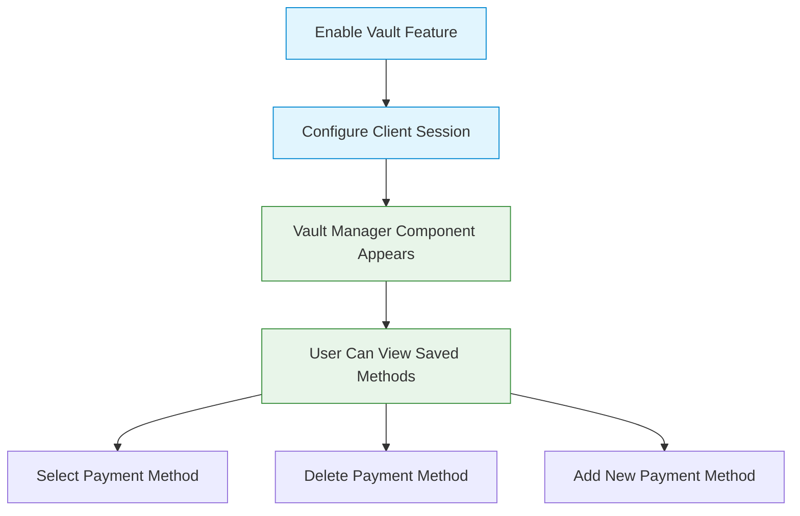
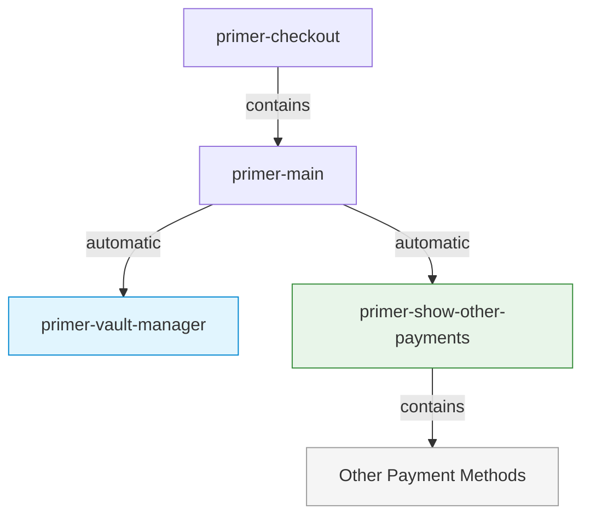
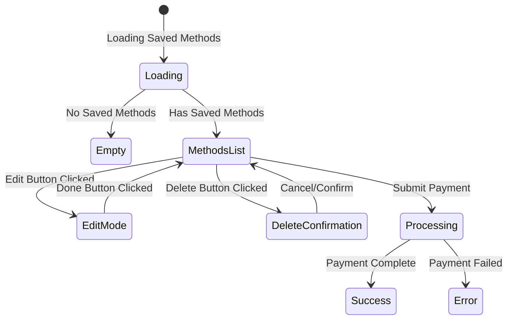

# Vault Manager Component

## \<primer-vault-manager\>

The `VaultManager` component displays and manages saved payment methods for returning customers. It provides a user interface for viewing, selecting, and managing vaulted payment methods, including the ability to delete saved payment methods. This component enhances the checkout experience for returning customers by enabling them to reuse their previously saved payment information.

## Usage

The Vault Manager component is automatically integrated with the Checkout component when the vault feature is enabled. It does not need to be manually added to your implementation when using the default layout.



### Enabling the Vault Manager

To enable the Vault Manager component, you need to:

1. Configure the `vault` option in the Primer Checkout component:

```html
<primer-checkout
  client-token="your-client-token"
  options='{"vault": {"enabled": true}}'
>
</primer-checkout>
```

2. Ensure your client session is properly configured to handle vaulted payment methods. Refer to the [Save Payment Methods documentation](https://primer.io/docs/payment-services/save-payment-methods) for detailed configuration requirements.

## Default Layout and Other Payment Methods

When using the default layout with the vault feature enabled:

1. The `<primer-vault-manager>` component automatically displays saved payment methods
2. The `<primer-show-other-payments>` component automatically wraps and collapses other payment methods
3. This creates a streamlined checkout flow that prioritizes saved payment methods while still providing access to alternatives



For more details on the Show Other Payments component, see the [Show Other Payments Component documentation](show-other-payments-doc).

## States and Views

The Vault Manager component manages several different views depending on the current state:



1. **Loading state**: While fetching saved payment methods
2. **Empty state**: When no saved payment methods exist
3. **Methods List**: Displays available payment methods with submit button
4. **Edit Mode**: Allows users to delete payment methods
5. **Delete Confirmation**: Confirms before deleting a payment method
6. **Processing state**: During payment processing

## Features

### Payment Method Management

The Vault Manager component provides a comprehensive interface for managing saved payment methods:

- **View saved payment methods**: Displays a list of all saved payment methods with relevant details
- **Edit mode**: Toggle between view and edit modes to manage saved payment methods
- **Delete payment methods**: Remove saved payment methods with confirmation
- **Select and use**: Choose a saved payment method for the current transaction
- **Error handling**: Clear display of error messages with ability to dismiss

### CVV Recapture

For enhanced security, the Vault Manager can be configured to require CVV verification for saved card payments. To enable CVV recapture, refer to the [Save Payment Methods documentation](https://primer.io/docs/payment-services/save-payment-methods).

## Technical Implementation

The Vault Manager component:

1. **Accesses vaulted payment methods** through the Vault Manager Context
2. **Manages state** for viewing, editing, and deleting payment methods
3. **Handles animations** for smooth transitions between states
4. **Communicates with the SDK** to process payments and delete saved methods
5. **Provides error handling** for various failure scenarios

## Examples

<details>
<summary><strong>Basic Implementation with Vault Enabled</strong></summary>

Enable vault features in the Checkout component:

```html
<primer-checkout
  client-token="your-client-token"
  options='{"vault": {"enabled": true}}'
>
</primer-checkout>
```

The Vault Manager will automatically appear when saved payment methods are available.

</details>

<details>
<summary><strong>When Used With Custom Layout</strong></summary>

When implementing a custom layout, you need to manually include both the Vault Manager and Show Other Payments components:

```html
<primer-checkout
  client-token="your-client-token"
  options='{"vault": {"enabled": true}}'
>
  <primer-main slot="main">
    <div slot="payments">
      <!-- Manually add the vault manager -->
      <primer-vault-manager></primer-vault-manager>

      <!-- Manually add the show-other-payments component to maintain the optimal UX -->
      <primer-show-other-payments>
        <div slot="other-payments" class="payment-methods-list">
          <primer-payment-method type="PAYMENT_CARD"></primer-payment-method>
          <primer-payment-method type="PAYPAL"></primer-payment-method>
          <!-- Add other payment methods as needed -->
        </div>
      </primer-show-other-payments>
    </div>
  </primer-main>
</primer-checkout>
```

This example demonstrates how to maintain the same user experience as the default layout while using a custom implementation. If you prefer not to use the Show Other Payments component in your custom layout, you can simply omit it and display payment methods directly.

</details>

## Key Considerations

:::info Summary of Key Points

- The Vault Manager component is automatically integrated when the vault feature is enabled
- In the default layout, other payment methods are automatically collapsed using the Show Other Payments component
- When implementing a custom layout, you must manually add both components to maintain the same user experience
- Proper client session configuration is essential for the vault feature to work correctly
- CVV recapture can be enabled for enhanced security with saved card payments
- The component automatically handles different states: loading, empty, edit mode, and delete confirmation
- Error handling is built in with clear user feedback
  :::

## Related Documentation

For more information on configuring and using the vaulting functionality:

- [Save Payment Methods Documentation](https://primer.io/docs/payment-services/save-payment-methods)
- [Show Other Payments Component](show-other-payments-doc)
