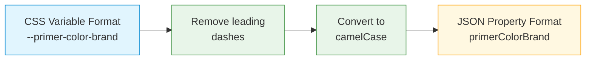
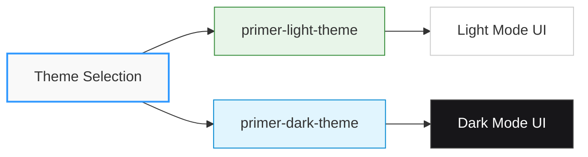

<style>
  {`
  .type-color, .type-font, .type-radius, .type-spacing, .type-size {
    display: inline-block;
    padding: 2px 6px;
    border-radius: 4px;
    font-size: 12px;
    font-weight: 500;
    line-height: 16px;
  }

            .type-color {
              background-color: rgba(230, 126, 34, 0.15);
              color: #d35400;
            }

            .type-font {
              background-color: rgba(155, 89, 182, 0.15);
              color: #8e44ad;
              white-space: nowrap;
            }

            .type-radius {
              background-color: rgba(46, 204, 113, 0.15);
              color: #27ae60;
            }

            .type-spacing {
              background-color: rgba(52, 152, 219, 0.15);
              color: #2980b9;
            }

            .type-size {
              background-color: rgba(241, 196, 15, 0.15);
              color: #f39c12;
            }

            .vars-table td:first-child code {
              white-space: nowrap;
            }
`}
</style>

# Primer Checkout Styling API

Primer Checkout uses styling variables (implemented as CSS Variables) to maintain a consistent design language across components. These variables provide a standardized way to customize the appearance of your checkout UI.

## Styling Methods

You can apply styling in two ways:

```css
/* Apply styling directly in your CSS */
primer-checkout {
  --primer-color-brand: #2f98ff;
  --primer-radius-medium: 8px;
  --primer-typography-brand: 'Inter', sans-serif;
}
```

```html
<!-- Apply styling through component attributes -->
<primer-checkout
  customStyles='{"primerColorBrand":"#2f98ff","primerRadiusMedium":"8px"}'
></primer-checkout>
```

## CSS to JSON Conversion



When using the JSON method, convert kebab-case CSS variables to camelCase properties:

1. Remove the leading dashes (`--`)
2. Convert hyphens to camelCase by removing the hyphen and capitalizing the next letter

**Examples:**

- `--primer-color-brand` → `primerColorBrand`
- `--primer-space-medium` → `primerSpaceMedium`
- `--primer-typography-body-large-font` → `primerTypographyBodyLargeFont`

## Core Styling Variables

These variables control the fundamental aspects of your checkout UI, from colors to spacing.

<div className="vars-table">

| CSS Variable                | Type                                           | Description                                               | Default Value               | Affects                                                                     |
| --------------------------- | ---------------------------------------------- | --------------------------------------------------------- | --------------------------- | --------------------------------------------------------------------------- |
| `--primer-color-brand`      | <span className="type-color">color</span>      | Controls the brand color across the checkout.             | `#2F98FF`                   | Background color in primary primer-button, Focus outline in all components  |
| `--primer-typography-brand` | <span className="type-font">font family</span> | Controls the brand font family across the checkout.       | `Inter`                     | All typography styles                                                       |
| `--primer-color-background` | <span className="type-color">color</span>      | Controls the background color across the checkout.        | `#FFFFFF`                   | Default background color in all components except the primary primer-button |
| `--primer-color-focus`      | <span className="type-color">color</span>      | Controls the interactive focus color across the checkout. | `var(--primer-color-brand)` | Focus outline in all components                                             |

</div>

## Text Colors

<div className="vars-table">

| CSS Variable                      | Type                                      | Description                                              | Default Value | Affects                                                                                                           |
| --------------------------------- | ----------------------------------------- | -------------------------------------------------------- | ------------- | ----------------------------------------------------------------------------------------------------------------- |
| `--primer-color-text-primary`     | <span className="type-color">color</span> | Controls the primary text color across the checkout.     | `#212121`     | Secondary/Tertiary primer-button label text, primer-input input text, primer-input-label text                     |
| `--primer-color-text-placeholder` | <span className="type-color">color</span> | Controls the placeholder text color across the checkout. | `#9E9E9E`     | primer-input placeholder text                                                                                     |
| `--primer-color-text-disabled`    | <span className="type-color">color</span> | Controls the disabled text color across the checkout.    | `#BDBDBD`     | (In disabled state) Secondary/Tertiary primer-button label text, primer-input input text, primer-input-label text |
| `--primer-color-text-negative`    | <span className="type-color">color</span> | Controls the negative text color across the checkout.    | `#B4324B`     | primer-input-error text in primer-input                                                                           |

</div>

## Border Radius

<div className="vars-table">

| CSS Variable             | Type                                        | Description                                            | Default Value | Affects                         |
| ------------------------ | ------------------------------------------- | ------------------------------------------------------ | ------------- | ------------------------------- |
| `--primer-radius-small`  | <span className="type-radius">radius</span> | Controls the small border radius across the checkout.  | `4px`         | primer-input-wrapper            |
| `--primer-radius-medium` | <span className="type-radius">radius</span> | Controls the medium border radius across the checkout. | `8px`         | Primary/Secondary primer-button |

</div>

## Spacing

<div className="vars-table">

| CSS Variable            | Type                                          | Description                                       | Default Value | Affects                                                                           |
| ----------------------- | --------------------------------------------- | ------------------------------------------------- | ------------- | --------------------------------------------------------------------------------- |
| `--primer-space-xsmall` | <span className="type-spacing">spacing</span> | Controls the x-small spacing across the checkout. | `4px`         | primer-input-wrapper (Spacing between primer-input-label & primer-input)          |
| `--primer-space-small`  | <span className="type-spacing">spacing</span> | Controls the small spacing across the checkout.   | `8px`         | primer-card-form, primer-input-card-number                                        |
| `--primer-space-medium` | <span className="type-spacing">spacing</span> | Controls the medium spacing across the checkout.  | `12px`        | Paddings in primer-button, primer-input-wrapper, Spacings inside primer-card-form |

</div>

## Typography

The following variables control text appearance across components, ensuring consistent text styling and readability.

### Title Large

<div className="vars-table">

| CSS Variable                                     | Type                                              | Description                                                      | Default Value                    | Affects                                             |
| ------------------------------------------------ | ------------------------------------------------- | ---------------------------------------------------------------- | -------------------------------- | --------------------------------------------------- |
| `--primer-typography-title-large-font`           | <span className="type-font">font family</span>    | Controls the font family of the title-large typography style.    | `var(--primer-typography-brand)` | Primary/Secondary/Tertiary primer-button label text |
| `--primer-typography-title-large-weight`         | <span className="type-font">font weight</span>    | Controls the font weight of the title-large typography style.    | `550`                            | Primary/Secondary/Tertiary primer-button label text |
| `--primer-typography-title-large-size`           | <span className="type-font">font size</span>      | Controls the font size of the title-large typography style.      | `16px`                           | Primary/Secondary/Tertiary primer-button label text |
| `--primer-typography-title-large-line-height`    | <span className="type-font">line height</span>    | Controls the line height of the title-large typography style.    | `20px`                           | Primary/Secondary/Tertiary primer-button label text |
| `--primer-typography-title-large-letter-spacing` | <span className="type-font">letter spacing</span> | Controls the letter spacing of the title-large typography style. | `-0.2px`                         | Primary/Secondary/Tertiary primer-button label text |

</div>

### Body Large

<div className="vars-table">

| CSS Variable                                    | Type                                              | Description                                                     | Default Value                    | Affects                                |
| ----------------------------------------------- | ------------------------------------------------- | --------------------------------------------------------------- | -------------------------------- | -------------------------------------- |
| `--primer-typography-body-large-font`           | <span className="type-font">font family</span>    | Controls the font family of the body-large typography style.    | `var(--primer-typography-brand)` | Input/Placeholder text in primer-input |
| `--primer-typography-body-large-weight`         | <span className="type-font">font weight</span>    | Controls the font weight of the body-large typography style.    | `400`                            | Input/Placeholder text in primer-input |
| `--primer-typography-body-large-size`           | <span className="type-font">font size</span>      | Controls the font size of the body-large typography style.      | `16px`                           | Input/Placeholder text in primer-input |
| `--primer-typography-body-large-line-height`    | <span className="type-font">line height</span>    | Controls the line height of the body-large typography style.    | `20px`                           | Input/Placeholder text in primer-input |
| `--primer-typography-body-large-letter-spacing` | <span className="type-font">letter spacing</span> | Controls the letter spacing of the body-large typography style. | `-0.2px`                         | Input/Placeholder text in primer-input |

</div>

### Body Small

<div className="vars-table">

| CSS Variable                                    | Type                                              | Description                                                     | Default Value                    | Affects                                |
| ----------------------------------------------- | ------------------------------------------------- | --------------------------------------------------------------- | -------------------------------- | -------------------------------------- |
| `--primer-typography-body-small-font`           | <span className="type-font">font family</span>    | Controls the font family of the body-small typography style.    | `var(--primer-typography-brand)` | primer-input-error, primer-input-label |
| `--primer-typography-body-small-weight`         | <span className="type-font">font weight</span>    | Controls the font weight of the body-small typography style.    | `400`                            | primer-input-error, primer-input-label |
| `--primer-typography-body-small-size`           | <span className="type-font">font size</span>      | Controls the font size of the body-small typography style.      | `12px`                           | primer-input-error, primer-input-label |
| `--primer-typography-body-small-line-height`    | <span className="type-font">line height</span>    | Controls the line height of the body-small typography style.    | `16px`                           | primer-input-error, primer-input-label |
| `--primer-typography-body-small-letter-spacing` | <span className="type-font">letter spacing</span> | Controls the letter spacing of the body-small typography style. | `0`                              | primer-input-error, primer-input-label |

</div>

## Outlined Container

These styling variables control the appearance of outlined containers like input wrappers and buttons.

### Background Properties

<div className="vars-table">

| CSS Variable                                  | Type                                      | Description                                                                | Default Value                                     | Affects                                                                               |
| --------------------------------------------- | ----------------------------------------- | -------------------------------------------------------------------------- | ------------------------------------------------- | ------------------------------------------------------------------------------------- |
| `--primer-color-background-outlined-default`  | <span className="type-color">color</span> | Controls the background color of the outlined container in default state.  | `var(--primer-color-background)`                  | (In default state) Background color in primer-input-wrapper, secondary primer-button  |
| `--primer-color-background-outlined-hover`    | <span className="type-color">color</span> | Controls the background color of the outlined container in hover state.    | `var(--primer-color-background-outlined-default)` | (In hover state) Background color in primer-input-wrapper, secondary primer-button    |
| `--primer-color-background-outlined-active`   | <span className="type-color">color</span> | Controls the background color of the outlined container in active state.   | `var(--primer-color-background-outlined-default)` | (In active state) Background color in primer-input-wrapper, secondary primer-button   |
| `--primer-color-background-outlined-error`    | <span className="type-color">color</span> | Controls the background color of the outlined container in error state.    | `var(--primer-color-background-outlined-default)` | (In error state) Background color in primer-input-wrapper                             |
| `--primer-color-background-outlined-disabled` | <span className="type-color">color</span> | Controls the background color of the outlined container in disabled state. | `#F5F5F5`                                         | (In disabled state) Background color in primer-input-wrapper, secondary primer-button |

</div>

### Border Properties

<div className="vars-table">

| CSS Variable                              | Type                                      | Description                                                            | Default Value               | Affects                                                                           |
| ----------------------------------------- | ----------------------------------------- | ---------------------------------------------------------------------- | --------------------------- | --------------------------------------------------------------------------------- |
| `--primer-color-border-outlined-default`  | <span className="type-color">color</span> | Controls the border color of the outlined container in default state.  | `#E0E0E0`                   | (In default state) Border color in primer-input-wrapper, secondary primer-button  |
| `--primer-color-border-outlined-hover`    | <span className="type-color">color</span> | Controls the border color of the outlined container in hover state.    | `#BDBDBD`                   | (In hover state) Border color in primer-input-wrapper, secondary primer-button    |
| `--primer-color-border-outlined-active`   | <span className="type-color">color</span> | Controls the border color of the outlined container in active state.   | `#9E9E9E`                   | (In active state) Border color in primer-input-wrapper, secondary primer-button   |
| `--primer-color-border-outlined-focus`    | <span className="type-color">color</span> | Controls the border color of the outlined container in focus state.    | `var(--primer-color-focus)` | (In focus state) Border color in primer-input-wrapper, secondary primer-button    |
| `--primer-color-border-outlined-error`    | <span className="type-color">color</span> | Controls the border color of the outlined container in error state.    | `#FF7279`                   | (In error state) Border color in primer-input-wrapper, secondary primer-button    |
| `--primer-color-border-outlined-disabled` | <span className="type-color">color</span> | Controls the border color of the outlined container in disabled state. | `#EEEEEE`                   | (In disabled state) Border color in primer-input-wrapper, secondary primer-button |

</div>

## Using Styling Variables in Practice

### CSS Variables Method

:::info Implementation Options
You can target specific components or apply global styling to all components in your checkout experience.
:::

```css
/* Customizing all components */
:root {
  /* Colors */
  --primer-color-brand: #663399;
  --primer-color-text-primary: #333333;

  /* Typography */
  --primer-typography-body-large-font: 'Helvetica Neue', sans-serif;

  /* Spacing */
  --primer-space-medium: 16px;

  /* Border Radius */
  --primer-radius-medium: 8px;
}
```

### JSON Properties Method

This approach is particularly useful when working with JavaScript frameworks or when you need to apply styling variables programmatically.

```javascript
// Create a styling object
const myCustomStyles = {
  primerColorBrand: '#663399',
  primerColorTextPrimary: '#333333',
  primerTypographyBodyLargeFont: 'Helvetica Neue, sans-serif',
  primerSpaceMedium: '16px',
  primerRadiusMedium: '8px',
};

// Apply to component
const checkoutElement = document.querySelector('primer-checkout');
checkoutElement.setAttribute('customStyles', JSON.stringify(myCustomStyles));
```

The component will parse the JSON and automatically apply the styles as CSS Variables internally.

## Theme Support

Primer Checkout supports both light (default) and dark themes using CSS classes:



```html
<!-- Add the theme class to your checkout container -->
<primer-checkout client-token="your-client-token" class="primer-dark-theme">
  <!-- Your checkout content -->
</primer-checkout>
```

You can toggle between themes using JavaScript:

```javascript
// Function to toggle between themes
function toggleTheme(isDark) {
  const container = document.querySelector('primer-checkout');
  container.className = isDark ? 'primer-dark-theme' : 'primer-light-theme';
}

// Examples
toggleTheme(true); // Switch to dark theme
toggleTheme(false); // Switch to light theme
```

This approach allows you to support both light and dark themes, toggling between them as needed.
