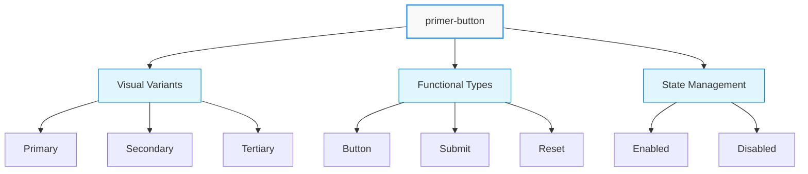
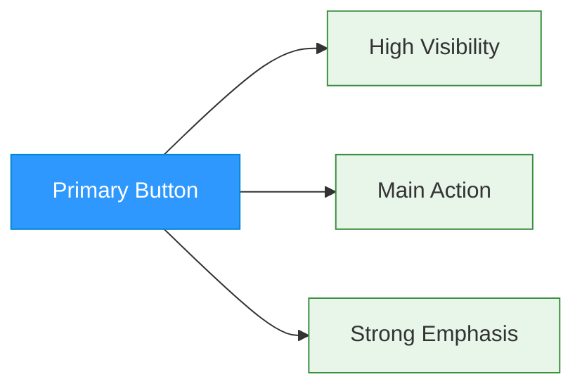
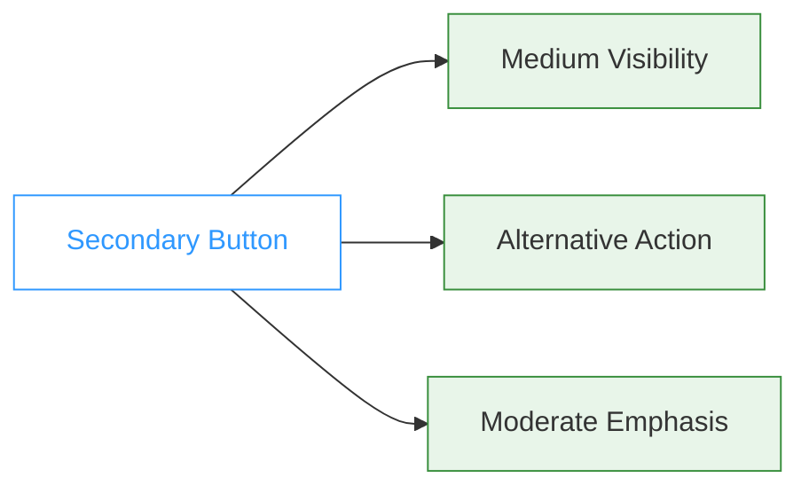
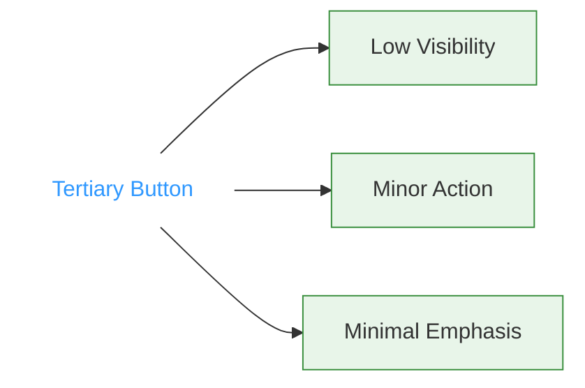
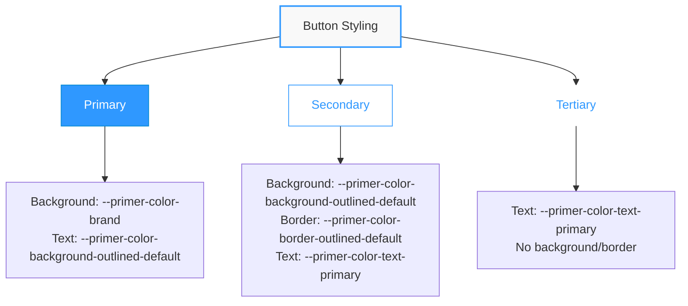

# Button Component

## \<primer-button\>

The Button component provides a consistent, styled button for user interactions throughout the checkout experience.



## Usage

```html
<primer-button>Click me</primer-button>
```

## Properties

| Property         | Attribute         | Type                                     | Default     | Description                            |
| ---------------- | ----------------- | ---------------------------------------- | ----------- | -------------------------------------- |
| `variant`        | `variant`         | `'primary' \| 'secondary' \| 'tertiary'` | `'primary'` | The button's visual style              |
| `disabled`       | `disabled`        | `boolean`                                | `false`     | Whether the button is disabled         |
| `buttonType`     | `type`            | `'button' \| 'submit' \| 'reset'`        | `'button'`  | The button's HTML type attribute       |
| `loading`        | `loading`         | `boolean`                                | `false`     | Shows a loading spinner when true      |
| `selectionState` | `selection-state` | `'default' \| 'checked'`                 | `'default'` | Selection state for selectable buttons |
| `selectable`     | `selectable`      | `boolean`                                | `false`     | Whether button is selectable/checkable |

## Slots

| Name      | Description                          |
| --------- | ------------------------------------ |
| `default` | Content to display inside the button |

## Variants

<div class="tabs-container">
<div class="tabs">
<div class="tab primary active">Primary</div>
<div class="tab secondary">Secondary</div>
<div class="tab tertiary">Tertiary</div>
</div>

<div class="tab-content primary active">

```html
<primer-button variant="primary">Pay Now</primer-button>
```

The primary variant is used for main actions and has high visual prominence. Use this style for the most important action on a page or form, such as completing a payment.



</div>

<div class="tab-content secondary">

```html
<primer-button variant="secondary">Save for Later</primer-button>
```

The secondary variant is used for secondary actions with medium visual prominence. Use this style for alternative actions that are important but not the main focus.



</div>

<div class="tab-content tertiary">

```html
<primer-button variant="tertiary">Cancel</primer-button>
```

The tertiary variant is used for minor actions with minimal visual prominence. Use this style for actions that should be available but not emphasized.



</div>
</div>

## Examples

<details>
<summary><strong>Submit Button in Form</strong></summary>

```html
<form>
  <!-- Form fields here -->
  <primer-button buttonType="submit">Complete Purchase</primer-button>
</form>
```

When using `buttonType="submit"`, the button will trigger form submission just like a native HTML submit button.

</details>

<details>
<summary><strong>Disabled Button</strong></summary>

```html
<primer-button disabled>Unavailable</primer-button>
```

Use the disabled state when an action is temporarily unavailable, such as when required fields are not yet complete.

</details>

<details>
<summary><strong>Loading Button</strong></summary>

```html
<primer-button loading>Processing</primer-button>
```

Use the loading state to indicate that an action is in progress. This displays a spinner while maintaining the button's position in the layout. The button will also be automatically disabled while in the loading state.

```javascript
// Example of toggling loading state
const button = document.querySelector('primer-button');
button.loading = true;

// Simulate API call
setTimeout(() => {
  button.loading = false;
}, 2000);
```

</details>

<details>
<summary><strong>Using with Card Form</strong></summary>

```html
<primer-card-form>
  <div slot="card-form-content">
    <primer-input-card-number></primer-input-card-number>
    <div style="display: flex; gap: 8px;">
      <primer-input-card-expiry></primer-input-card-expiry>
      <primer-input-cvv></primer-input-cvv>
    </div>
    <primer-input-card-holder-name></primer-input-card-holder-name>

    <primer-button buttonType="submit" variant="primary">
      Pay Now
    </primer-button>
  </div>
</primer-card-form>
```

</details>

<details>
<summary><strong>Discount Code Application</strong></summary>

```html
<primer-input-wrapper>
  <primer-input-label slot="label">Discount Code</primer-input-label>
  <div slot="input" style="display: flex; gap: 8px;">
    <primer-input id="discount-code"></primer-input>
    <primer-button variant="secondary">Apply</primer-button>
  </div>
</primer-input-wrapper>
```

</details>

## CSS Custom Properties

The Button component uses the following CSS custom properties for styling:

:::info
These properties inherit from your checkout theme, ensuring buttons maintain consistent styling with the rest of your checkout experience.
:::

<div class="row">
<div class="col col--6">

### Layout & Typography

| Property                                         | Description                         |
| ------------------------------------------------ | ----------------------------------- |
| `--primer-radius-medium`                         | Border radius for primary/secondary |
| `--primer-radius-small`                          | Border radius for tertiary          |
| `--primer-typography-title-large-weight`         | Font weight                         |
| `--primer-typography-title-large-size`           | Font size                           |
| `--primer-typography-title-large-letter-spacing` | Letter spacing                      |
| `--primer-typography-title-large-line-height`    | Line height                         |
| `--primer-typography-title-large-font`           | Font family                         |
| `--primer-space-medium`                          | Padding for primary/secondary       |
| `--primer-space-xxsmall`                         | Padding for tertiary                |

</div>
<div class="col col--6">

### Colors

| Property                                     | Description                                      |
| -------------------------------------------- | ------------------------------------------------ |
| `--primer-color-brand`                       | Background color for primary variant             |
| `--primer-color-background-outlined-default` | Text color for primary, background for secondary |
| `--primer-color-text-primary`                | Text color for secondary/tertiary                |
| `--primer-color-border-outlined-default`     | Border color for secondary variant               |
| `--primer-color-text-disabled`               | Text color when disabled                         |

</div>
</div>



## Notes

:::tip Best Practices

- For form submission, set `buttonType="submit"` when the button should submit a form
- Use the `primary` variant for the main action in a form (like payment submission)
- Use the `secondary` variant for alternative actions
- Use the `tertiary` variant for minor actions that should have minimal visual weight
  :::
