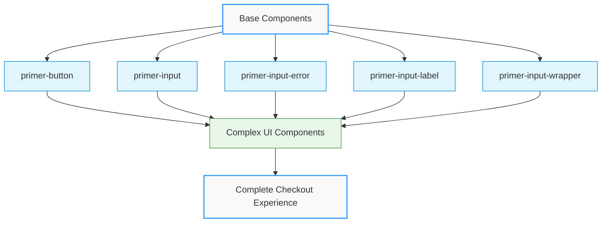
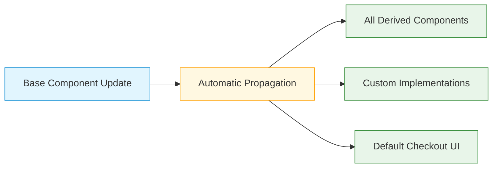
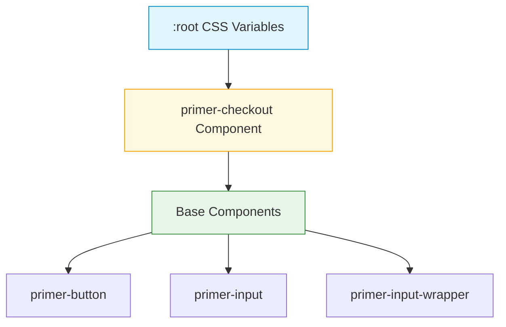
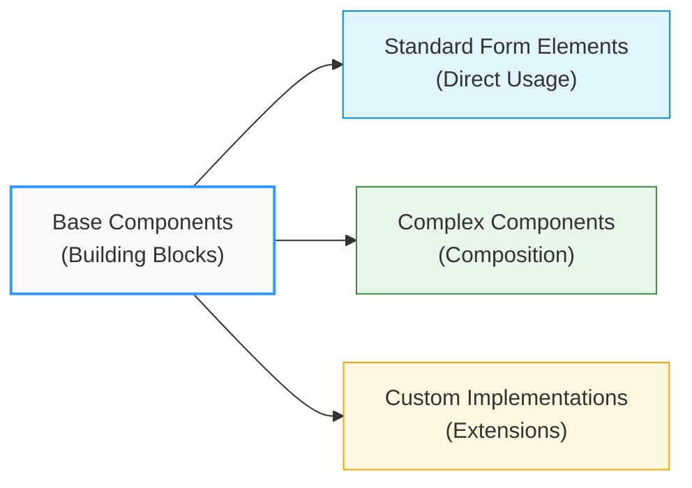

# Base Components

## Overview

The Base Components folder contains the fundamental UI building blocks of the Primer Composable Checkout SDK. These components are designed to be simple, reusable, and consistent across all checkout implementations.



Think of these components as the foundation of the design system - the essential elements that combine to create more complex interfaces.

## Purpose

Base Components serve several key purposes in the SDK architecture:

<div class="row">
<div class="col col--6">

:::info Key Benefits

- **Consistency**: They ensure visual and interactive elements behave predictably throughout the checkout experience
- **Reusability**: They can be composed together to build more complex components and interfaces
- **Maintainability**: Changes to these core components automatically propagate to all implementations
- **Accessibility**: They implement accessibility best practices at the foundation level
  :::

</div>
<div class="col col--6">



</div>
</div>

## Available Components

The current Base Components collection includes:

| Component                                             | Description                                               |
| ----------------------------------------------------- | --------------------------------------------------------- |
| [`<primer-button>`](/components/button)               | A versatile button component with multiple style variants |
| [`<primer-input>`](/components/input)                 | A customizable input field for text and other data types  |
| [`<primer-input-error>`](/components/input-error)     | A component for displaying validation error messages      |
| [`<primer-input-label>`](/components/input-label)     | A label component for form elements                       |
| [`<primer-input-wrapper>`](/components/input-wrapper) | A container component that enhances input interactions    |

<details>
<summary><strong>Component Relationships</strong></summary>

These components often work together to create cohesive form experiences. For example:

```html
<primer-input-wrapper>
  <primer-input-label slot="label">Email Address</primer-input-label>
  <primer-input
    slot="input"
    type="email"
    placeholder="example@email.com"
  ></primer-input>
  <primer-input-error slot="error"
    >Please enter a valid email address</primer-input-error
  >
</primer-input-wrapper>
```

This composition pattern allows for consistent form field styling and behavior throughout the checkout experience.

</details>

Additional base components may be added in future releases to expand the design system capabilities.

## Styling

All Base Components automatically inherit styling variables from the primary checkout component, ensuring they respect your custom theme settings without additional configuration. This inheritance system means that:

<div class="tabs-container">
<div class="tabs">
<div class="tab inheritance active">CSS Inheritance</div>
<div class="tab themes">Theme Support</div>
<div class="tab custom">Custom Styling</div>
</div>

<div class="tab-content inheritance active">



CSS Custom Properties (variables) flow down from the root to all components, ensuring consistent styling.

</div>

<div class="tab-content themes">

Base Components automatically adapt to both light and dark themes through CSS variable substitution:

```css
/* Light theme variables */
.primer-light-theme {
  --primer-color-text-primary: var(--primer-color-gray-900);
  --primer-color-background-outlined-default: var(--primer-color-gray-000);
}

/* Dark theme variables */
.primer-dark-theme {
  --primer-color-text-primary: var(--primer-color-gray-900);
  --primer-color-background-outlined-default: var(--primer-color-gray-000);
}
```

Components reference these semantic variables rather than explicit colors.

</div>

<div class="tab-content custom">

You can customize Base Components by setting CSS variables at the checkout level:

```html
<style>
  primer-checkout {
    --primer-color-brand: #4a90e2;
    --primer-radius-small: 4px;
    --primer-typography-body-large-font: 'Your-Font', sans-serif;
  }
</style>
```

These customizations will automatically propagate to all Base Components.

</div>
</div>

- Base Components maintain visual consistency with your overall checkout design
- Theme changes are automatically applied to all Base Components
- Components adapt to both light and dark modes without extra code

## Usage Patterns

Base Components can be used:

:::tip Application Patterns

- **Directly** within checkout forms when simple UI elements are needed
- As **building blocks** for creating more complex, composite components
- In **custom implementations** where standard form elements are required
  :::



For detailed implementation examples, refer to the documentation for each individual component.
