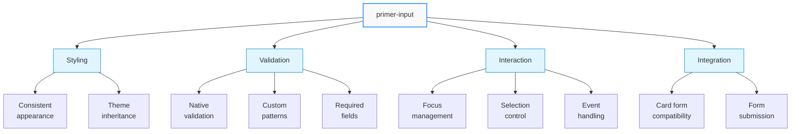
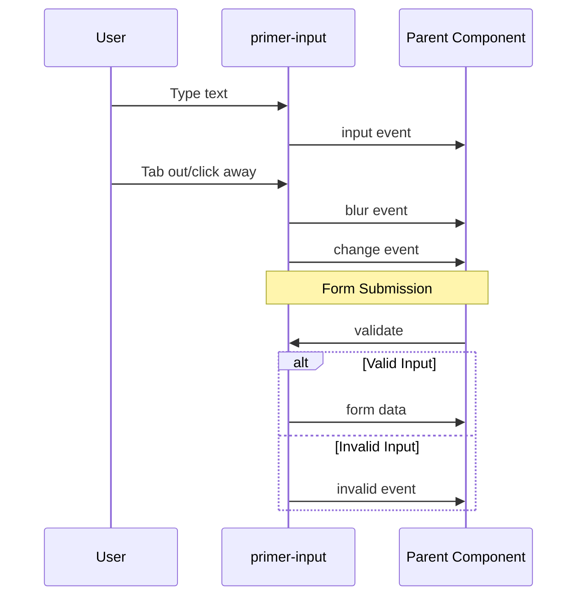
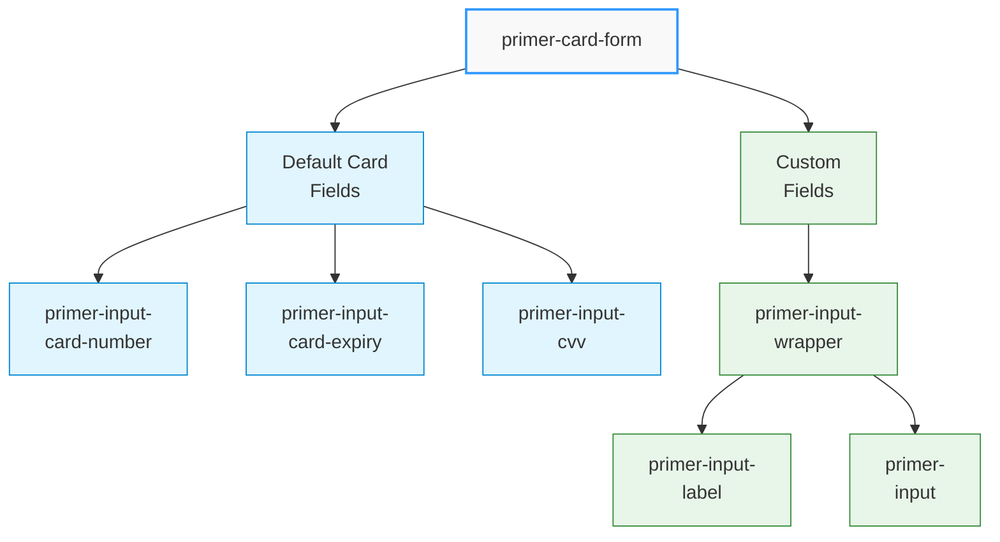

# Input Component
## \<primer-input\>

The Input component is a versatile wrapper around the native HTML input element that provides consistent styling and additional functionality. It can be used to create custom fields that match the appearance of the card form fields.



## Usage

```html
<primer-input
  type="text"
  placeholder="Enter value"
  value="Initial value">
</primer-input>
```

## Properties

### Core Properties

| Property       | Attribute      | Type        | Default  | Description                                   |
|----------------|----------------|-------------|----------|-----------------------------------------------|
| `value`        | `value`        | `string`    | `''`     | The input's current value                     |
| `placeholder`  | `placeholder`  | `string`    | `''`     | Placeholder text when the input is empty      |
| `disabled`     | `disabled`     | `boolean`   | `false`  | Whether the input is disabled                 |
| `name`         | `name`         | `string`    | `''`     | The name of the input for form submission     |
| `type`         | `type`         | `InputType` | `'text'` | The type of input (see supported types below) |
| `required`     | `required`     | `boolean`   | `false`  | Whether the input is required                 |
| `readonly`     | `readonly`     | `boolean`   | `false`  | Whether the input is read-only                |
| `id`           | `id`           | `string`    | `''`     | ID attribute for the input                    |

### Validation Properties

| Property       | Attribute      | Type        | Default  | Description                                   |
|----------------|----------------|-------------|----------|-----------------------------------------------|
| `pattern`      | `pattern`      | `string`    | `''`     | Regex pattern for validation                  |
| `minlength`    | `minlength`    | `number`    | —        | Minimum input length for validation           |
| `maxlength`    | `maxlength`    | `number`    | —        | Maximum input length for validation           |
| `min`          | `min`          | `string`    | `''`     | Minimum value for number/date inputs          |
| `max`          | `max`          | `string`    | `''`     | Maximum value for number/date inputs          |
| `step`         | `step`         | `string`    | `''`     | Step value for number inputs                  |
| `autocomplete` | `autocomplete` | `string`    | `''`     | Autocomplete attribute value                  |

### Supported Input Types

<div class="tabs-container">
<div class="tabs">
<div class="tab text active">Text-based</div>
<div class="tab numeric">Numeric</div>
<div class="tab date">Date & Time</div>
<div class="tab other">Other</div>
</div>

<div class="tab-content text active">

- `text` - Standard text input
- `password` - Password field with masked input
- `email` - Email address with validation
- `tel` - Telephone number
- `url` - URL with validation
- `search` - Search field

</div>

<div class="tab-content numeric">

- `number` - Numeric input with increment/decrement controls

</div>

<div class="tab-content date">

- `date` - Date picker
- `time` - Time picker
- `datetime-local` - Date and time picker
- `month` - Month picker
- `week` - Week picker

</div>

<div class="tab-content other">

- `color` - Color picker

</div>
</div>

## Events

| Event Name | Description                                  | Event Detail             |
|------------|----------------------------------------------|--------------------------|
| `input`    | Fired when the input value changes           | Current input value      |
| `change`   | Fired when the input value is committed      | Current input value      |
| `focus`    | Fired when the input receives focus          | Standard FocusEvent      |
| `blur`     | Fired when the input loses focus             | Standard FocusEvent      |
| `invalid`  | Fired when the input fails validation        | Standard Event           |



## Methods

| Method              | Parameters                                       | Return Type | Description                              |
|---------------------|--------------------------------------------------|-------------|------------------------------------------|
| `focus`             | `options?: FocusOptions`                         | `void`      | Focus the input element                  |
| `blur`              | —                                                | `void`      | Remove focus from the input element      |
| `select`            | —                                                | `void`      | Select all text in the input element     |
| `setSelectionRange` | `start: number, end: number, direction?: string` | `void`      | Set the selection range of the input     |
| `checkValidity`     | —                                                | `boolean`   | Check if the input element is valid      |
| `reportValidity`    | —                                                | `boolean`   | Report the validity of the input element |

## CSS Parts

| Part      | Description                          |
|-----------|--------------------------------------|
| `input`   | The native input element             |

## CSS Custom Properties

:::info Theme Integration
The Input component inherits styling from your theme variables, ensuring consistent appearance with other checkout components.
:::

| Property                                     | Description                       |
|----------------------------------------------|-----------------------------------|
| `--primer-typography-body-large-line-height` | Line height for the input text    |
| `--primer-typography-body-large-size`        | Font size for the input text      |
| `--primer-typography-body-large-font`        | Font family for the input text    |
| `--primer-color-text-primary`                | Text color for the input          |
| `--primer-color-text-placeholder`            | Color for the placeholder text    |
| `--primer-color-text-disabled`               | Text color when input is disabled |

## Examples

<details>
<summary><strong>Basic Text Input</strong></summary>

```html
<primer-input
  type="text"
  placeholder="Enter your name"
  name="customer-name">
</primer-input>
```

This example shows a simple text input field with a placeholder.
</details>

<details>
<summary><strong>Custom Field in Card Form</strong></summary>

```html
<primer-card-form>
  <div slot="card-form-content">
    <primer-input-card-number></primer-input-card-number>
    <div style="display: flex; gap: 8px;">
      <primer-input-card-expiry></primer-input-card-expiry>
      <primer-input-cvv></primer-input-cvv>
    </div>

    <!-- Custom field using primer-input -->
    <primer-input-wrapper>
      <primer-input-label slot="label">Reference Number</primer-input-label>
      <primer-input
        slot="input"
        type="text"
        name="reference"
        placeholder="Enter your reference number">
      </primer-input>
    </primer-input-wrapper>

    <button type="submit">Pay Now</button>
  </div>
</primer-card-form>
```

The Input component can be used to add custom fields to your payment form that match the style of the card form fields.


</details>

<details>
<summary><strong>Discount Code Field</strong></summary>

```html
<primer-input-wrapper>
  <primer-input-label slot="label">Discount Code</primer-input-label>
  <div slot="input" style="display: flex; gap: 8px;">
    <primer-input id="discount-code"></primer-input>
    <primer-button>Apply</primer-button>
  </div>
</primer-input-wrapper>
```

This example shows how to create an input with an adjacent button, useful for discount code fields or search forms.
</details>

<details>
<summary><strong>Form with Validation</strong></summary>

```html
<form id="customer-details">
  <primer-input-wrapper>
    <primer-input-label slot="label">Email Address</primer-input-label>
    <primer-input
      slot="input"
      type="email"
      name="email"
      required
      pattern="[a-z0-9._%+-]+@[a-z0-9.-]+\.[a-z]{2,}$">
    </primer-input>
  </primer-input-wrapper>

  <primer-input-wrapper>
    <primer-input-label slot="label">Phone Number</primer-input-label>
    <primer-input
      slot="input"
      type="tel"
      name="phone"
      pattern="[0-9]{10}">
    </primer-input>
  </primer-input-wrapper>
  
  <button type="submit">Submit</button>
</form>

<script>
  document.getElementById('customer-details').addEventListener('submit', (event) => {
    event.preventDefault();
    // Collect form data
    const formData = new FormData(event.target);
    const customerData = Object.fromEntries(formData.entries());
    console.log('Customer data:', customerData);
  });
</script>
```

This example demonstrates a form with multiple input fields and validation using HTML5 validation attributes.
</details>

## Notes

:::tip Best Practices
- For a complete form control with label and error handling, wrap this component with `primer-input-wrapper` and use appropriate slots
- The input component matches the styling of card form fields when used within the same layout
- When wrapped in `primer-input-wrapper`, clicking anywhere in the wrapper area will focus the input
- Use the `invalid` event to implement custom validation behavior
- For numeric inputs, use the `type="number"` and appropriate `min`, `max`, and `step` attributes
  :::
