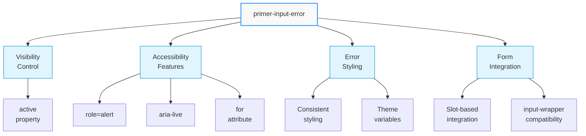
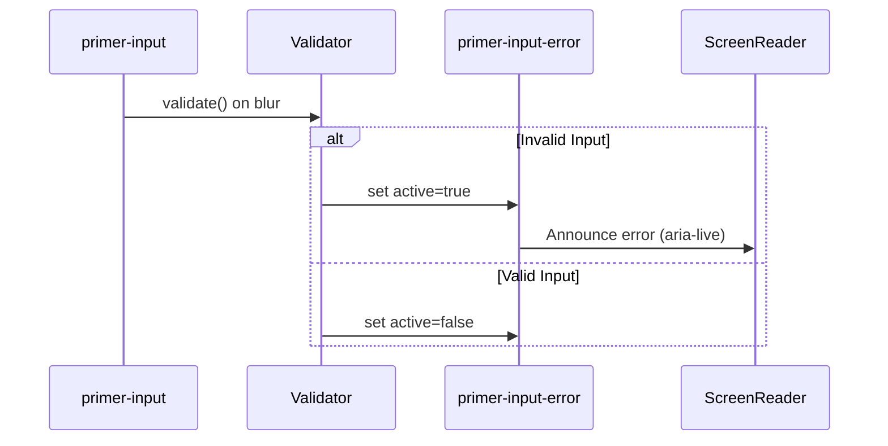
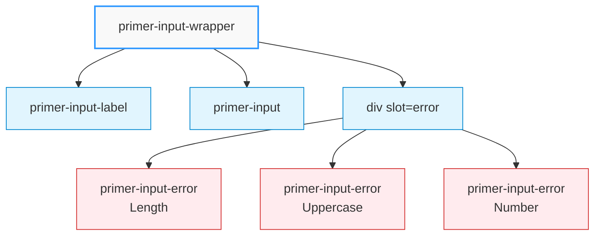

# Input Error Component
## \<primer-input-error\>

The Input Error component displays validation error messages with consistent styling and proper accessibility features. It's designed to work with Primer form components to provide clear feedback when validation fails.



## Usage

### Basic Usage

```html
<primer-input-error for="email-input" active>
  Please enter a valid email address
</primer-input-error>
```

### Within Input Wrapper (Recommended)

```html
<primer-input-wrapper has-error>
  <primer-input-label slot="label" for="password-input">Password</primer-input-label>
  <primer-input slot="input" id="password-input" type="password"></primer-input>
  <primer-input-error slot="error" for="password-input">
    Password must be at least 8 characters
  </primer-input-error>
</primer-input-wrapper>
```

## Properties

| Property | Attribute | Type      | Default | Description                                                  |
|----------|-----------|-----------|---------|--------------------------------------------------------------|
| `for`    | `for`     | `string`  | `''`    | ID of the form control this error message is associated with |
| `active` | `active`  | `boolean` | `true`  | Whether the error is currently active/visible                |

## Slots

| Name      | Description                                        |
|-----------|----------------------------------------------------|
| `default` | Content of the error message (text content)        |

## Accessibility

:::info Accessibility Support
The Input Error component includes these accessibility features:

- Uses `role="alert"` to ensure screen readers announce the error
- Uses `aria-live="polite"` to announce changes when they occur
- Correctly associates with the input via the `for` attribute
  :::



## CSS Custom Properties

The Input Error component uses these CSS custom properties for styling:

| Property                                  | Description                         |
|-------------------------------------------|-------------------------------------|
| `--primer-color-text-negative`            | Text color for error messages       |
| `--primer-typography-body-small-size`     | Font size for error messages        |
| `--primer-typography-body-small-line-height` | Line height for error messages   |
| `--primer-typography-body-small-font`     | Font family for error messages      |

## Examples

<details>
<summary><strong>Basic Usage</strong></summary>

```html
<primer-input-error for="ccnumber" active>
  Credit card number is invalid
</primer-input-error>
```

This shows a simple error message associated with a credit card input field.
</details>

<details>
<summary><strong>Toggling Error Visibility</strong></summary>

```html
<primer-input id="email" type="email"></primer-input>
<primer-input-error id="email-error" for="email" active="false">
  Please enter a valid email address
</primer-input-error>

<script>
  const input = document.querySelector('#email');
  const error = document.querySelector('#email-error');
  
  input.addEventListener('blur', () => {
    const isValid = /^[^\s@]+@[^\s@]+\.[^\s@]+$/.test(input.value);
    error.active = !isValid;
    
    // Also update wrapper if being used
    const wrapper = input.closest('primer-input-wrapper');
    if (wrapper) {
      wrapper.hasError = !isValid;
    }
  });
</script>
```

This example shows how to programmatically toggle the visibility of an error message based on validation logic.
</details>

<details>
<summary><strong>Within Input Wrapper</strong></summary>

```html
<primer-input-wrapper id="password-wrapper">
  <primer-input-label slot="label" for="password">Create Password</primer-input-label>
  <primer-input 
    slot="input" 
    id="password" 
    type="password"
    minlength="8"
  ></primer-input>
  <primer-input-error slot="error" id="password-error" for="password" active="false">
    Password must be at least 8 characters
  </primer-input-error>
</primer-input-wrapper>

<script>
  const input = document.querySelector('#password');
  const error = document.querySelector('#password-error');
  const wrapper = document.querySelector('#password-wrapper');
  
  input.addEventListener('invalid', () => {
    error.active = true;
    wrapper.hasError = true;
  });
  
  input.addEventListener('input', () => {
    if (input.validity.valid) {
      error.active = false;
      wrapper.hasError = false;
    }
  });
</script>
```

This example demonstrates how to integrate the error component with input wrapper and handle validation events.
</details>

<details>
<summary><strong>Multiple Errors</strong></summary>

```html
<primer-input-wrapper id="password-wrapper">
  <primer-input-label slot="label" for="password">Create Password</primer-input-label>
  <primer-input 
    slot="input" 
    id="password" 
    type="password"
  ></primer-input>
  <div slot="error">
    <primer-input-error id="length-error" for="password" active="false">
      Password must be at least 8 characters
    </primer-input-error>
    <primer-input-error id="uppercase-error" for="password" active="false">
      Password must contain at least one uppercase letter
    </primer-input-error>
    <primer-input-error id="number-error" for="password" active="false">
      Password must contain at least one number
    </primer-input-error>
  </div>
</primer-input-wrapper>
```

This example shows how to implement multiple validation rules with separate error messages.


</details>

## Common Integration Patterns

<div class="tabs-container">
<div class="tabs">
<div class="tab wrapper active">With Input Wrapper</div>
<div class="tab standalone">Standalone</div>
<div class="tab multiple">Multiple Errors</div>
</div>

<div class="tab-content wrapper active">

When used with `primer-input-wrapper`, the error component appears in the proper position and automatically adds error styling to the input:

```html
<primer-input-wrapper has-error>
  <primer-input-label slot="label">Email Address</primer-input-label>
  <primer-input slot="input" type="email"></primer-input>
  <primer-input-error slot="error">
    Please enter a valid email address
  </primer-input-error>
</primer-input-wrapper>
```

:::tip
Always use the `slot="error"` attribute when placing inside a `primer-input-wrapper`
:::

</div>

<div class="tab-content standalone">

For standalone usage, place the error component near the related input:

```html
<label for="email">Email Address</label>
<input id="email" type="email">
<primer-input-error for="email">
  Please enter a valid email address
</primer-input-error>
```

:::tip
Always set the `for` attribute to match the ID of the associated input
:::

</div>

<div class="tab-content multiple">

For complex validation rules, you can display multiple errors:

```html
<div slot="error">
  <primer-input-error id="error1" active="false">Rule 1</primer-input-error>
  <primer-input-error id="error2" active="false">Rule 2</primer-input-error>
  <primer-input-error id="error3" active="false">Rule 3</primer-input-error>
</div>
```

:::tip
Toggle each error's `active` property individually based on specific validation checks
:::

</div>
</div>

## Notes

:::tip Best Practices
- The error is displayed by default when created (`active=true`)
- Set `active="false"` to hide the error initially
- When used inside a `primer-input-wrapper`, add the `has-error` attribute to the wrapper to apply error styling to the input field
- Use the `slot="error"` attribute when placing inside a `primer-input-wrapper`
- For complex validation, toggle different error components based on specific validation rules
  :::
