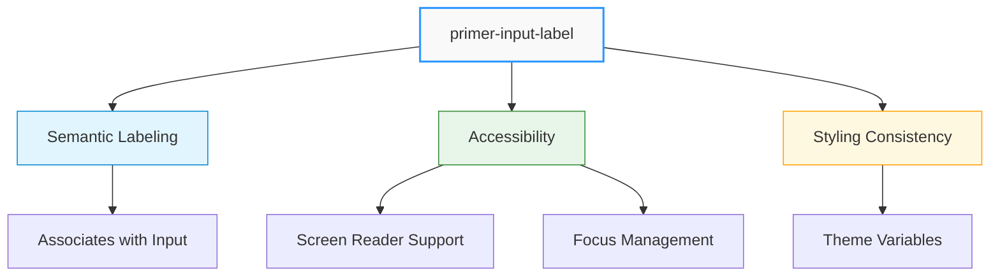
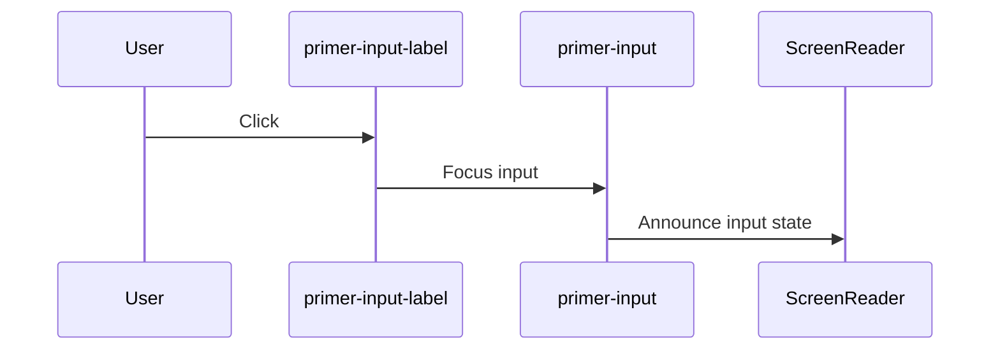

# Input Label Component

## \<primer-input-label\>

The Input Label component provides a standardized way to label form elements with consistent styling and proper accessibility. It's designed to work seamlessly with Primer input components to maintain design consistency across your forms.



## Usage Patterns

### Basic Label Association

```html
<primer-input-label for="email-input">Email Address</primer-input-label>
<primer-input id="email-input" type="email"></primer-input>
```

### With Input Wrapper (Recommended)

```html
<primer-input-wrapper>
  <primer-input-label slot="label" for="name-input"
    >Full Name</primer-input-label
  >
  <primer-input slot="input" id="name-input"></primer-input>
</primer-input-wrapper>
```

## Properties

| Property   | Attribute  | Type      | Default | Description                                          |
| ---------- | ---------- | --------- | ------- | ---------------------------------------------------- |
| `for`      | `for`      | `string`  | `''`    | ID of the form control this label is associated with |
| `disabled` | `disabled` | `boolean` | `false` | Whether the label should appear disabled             |

## Accessibility Features

:::info Accessibility Highlights

- Generates a semantic `<label>` element
- Properly associates with input fields via `for` attribute
- Enables screen reader support
- Allows direct input focus when label is clicked
  :::



## Styling Customization

The Input Label component inherits styling from CSS custom properties:

<details>
<summary>Customizable Style Properties</summary>

| Property                                        | Description                       |
| ----------------------------------------------- | --------------------------------- |
| `--primer-typography-body-small-weight`         | Font weight for the label         |
| `--primer-typography-body-small-size`           | Font size for the label           |
| `--primer-typography-body-small-letter-spacing` | Letter spacing for the label      |
| `--primer-typography-body-small-line-height`    | Line height for the label         |
| `--primer-color-text-primary`                   | Text color for the label          |
| `--primer-typography-body-small-font`           | Font family for the label         |
| `--primer-color-text-disabled`                  | Text color when label is disabled |

</details>

## Example Implementations

<div class="tabs-container">
<div class="tabs">
<div class="tab basic active">Basic Label</div>
<div class="tab disabled">Disabled State</div>
<div class="tab wrapper">With Input Wrapper</div>
<div class="tab required">Required Field</div>
</div>

<div class="tab-content basic active">

```html
<primer-input-label for="email">Email Address</primer-input-label>
<primer-input id="email" type="email"></primer-input>
```

</div>

<div class="tab-content disabled">

```html
<primer-input-label for="username" disabled>Username</primer-input-label>
<primer-input id="username" disabled></primer-input>
```

</div>

<div class="tab-content wrapper">

```html
<primer-input-wrapper>
  <primer-input-label slot="label" for="phone">Phone Number</primer-input-label>
  <primer-input slot="input" id="phone" type="tel"></primer-input>
</primer-input-wrapper>
```

</div>

<div class="tab-content required">

```html
<primer-input-wrapper>
  <primer-input-label slot="label" for="email">
    Email Address <span style="color: red">*</span>
  </primer-input-label>
  <primer-input slot="input" id="email" type="email" required></primer-input>
</primer-input-wrapper>
```

</div>
</div>

## Best Practices

:::tip Key Recommendations

- Always match the `for` attribute with the input's `id`
- Use the `disabled` attribute consistently between label and input
- Prefer using the Input Label inside the `primer-input-wrapper`'s label slot
- Keep labels concise and descriptive
  :::

## Potential Pitfalls

:::warning Common Mistakes to Avoid

- Forgetting to set the `for` attribute
- Mismatching label and input IDs
- Inconsistent disabled states between label and input
- Overriding default typography without considering accessibility
  :::
