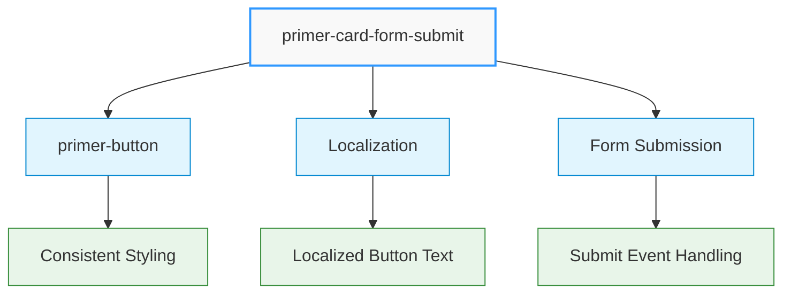
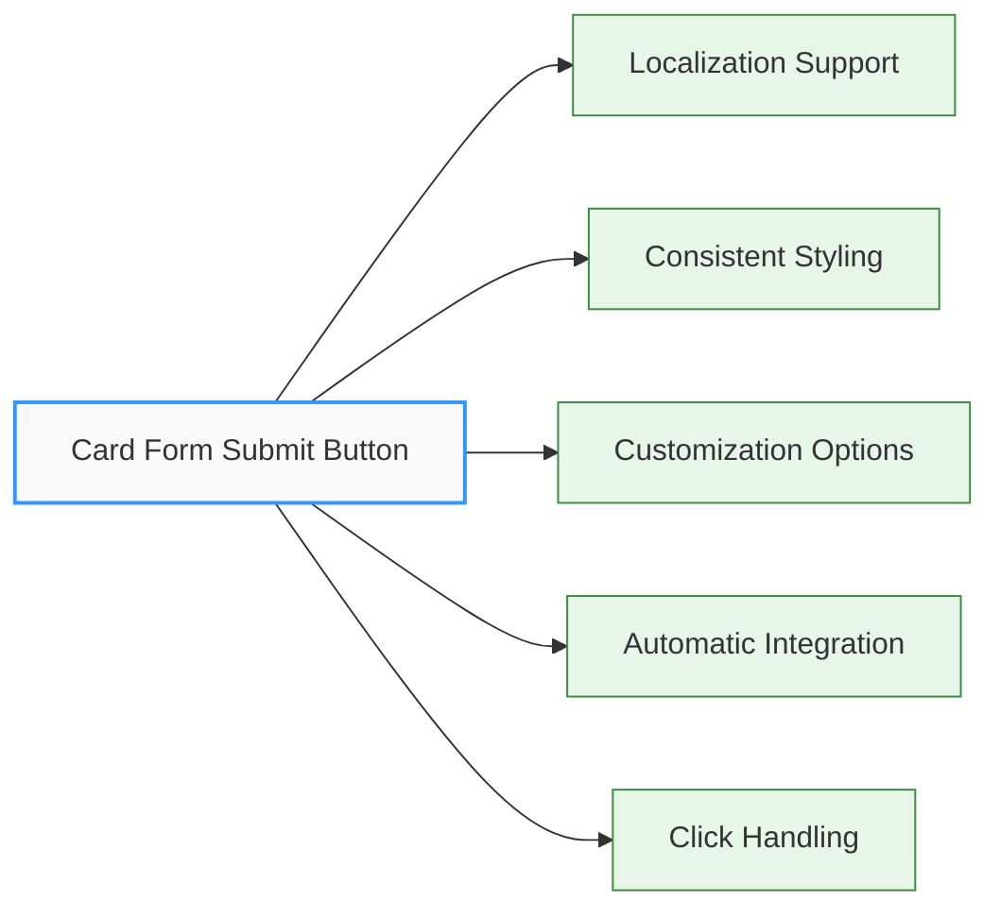
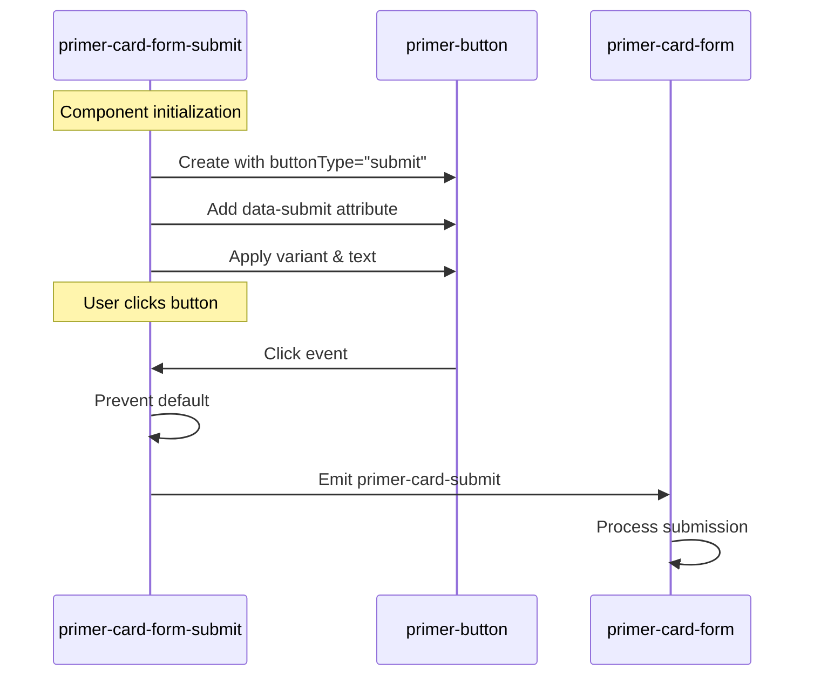

# Card Form Submit Button Component

## \<primer-card-form-submit\>

The Card Form Submit Button component provides a standardized submit button specifically designed for card payment forms. It includes localization support and consistent styling. Under the hood, it wraps a `primer-button` component to provide additional payment form-specific functionality.



## Usage

The Card Form Submit Button component is designed to be used within a `primer-card-form` container:

```html
<primer-card-form>
  <!-- Card form inputs -->
  <primer-card-form-submit></primer-card-form-submit>
</primer-card-form>
```

## Properties

| Property     | Attribute    | Type      | Default              | Description                                                                                                                                      |
| ------------ | ------------ | --------- | -------------------- | ------------------------------------------------------------------------------------------------------------------------------------------------ |
| `buttonText` | `buttonText` | `string`  | Localized "Pay" text | The text displayed on the button. If not explicitly set, falls back to a localized version of "Pay" based on the application's language settings |
| `variant`    | `variant`    | `string`  | "primary"            | Button variant/style ("primary", etc.)                                                                                                           |
| `disabled`   | `disabled`   | `boolean` | `false`              | Whether the button is disabled                                                                                                                   |

## Events

| Event Name           | Description                      | Event Detail                            |
| -------------------- | -------------------------------- | --------------------------------------- |
| `primer-card-submit` | Fired when the button is clicked | `{ source: 'primer-card-form-submit' }` |

## Features



<div class="features-list">

- **Localization Support**: Button text is automatically localized based on the application's language
- **Consistent Styling**: Ensures a consistent look and feel across all checkout forms
- **Customization Options**: Text and button variant can be customized
- **Automatic Integration**: Works seamlessly with the card form's submission logic
- **Click Handling**: Prevents default form submission to allow for custom validation and submission flow

</div>

## Technical Implementation



## DOM Structure

This component uses `display: contents` which means it doesn't create a new box in the DOM layout. Instead, it renders the inner `primer-button` directly within the parent container. The rendered DOM looks like:

```html
<primer-button buttonType="submit" variant="primary|secondary|etc" data-submit>
  Payment Text
</primer-button>
```

## Examples

<div class="tabs-container">
<div class="tabs">
<div class="tab basic active">Basic Usage</div>
<div class="tab custom">Custom Text & Variant</div>
<div class="tab disabled">Disabled State</div>
</div>

<div class="tab-content basic active">

```html
<primer-card-form>
  <!-- Card form inputs -->
  <primer-card-form-submit></primer-card-form-submit>
</primer-card-form>
```

</div>

<div class="tab-content custom">

```html
<primer-card-form>
  <!-- Card form inputs -->
  <primer-card-form-submit buttonText="Complete Payment" variant="secondary">
  </primer-card-form-submit>
</primer-card-form>
```

</div>

<div class="tab-content disabled">

```html
<primer-card-form>
  <!-- Card form inputs -->
  <primer-card-form-submit disabled></primer-card-form-submit>
</primer-card-form>
```

</div>
</div>

## Key Considerations

:::info Default Behavior

- The Card Form Submit Button is automatically included in the default card form layout
- When using a custom layout with the `card-form-content` slot, you'll need to add this component manually
  :::

:::tip Submission Options

- You can use either this component or a standard HTML button with `type="submit"` or the `data-submit` attribute
  :::

:::note Text Localization

- The button text is automatically localized by default, falling back to a localized version of "Pay" if not explicitly set
- Setting the `buttonText` property to an empty string will revert to using the localized default text
  :::

:::tip Implementation Detail

- The component adds a `data-submit` attribute to the internal button, which can be used for styling or selection
  :::
