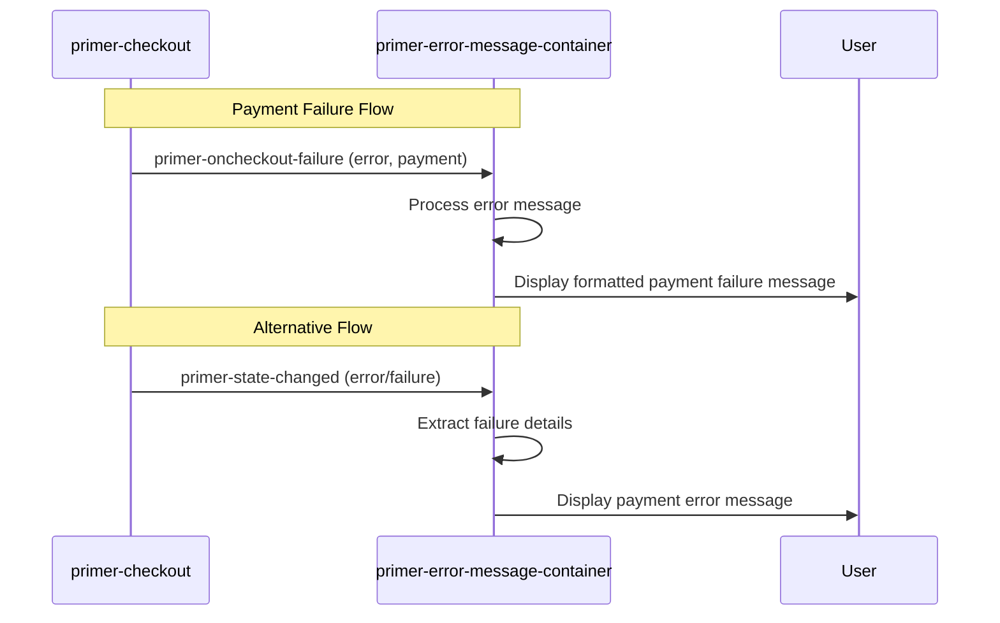

# Error Message Container

## \<primer-error-message-container\>

The `primer-error-message-container` component provides a convenient way to display payment failure messages during the checkout process. It automatically handles the display of payment-related errors received from the SDK without requiring you to write custom error handling code.


## Usage

<div class="tabs-container">
<div class="tabs">
<div class="tab standard active">Standard Layout</div>
<div class="tab custom">Custom Layout</div>
<div class="tab events">Custom Error Handling</div>
</div>

<div class="tab-content standard active">

```html
<primer-checkout client-token="your-client-token">
  <primer-main slot="main">
    <div slot="payments">
      <primer-payment-method type="PAYMENT_CARD"></primer-payment-method>
      <!-- Include the error message container for payment failure display -->
      <primer-error-message-container></primer-error-message-container>
    </div>
  </primer-main>
</primer-checkout>
```

</div>

<div class="tab-content custom">

```html
<primer-checkout client-token="your-client-token">
  <div slot="main">
    <!-- Your custom payment method layout -->
    <primer-payment-method type="PAYMENT_CARD"></primer-payment-method>
    
    <!-- Include error message container for built-in payment failure handling -->
    <primer-error-message-container></primer-error-message-container>
  </div>
</primer-checkout>
```

</div>

<div class="tab-content events">

```javascript
// Alternative approach using event listeners for custom payment failure handling
const checkout = document.querySelector('primer-checkout');

// Option 1: Listen for the dedicated payment failure event
checkout.addEventListener('primer-oncheckout-failure', (event) => {
  const { error, payment } = event.detail;
  
  // Display the payment failure using your own UI
  const errorElement = document.getElementById('custom-error-display');
  errorElement.textContent = error.message;
  errorElement.style.display = 'block';
  
  // Optionally, you can access partial payment data if available
  if (payment) {
    console.log('Partial payment data:', payment);
  }
});

// Option 2: Listen for checkout state changes
checkout.addEventListener('primer-state-changed', (event) => {
  const { error, failure } = event.detail;
  
  if (error || failure) {
    // Display the error using your own UI
    const errorElement = document.getElementById('custom-error-display');
    errorElement.textContent = failure ? failure.message : error.message;
    errorElement.style.display = 'block';
  } else {
    // Hide error when not present
    document.getElementById('custom-error-display').style.display = 'none';
  }
});
```

</div>
</div>

## When to Use

Include this component in your custom checkout layouts when you need to:

- Display payment processing failures
- Present server-side error responses
- Notify users about declined transactions
- Show general payment-related errors

:::tip
This component specifically handles payment failures, not card validation errors. Card validation is handled separately and prevents form submission until valid.
:::

## Properties

The component doesn't require any properties or attributes to function. It automatically connects to the checkout context and displays payment failure messages that occur during the checkout process.

## Events

This component doesn't emit any events directly, but it displays errors emitted by other components in the checkout flow:

| Event Source      | Event Name                  | What It Displays                                          |
|-------------------|-----------------------------|-----------------------------------------------------------|
| `primer-checkout` | `primer-oncheckout-failure` | Payment failure details                                   |
| `primer-checkout` | `primer-state-changed`      | General checkout errors (via error or failure properties) |

## CSS Custom Properties

The error message container uses these CSS custom properties for styling:

| CSS Property                           | Description                           | Default     |
|----------------------------------------|---------------------------------------|-------------|
| `--primer-color-background-error`      | Background color for error messages   | `#ffebee`   |
| `--primer-color-text-error`            | Text color for error messages         | `#d32f2f`   |
| `--primer-radius-small`                | Border radius for the error container | `4px`       |
| `--primer-space-small`                 | Padding inside the error container    | `8px`       |
| `--primer-typography-body-medium-font` | Font family for error text            | System font |
| `--primer-typography-body-medium-size` | Font size for error text              | `14px`      |

### Styling Example

```css
primer-error-message-container {
  --primer-color-background-error: #fff0f0;
  --primer-color-text-error: #d32f2f;
  --primer-radius-small: 8px;
}
```

## Technical Details

The error message container integrates with the SDK's state management system and automatically displays payment failure messages when they occur. It handles:

- Payment processor errors
- Network connectivity issues
- Server-side errors from the Primer API
- Declined transaction messages




## Important Distinction

:::info
Unlike form validation errors (which prevent submission), the `primer-error-message-container` specifically handles payment failures that occur after a valid form is submitted or other payment method has been used

Card validation errors are handled by the card input components themselves and prevent form submission.
:::

## Best Practices

:::tip Best Practices Summary
1. **Strategic Placement**: Position the error container prominently where users will look after attempting payment.
2. **Visual Integration**: Use consistent styling with the rest of your checkout for a cohesive experience.
3. **Consider Alternatives**: For highly customized UIs, you may prefer implementing your own error handling with the `primer-oncheckout-failure` event.
4. **Accessibility First**: The component includes proper ARIA attributes, but ensure your layout maintains focus management for error states.
5. **Clear Messaging**: The component handles formatting error messages from the server, but consider how they fit within your overall checkout flow.
:::

## Related Components

- [`<primer-checkout>`](/api/Components/primer-checkout-doc) - The main checkout container
- [`<primer-main>`](/api/Components/primer-main-doc) - The main content area component
