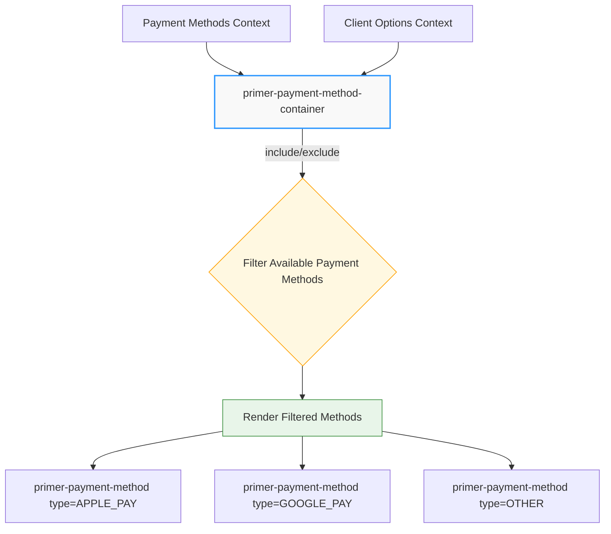

# Payment Method Container

## \<primer-payment-method-container\>

The `primer-payment-method-container` component simplifies the creation of custom payment method layouts by automatically rendering available payment methods with built-in filtering capabilities. It eliminates the need for verbose event listeners and manual state management.

```html
<primer-payment-method-container
  include="APPLE_PAY,GOOGLE_PAY"
></primer-payment-method-container>
```



## Usage

```html
<primer-checkout client-token="your-client-token">
  <primer-main slot="main">
    <div slot="payments">
      <!-- Render all available payment methods -->
      <primer-payment-method-container></primer-payment-method-container>

      <!-- Include specific payment methods -->
      <primer-payment-method-container
        include="APPLE_PAY,GOOGLE_PAY"
      ></primer-payment-method-container>

      <!-- Exclude specific payment methods -->
      <primer-payment-method-container
        exclude="PAYMENT_CARD"
      ></primer-payment-method-container>
    </div>
  </primer-main>
</primer-checkout>
```

## Properties

| Property   | Type      | Default     | Description                                                                                   |
| ---------- | --------- | ----------- | --------------------------------------------------------------------------------------------- |
| `include`  | `string`  | `undefined` | Comma-separated list of payment method types to include. Only these methods will be rendered. |
| `exclude`  | `string`  | `undefined` | Comma-separated list of payment method types to exclude. These methods will be filtered out.  |
| `disabled` | `boolean` | `false`     | Disables all payment methods in the container.                                                |

## CSS Custom Properties

| Property               | Description                           |
| ---------------------- | ------------------------------------- |
| `--primer-space-small` | Gap between payment method components |

## Key Benefits

### Before: Verbose Event Listeners

The traditional approach requires complex event handling and state management:

```tsx
// Old approach - requires complex setup
const [paymentMethods, setPaymentMethods] = useState([]);
const litRef = useRef<PrimerCheckoutComponent>(null);

useEffect(() => {
  if (litRef.current) {
    litRef.current.addEventListener('primer:methods-update', (e) => {
      const methods = e?.detail;
      const filteredMethods = methods
        .toArray()
        .filter((method) => method.type !== 'PAYMENT_CARD');
      setPaymentMethods(filteredMethods);
    });
  }
}, [clientToken]);

return (
  <primer-checkout client-token={clientToken} ref={litRef}>
    <primer-main slot='main'>
      <div slot='payments'>
        {paymentMethods.map(({ type }) => (
          <primer-payment-method key={type} type={type}></primer-payment-method>
        ))}
      </div>
    </primer-main>
  </primer-checkout>
);
```

### After: Declarative Container

The new container component provides a simple, declarative approach:

```html
<!-- New approach - simple and declarative -->
<primer-payment-method-container
  exclude="PAYMENT_CARD"
></primer-payment-method-container>
```

## Examples

<details>
<summary><strong>Sectioned Payment Layout</strong></summary>

Create organized payment sections with different filtering:

```html
<primer-checkout client-token="your-client-token">
  <primer-main slot="main">
    <div slot="payments">
      <!-- Quick pay options section -->
      <div class="payment-section">
        <h3>Quick Pay Options</h3>
        <primer-payment-method-container
          include="APPLE_PAY,GOOGLE_PAY"
        ></primer-payment-method-container>
      </div>

      <!-- Alternative payment methods section -->
      <div class="payment-section">
        <h3>Other Payment Methods</h3>
        <primer-payment-method-container
          exclude="PAYMENT_CARD,APPLE_PAY,GOOGLE_PAY"
        ></primer-payment-method-container>
      </div>

      <!-- Card form section -->
      <div class="payment-section">
        <h3>Pay with Card</h3>
        <primer-payment-method type="PAYMENT_CARD"></primer-payment-method>
      </div>
    </div>
  </primer-main>
</primer-checkout>
```

</details>

<details>
<summary><strong>Combined Filtering</strong></summary>

Use both include and exclude filters together:

```html
<!-- Include specific methods, then exclude one from that set -->
<primer-payment-method-container
  include="APPLE_PAY,GOOGLE_PAY,PAYPAL"
  exclude="PAYPAL"
></primer-payment-method-container>
<!-- Result: Only APPLE_PAY and GOOGLE_PAY will be rendered -->
```

</details>

<details>
<summary><strong>Disabled State</strong></summary>

Temporarily disable all payment methods in a container:

```html
<!-- Disable all payment methods during processing -->
<primer-payment-method-container disabled></primer-payment-method-container>
```

</details>

## Filter Logic

### Include Filter

- When `include` is specified, only payment methods with types in the comma-separated list are rendered
- Filter is case-sensitive and matches exact payment method types
- Whitespace around comma-separated values is automatically trimmed

### Exclude Filter

- When `exclude` is specified, payment methods with types in the comma-separated list are filtered out
- Filter is case-sensitive and matches exact payment method types
- Whitespace around comma-separated values is automatically trimmed

### Combined Filters

- Both `include` and `exclude` can be used together
- `include` filter is applied first, then `exclude` filter is applied to the included methods
- If no methods remain after filtering, the component renders nothing

## Common Payment Method Types

| Type                | Description                    |
| ------------------- | ------------------------------ |
| `PAYMENT_CARD`      | Credit/debit card form         |
| `APPLE_PAY`         | Apple Pay button               |
| `GOOGLE_PAY`        | Google Pay button              |
| `PAYPAL`            | PayPal button                  |
| `KLARNA`            | Klarna payment options         |
| `AFTERPAY_CLEARPAY` | Afterpay/Clearpay installments |

## Styling

### Default Styles

The component applies minimal default styling:

- Full width container (`width: 100%`)
- Vertical layout with gap between payment methods
- Disabled state with reduced opacity

### Customization

```css
/* Customize the container */
primer-payment-method-container {
  --primer-space-small: 16px; /* Adjust gap between methods */
}

/* Style the inner container */
primer-payment-method-container .payment-methods-container {
  border: 1px solid #e1e5e9;
  border-radius: 8px;
  padding: 16px;
}

/* Horizontal layout instead of vertical */
primer-payment-method-container .payment-methods-container {
  flex-direction: row;
  flex-wrap: wrap;
}
```

## Migration Guide

### From Event Listener Approach

**Before** (Complex event-driven approach):

```tsx
const Component = ({ clientToken, options }) => {
  const [paymentMethods, setPaymentMethods] = useState([]);
  const litRef = useRef<PrimerCheckoutComponent>(null);

  useEffect(() => {
    if (litRef.current) {
      litRef.current.addEventListener('primer:methods-update', (e) => {
        const methods = e?.detail;
        const filteredMethods = methods
          .toArray()
          .filter((method) => method.type !== 'PAYMENT_CARD');
        setPaymentMethods(filteredMethods);
      });
    }
  }, [clientToken]);

  return (
    <primer-checkout client-token={clientToken} options={options} ref={litRef}>
      <primer-main slot='main'>
        <div slot='payments'>
          {paymentMethods.map(({ type }) => (
            <primer-payment-method
              key={type}
              type={type}
            ></primer-payment-method>
          ))}
        </div>
      </primer-main>
    </primer-checkout>
  );
};
```

**After** (Declarative container approach):

```tsx
const Component = ({ clientToken, options }) => {
  return (
    <primer-checkout client-token={clientToken} options={options}>
      <primer-main slot='main'>
        <div slot='payments'>
          <primer-payment-method-container exclude='PAYMENT_CARD'></primer-payment-method-container>
        </div>
      </primer-main>
    </primer-checkout>
  );
};
```

### Benefits of Migration

1. **Reduced Complexity**: No need for event listeners, state management, or manual filtering
2. **Declarative Syntax**: Clear intent through HTML attributes
3. **Automatic Updates**: Container automatically responds to payment method changes
4. **Better Performance**: Eliminates React re-renders for payment method updates
5. **Cleaner Code**: Significantly less boilerplate code

## Related Components

- [Payment Method Component](/api/Components/payment-method-doc) - Individual payment method component
- [Primer Checkout](/api/Components/primer-checkout-doc) - Main checkout container
- [Primer Main](/api/Components/primer-main-doc) - Main checkout content area

## Key Considerations

:::info Summary

- Payment methods must be configured in your Primer Checkout Builder settings to be displayed
- The container automatically subscribes to payment method updates from the Primer context
- Filter attributes are case-sensitive and match exact payment method types
- When no methods remain after filtering, the component renders nothing (no error)
- The component must be used within a `primer-checkout` context to access payment methods
- Both `include` and `exclude` filters can be used together for precise control

:::
