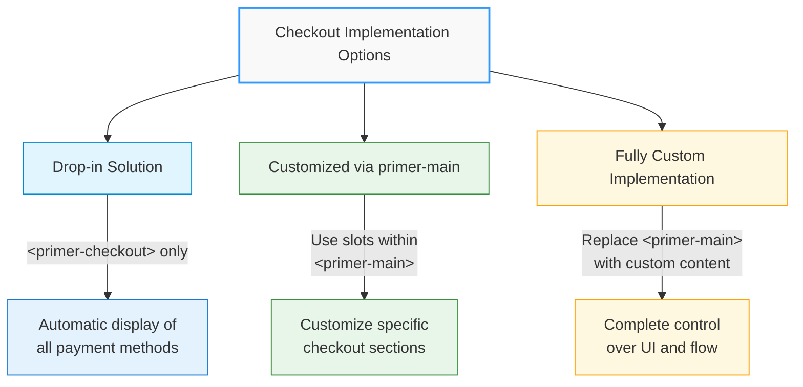
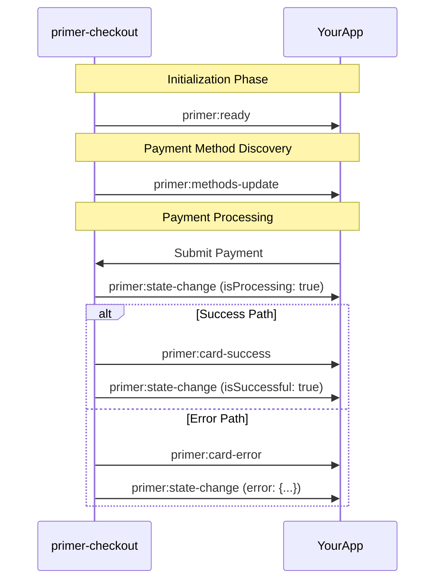
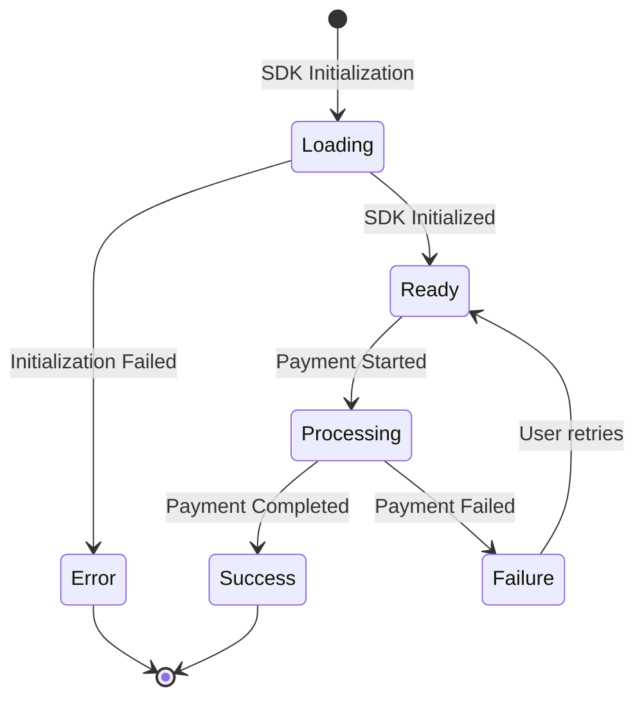

# Checkout Component

## \<primer-checkout\>

The `Checkout` component serves as the main container for all Primer payment components. It initializes the Primer SDK, manages the checkout state, and provides context to child components. This component can be used as a simple drop-in solution or as a foundation for a highly customized checkout experience.

:::warning Single Instance Limitation
Currently, only one instance of `<primer-checkout>` can be used per application. Multiple checkout configurations on a single page are not supported in the current version. This limitation may be addressed in future releases as we progress with engine rewrites.
:::

## Usage

The Checkout component can be used in three ways:



### 1. As a Drop-in Solution

Simply add the component with a client token to render a complete, ready-to-use checkout experience:

```html
<primer-checkout client-token="your-client-token"></primer-checkout>
```

This minimal implementation automatically displays all available payment methods with default styling and behavior.

### 2. With Customized primer-main Component

Use the optional `primer-main` component with slots to customize specific parts of the checkout experience:

```html
<primer-checkout client-token="your-client-token">
  <primer-main slot="main">
    <!-- Custom payment method layout -->
    <div slot="payments">
      <primer-payment-method type="PAYMENT_CARD"></primer-payment-method>
      <primer-payment-method type="PAYPAL"></primer-payment-method>
    </div>

    <!-- Custom completion screen -->
    <div slot="checkout-complete">
      <h2>Thank you for your purchase!</h2>
    </div>
  </primer-main>
</primer-checkout>
```

### 3. With Fully Custom Implementation

Replace the `primer-main` component entirely with your own custom implementation:

```html
<primer-checkout client-token="your-client-token">
  <!-- Custom implementation without using primer-main -->
  <div slot="main" id="custom-checkout">
    <h2>Select Payment Method</h2>
    <div class="payment-options">
      <primer-payment-method type="PAYMENT_CARD"></primer-payment-method>
    </div>
  </div>
</primer-checkout>
```

For comprehensive layout customization options, see the [Layout Customizations Guide](/documentation/layout-customizations-guide).

## Properties

| Attribute        | Type      | Description                                                                     | Default |
| ---------------- | --------- | ------------------------------------------------------------------------------- | ------- |
| `client-token`   | `String`  | Required. The client token obtained from your Primer backend integration.       | `''`    |
| `options`        | `Object`  | Optional. Configuration options for the Primer SDK.                             | `{}`    |
| `custom-styles`  | `String`  | Optional. Stringified JSON object containing CSS custom properties for styling. | `''`    |
| `disable-loader` | `Boolean` | Optional. When true, disables the default loading spinner.                      | `false` |

## Setting Attributes in JavaScript

:::warning Important: setAttribute() Required for Most Attributes
When setting attributes programmatically in JavaScript, most attributes must be set using `setAttribute()` rather than direct property assignment. This is because the component's attribute change processing is triggered only through the DOM attribute system.
:::

### Attributes that MUST use setAttribute()

The following attributes require `setAttribute()` to work correctly:

```javascript
const checkoutElement = document.querySelector('primer-checkout');

// ✅ Correct - use setAttribute()
checkoutElement.setAttribute('client-token', 'your-client-token');
checkoutElement.setAttribute('custom-styles', JSON.stringify(themeStyles));
checkoutElement.setAttribute('loader-disabled', 'true');

// ❌ Incorrect - direct property assignment not supported
checkoutElement.clientToken = 'your-client-token'; // Won't work
checkoutElement.customStyles = JSON.stringify(themeStyles); // Won't work
checkoutElement.disableLoader = true; // Won't work
```

### Exception: The options Property

The `options` property is an exception and should be set directly as a property:

```javascript
// ✅ Correct - options is set as a property, not an attribute
checkoutElement.options = {
  locale: 'en-GB',
  apiVersion: '2.4',
};

// ❌ Incorrect - options cannot be set as an attribute
checkoutElement.setAttribute('options', JSON.stringify(options)); // Won't work
```

### Why setAttribute() is Required

Using `setAttribute()` is required because:

1. **Attribute Change Processing**: The component watches for attribute changes through the DOM's mutation system
2. **Type Conversion**: The component automatically handles string-to-type conversion for attributes
3. **Lifecycle Integration**: Attribute changes trigger the component's internal update mechanisms

### Complete Example

```javascript
// Initialize checkout element
const checkoutElement = document.querySelector('primer-checkout');

// Set required attributes using setAttribute()
checkoutElement.setAttribute('client-token', 'your-client-token');

// Set optional styling
const customStyles = {
  primerColorBrand: '#4a6cf7',
  primerTypographyBrand: 'Inter, sans-serif',
};
checkoutElement.setAttribute('custom-styles', JSON.stringify(customStyles));

// Disable loader if needed
checkoutElement.setAttribute('loader-disabled', 'true');

// Set options as a property (not an attribute)
checkoutElement.options = {
  locale: 'en-GB',
  apiVersion: '2.4',
};
```

## Slots

| Name   | Description                                                                                                                                                                                                                                                  |
| ------ | ------------------------------------------------------------------------------------------------------------------------------------------------------------------------------------------------------------------------------------------------------------ |
| `main` | Main content slot for checkout components. If no content is provided, a default `<primer-main>` component is rendered with all available payment methods. You can provide either a `<primer-main>` component or your own custom implementation in this slot. |

## Events

| Event Name                   | Description                                      | Event Detail              |
| ---------------------------- | ------------------------------------------------ | ------------------------- |
| `primer:ready`               | Fired when the SDK is successfully initialized   | PrimerJS instance         |
| `primer:methods-update`      | Fired when payment methods are loaded            | Available payment methods |
| `primer:state-change`        | Fired when the checkout state changes            | Current state object      |
| `primer:card-network-change` | Fired when card network detection changes        | Card network information  |
| `primer:card-success`        | Fired when a card form is successfully submitted | Submission result         |
| `primer:card-error`          | Fired when card form submission has errors       | Validation errors         |

:::info Card Form Events
For detailed information about card form events, including the triggerable `primer:card-submit` event and payload interfaces, see the [Card Form Component documentation](/api/Components/CardForm/).
:::



## SDK Options

:::caution Temporary Implementation
The current SDK options structure documented here is temporary and will be changing. We will be moving away from the JSON-based configuration approach as we progress with the migration of our Headless SDK.
:::

The `options` property accepts a configuration object for the Primer SDK. When used as an HTML attribute, it must be a stringified JSON object. Remember that stringified JSON must use double quotes for property names and string values.

Here's a comprehensive overview of the available options:

### Core Options

| Option             | Type                | Description                                                        | Default          |
| ------------------ | ------------------- | ------------------------------------------------------------------ | ---------------- |
| `locale`           | `String`            | Forces the locale for UI elements. Formats: "en-US", "fr-FR", etc. | Browser's locale |
| `apiVersion`       | `"legacy" \| "2.4"` | API version to use when interacting with Primer backend.           | `"legacy"`       |
| `disabledPayments` | `Boolean`           | When true, disables all payment methods globally.                  | `false`          |

### Payment Method-Specific Options

<details>
<summary><strong>Card Options</strong></summary>

Controls the behavior of card payment methods.

```javascript
{
  "card": {
    "cardholderName": {
      "required": true  // Whether the cardholder name is required
    }
  }
}
```

</details>

<details>
<summary><strong>Apple Pay Options</strong></summary>

Configures Apple Pay payment behavior and button appearance.

```javascript
{
  "applePay": {
    "buttonType": "plain",           // "plain", "buy", "set-up", "donate", "check-out", "book", "subscribe"
    "buttonStyle": "black",          // "white", "white-outline", "black"

    // Deprecated - use billingOptions.requiredBillingContactFields instead
    "captureBillingAddress": false,

    "billingOptions": {
      // Required billing information to collect during checkout
      "requiredBillingContactFields": ["postalAddress", "phoneNumber", "emailAddress", "name", "phoneticName"]
    },

    "shippingOptions": {
      // Required shipping information to collect during checkout
      "requiredShippingContactFields": ["postalAddress", "name", "phoneNumber", "emailAddress", "phoneticName"],
      "requireShippingMethod": false   // Whether shipping method selection is required
    }
  }
}
```

</details>

<details>
<summary><strong>Google Pay Options</strong></summary>

Configures Google Pay payment behavior and button appearance.

```javascript
{
  "googlePay": {
    "buttonType": "long",            // "long", "short", "book", "buy", "checkout", "donate", "order", "pay", "plain", "subscribe"
    "buttonColor": "default",        // "default", "black", "white"
    "buttonSizeMode": "fill",        // "fill" or "static"
    "captureBillingAddress": false,  // Whether to prompt for billing address
    "shippingAddressParameters": {
      "phoneNumberRequired": false   // Whether phone number is required in shipping address
    },
    "emailRequired": false,          // Whether email address is required
    "requireShippingMethod": false,  // Whether shipping method selection is required
  }
}
```

</details>

<details>
<summary><strong>PayPal Options</strong></summary>

Configures PayPal payment behavior and button appearance.

```javascript
{
  "paypal": {
    "buttonColor": "gold",           // "gold", "blue", "silver", "white", "black"
    "buttonShape": "pill",           // "pill" or "rect"
    "buttonSize": "medium",          // "small", "medium", "large", "responsive"
    "buttonHeight": 40,              // Custom button height in pixels
    "buttonLabel": "checkout",       // "checkout", "credit", "pay", "buynow", "paypal", "installment"
    "buttonTagline": false,          // Whether to show PayPal tagline
    "paymentFlow": "DEFAULT",        // "DEFAULT" or "PREFER_VAULT"
  }
}
```

</details>

<details>
<summary><strong>Klarna Options</strong></summary>

Configures Klarna payment behavior.

```javascript
{
  "klarna": {
    "paymentFlow": "DEFAULT",        // "DEFAULT" or "PREFER_VAULT"
    "recurringPaymentDescription": "Monthly subscription", // Description for recurring payments
    "allowedPaymentCategories": ["pay_now", "pay_later", "pay_over_time"], // Allowed Klarna payment categories
    "buttonOptions": {
      "text": "Pay with Klarna"         // Custom button text
    }
  }
}
```

</details>

<details>
<summary><strong>3D Secure Options</strong></summary>

Configures 3D Secure authentication behavior.

```javascript
{
  "threeDsOptions": {
    "enabled": true,                 // Whether 3DS is enabled
    "preferred": false               // Whether 3DS is preferred over other auth methods
  }
}
```

</details>

<details>
<summary><strong>Vaulting Options</strong></summary>

Configures payment method vaulting (saving for future use).

```javascript
{
  "vault": {
    "enabled": true,                 // Enable payment method vaulting
    "showEmptyState": true           // Show empty state when no vaulted methods exist
  }
}
```

</details>

<details>
<summary><strong>Stripe Options</strong></summary>

Configures Stripe-specific payment options.

```javascript
{
  "stripe": {
    "mandateData": {
      "fullMandateText": "Custom mandate text for direct debits",
      "merchantName": "Your Business Name"
    },
    "publishableKey": "pk_test_..."  // Stripe publishable key
  }
}
```

</details>

<details>
<summary><strong>Submit Button Options</strong></summary>

Configures the submit button behavior.

```javascript
{
  "submitButton": {
    "amountVisible": true            // Whether to show the payment amount on the submit button
  }
}
```

</details>

### Example of Complete Options Object

Here's an example of a complete options object with various settings:

```html
<primer-checkout
  client-token="your-client-token"
  options='{"locale":"en-GB","apiVersion":"2.4","disabledPayments":false,"card":{"cardholderName":{"required":true}},"applePay":{"buttonStyle":"black","billingOptions":{"requiredBillingContactFields":["postalAddress","emailAddress"]}},"googlePay":{"buttonColor":"black","captureBillingAddress":true},"paypal":{"buttonColor":"blue","buttonShape":"pill","buttonLabel":"checkout"},"klarna":{"allowedPaymentCategories":["pay_now","pay_later"]},"vault":{"enabled":true}}'
>
  <primer-main slot="main"></primer-main>
</primer-checkout>
```

When using JavaScript:

```javascript
const checkout = document.querySelector('primer-checkout');

// ✅ Correct - The options property is set directly as an object
checkout.options = {
  locale: 'en-GB',
  apiVersion: '2.4',
  disabledPayments: false,
  card: {
    cardholderName: {
      required: true,
    },
  },
  applePay: {
    buttonStyle: 'black',
    billingOptions: {
      requiredBillingContactFields: ['postalAddress', 'emailAddress'],
    },
  },
  googlePay: {
    buttonColor: 'black',
    captureBillingAddress: true,
  },
  paypal: {
    buttonColor: 'blue',
    buttonShape: 'pill',
    buttonLabel: 'checkout',
  },
  klarna: {
    allowedPaymentCategories: ['pay_now', 'pay_later'],
  },
  vault: {
    enabled: true,
  },
};
```

### Important Notes on JSON Formatting

:::warning
When passing options to the `primer-checkout` component as an HTML attribute:

1. The entire options object must be a valid JSON string (use `JSON.stringify()` in JavaScript)
2. Use double quotes (`"`) for property names and string values
3. Do not include trailing commas
4. Boolean values should be `true` or `false` (not strings)
   :::

<div class="tabs-container">
<div class="tabs">
<div class="tab incorrect">Incorrect ❌</div>
<div class="tab correct">Correct ✅</div>
</div>

<div class="tab-content incorrect">

```html
<!-- Invalid: Single quotes around property names, trailing comma -->
<primer-checkout
  options='{"locale": "en-GB", "apiVersion": "2.4",}'
></primer-checkout>
```

</div>

<div class="tab-content correct">

```html
<!-- Valid: Proper JSON formatting -->
<primer-checkout
  options='{"locale":"en-GB","apiVersion":"2.4"}'
></primer-checkout>
```

</div>
</div>

## States

The Checkout component manages several states:



1. **Loading state**: During SDK initialization
2. **Error state**: When SDK initialization fails
3. **Ready state**: When SDK is initialized and ready to process payments
4. **Processing state**: During payment processing
5. **Success state**: When payment is completed successfully
6. **Failure state**: When payment processing fails

## CSS Custom Properties

Checkout Components use CSS Custom Properties (CSS Variables) to maintain a consistent design language across components. These tokens provide a standardized way to customize the appearance of your UI components.

You can apply tokens in two ways:

1. Using CSS Custom Properties directly in your stylesheets
2. Using JSON properties through the `custom-styles` attribute

<details>
<summary><strong>CSS Usage Example</strong></summary>

```css
/* Apply styling to all checkout components */
:root {
  --primer-color-brand: #2f98ff;
  --primer-radius-base: 4px;
  --primer-typography-brand: Inter, sans-serif;
  --primer-space-base: 4px;
  --primer-size-base: 4px;
  --primer-color-loader: #2f98ff;
  --primer-color-focus: #2f98ff;
}
```

</details>

<details>
<summary><strong>JSON Usage Example</strong></summary>

```html
<primer-checkout
  custom-styles='{"primerColorBrand":"#2f98ff","primerRadiusBase":"4px","primerTypographyBrand":"Inter, sans-serif","primerSpaceBase":"4px","primerSizeBase":"4px","primerColorLoader":"#2f98ff","primerColorFocus":"#2f98ff"}'
></primer-checkout>
```

</details>

:::tip
Choose the approach that best fits your project structure. The CSS approach offers more flexibility with selectors and media queries, while the JSON approach keeps styling concerns directly with the component instance.
:::

## Technical Implementation

The Checkout component:

1. **Initializes the Primer SDK** using the provided client token
2. **Manages locale settings** based on the options or falls back to browser default
3. **Provides context to child components** through various controllers
4. **Renders a default main component** when no content is provided
5. **Handles loading and error states** automatically

## Examples

<details>
<summary><strong>Basic Drop-in Implementation</strong></summary>

The simplest implementation with default behavior and styling:

```html
<primer-checkout client-token="your-client-token"></primer-checkout>
```

</details>

<details>
<summary><strong>Using primer-main with Customization</strong></summary>

```html
<primer-checkout client-token="your-client-token" options='{"locale":"en-GB"}'>
  <primer-main slot="main">
    <!-- Customize payment methods display -->
    <div slot="payments">
      <primer-payment-method type="PAYMENT_CARD"></primer-payment-method>
    </div>
  </primer-main>
</primer-checkout>
```

</details>

<details>
<summary><strong>Fully Custom Implementation</strong></summary>

```html
<primer-checkout client-token="your-client-token">
  <!-- Custom implementation without primer-main -->
  <div slot="main" class="custom-checkout">
    <h2>Complete Your Purchase</h2>
    <primer-payment-method type="PAYMENT_CARD"></primer-payment-method>
  </div>
</primer-checkout>
```

</details>

<details>
<summary><strong>With Custom Styling</strong></summary>

```html
<primer-checkout
  client-token="your-client-token"
  options='{"locale":"en-GB"}'
  custom-styles='{"primerColorBrand":"#4a6cf7","primerTypographyBrand":"Inter, sans-serif","primerRadiusBase":"4px","primerSpaceBase":"8px","primerSizeBase":"4px","primerColorLoader":"#4a6cf7","primerColorFocus":"#2f98ff"}'
>
  <primer-main slot="main"></primer-main>
</primer-checkout>
```

</details>

<details>
<summary><strong>With API Version and Card Options</strong></summary>

```html
<primer-checkout
  client-token="your-client-token"
  options='{"apiVersion":"2.4","locale":"en-GB","card":{"cardholderName":{"required":true}}}'
>
  <primer-main slot="main"></primer-main>
</primer-checkout>
```

</details>

<details>
<summary><strong>Disabling All Payment Methods Globally</strong></summary>

```html
<!-- Disable all payment methods through global configuration -->
<primer-checkout
  client-token="your-client-token"
  options='{"disabledPayments":true}'
>
  <primer-main slot="main"></primer-main>
</primer-checkout>

<!-- Using JavaScript -->
<script>
  const checkout = document.querySelector('primer-checkout');
  checkout.options = {
    disabledPayments: true,
  };
</script>
```

</details>

<details>
<summary><strong>Complete Checkout with Event Handling</strong></summary>

```html
<primer-checkout
  id="checkout"
  client-token="your-client-token"
  options='{"locale":"en-GB"}'
>
  <primer-main slot="main">
    <div slot="payments">
      <!-- Custom payment methods layout -->
    </div>
    <div slot="checkout-complete">
      <h2>Thank you for your purchase!</h2>
      <p>Your order has been confirmed.</p>
    </div>
  </primer-main>
</primer-checkout>

<script>
  const checkout = document.getElementById('checkout');

  // Listen for payment methods loading
  checkout.addEventListener('primer:methods-update', (event) => {
    const paymentMethods = event.detail;
    console.log('Available payment methods:', paymentMethods.toArray());
  });

  // Listen for checkout state changes
  checkout.addEventListener('primer:state-change', (event) => {
    const state = event.detail;
    if (state.isSuccessful) {
      console.log('Payment completed successfully');
    } else if (state.isProcessing) {
      console.log('Payment is processing');
    } else if (state.error) {
      console.error('Error:', state.error.message);
    }
  });

  // Listen for SDK initialization
  checkout.addEventListener('primer:ready', (event) => {
    console.log('Checkout SDK initialized');
  });
</script>
```

</details>

<details>
<summary><strong>Dynamically Setting Attributes and Options in JavaScript</strong></summary>

```html
<primer-checkout id="checkout">
  <primer-main slot="main"></primer-main>
</primer-checkout>

<script>
  const checkout = document.getElementById('checkout');

  // ✅ Set client-token using setAttribute()
  checkout.setAttribute('client-token', 'your-client-token');

  // ✅ Set custom styles using setAttribute()
  const customStyles = {
    primerColorBrand: '#4a6cf7',
    primerTypographyBrand: 'Inter, sans-serif',
  };
  checkout.setAttribute('custom-styles', JSON.stringify(customStyles));

  // ✅ Set options directly as a property (not an attribute)
  checkout.options = {
    locale: 'en-GB',
    apiVersion: '2.4',
    card: {
      cardholderName: {
        required: true,
      },
    },
  };
</script>
```

</details>

## Locale Support

The Checkout component supports internationalization through the `locale` option. Set the desired locale in the options object:

```html
<primer-checkout client-token="your-client-token" options='{"locale":"fr-FR"}'>
  <primer-main slot="main"></primer-main>
</primer-checkout>
```

The full list of supported locales can be found in the [Localization and languages
section](https://primer.io/docs/payments/universal-checkout/drop-in/customize-checkout/web#localization-and-languages).

:::note
If an unsupported locale is provided, the component will fall back to the default 'en-GB' locale with a warning message in the console.
:::

:::warning
At present the Checkout Components only support left-to-right (LTR) languages.
:::

## Disable Loader Option

You can disable the default loading spinner that appears during SDK initialization by using the `disable-loader` attribute:

```html
<primer-checkout client-token="your-client-token" disable-loader>
  <primer-main slot="main"></primer-main>
</primer-checkout>
```

This is useful when you want to implement your own custom loading indicator or when integrating the checkout into a page that already has a loader.

## Key Considerations

:::info Summary of Key Points

- The Checkout component functions as a complete checkout solution out of the box, requiring only a client token
- Currently, only one instance of `<primer-checkout>` can be used per application (this limitation may be addressed in future releases)
- Without custom layout, the component automatically displays all available payment methods
- The `primer-main` component is optional - you can provide your own custom implementation in the `main` slot
- When using a custom implementation instead of `primer-main`, you'll need to listen to checkout events to handle different checkout states
- For custom layouts, use the `main` slot to provide your own content configuration
- The component automatically handles loading states and error messages
- All Primer payment components must be used within the Checkout component
- Unsupported locales will fall back to 'en-GB' with a console warning
- When using the `options` property directly in JavaScript, you can pass it as an object; when using it as an HTML attribute, it must be a stringified JSON object
- The `custom-styles` attribute accepts a stringified JSON object with camelCase property names that map to kebab-case CSS variables
- **Important**: Most attributes (`client-token`, `custom-styles`, `loader-disabled`) must be set using `setAttribute()` in JavaScript, not direct property assignment. The `options` property is an exception and should be set directly as a property.
  :::

For advanced customization, refer to the [Layout Customizations Guide](/documentation/layout-customizations-guide).
