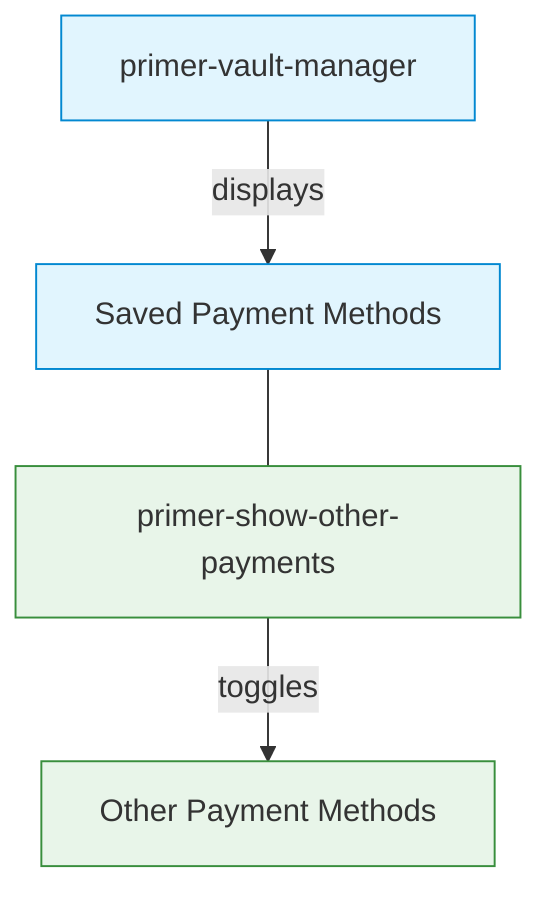

# Show Other Payments Component

## \<primer-show-other-payments\>

The `ShowOtherPayments` component provides a collapsible container that toggles the visibility of alternative payment methods when vaulted payment methods are available. It helps optimize the checkout interface by prioritizing saved payment methods while still providing access to other payment options.

## Usage

The Show Other Payments component is automatically integrated with the default checkout layout when the vault feature is enabled. When using a custom layout, it needs to be explicitly included.



### Component Purpose

This component serves to declutter the checkout interface by:

1. Automatically collapsing alternative payment methods when saved methods are available
2. Providing a clear toggle button to view additional payment options
3. Automatically expanding other payment methods when no saved methods exist

## Slots

| Name            | Description                                                                                      |
| --------------- | ------------------------------------------------------------------------------------------------ |
| `other-payments` | Container slot for alternative payment methods that will be made collapsible |

## Technical Implementation

The Show Other Payments component:

1. **Consumes the Vault Manager context** to access information about saved payment methods
2. **Conditionally renders** a collapsible container based on vault state
3. **Manages expansion state** based on the presence of vaulted payment methods
4. **Utilizes the Collapsable component** for smooth transitions and animations
5. **Handles loading states** to ensure proper rendering sequence

## Examples

<details>
<summary><strong>Basic Implementation (Default Layout)</strong></summary>

When using the default layout, the Show Other Payments component is automatically integrated:

```html
<primer-checkout
  client-token="your-client-token"
  options='{"vault": {"enabled": true}}'
>
</primer-checkout>
```

The component will automatically handle the toggling of alternative payment methods based on vault state.

</details>

<details>
<summary><strong>Custom Layout Implementation</strong></summary>

When using a custom layout, you need to explicitly include the component:

```html
<primer-checkout
  client-token="your-client-token"
  options='{"vault": {"enabled": true}}'
>
  <primer-main slot="main">
    <div slot="payments">
      <!-- Display vault manager for saved payment methods -->
      <primer-vault-manager></primer-vault-manager>
      
      <!-- Wrap other payment methods in the show-other-payments component -->
      <primer-show-other-payments>
        <div slot="other-payments" class="payment-methods-list">
          <primer-payment-method type="PAYMENT_CARD"></primer-payment-method>
          <primer-payment-method type="PAYPAL"></primer-payment-method>
          <!-- Add other payment methods as needed -->
        </div>
      </primer-show-other-payments>
    </div>
  </primer-main>
</primer-checkout>
```

This example demonstrates how to manually integrate the component in a custom layout while maintaining the desired user experience.

</details>

## States

The component handles several distinct states:

1. **Vault Manager Loading**: Renders nothing while vault data is loading
2. **No Vault or Vault Disabled**: Renders content without collapse functionality (direct passthrough)
3. **Vault with No Saved Methods**: Renders expanded collapsible container
4. **Vault with Saved Methods**: Renders collapsed collapsible container

## Key Considerations

:::info Summary of Key Points

- The Show Other Payments component helps manage checkout UI complexity when using the vault feature
- It is automatically integrated in the default layout, but needs explicit inclusion in custom layouts
- The component works in conjunction with the Vault Manager component
- It automatically expands when no saved payment methods are available
- The collapse/expand behavior provides a cleaner checkout interface while maintaining access to all payment options
:::

## Related Documentation

For more information on related components and functionality:

- [Vault Manager Component](vault-manager-doc)
- [Payment Method Component](payment-method-doc)
- [Main Component](primer-main-doc)
