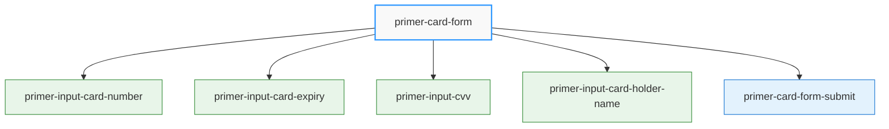
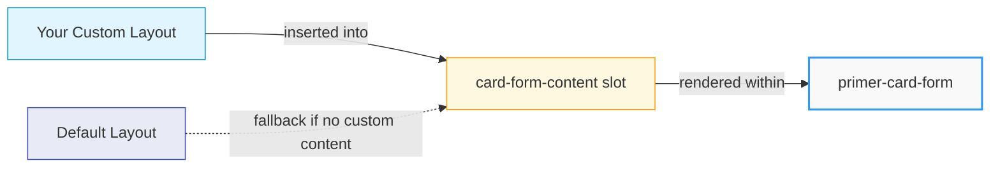
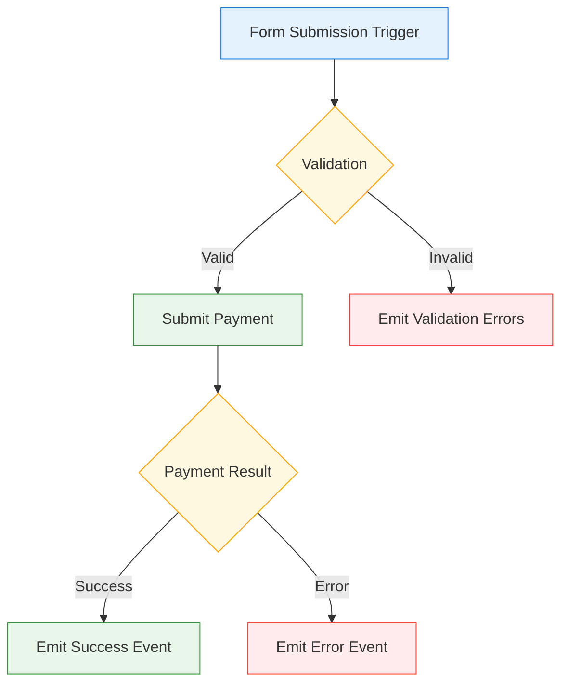
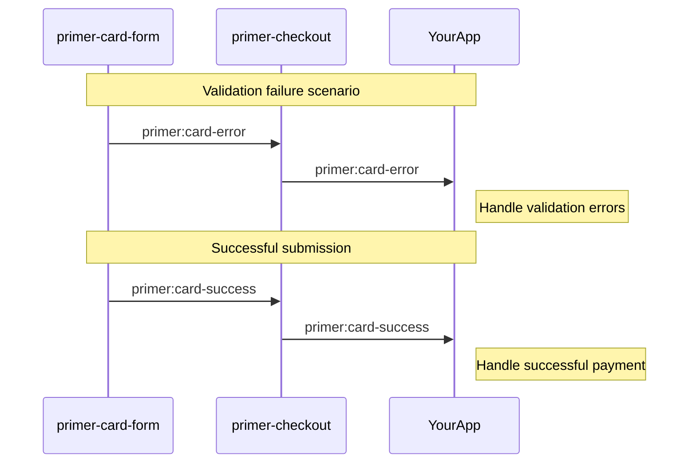
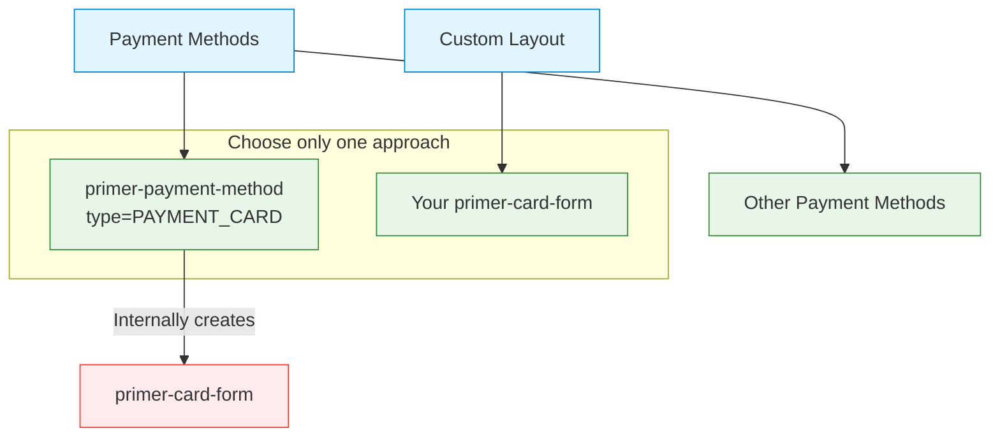

import CardFormLayoutBuilder from '@site/src/components/CardFormLayoutBuilder/CardFormLayoutBuilder';

# Card Form Customizations Guide

The Primer SDK's card form components provide a secure way to collect payment card information while offering extensive customization options. This guide explains the fundamental concepts behind card form customization and how to tailor it to match your brand's requirements.

## Interactive Card Form Layout Builder

Experience the power of drag-and-drop form building! The interactive builder below lets merchants visually design their card form layouts without writing code.

**🎯 Key Features:**

- **Drag & Drop**: Drag components from the palette directly into layout rows
- **Live Preview**: See your HTML code update in real-time as you build
- **Component Configuration**: Click the gear icon (⚙) to customize labels, placeholders, and accessibility attributes
- **Reordering**: Drag rows vertically and components horizontally to perfect your layout
- **Visual Feedback**: Clear visual cues show drag states and drop zones

<CardFormLayoutBuilder />

## Card Form Component Architecture

The card form uses a component-based architecture that separates concerns while maintaining security and compliance. At the heart of this architecture is the parent-child relationship between components:



### Component Relationships

The card form components have a strict hierarchical relationship:

1. **Parent Container**: `<primer-card-form>` serves as both the container and context provider
2. **Child Components**: Input fields and submit button must be descendants of the card form
3. **Context Dependency**: Child components depend on the context provided by the parent

### Card Form Components

<details>
<summary><strong>Card Form Components</strong></summary>

- `<primer-card-form>` - The container that orchestrates validation and submission
- `<primer-input-card-number>` - Secure field for card number collection with network detection
- `<primer-input-card-expiry>` - Secure field for expiration date collection
- `<primer-input-cvv>` - Secure field for security code collection
- `<primer-input-card-holder-name>` - Field for cardholder name collection
- `<primer-card-form-submit>` - Submit button with contextual styling

</details>

Each component is designed to work within the `<primer-card-form>` container, which provides:

- **Context**: Validation state, error handling, and form state
- **Event Handling**: Form submission and validation events
- **Hosted Inputs**: Secure iframe-based input fields for PCI compliance
- **Layout Structure**: Default or customizable layout options

## Understanding Card Form Slot Customization

The card form uses a slot-based customization model to allow flexible layouts without compromising security.

### The `card-form-content` Slot

:::info Key Customization Point
The primary customization point is the `card-form-content` slot within the `<primer-card-form>` component.
:::

This slot allows you to:

1. Arrange input fields in your preferred order
2. Group fields together (e.g., expiry and CVV in a row)
3. Add custom elements alongside secure inputs
4. Apply your own styling and layout

```html
<primer-card-form>
  <div slot="card-form-content">
    <!-- Your custom layout here -->
  </div>
</primer-card-form>
```

When you don't provide content for this slot, the card form automatically renders a default layout with all required fields.



## Component Dependency and Context

All card form input components have a critical relationship with the parent card form.

This relationship means:

1. **Mandatory Containment**: Card input components must always be placed inside a `<primer-card-form>` component
2. **Context Access**: Components access secure hosted inputs, validation state, and form management through the parent's context
3. **Event Bubbling**: Events from child components bubble up to the parent for processing
4. **Coordinated Validation**: The parent coordinates validation across all input components

## Customizing Input Field Appearance

Each card input component accepts properties that modify its appearance without affecting functionality:

### Label and Placeholder Customization

You can customize the visible text for each input:

```html
<primer-input-card-number
  label="Card Number"           <!-- Changes the label text -->
placeholder="1234 5678 9012 3456" <!-- Changes the placeholder text -->
aria-label="Credit card number" <!-- Changes the accessibility label -->
></primer-input-card-number>
```

These properties work consistently across all card input components, allowing for uniform customization.

## Form Layout Patterns

While you have complete freedom over the layout, certain patterns are common and effective:

### Standard Vertical Layout

The most common pattern is a vertical stack of inputs:

```html
<primer-card-form>
  <div slot="card-form-content">
    <primer-input-card-number></primer-input-card-number>
    <primer-input-card-holder-name></primer-input-card-holder-name>
    <div style="display: flex; gap: 8px;">
      <primer-input-card-expiry></primer-input-card-expiry>
      <primer-input-cvv></primer-input-cvv>
    </div>
    <primer-card-form-submit></primer-card-form-submit>
  </div>
</primer-card-form>
```

This pattern places related fields (expiry and CVV) side-by-side while keeping the main inputs full-width.

### How Form Submission Works

The `<primer-card-form>` component handles form submission in several ways:



<details>
<summary><strong>Submission Trigger Methods</strong></summary>

1. Through the `<primer-card-form-submit>` component (recommended)
2. Through any HTML button with `type="submit"`
3. Through any element with the `data-submit` attribute

</details>

When submission is triggered, the component:

1. Validates all card inputs
2. Emits validation errors if necessary
3. Submits the payment if validation passes
4. Emits success or error events based on the outcome

## Event-Driven Integration

The card form follows an event-driven approach for both validation handling and programmatic control. This section covers how to listen for events and trigger actions programmatically.

For comprehensive information on all available events, event payloads, and best practices, see the [Events Guide](/documentation/events-guide).

### Selecting Card Form Components

To interact with card form components programmatically, you need to select them from the DOM:

```javascript
// Select the main checkout component
const checkout = document.querySelector('primer-checkout');

// Select a specific card form (if using custom layout)
const cardForm = document.querySelector('primer-card-form');
```

:::note Component Presence Required
Components must be present in the DOM before you can interact with them. Ensure your code runs after the components are loaded and rendered in the UI.
:::

### Event Listening

```javascript
const checkout = document.querySelector('primer-checkout');

// Listen for validation errors
checkout.addEventListener('primer:card-error', (event) => {
  const errors = event.detail.errors;
  // Handle validation errors
});

// Listen for successful submission
checkout.addEventListener('primer:card-success', (event) => {
  const result = event.detail.result;
  // Handle successful submission
});

// Listen for card network changes
checkout.addEventListener('primer:card-network-change', (event) => {
  const network = event.detail;
  // Handle card network detection/change
});
```

These events bubble up to the `<primer-checkout>` component, allowing you to handle them at any level.

### Programmatic Form Submission

You can trigger card form submission programmatically by dispatching a `primer:card-submit` event to the document:

```javascript
// Trigger card form submission from anywhere in your application
document.dispatchEvent(
  new CustomEvent('primer:card-submit', {
    bubbles: true,
    composed: true,
    detail: { source: 'custom-submit-button' },
  }),
);
```

The checkout component listens for this event at the document level and forwards it internally to the card form, so you don't need to reference the card form element directly.

:::important Event Propagation
The checkout component listens for `primer:card-submit` events at the document level. You can dispatch this event from anywhere in your application—the event will bubble up through the DOM and be captured by the checkout component, which forwards it internally to the card form.

This approach is useful for:

- Custom submit buttons outside the card form
- Triggering submission from other UI elements
- Integrating with external form validation systems
  :::

**Complete Example: Custom Submit Button with Event Handling**

```html
<primer-checkout client-token="your-client-token">
  <primer-main slot="main">
    <div slot="payments">
      <primer-card-form>
        <div slot="card-form-content">
          <primer-input-card-number></primer-input-card-number>
          <primer-input-card-expiry></primer-input-card-expiry>
          <primer-input-cvv></primer-input-cvv>
          <!-- Custom submit button -->
          <button type="button" id="custom-submit" class="custom-pay-button">
            Pay Now
          </button>
        </div>
      </primer-card-form>
    </div>
  </primer-main>
</primer-checkout>

<script>
  // Set up custom submit button
  document.getElementById('custom-submit').addEventListener('click', () => {
    // Dispatch to document - checkout listens at document level
    document.dispatchEvent(
      new CustomEvent('primer:card-submit', {
        bubbles: true,
        composed: true,
        detail: { source: 'custom-pay-button' },
      }),
    );
  });

  // Handle submission results
  const checkout = document.querySelector('primer-checkout');

  checkout.addEventListener('primer:card-success', (event) => {
    console.log('Payment successful:', event.detail.result);
    // Handle success (e.g., redirect to confirmation page)
  });

  checkout.addEventListener('primer:card-error', (event) => {
    console.log('Validation errors:', event.detail.errors);
    // Handle errors (e.g., show error messages)
  });
</script>
```



## Styling Card Form Components

Card form components inherit styling from CSS custom properties defined at the checkout level:

```css
:root {
  /* These properties affect all components */
  --primer-color-brand: #4a90e2;
  --primer-radius-small: 4px;
  --primer-typography-body-large-font: 'Your-Font', sans-serif;
}
```

## Integrating Custom Fields

You can seamlessly integrate custom fields alongside the secure card inputs:

```html
<primer-card-form>
  <div slot="card-form-content">
    <primer-input-card-number></primer-input-card-number>

    <!-- Custom field using primer-input -->
    <primer-input-wrapper>
      <primer-input-label slot="label">Billing Zip Code</primer-input-label>
      <primer-input slot="input" type="text" name="zip"></primer-input>
    </primer-input-wrapper>

    <div style="display: flex; gap: 8px;">
      <primer-input-card-expiry></primer-input-card-expiry>
      <primer-input-cvv></primer-input-cvv>
    </div>

    <primer-card-form-submit></primer-card-form-submit>
  </div>
</primer-card-form>
```

:::note
The form container doesn't validate these custom fields directly, so you'll need to implement your own validation if needed.
:::

## Avoiding Duplicate Card Form Rendering

When customizing your card form layout, be aware of a common issue that can lead to duplicate card form elements:

:::caution Common Issue

```html
<!-- ❌ INCORRECT: This will cause duplicate card forms to appear -->
<primer-checkout client-token="your-token">
  <primer-main slot="main">
    <div slot="payments">
      <!-- Custom card form -->
      <primer-card-form>
        <div slot="card-form-content">
          <!-- Card form inputs -->
        </div>
      </primer-card-form>

      <!-- This will render ANOTHER card form, causing duplicates -->
      <primer-payment-method type="PAYMENT_CARD"></primer-payment-method>
    </div>
  </primer-main>
</primer-checkout>
```

:::

**Important:** When using a custom card form, do not include `<primer-payment-method type="PAYMENT_CARD">` in your layout. The payment method component will render its own card form, resulting in duplicates.

This is especially important when dynamically generating payment methods:

<details>
<summary><strong>Dynamic Payment Method Filtering Example</strong></summary>

```javascript
// When dynamically rendering payment methods, filter out PAYMENT_CARD if you're using a custom card form
checkout.addEventListener('primer:methods-update', (event) => {
  const availableMethods = event.detail
    .toArray()
    // Filter out PAYMENT_CARD if you're using a custom card form
    .filter((method) => method.type !== 'PAYMENT_CARD');

  // Render the filtered payment methods
  availableMethods.forEach((method) => {
    const element = document.createElement('primer-payment-method');
    element.setAttribute('type', method.type);
    container.appendChild(element);
  });
});
```

</details>

## Relationship with Payment Method Component

The relationship between `<primer-card-form>` and `<primer-payment-method type="PAYMENT_CARD">` is important to understand:



Key points about this relationship:

1. `<primer-payment-method type="PAYMENT_CARD">` internally creates its own `<primer-card-form>`
2. You should use either:
   - A custom `<primer-card-form>` (for full layout control)
   - The `<primer-payment-method type="PAYMENT_CARD">` component (for automatic handling)
3. Using both simultaneously will create duplicate forms and cause conflicts

## Best Practices

:::tip Best Practices Summary

1. **Maintain Security** - Always use the provided secure input components for card data
2. **Respect Component Hierarchy** - Keep all card input components within the `primer-card-form`
3. **Avoid Duplicate Components** - Don't use `<primer-payment-method type="PAYMENT_CARD">` with a custom card form
4. **Prioritize Clarity** - Keep layouts simple and focused on the payment task
5. **Use Consistent Styling** - Maintain visual consistency with your site's design system
6. **Handle Validation Properly** - Provide clear error messages and guidance
7. **Consider Mobile First** - Design for small screens first, then enhance for larger devices
8. **Test Thoroughly** - Validate behavior across browsers and device types
   :::

For detailed information on individual components, refer to their SDK Reference documentation:

- [Card Form](/sdk-reference/Components/CardForm/)
