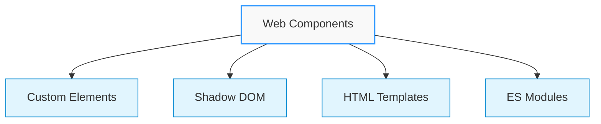
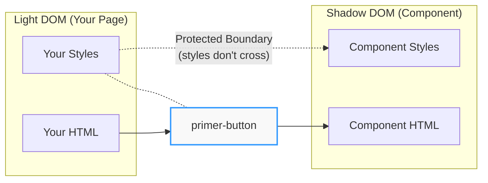
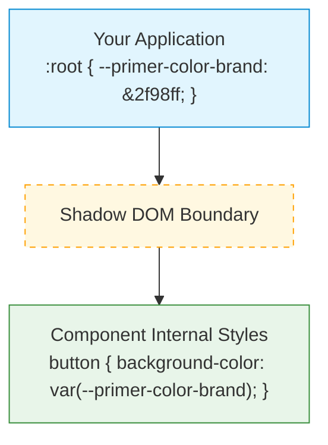
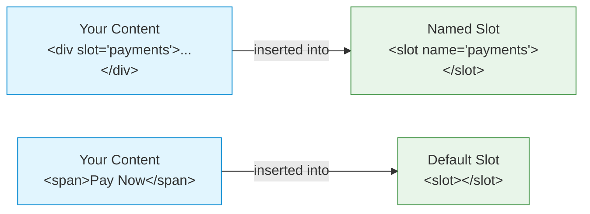
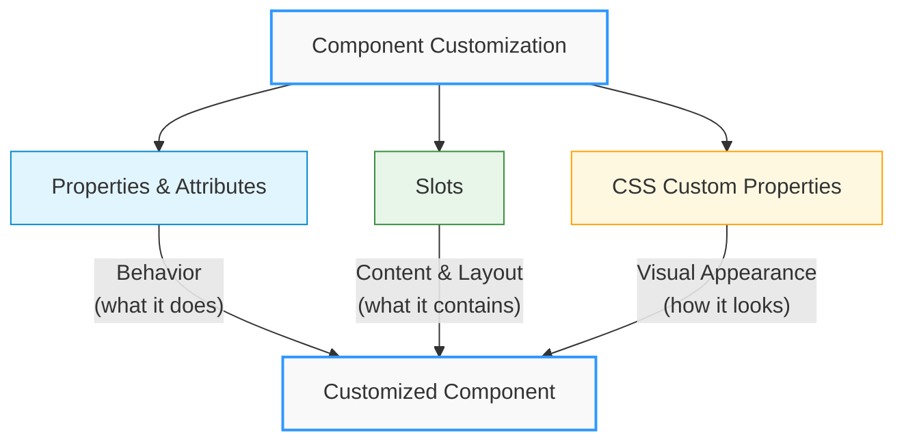

# Understanding Primer Components Technology

This guide introduces the core technologies that power Primer Checkout. While you won't need to implement these technologies directly, understanding them will help you better use and customize the checkout components in your projects.

## Web Components: The Foundation

Primer Checkout is built on [Web Components](https://developer.mozilla.org/en-US/docs/Web/API/Web_components) - a set of web platform features that enable reusable, encapsulated components. Think of them as specialized HTML elements that:

- Keep their internal workings private and protected
- Can be easily customized through properties and attributes
- Work consistently across different frameworks and environments



### What This Means For You

<div className="benefits">

- **Framework Independence**: Primer Components work in any JavaScript environment
- **Consistent Behavior**: Components behave the same way regardless of your tech stack
- **Future-Proof**: Built on web standards that browsers will support long-term

</div>

## Shadow DOM: Style Isolation

[Shadow DOM](https://developer.mozilla.org/en-US/docs/Web/API/Web_components/Using_shadow_DOM) is like a protective bubble around each component that:

- Keeps component styles from affecting your application
- Prevents your application classes from breaking components
- Enables consistent component appearance across different contexts



<details>
<summary><strong>Example of Shadow DOM Structure</strong></summary>

```html
<!-- Your application styles won't affect the internal structure -->
<primer-button>
  #shadow-root (open)
  <!-- Protected internal component structure -->
  <button class="primer-button">
    <slot></slot>
  </button>
</primer-button>
```

</details>

### Inheritable Properties

Although CSS classes won't cascade into the shadow DOM, inheritable properties like `color`, `text-align`, and CSS variables will pierce the shadow DOM as usual.

[Why is my Web Component inheriting styles?](https://lamplightdev.com/blog/2019/03/26/why-is-my-web-component-inheriting-styles/)

### What This Means For You

<div className="benefits">

- **Reliability**: Components maintain their intended appearance
- **Reduced Style Conflicts**: Your CSS classes won't accidentally break components
- **Predictable Behavior**: Components work consistently across different style environments

</div>

## CSS Custom Properties: Theming Through Boundaries

One challenge of Shadow DOM is styling components from the outside. This is where CSS Custom Properties (CSS Variables) come in as a critical part of Primer's technology stack:

- **Cross-boundary styling**: CSS Variables can penetrate Shadow DOM boundaries
- **Centralized theming**: Define styling once and apply it everywhere
- **Runtime customization**: Change appearance without rebuilding components



### How CSS Variables Work with Shadow DOM

CSS Variables have the ability to "pierce" through Shadow DOM boundaries, making them ideal for component styling:

<details>
<summary><strong>Example: CSS Variables with Shadow DOM</strong></summary>

```html
<!-- Define variables in parent document -->
<style>
  :root {
    --primer-color-brand: #2f98ff;
    --primer-radius-base: 4px;
  }
</style>

<!-- Component accesses these variables from inside its Shadow DOM -->
<primer-button>
  #shadow-root (open)
  <button
    style="background-color: var(--primer-color-brand); 
                   border-radius: var(--primer-radius-base);"
  >
    <slot></slot>
  </button>
</primer-button>
```

</details>

Primer's design system leverages this capability with a comprehensive set of variables for colors, spacing, typography, and more:

```css
/* Examples of Primer's design tokens */
:root {
  --primer-color-brand: #2f98ff; /* Primary brand color */
  --primer-color-text-primary: #212121; /* Main text color */
  --primer-typography-brand: 'Inter', sans-serif; /* Brand font */
  --primer-radius-small: 4px; /* Small border radius */
  --primer-space-xsmall: 4px; /* Extra small spacing unit */
}
```

This approach ensures visual consistency while enabling comprehensive customization without breaking component encapsulation.

## Slots: A Native Content Distribution System

[Slots](https://developer.mozilla.org/en-US/docs/Web/HTML/Element/slot) are a built-in browser feature that allows components to receive and display content from their consumers. Think of slots as designated "spaces" in a component where you can insert your own HTML content - similar to how a physical binder has slots for inserting different sections of paper.



### Why Slots?

Slots were introduced as part of the Web Components standard to solve a common problem: how can reusable components accept and display arbitrary content while maintaining their encapsulation? The slot system provides a native, performant solution that:

- Works directly in the browser without additional libraries
- Maintains proper DOM structure and events
- Enables dynamic content updates without component rebuilds

### How Slots Work

<details>
<summary><strong>Example: Card Form with Multiple Slots</strong></summary>

```html
<!-- A primer-card-form component with multiple slots -->
<primer-card-form>
  <!-- Named slot: specifically for card form content -->
  <div slot="card-form-content">
    <primer-input-card-number></primer-input-card-number>
    <div style="display: flex; gap: 8px;">
      <primer-input-card-expiry></primer-input-card-expiry>
      <primer-input-cvv></primer-input-cvv>
    </div>
    <primer-button buttonType="submit">Pay Now</primer-button>
  </div>
</primer-card-form>
```

</details>

### Types of Slots

<div className="slot-types">
<div className="tabs-container">
<div className="tabs">
<div className="tab default active">Default Slots</div>
<div className="tab named">Named Slots</div>
<div className="tab multiple">Multiple Elements</div>
</div>

<div className="tab-content default active">

```html
<primer-button>
  <!-- Content automatically goes into the default slot -->
  <span>Pay Now</span>
</primer-button>
```

</div>

<div className="tab-content named">

```html
<primer-main>
  <!-- Specific content areas using named slots -->
  <div slot="payments">
    <primer-payment-method type="PAYMENT_CARD"></primer-payment-method>
  </div>
  <div slot="checkout-complete">
    <h3>Thank you for your purchase!</h3>
  </div>
</primer-main>
```

</div>

<div className="tab-content multiple">

```html
<primer-input-wrapper>
  <!-- Multiple elements can go into the same slot -->
  <div slot="input">
    <primer-input placeholder="Search"></primer-input>
    <button>Search</button>
  </div>
</primer-input-wrapper>
```

</div>
</div>
</div>

### What This Means For You

<div className="benefits">

- **Natural HTML Structure**: Write your content using standard HTML - slots organize it automatically
- **Flexible Content**: Insert any HTML elements, components, or text into slots
- **Dynamic Updates**: Add, remove, or modify slotted content anytime - the component adapts automatically
- **Framework Compatible**: Slots work with any framework's templating system
- **Performance**: Browser-native feature means optimal performance without additional overhead

</div>

:::tip Pro Tip
Think of slots as labeled sections in your component. Just like you'd put specific papers in specific sections of a binder, you put specific content in specific slots of your component. The component handles displaying everything in the right place!
:::

## Lit: Enhanced Functionality

[Lit](https://lit.dev/) provides the reactive foundation for Primer Components, enabling them to:

- Update efficiently when data changes
- Handle events consistently
- Manage component state effectively

Lit is a lightweight library for building fast, reactive web components. Learn more in the [Lit documentation](https://lit.dev/docs/).

### What This Means For You

<div className="benefits">

- **Performance**: Components update quickly and efficiently
- **Reliability**: Consistent behavior across different scenarios
- **Modern Features**: Access to modern web capabilities while maintaining compatibility

</div>

## Component Customization Technologies

Primer Checkout components can be customized through multiple complementary technologies:



Together, these technologies create a flexible system that can adapt to your specific needs while maintaining consistency and reliability.

## Browser Support

Primer Checkout works in all modern browsers:

| Browser | Support |
| ------- | ------- |
| Chrome  | ✅      |
| Firefox | ✅      |
| Safari  | ✅      |
| Edge    | ✅      |

:::note
Primer Components handle browser compatibility for you - you don't need to worry about polyfills or compatibility layers.
:::

## Key Takeaways

Understanding these technologies helps you:

- **Use Components Effectively**: Know where and how to customize
- **Debug More Easily**: Understand component boundaries and behavior
- **Build Better UIs**: Take advantage of component isolation and composition
- **Style Consistently**: Apply unified styling through CSS Custom Properties

:::tip Learn More
For a deeper understanding of Web Components, check out the following resources:

- [MDN Web Components Guide](https://developer.mozilla.org/en-US/docs/Web/API/Web_components)
- [Using Custom Elements](https://developer.mozilla.org/en-US/docs/Web/API/Web_components/Using_custom_elements)
- [Shadow DOM on MDN](https://developer.mozilla.org/en-US/docs/Web/API/Web_components/Using_shadow_DOM)
- [CSS Custom Properties on MDN](https://developer.mozilla.org/en-US/docs/Web/CSS/Using_CSS_custom_properties)
- [Lit Documentation](https://lit.dev/docs/)
  :::

:::tip Remember
You don't need to implement these technologies yourself - Primer Checkout handles the complexity for you. This knowledge simply helps you use the components more effectively.
:::
