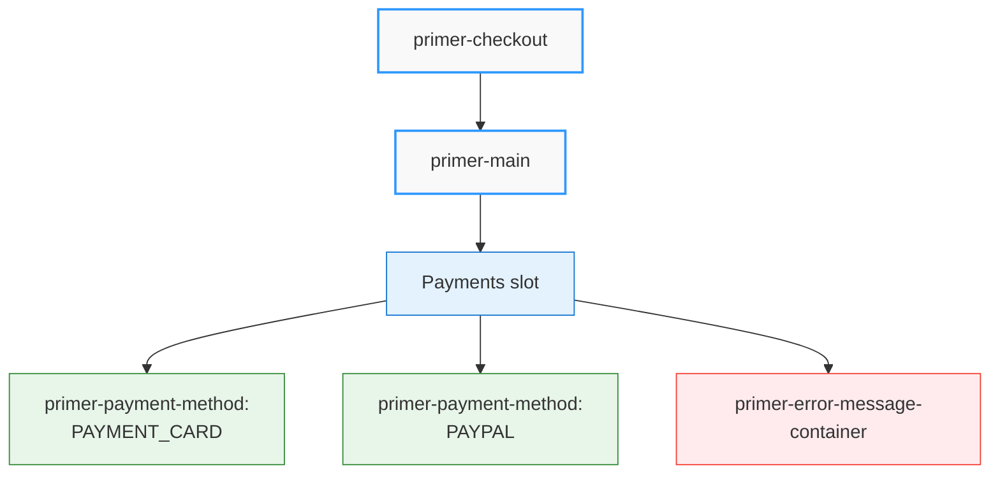

# Getting Started with Primer Composable Checkout

Welcome to Primer's Composable Checkout SDK! This guide will help you integrate our payment solution into your website or web application.

:::tip What you'll learn

- Set up a client session for Primer payments
- Install and initialize the Primer Composable Checkout SDK
- Implement a basic checkout experience
- Style your checkout with light and dark themes
- Handle payment events and checkout state changes
- Customize your checkout layout
- Understand technical considerations and limitations
  :::

## Environment Requirements

Before diving into the implementation, ensure your environment meets these requirements:

| Requirement       | Details                                         |
| ----------------- | ----------------------------------------------- |
| **Node.js**       | Current LTS version recommended                 |
| **Browsers**      | Modern browsers (Chrome, Firefox, Safari, Edge) |
| **Not Supported** | Internet Explorer 11, Classic Edge (legacy)     |

:::note Why some browsers aren't supported
Legacy browsers like Internet Explorer 11 aren't officially supported due to their non-standard DOM behavior and lack of support for modern Web Component features.
:::

## Server-Side Rendering Limitations

:::warning Important SSR Limitation
Primer Composable Checkout is **not supported in server-side rendering (SSR) frameworks out of the box**. The library relies on browser-specific APIs and must only be loaded on the client side.
:::

When using SSR frameworks like Next.js, Nuxt.js, or SvelteKit, you must ensure that Primer is only loaded in the browser environment. Here's how to handle this:

### Next.js Example

```javascript
import { useEffect } from 'react';
import { loadPrimer } from '@primer-io/primer-js';

function MyCheckoutComponent() {
  useEffect(() => {
    // Only run on client side
    if (typeof window !== 'undefined') {
      console.log('🔧 Loading Primer components');
      try {
        loadPrimer();
        console.log('✅ Primer components loaded successfully');
      } catch (error: any) {
        console.error('❌ Failed to load Primer components:', error);
      }
    }
  }, []);

  return (
    <div>
      {/* Your checkout components here */}
      <primer-checkout client-token="your-client-token">
        {/* Checkout content */}
      </primer-checkout>
    </div>
  );
}
```

### General SSR Framework Guidelines

For other SSR frameworks, follow these principles:

1. **Client-Side Only**: Always wrap `loadPrimer()` in client-side detection logic
2. **Use Framework Patterns**: Utilize your framework's client-side lifecycle methods (useEffect, onMounted, etc.)
3. **Error Handling**: Include proper error handling for loading failures
4. **Component Placement**: Only render Primer components after successful client-side initialization

:::tip Framework-Specific Solutions
Each SSR framework has its own patterns for client-side code execution. Consult your framework's documentation for the recommended approach to client-side-only code execution.
:::

## Before You Start

Before integrating Primer Composable Checkout, ensure you have completed these prerequisites:

1. You're [ready to process payments](https://primer.io/docs/payments/process-payments)
2. [Universal Checkout is properly configured](https://primer.io/docs/payments/universal-checkout/configure-universal-checkout-without-code) in your Primer Dashboard

### Create a Client Session

A **client session** is required to initialize the checkout experience. This session contains your order data and provides you with a **client token** needed to initialize the components.

#### Steps to create a client session:

<details>
<summary><strong>1. Generate an API key</strong></summary>

- Visit the [Primer Dashboard developer page](https://sandbox-dashboard.primer.io/developers/apiKeys)
- Create an API key with these scopes: - `client_tokens:write` - `transactions:authorize`
</details>

<details>
<summary><strong>2. Make a client session request</strong></summary>

- Make a POST request to the [Client Session API](https://primer.io/docs/api/api-reference/client-session-api/create-client-side-token)
- Include at minimum: - `orderId`: Your reference for tracking this payment - `currencyCode`: Three-letter currency code (e.g., "USD") - `order.lineItems`: Details of items in the order
</details>

The response will contain a `clientToken` that you'll use in the next steps to initialize Primer Composable Checkout.

## Installation

You can integrate the Primer SDK using NPM.

```bash
npm install @primer-io/primer-js
```

Then import and initialize Primer in your application:

```javascript
import { loadPrimer } from '@primer-io/primer-js';
loadPrimer();
```

## Basic Setup

Create a basic checkout integration by adding the `primer-checkout` component to your page:

```html
<primer-checkout client-token="your-client-token"></primer-checkout>
```

:::warning Single Instance Limitation
Currently, only one instance of `<primer-checkout>` can be used per application. Multiple checkout configurations on a single page are not supported in the current version. This limitation may be addressed in future releases as we progress with engine rewrites.
:::

For comprehensive details on all available attributes, refer to the [Checkout Component API Reference](/api/Components/primer-checkout-doc).

## Adding Styles

The Primer Composable Checkout SDK uses CSS Custom Properties to manage its visual appearance. The styles are loaded automatically when you call `loadPrimer();`

### Theme Implementation Options

```html
<!-- Add the theme class to your checkout container -->
<primer-checkout client-token="your-client-token" class="primer-dark-theme">
  <!-- Your checkout content -->
</primer-checkout>
```

You can switch themes by changing the class on your container:

```javascript
// Switch to light theme
document.querySelector('primer-checkout').className = 'primer-light-theme';

// Switch to dark theme
document.querySelector('primer-checkout').className = 'primer-dark-theme';
```

## Customizing with the Styling API

The Primer Composable Checkout SDK provides a comprehensive Styling API that allows you to customize the visual appearance of all checkout components. This API uses CSS Custom Properties (CSS Variables) to maintain a consistent design language across components.

```html
<!-- Example of styling customization using CSS variables -->
<style>
  primer-checkout {
    /* Brand color customization */
    --primer-color-brand: #4a6cf7;

    /* Typography customization */
    --primer-typography-brand: 'Montserrat', sans-serif;

    /* Border radius customization */
    --primer-radius-medium: 8px;

    /* Spacing customization */
    --primer-space-medium: 16px;
  }
</style>
```

You can customize nearly every aspect of the checkout UI, including:

- Colors (brand colors, text colors, backgrounds)
- Typography (font families, sizes, weights) - At the moment custom fonts will not work on iframes. The mechanism to set custom fonts on the whole checkout will come in future releases.
- Border radius values
- Spacing and sizing
- Input and button appearances

The Styling API also supports providing styles through a JSON object using the `custom-styles` attribute:

```html
<primer-checkout
  client-token="your-client-token"
  custom-styles='{"primerColorBrand":"#4a6cf7","primerTypographyBrand":"Montserrat, sans-serif"}'
>
</primer-checkout>
```

For detailed information on all available styling variables and customization options, refer to the [Composable Checkout Styling API](/api/styling-api-docs).

## TypeScript Support

### JSX-based Frameworks

You can define special types so that merchants can use Primer components in any JSX Framework without needing a dedicated wrapper:

```tsx
import { CustomElements } from '@primer-io/primer-js/dist/jsx/index';

// Libraries will often have their own module names,
// you will need to use when extending the IntrinsicElements interface.
// For example, Preact requires you to use the "preact"
declare module 'my-app' {
  namespace JSX {
    interface IntrinsicElements extends CustomElements {}
  }
}
```

:::note
Libraries will often have their own module names you will need to use when extending the IntrinsicElements interface. For example, Preact requires you to use the "preact" module name instead of "my-app" (declare module "preact") and StencilJS uses "@stencil/core" (declare module "@stencil/core").
:::

## Event Handling

The SDK emits events to help you manage the checkout flow. All events bubble up through the DOM and can be listened to at the document level or on the checkout component.

:::warning Version 0.2.0 Breaking Changes
If you're updating from v0.1.x to v0.2.x, please note that all event names have changed to follow the `primer:*` namespace format. For detailed information on these changes and how to migrate, see the [Migration Guide from v0.1.x to v0.2.x](migration-guides/v01-to-v02).
:::

### Selecting the Checkout Component

To listen for events or interact with the checkout programmatically, first select the primary checkout component:

```javascript
const checkout = document.querySelector('primer-checkout');
```

:::note Component Presence Required
The checkout component must be present in the DOM before you can interact with it. Ensure your code runs after the component is loaded.
:::

### Alternative: Document-Level Event Listening

All Primer events bubble up through the DOM, which means you can also listen for them at the document level. This approach is equally valid and may be preferred in some application architectures:

```javascript
// Alternative: Listen at document level (also valid)
document.addEventListener('primer:state-change', (event) => {
  const { isProcessing, isSuccessful, error } = event.detail;
  // Handle state changes
});

document.addEventListener('primer:card-success', (event) => {
  const result = event.detail.result;
  // Handle card success
});

document.addEventListener('primer:card-error', (event) => {
  const errors = event.detail.errors;
  // Handle card errors
});

// All other Primer events work the same way...
```

**When to use each approach:**

- **Component-level** (`checkout.addEventListener`): When you want to scope listeners to specific checkout instances or organize event handling per component
- **Document-level** (`document.addEventListener`): When you prefer centralized event handling or want to ensure you catch all events regardless of component location

### Event Types Overview

The `primer-checkout` component emits the following events:

#### Core Events

| Event Name              | Description                      | Payload                           |
| ----------------------- | -------------------------------- | --------------------------------- |
| `primer:state-change`   | Checkout state changes           | isProcessing, isSuccessful, error |
| `primer:methods-update` | Available payment methods loaded | Payment methods list              |
| `primer:ready`          | SDK successfully initialized     | PrimerJS instance                 |

#### Card Events

| Event Name                   | Description                      | Payload           |
| ---------------------------- | -------------------------------- | ----------------- |
| `primer:card-success`        | Card form submitted successfully | Submission result |
| `primer:card-error`          | Card validation errors           | Validation errors |
| `primer:card-network-change` | Card network detected            | Card network info |

### Core Events

```javascript
const checkout = document.querySelector('primer-checkout');

// Listen for SDK state changes
checkout.addEventListener('primer:state-change', (event) => {
  const { isProcessing, isSuccessful, error } = event.detail;
  // Handle state changes
});

// Listen for available payment methods
checkout.addEventListener('primer:methods-update', (event) => {
  const paymentMethods = event.detail.toArray();
  // Handle payment methods list
});

// Access PrimerJS instance
checkout.addEventListener('primer:ready', (event) => {
  const primer = event.detail;

  // Configure payment completion handler
  primer.onPaymentComplete = ({ payment, status, error }) => {
    if (status === 'success') {
      console.log('✅ Payment successful', payment);
      // Handle successful payment
    } else if (status === 'pending') {
      console.log('⏳ Payment pending', payment);
      // Handle pending payment
    } else if (status === 'error') {
      console.error('❌ Payment failed', error);
      // Handle payment failure
    }
  };
});
```

:::tip New Payment Method Container
For most use cases involving payment method layout and filtering, the new `primer-payment-method-container` component eliminates the need for manual `primer:methods-update` event handling. See the [Payment Method Container API documentation](/api/Components/payment-method-container-doc) for the simpler declarative approach.
:::

### Card Events

```javascript
const checkout = document.querySelector('primer-checkout');

// Handle successful card submission
checkout.addEventListener('primer:card-success', (event) => {
  const result = event.detail.result;
  // Handle success
});

// Handle card validation errors
checkout.addEventListener('primer:card-error', (event) => {
  const errors = event.detail.errors;
  // Handle validation errors
});

// Listen for card network changes
checkout.addEventListener('primer:card-network-change', (event) => {
  const network = event.detail;
  // Handle card network detection/change
});
```

## Customizing the Checkout Experience

The SDK provides flexible options for customizing your checkout experience. You can use the built-in components with custom layouts or implement your own UI entirely.

### Basic Layout Structure

```html
<primer-checkout client-token="your-client-token">
  <primer-main slot="main">
    <div slot="payments">
      <primer-payment-method type="PAYMENT_CARD"></primer-payment-method>
      <primer-payment-method type="PAYPAL"></primer-payment-method>
      <!-- Include error message container to display payment failures -->
      <primer-error-message-container></primer-error-message-container>
    </div>
  </primer-main>
</primer-checkout>
```



:::tip
The `<primer-error-message-container>` component provides a ready-to-use solution for displaying payment failure messages. When using custom layouts, you can either include this component or build your own error handling using the checkout events (as shown in the Event Handling section).
:::

For more advanced customization options, including handling success and failure states, checkout flow customization, and more, refer to the [Layout Customizations Guide](/documentation/layout-customizations-guide).

### Payment Method Configuration

#### Using Payment Method Container (Recommended)

For most use cases, the new `primer-payment-method-container` component provides a simpler declarative approach:

```html
<!-- Include specific payment methods -->
<primer-payment-method-container
  include="APPLE_PAY,GOOGLE_PAY"
></primer-payment-method-container>

<!-- Exclude specific payment methods -->
<primer-payment-method-container
  exclude="PAYMENT_CARD"
></primer-payment-method-container>
```

See [API documentation](/api/Components/payment-method-container-doc) for complete usage guide.

#### Alternative: Event-Driven Approach

For advanced use cases requiring complex payment method handling, you can use the traditional event-driven approach with `primer:methods-update` events as shown in the Event Handling section above.

## Technical Limitations

When working with the Primer Composable Checkout SDK, be aware of the following limitations:

:::warning Key Limitations

1. **Browser Compatibility**: The SDK uses modern web technologies and is not compatible with legacy browsers such as Internet Explorer 11.

2. **Shadow DOM Isolation**: Since the SDK uses Shadow DOM for style encapsulation, direct CSS targeting of inner elements is not possible. Use the provided CSS variables for styling.

3. **Web Component Lifecycle**: Custom elements have their own lifecycle methods that differ from those in frameworks like React or Vue. Ensure you're properly handling connections and disconnections.

4. **Security Contexts**: The SDK requires a secure context (HTTPS) for certain features like Apple Pay to function correctly.

5. **Framework Integration**: While the SDK works with all modern frameworks, integration patterns may differ slightly based on your framework's approach to handling custom elements.
   :::

For more detailed information about the underlying technologies and design decisions, see our [Technology Overview](/documentation/components-technology).
