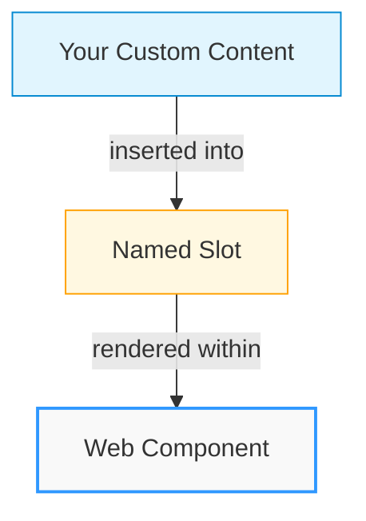
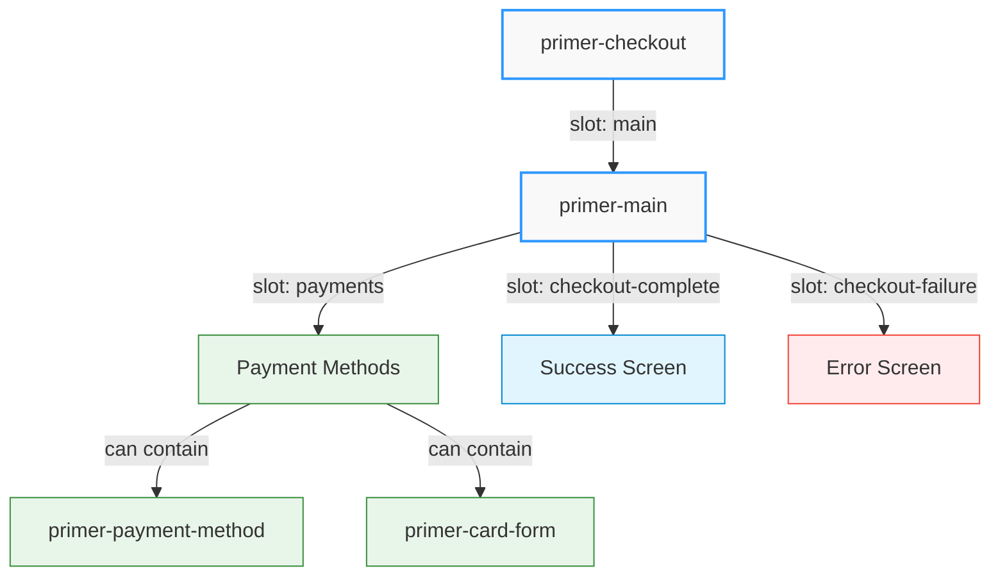
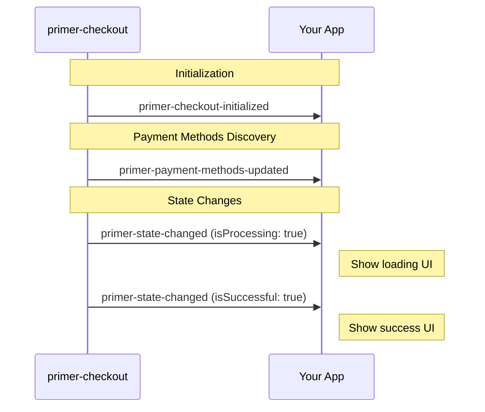
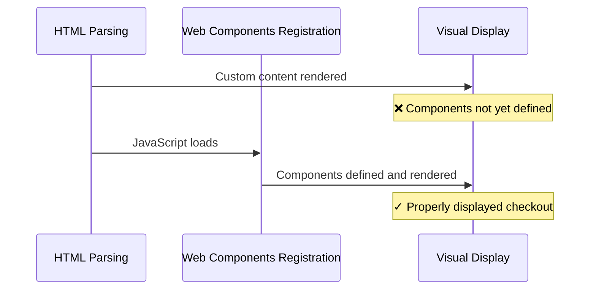

# Layout Customizations Guide

Primer Composable Checkout provides a flexible, slot-based architecture that allows you to customize the checkout layout while maintaining the core payment functionality. This guide explains the fundamental concepts behind layout customization and how to implement your own checkout experience.

## Understanding Slot-Based Architecture

The Composable Checkout SDK uses **slots** as the primary mechanism for layout customization. Slots are named placeholders in components where you can insert your own content.



### What Are Slots?

Slots are designated areas within Web Components where custom content can be inserted. Each slot has a specific name that determines where the content will appear.

```html
<!-- This content will be inserted into the "main" slot of primer-checkout -->
<div slot="main">Your custom content goes here</div>
```

When a component renders, it replaces each slot with the content you provide. If you don't provide content for a slot, the component often uses default content instead.

:::info Key Concept
Slots allow you to customize specific parts of a component without having to recreate the entire component's functionality.
:::

## Component Hierarchy and Available Slots

The checkout layout follows a hierarchical structure with slots at each level:



<details>
<summary><strong>1. &lt;primer-checkout&gt; Component</strong></summary>

The root component that initializes the SDK and provides the checkout context.

**Available Slots:**

- `main` - The main content area for the checkout experience

```html
<primer-checkout client-token="your-token">
  <div slot="main">
    <!-- Your custom checkout UI -->
  </div>
</primer-checkout>
```

</details>

<details>
<summary><strong>2. &lt;primer-main&gt; Component (Optional)</strong></summary>

A pre-built component that manages checkout states and provides additional slots for customization.

**Available Slots:**

- `payments` - Contains payment method components
- `checkout-complete` - Content shown on successful payment
- `checkout-fail`ure` - Content shown when payment fails

```html
<primer-checkout client-token="your-token">
  <primer-main slot="main">
    <div slot="payments">
      <!-- Your payment methods layout -->
    </div>
    <div slot="checkout-complete">
      <!-- Your success screen -->
    </div>
    <div slot="checkout-failure">
      <!-- Your error screen -->
    </div>
  </primer-main>
</primer-checkout>
```

</details>

## Customization Approaches

You can customize the checkout layout in two main ways:

### Approach 1: Using `<primer-main>` with Custom Slots

This approach allows you to customize specific parts of the checkout while relying on `<primer-main>` to handle state management:

```html
<primer-checkout client-token="your-token">
  <primer-main slot="main">
    <div slot="payments">
      <h2>Select Payment Method</h2>
      <primer-payment-method type="PAYMENT_CARD"></primer-payment-method>
      <primer-payment-method type="PAYPAL"></primer-payment-method>
    </div>
  </primer-main>
</primer-checkout>
```

:::tip Benefits of This Approach

- `<primer-main>` handles state transitions (loading, success, error)
- You only need to provide content for the slots you want to customize
- Default content is used for any slots you don't provide
  :::

### Approach 2: Fully Custom Implementation

For complete control, you can bypass `<primer-main>` entirely and provide your own implementation:

```html
<primer-checkout client-token="your-token">
  <div slot="main" id="custom-checkout">
    <!-- Your completely custom checkout implementation -->
    <div id="payment-methods">
      <primer-payment-method type="PAYMENT_CARD"></primer-payment-method>
    </div>
  </div>
</primer-checkout>
```

:::warning Implementation Responsibility
When using this approach:

- You must handle state management yourself through events
- You have complete freedom over the layout and user flow
- You're responsible for showing/hiding appropriate content based on checkout state
  :::

## Why Slot Names Matter

Slot names are crucial for several reasons:

1. **Component Targeting** - Names tell the component exactly where to insert your content
2. **Default Content** - Components can provide default content for slots that aren't filled
3. **Preventing Accidental Rendering** - Content without a matching slot won't be displayed
4. **Multiple Insertion Points** - Different named slots allow multiple insertion points

Using the wrong slot name or omitting it entirely can lead to content not appearing where expected.

## Event-Driven State Management

When implementing a custom layout without `<primer-main>`, you'll need to listen for events to manage checkout states:

```javascript
document
  .querySelector('primer-checkout')
  .addEventListener('primer-state-changed', (event) => {
    const state = event.detail;

    // Handle different checkout states
    if (state.isProcessing) {
      // Show loading indicator
    } else if (state.isSuccessful) {
      // Show success message
    } else if (state.error) {
      // Show error message
    }
  });
```



<details>
<summary><strong>Key events to listen for</strong></summary>

- `primer-state-changed` - Fired when checkout state changes
- `primer-payment-methods-updated` - Fired when available payment methods are loaded
- `primer-checkout-initialized` - Fired when the SDK is ready
</details>

## Configuring Payment Methods

When customizing the payment method layout, you can include specific payment methods:

```html
<div slot="payments">
  <primer-payment-method type="PAYMENT_CARD"></primer-payment-method>
  <primer-payment-method type="PAYPAL"></primer-payment-method>
</div>
```

The `type` attribute specifies which payment method to display. If a payment method isn't available in your configuration, it simply won't render.

### Important: Avoiding Duplicate Card Forms

:::caution Common Mistake
When customizing your checkout layout, be careful not to render duplicate card forms. This commonly happens when:

1. You create a custom card form using `<primer-card-form>`
2. You also include `<primer-payment-method type="PAYMENT_CARD">` in your layout
   :::

```html
<!-- ❌ INCORRECT: Will result in duplicate card forms -->
<div slot="payments">
  <!-- Custom card form -->
  <primer-card-form>
    <!-- Custom card form content -->
  </primer-card-form>

  <!-- This will render ANOTHER card form -->
  <primer-payment-method type="PAYMENT_CARD"></primer-payment-method>
</div>
```

If you're using a custom card form implementation, you should **not** include the `PAYMENT_CARD` payment method in your layout.

### Dynamic Payment Method Rendering

You can dynamically render payment methods by listening to the `primer-payment-methods-updated` event:

<details>
<summary><strong>Example: Dynamic Payment Method Rendering</strong></summary>

```javascript
checkout.addEventListener('primer-payment-methods-updated', (event) => {
  const availableMethods = event.detail.toArray();
  const container = document.getElementById('payment-methods');

  // Create payment method elements based on available methods
  availableMethods.forEach((method) => {
    const element = document.createElement('primer-payment-method');
    element.setAttribute('type', method.type);
    container.appendChild(element);
  });
});
```

</details>

This approach ensures you only display payment methods that are actually available.

<details>
<summary><strong>Filtering to avoid duplicate card forms</strong></summary>

**Important:** If you're using a custom card form, you should filter out the `PAYMENT_CARD` type to avoid duplicate card forms:

```javascript
checkout.addEventListener('primer-payment-methods-updated', (event) => {
  let availableMethods = event.detail.toArray();
  const container = document.getElementById('payment-methods');

  // If using a custom card form, filter out PAYMENT_CARD
  if (document.querySelector('primer-card-form')) {
    availableMethods = availableMethods.filter(
      (method) => method.type !== 'PAYMENT_CARD',
    );
  }

  // Create payment method elements based on filtered methods
  availableMethods.forEach((method) => {
    const element = document.createElement('primer-payment-method');
    element.setAttribute('type', method.type);
    container.appendChild(element);
  });
});
```

</details>

## Styling Custom Layouts

When styling custom layouts, use CSS custom properties for consistency:

```css
.payment-section {
  padding: var(--primer-space-medium);
  border-radius: var(--primer-radius-small);
  background-color: var(--primer-color-background-outlined-default);
}

.payment-section h2 {
  color: var(--primer-color-text-primary);
  font-family: var(--primer-typography-title-large-font);
  font-size: var(--primer-typography-title-large-size);
}
```

Using these properties ensures your custom layout maintains visual consistency with the checkout components.

## Handling Flash of Undefined Components

When using slot-based customizations, you might encounter a brief "flash" where your custom content appears before the Primer components are fully initialized. This occurs because web components are registered with JavaScript, which may load after your HTML is rendered.



This is particularly noticeable when:

- You've added custom UI in slots
- The page loads and shows your custom content
- The components initialize and potentially hide or rearrange your content

<details>
<summary><strong>Solution: Hide components until ready</strong></summary>

To prevent this jarring visual experience, you can hide the components until they're fully defined:

```css
primer-checkout:has(:not(:defined)) {
  visibility: hidden;
}
```

This CSS rule hides the checkout container when it contains any undefined custom elements. Once all components are defined, the container becomes visible automatically. Using `visibility: hidden` instead of `display: none` preserves the layout space to minimize shifting when components appear.

For more complex implementations, you could also use JavaScript to detect when all components are ready:

```javascript
Promise.allSettled([
  customElements.whenDefined('primer-checkout'),
  customElements.whenDefined('primer-payment-method'),
  // Add other components you're using
]).then(() => {
  document.querySelector('.checkout-container').classList.add('ready');
});
```

</details>

## Best Practices for Layout Customization

:::tip Best Practices Summary

1. **Use Named Slots Correctly** - Always use the correct slot names to ensure content appears where expected
2. **Listen for Relevant Events** - Handle checkout state through event listeners
3. **Maintain Visual Consistency** - Use CSS custom properties for styling
4. **Design Responsively** - Ensure your layout works on all device sizes
5. **Test Thoroughly** - Validate behavior across different payment methods and scenarios
6. **Prevent Component Flash** - Use CSS or JavaScript techniques to hide content until components are defined
   :::

For detailed information on available components and their slots, refer to the component API documentation:

- [Checkout Component](/api/Components/primer-checkout-doc/)
- [Main Component](/api/Components/primer-main-doc/)
- [Payment Method Component](/api/Components/payment-method-doc/)
