# LLM Guide

## How to Use This Guide

This guide contains our comprehensive documentation consolidated onto a single page. The goal is to provide an easy way for you to give Large Language Models (LLMs) of your choosing context on how to use our components.

You can either:

:::info Download Complete Documentation

[](https://github.com/primer-io/examples/blob/main/docs/general-docs/documentation/llm-guide.md) **← Download the complete documentation file**
:::

:::info Share Link with LLM

[](https://composable-checkout.vercel.app/documentation/llm-guide) **← Simply share this page URL with your LLM**
:::

The LLM will process all the text below, giving it a complete understanding of our component library. After providing this context, you can easily ask the LLM to build whatever you need using our components.

:::tip
For best results, ask the LLM to thoroughly review all the documentation before you begin asking implementation questions.
:::

## Example Prompt

You can use the following example prompt with your LLM after sharing this guide:

```
Go to this page and analyze how you can use primer's checkout components to create our checkout. https://composable-checkout.vercel.app/documentation/llm-guide

Now, create a basic implementation using TypeScript and add custom layout where we take control over the order of the payment methods. So we can put PayPal on top and CardForm second and then the rest should follow.
```

This prompt directs the LLM to:

1. Review the documentation on our components
2. Create a TypeScript implementation
3. Customize the payment method order (PayPal first, CardForm second, followed by other methods)

Feel free to modify this prompt to match your specific implementation needs.

---

## Component Library Documentation

<!-- This section will be auto-generated by script -->
<!-- DO NOT EDIT CONTENT BELOW THIS LINE MANUALLY -->

<!-- DOCUMENTATION_CONTENT_START -->


## Documentation Guides


---

<!-- Source: getting-started (Guide) -->

# Getting Started with Primer Composable Checkout

Welcome to Primer's Composable Checkout SDK! This guide will help you integrate our payment solution into your website or web application.

:::tip What you'll learn

- Set up a client session for Primer payments
- Install and initialize the Primer Composable Checkout SDK
- Implement a basic checkout experience
- Style your checkout with light and dark themes
- Handle payment events and checkout state changes
- Customize your checkout layout
- Understand technical considerations and limitations
  :::

## Environment Requirements

Before diving into the implementation, ensure your environment meets these requirements:

| Requirement       | Details                                         |
| ----------------- | ----------------------------------------------- |
| **Node.js**       | Current LTS version recommended                 |
| **Browsers**      | Modern browsers (Chrome, Firefox, Safari, Edge) |
| **Not Supported** | Internet Explorer 11, Classic Edge (legacy)     |

:::note Why some browsers aren't supported
Legacy browsers like Internet Explorer 11 aren't officially supported due to their non-standard DOM behavior and lack of support for modern Web Component features.
:::

## Before You Start

Before integrating Primer Composable Checkout, ensure you have completed these prerequisites:

1. You're [ready to process payments](https://primer.io/docs/payments/process-payments)
2. [Universal Checkout is properly configured](https://primer.io/docs/payments/universal-checkout/configure-universal-checkout-without-code) in your Primer Dashboard

### Create a Client Session

A **client session** is required to initialize the checkout experience. This session contains your order data and provides you with a **client token** needed to initialize the components.

#### Steps to create a client session:

<details>
<summary><strong>1. Generate an API key</strong></summary>

- Visit the [Primer Dashboard developer page](https://sandbox-dashboard.primer.io/developers/apiKeys)
- Create an API key with these scopes: - `client_tokens:write` - `transactions:authorize`
</details>

<details>
<summary><strong>2. Make a client session request</strong></summary>

- Make a POST request to the [Client Session API](https://primer.io/docs/api/api-reference/client-session-api/create-client-side-token)
- Include at minimum: - `orderId`: Your reference for tracking this payment - `currencyCode`: Three-letter currency code (e.g., "USD") - `order.lineItems`: Details of items in the order
</details>

The response will contain a `clientToken` that you'll use in the next steps to initialize Primer Composable Checkout.

## Installation

You can integrate the Primer SDK using NPM.

```bash
npm install @primer-io/primer-js
```

Then import and initialize Primer in your application:

```javascript
import { loadPrimer } from '@primer-io/primer-js';
loadPrimer();
```

## Basic Setup

Create a basic checkout integration by adding the `primer-checkout` component to your page:

```html
<primer-checkout client-token="your-client-token"></primer-checkout>
```

For comprehensive details on all available attributes, refer to the Checkout Component API Reference.

## Adding Styles

The Primer Composable Checkout SDK uses CSS Custom Properties to manage its visual appearance. The styles are loaded automatically when you call `loadPrimer();`

### Theme Implementation Options

```html
<!-- Add the theme class to your checkout container -->
<primer-checkout client-token="your-client-token" class="primer-dark-theme">
  <!-- Your checkout content -->
</primer-checkout>
```

You can switch themes by changing the class on your container:

```javascript
// Switch to light theme
document.querySelector('primer-checkout').className = 'primer-light-theme';

// Switch to dark theme
document.querySelector('primer-checkout').className = 'primer-dark-theme';
```

## Customizing with the Styling API

The Primer Composable Checkout SDK provides a comprehensive Styling API that allows you to customize the visual appearance of all checkout components. This API uses CSS Custom Properties (CSS Variables) to maintain a consistent design language across components.

```html
<!-- Example of styling customization using CSS variables -->
<style>
  primer-checkout {
    /* Brand color customization */
    --primer-color-brand: #4a6cf7;

    /* Typography customization */
    --primer-typography-brand: 'Montserrat', sans-serif;

    /* Border radius customization */
    --primer-radius-medium: 8px;

    /* Spacing customization */
    --primer-space-medium: 16px;
  }
</style>
```

You can customize nearly every aspect of the checkout UI, including:

- Colors (brand colors, text colors, backgrounds)
- Typography (font families, sizes, weights) - At the moment custom fonts will not work on iframes. The mechanism to set custom fonts on the whole checkout will come in future releases.
- Border radius values
- Spacing and sizing
- Input and button appearances

The Styling API also supports providing styles through a JSON object using the `custom-styles` attribute:

```html
<primer-checkout
  client-token="your-client-token"
  custom-styles='{"primerColorBrand":"#4a6cf7","primerTypographyBrand":"Montserrat, sans-serif"}'
>
</primer-checkout>
```

For detailed information on all available styling variables and customization options, refer to the Composable Checkout Styling API.

## TypeScript Support

### JSX-based Frameworks

You can define special types so that merchants can use Primer components in any JSX Framework without needing a dedicated wrapper:

```tsx
import { CustomElements } from '@primer-io/primer-js/dist/jsx/index';

// Libraries will often have their own module names,
// you will need to use when extending the IntrinsicElements interface.
// For example, Preact requires you to use the "preact"
declare module 'my-app' {
  namespace JSX {
    interface IntrinsicElements extends CustomElements {}
  }
}
```

:::note
Libraries will often have their own module names you will need to use when extending the IntrinsicElements interface. For example, Preact requires you to use the "preact" module name instead of "my-app" (declare module "preact") and StencilJS uses "@stencil/core" (declare module "@stencil/core").
:::

## Event Handling

The SDK emits events to help you manage the checkout flow. All events bubble up through the DOM and can be listened to at the document level or on the checkout component.

### Event Types Overview

The `primer-checkout` component emits the following events:

#### Core Events

| Event Name                       | Description                      | Payload                           |
| -------------------------------- | -------------------------------- | --------------------------------- |
| `primer-state-changed`           | Checkout state changes           | isProcessing, isSuccessful, error |
| `primer-payment-methods-updated` | Available payment methods loaded | Payment methods list              |
| `primer-checkout-initialized`    | SDK successfully initialized     | SDK instance                      |

#### Card Events

| Event Name                   | Description                      | Payload           |
| ---------------------------- | -------------------------------- | ----------------- |
| `primer-card-submit-success` | Card form submitted successfully | Submission result |
| `primer-card-submit-errors`  | Card validation errors           | Validation errors |
| `primer-card-network-change` | Card network detected            | Card network info |

#### Checkout Events

| Event Name                   | Description                     | Payload                |
| ---------------------------- | ------------------------------- | ---------------------- |
| `primer-oncheckout-complete` | Checkout completed successfully | Payment payload        |
| `primer-oncheckout-failure`  | Checkout process failed         | Error details, payment |

### Core Events

```javascript
const checkout = document.querySelector('primer-checkout');

// Listen for SDK state changes
checkout.addEventListener('primer-state-changed', (event) => {
  const { isProcessing, isSuccessful, error } = event.detail;
  // Handle state changes
});

// Listen for available payment methods
checkout.addEventListener('primer-payment-methods-updated', (event) => {
  const paymentMethods = event.detail.toArray();
  // Handle payment methods list
});

// Access SDK instance
checkout.addEventListener('primer-checkout-initialized', (event) => {
  const primerInstance = event.detail;
  // Access SDK methods
});

// Listen for checkout completion (new in v0.1.6)
checkout.addEventListener('primer-oncheckout-complete', (event) => {
  const { payment } = event.detail;
  // Handle successful checkout completion
  console.log('Checkout completed successfully:', payment);
});

// Listen for checkout failure (new in v0.1.6)
checkout.addEventListener('primer-oncheckout-failure', (event) => {
  const { error, payment } = event.detail;
  // Handle checkout failure
  console.error('Checkout failed:', error);
  if (payment) {
    console.log('Partial payment data:', payment);
  }
});
```

### Card Form Events

```javascript
// Handle successful card submission
checkout.addEventListener('primer-card-submit-success', (event) => {
  const result = event.detail.result;
  // Handle success
});

// Handle card validation errors
checkout.addEventListener('primer-card-submit-errors', (event) => {
  const errors = event.detail.errors;
  // Handle validation errors
});

// Listen for card network changes
checkout.addEventListener('primer-card-network-change', (event) => {
  const network = event.detail;
  // Handle card network detection/change
});
```

### ACH Events

For merchants using ACH (Automated Clearing House) payments, the SDK provides specific events to handle the ACH payment flow:

```javascript
// Handle ACH errors
checkout.addEventListener('primer-ach-error', (event) => {
  const error = event.detail.error;
  // Handle ACH-specific errors
});

// Bank details collected successfully
checkout.addEventListener('primer-ach-bank-details-collected', (event) => {
  // Proceed with payment flow after bank details are collected
});

// ACH mandate confirmed by the customer
checkout.addEventListener('primer-ach-mandate-confirmed', (event) => {
  // Handle successful mandate confirmation
});

// ACH mandate declined by the customer
checkout.addEventListener('primer-ach-mandate-declined', (event) => {
  // Handle mandate decline
});
```

## Customizing the Checkout Experience

The SDK provides flexible options for customizing your checkout experience. You can use the built-in components with custom layouts or implement your own UI entirely.

### Basic Layout Structure

```html
<primer-checkout client-token="your-client-token">
  <primer-main slot="main">
    <div slot="payments">
      <primer-payment-method type="PAYMENT_CARD"></primer-payment-method>
      <primer-payment-method type="PAYPAL"></primer-payment-method>
      <!-- Include error message container to display payment failures -->
      <primer-error-message-container></primer-error-message-container>
    </div>
  </primer-main>
</primer-checkout>
```

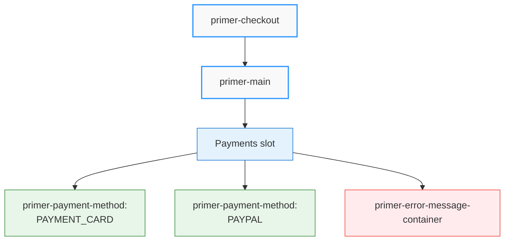

:::tip
The `<primer-error-message-container>` component provides a ready-to-use solution for displaying payment failure messages. When using custom layouts, you can either include this component or build your own error handling using the checkout events (as shown in the Event Handling section).
:::

For more advanced customization options, including handling success and failure states, checkout flow customization, and more, refer to the Layout Customizations Guide.

## Technical Limitations

When working with the Primer Composable Checkout SDK, be aware of the following limitations:

:::warning Key Limitations

1. **Browser Compatibility**: The SDK uses modern web technologies and is not compatible with legacy browsers such as Internet Explorer 11.

2. **Shadow DOM Isolation**: Since the SDK uses Shadow DOM for style encapsulation, direct CSS targeting of inner elements is not possible. Use the provided CSS variables for styling.

3. **Web Component Lifecycle**: Custom elements have their own lifecycle methods that differ from those in frameworks like React or Vue. Ensure you're properly handling connections and disconnections.

4. **Security Contexts**: The SDK requires a secure context (HTTPS) for certain features like Apple Pay to function correctly.

5. **Framework Integration**: While the SDK works with all modern frameworks, integration patterns may differ slightly based on your framework's approach to handling custom elements.
   :::

For more detailed information about the underlying technologies and design decisions, see our Technology Overview.

---

<!-- Source: components-technology (Guide) -->

# Understanding Primer Components Technology

This guide introduces the core technologies that power Primer Composable Checkout. While you won't need to implement these technologies directly, understanding them will help you better use and customize the checkout components in your projects.

:::tip What you'll learn

- The technologies that make Primer Composable Checkout work
- How these technologies enable component isolation and customization
- What these technical foundations mean for your development experience
  :::

## Web Components: The Foundation

Primer Composable Checkout is built on [Web Components](https://developer.mozilla.org/en-US/docs/Web/API/Web_components) - a set of web platform features that enable reusable, encapsulated components. Think of them as specialized HTML elements that:

- Keep their internal workings private and protected
- Can be easily customized through properties and attributes
- Work consistently across different frameworks and environments

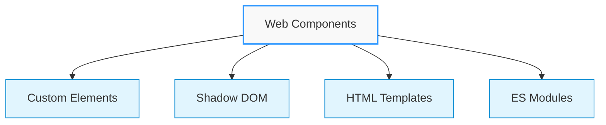

### What This Means For You

<div class="benefits">

- **Framework Independence**: Primer Components work in any JavaScript environment
- **Consistent Behavior**: Components behave the same way regardless of your tech stack
- **Future-Proof**: Built on web standards that browsers will support long-term

</div>

## Shadow DOM: Style Isolation

[Shadow DOM](https://developer.mozilla.org/en-US/docs/Web/API/Web_components/Using_shadow_DOM) is like a protective bubble around each component that:

- Keeps component styles from affecting your application
- Prevents your application classes from breaking components
- Enables consistent component appearance across different contexts

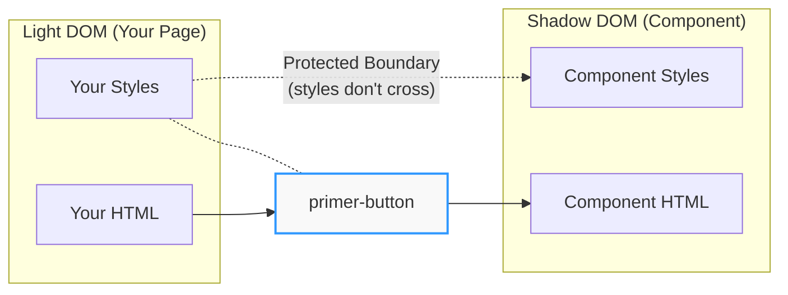

<details>
<summary><strong>Example of Shadow DOM Structure</strong></summary>

```html
<!-- Your application styles won't affect the internal structure -->
<primer-button>
  #shadow-root (open)
  <!-- Protected internal component structure -->
  <button class="primer-button">
    <slot></slot>
  </button>
</primer-button>
```

</details>

### Inheritable Properties

Although CSS classes won't cascade into the shadow DOM, inheritable properties like `color`, `text-align`, and CSS variables will pierce the shadow DOM as usual.

[Why is my Web Component inheriting styles?](https://lamplightdev.com/blog/2019/03/26/why-is-my-web-component-inheriting-styles/)

### What This Means For You

<div class="benefits">

- **Reliability**: Components maintain their intended appearance
- **Reduced Style Conflicts**: Your CSS classes won't accidentally break components
- **Predictable Behavior**: Components work consistently across different style environments

</div>

## CSS Custom Properties: Theming Through Boundaries

One challenge of Shadow DOM is styling components from the outside. This is where CSS Custom Properties (CSS Variables) come in as a critical part of Primer's technology stack:

- **Cross-boundary styling**: CSS Variables can penetrate Shadow DOM boundaries
- **Centralized theming**: Define styling once and apply it everywhere
- **Runtime customization**: Change appearance without rebuilding components

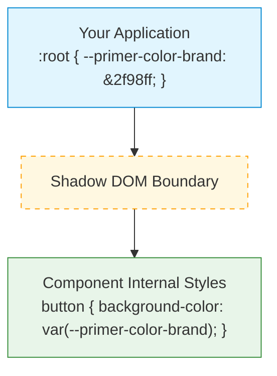

### How CSS Variables Work with Shadow DOM

CSS Variables have the ability to "pierce" through Shadow DOM boundaries, making them ideal for component styling:

<details>
<summary><strong>Example: CSS Variables with Shadow DOM</strong></summary>

```html
<!-- Define variables in parent document -->
<style>
  :root {
    --primer-color-brand: #2f98ff;
    --primer-radius-base: 4px;
  }
</style>

<!-- Component accesses these variables from inside its Shadow DOM -->
<primer-button>
  #shadow-root (open)
  <button
    style="background-color: var(--primer-color-brand); 
                   border-radius: var(--primer-radius-base);"
  >
    <slot></slot>
  </button>
</primer-button>
```

</details>

Primer's design system leverages this capability with a comprehensive set of variables for colors, spacing, typography, and more:

```css
/* Examples of Primer's design tokens */
:root {
  --primer-color-brand: #2f98ff; /* Primary brand color */
  --primer-color-text-primary: #212121; /* Main text color */
  --primer-typography-brand: 'Inter', sans-serif; /* Brand font */
  --primer-radius-small: 4px; /* Small border radius */
  --primer-space-xsmall: 4px; /* Extra small spacing unit */
}
```

This approach ensures visual consistency while enabling comprehensive customization without breaking component encapsulation.

## Slots: A Native Content Distribution System

[Slots](https://developer.mozilla.org/en-US/docs/Web/HTML/Element/slot) are a built-in browser feature that allows components to receive and display content from their consumers. Think of slots as designated "spaces" in a component where you can insert your own HTML content - similar to how a physical binder has slots for inserting different sections of paper.

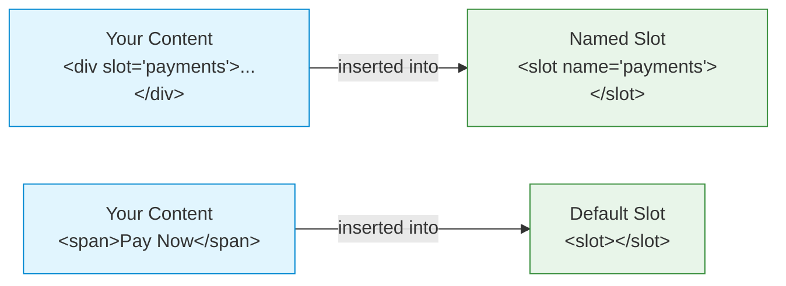

### Why Slots?

Slots were introduced as part of the Web Components standard to solve a common problem: how can reusable components accept and display arbitrary content while maintaining their encapsulation? The slot system provides a native, performant solution that:

- Works directly in the browser without additional libraries
- Maintains proper DOM structure and events
- Enables dynamic content updates without component rebuilds

### How Slots Work

<details>
<summary><strong>Example: Card Form with Multiple Slots</strong></summary>

```html
<!-- A primer-card-form component with multiple slots -->
<primer-card-form>
  <!-- Named slot: specifically for card form content -->
  <div slot="card-form-content">
    <primer-input-card-number></primer-input-card-number>
    <div style="display: flex; gap: 8px;">
      <primer-input-card-expiry></primer-input-card-expiry>
      <primer-input-cvv></primer-input-cvv>
    </div>
    <primer-button buttonType="submit">Pay Now</primer-button>
  </div>
</primer-card-form>
```

</details>

### Types of Slots

<div class="slot-types">
<div class="tabs-container">
<div class="tabs">
<div class="tab default active">Default Slots</div>
<div class="tab named">Named Slots</div>
<div class="tab multiple">Multiple Elements</div>
</div>

<div class="tab-content default active">

```html
<primer-button>
  <!-- Content automatically goes into the default slot -->
  <span>Pay Now</span>
</primer-button>
```

</div>

<div class="tab-content named">

```html
<primer-main>
  <!-- Specific content areas using named slots -->
  <div slot="payments">
    <primer-payment-method type="PAYMENT_CARD"></primer-payment-method>
  </div>
  <div slot="checkout-complete">
    <h3>Thank you for your purchase!</h3>
  </div>
</primer-main>
```

</div>

<div class="tab-content multiple">

```html
<primer-input-wrapper>
  <!-- Multiple elements can go into the same slot -->
  <div slot="input">
    <primer-input placeholder="Search"></primer-input>
    <button>Search</button>
  </div>
</primer-input-wrapper>
```

</div>
</div>
</div>

### What This Means For You

<div class="benefits">

- **Natural HTML Structure**: Write your content using standard HTML - slots organize it automatically
- **Flexible Content**: Insert any HTML elements, components, or text into slots
- **Dynamic Updates**: Add, remove, or modify slotted content anytime - the component adapts automatically
- **Framework Compatible**: Slots work with any framework's templating system
- **Performance**: Browser-native feature means optimal performance without additional overhead

</div>

:::tip Pro Tip
Think of slots as labeled sections in your component. Just like you'd put specific papers in specific sections of a binder, you put specific content in specific slots of your component. The component handles displaying everything in the right place!
:::

## Lit: Enhanced Functionality

[Lit](https://lit.dev/) provides the reactive foundation for Primer Components, enabling them to:

- Update efficiently when data changes
- Handle events consistently
- Manage component state effectively

Lit is a lightweight library for building fast, reactive web components. Learn more in the [Lit documentation](https://lit.dev/docs/).

### What This Means For You

<div class="benefits">

- **Performance**: Components update quickly and efficiently
- **Reliability**: Consistent behavior across different scenarios
- **Modern Features**: Access to modern web capabilities while maintaining compatibility

</div>

## Component Customization Technologies

Primer Composable Checkout components can be customized through multiple complementary technologies:

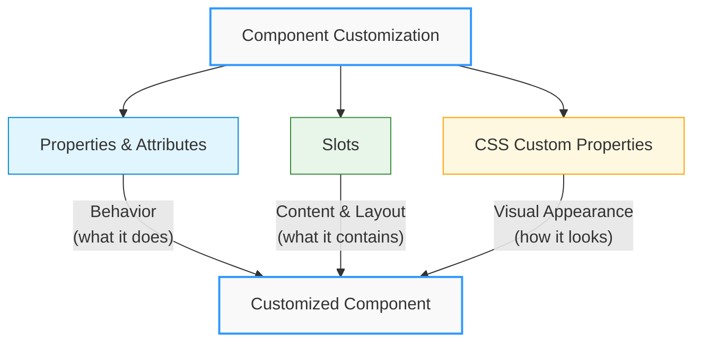

Together, these technologies create a flexible system that can adapt to your specific needs while maintaining consistency and reliability.

## Browser Support

Primer Composable Checkout works in all modern browsers:

| Browser | Support |
| ------- | ------- |
| Chrome  | ✅      |
| Firefox | ✅      |
| Safari  | ✅      |
| Edge    | ✅      |

:::note
Primer Components handle browser compatibility for you - you don't need to worry about polyfills or compatibility layers.
:::

## Key Takeaways

Understanding these technologies helps you:

- **Use Components Effectively**: Know where and how to customize
- **Debug More Easily**: Understand component boundaries and behavior
- **Build Better UIs**: Take advantage of component isolation and composition
- **Style Consistently**: Apply unified styling through CSS Custom Properties

:::tip Learn More
For a deeper understanding of Web Components, check out the following resources:

- [MDN Web Components Guide](https://developer.mozilla.org/en-US/docs/Web/API/Web_components)
- [Using Custom Elements](https://developer.mozilla.org/en-US/docs/Web/API/Web_components/Using_custom_elements)
- [Shadow DOM on MDN](https://developer.mozilla.org/en-US/docs/Web/API/Web_components/Using_shadow_DOM)
- [CSS Custom Properties on MDN](https://developer.mozilla.org/en-US/docs/Web/CSS/Using_CSS_custom_properties)
- [Lit Documentation](https://lit.dev/docs/)
  :::

:::tip Remember
You don't need to implement these technologies yourself - Primer Composable Checkout handles the complexity for you. This knowledge simply helps you use the components more effectively.
:::

---

<!-- Source: card-form-customizations-guide (Guide) -->

# Card Form Customizations Guide

The Primer SDK's card form components provide a secure way to collect payment card information while offering extensive customization options. This guide explains the fundamental concepts behind card form customization and how to tailor it to match your brand's requirements.

## Card Form Component Architecture

The card form uses a component-based architecture that separates concerns while maintaining security and compliance. At the heart of this architecture is the parent-child relationship between components:

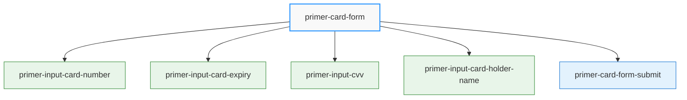

### Component Relationships

The card form components have a strict hierarchical relationship:

1. **Parent Container**: `<primer-card-form>` serves as both the container and context provider
2. **Child Components**: Input fields and submit button must be descendants of the card form
3. **Context Dependency**: Child components depend on the context provided by the parent

### Card Form Components

<details>
<summary><strong>Card Form Components</strong></summary>

- `<primer-card-form>` - The container that orchestrates validation and submission
- `<primer-input-card-number>` - Secure field for card number collection with network detection
- `<primer-input-card-expiry>` - Secure field for expiration date collection
- `<primer-input-cvv>` - Secure field for security code collection
- `<primer-input-card-holder-name>` - Field for cardholder name collection
- `<primer-card-form-submit>` - Submit button with contextual styling
</details>

Each component is designed to work within the `<primer-card-form>` container, which provides:

- **Context**: Validation state, error handling, and form state
- **Event Handling**: Form submission and validation events
- **Hosted Inputs**: Secure iframe-based input fields for PCI compliance
- **Layout Structure**: Default or customizable layout options

## Understanding Card Form Slot Customization

The card form uses a slot-based customization model to allow flexible layouts without compromising security.

### The `card-form-content` Slot

:::info Key Customization Point
The primary customization point is the `card-form-content` slot within the `<primer-card-form>` component.
:::

This slot allows you to:

1. Arrange input fields in your preferred order
2. Group fields together (e.g., expiry and CVV in a row)
3. Add custom elements alongside secure inputs
4. Apply your own styling and layout

```html
<primer-card-form>
  <div slot="card-form-content">
    <!-- Your custom layout here -->
  </div>
</primer-card-form>
```

When you don't provide content for this slot, the card form automatically renders a default layout with all required fields.

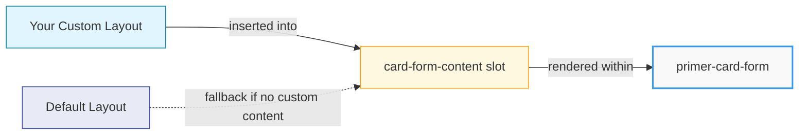

## Component Dependency and Context

All card form input components have a critical relationship with the parent card form.

This relationship means:

1. **Mandatory Containment**: Card input components must always be placed inside a `<primer-card-form>` component
2. **Context Access**: Components access secure hosted inputs, validation state, and form management through the parent's context
3. **Event Bubbling**: Events from child components bubble up to the parent for processing
4. **Coordinated Validation**: The parent coordinates validation across all input components

## Customizing Input Field Appearance

Each card input component accepts properties that modify its appearance without affecting functionality:

### Label and Placeholder Customization

You can customize the visible text for each input:

```html
<primer-input-card-number
  label="Card Number"           <!-- Changes the label text -->
placeholder="1234 5678 9012 3456" <!-- Changes the placeholder text -->
aria-label="Credit card number" <!-- Changes the accessibility label -->
></primer-input-card-number>
```

These properties work consistently across all card input components, allowing for uniform customization.

## Form Layout Patterns

While you have complete freedom over the layout, certain patterns are common and effective:

### Standard Vertical Layout

The most common pattern is a vertical stack of inputs:

```html
<primer-card-form>
  <div slot="card-form-content">
    <primer-input-card-number></primer-input-card-number>
    <primer-input-card-holder-name></primer-input-card-holder-name>
    <div style="display: flex; gap: 8px;">
      <primer-input-card-expiry></primer-input-card-expiry>
      <primer-input-cvv></primer-input-cvv>
    </div>
    <primer-card-form-submit></primer-card-form-submit>
  </div>
</primer-card-form>
```

This pattern places related fields (expiry and CVV) side-by-side while keeping the main inputs full-width.

### How Form Submission Works

The `<primer-card-form>` component handles form submission in several ways:

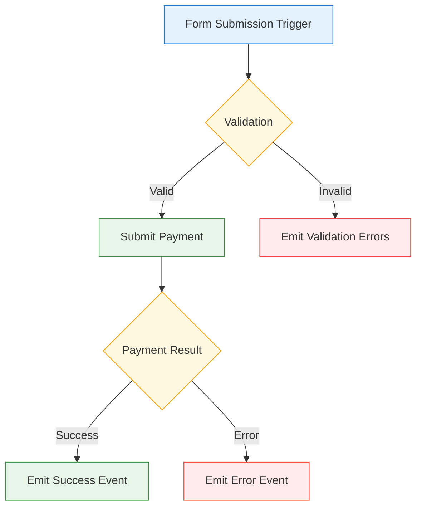

<details>
<summary><strong>Submission Trigger Methods</strong></summary>

1. Through the `<primer-card-form-submit>` component (recommended)
2. Through any HTML button with `type="submit"`
3. Through any element with the `data-submit` attribute
</details>

When submission is triggered, the component:

1. Validates all card inputs
2. Emits validation errors if necessary
3. Submits the payment if validation passes
4. Emits success or error events based on the outcome

## Event-Driven Validation

The card form follows an event-driven validation approach:

```javascript
// Listen for validation errors
cardForm.addEventListener('primer-card-submit-errors', (event) => {
  const errors = event.detail.errors;
  // Handle validation errors
});

// Listen for successful submission
cardForm.addEventListener('primer-card-submit-success', (event) => {
  const result = event.detail.result;
  // Handle successful submission
});
```

These events bubble up to the `<primer-checkout>` component, allowing you to handle them at any level.

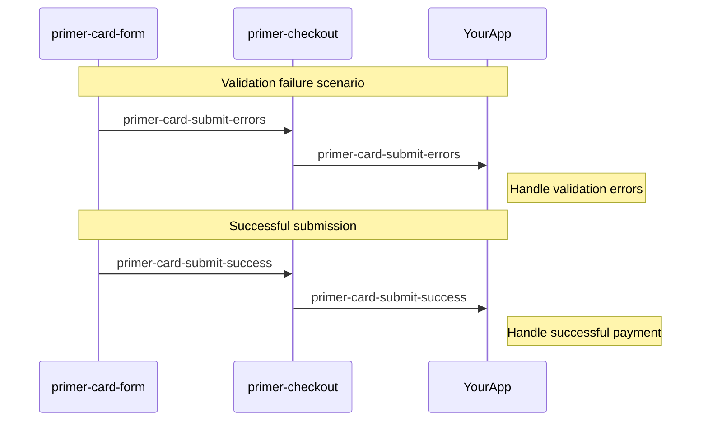

## Styling Card Form Components

Card form components inherit styling from CSS custom properties defined at the checkout level:

```css
:root {
  /* These properties affect all components */
  --primer-color-brand: #4a90e2;
  --primer-radius-small: 4px;
  --primer-typography-body-large-font: 'Your-Font', sans-serif;
}
```

## Integrating Custom Fields

You can seamlessly integrate custom fields alongside the secure card inputs:

```html
<primer-card-form>
  <div slot="card-form-content">
    <primer-input-card-number></primer-input-card-number>

    <!-- Custom field using primer-input -->
    <primer-input-wrapper>
      <primer-input-label slot="label">Billing Zip Code</primer-input-label>
      <primer-input slot="input" type="text" name="zip"></primer-input>
    </primer-input-wrapper>

    <div style="display: flex; gap: 8px;">
      <primer-input-card-expiry></primer-input-card-expiry>
      <primer-input-cvv></primer-input-cvv>
    </div>

    <primer-card-form-submit></primer-card-form-submit>
  </div>
</primer-card-form>
```

:::note
The form container doesn't validate these custom fields directly, so you'll need to implement your own validation if needed.
:::

## Avoiding Duplicate Card Form Rendering

When customizing your card form layout, be aware of a common issue that can lead to duplicate card form elements:

:::caution Common Issue

```html
<!-- ❌ INCORRECT: This will cause duplicate card forms to appear -->
<primer-checkout client-token="your-token">
  <primer-main slot="main">
    <div slot="payments">
      <!-- Custom card form -->
      <primer-card-form>
        <div slot="card-form-content">
          <!-- Card form inputs -->
        </div>
      </primer-card-form>

      <!-- This will render ANOTHER card form, causing duplicates -->
      <primer-payment-method type="PAYMENT_CARD"></primer-payment-method>
    </div>
  </primer-main>
</primer-checkout>
```

:::

**Important:** When using a custom card form, do not include `<primer-payment-method type="PAYMENT_CARD">` in your layout. The payment method component will render its own card form, resulting in duplicates.

This is especially important when dynamically generating payment methods:

<details>
<summary><strong>Dynamic Payment Method Filtering Example</strong></summary>

```javascript
// When dynamically rendering payment methods, filter out PAYMENT_CARD if you're using a custom card form
checkout.addEventListener('primer-payment-methods-updated', (event) => {
  const availableMethods = event.detail
    .toArray()
    // Filter out PAYMENT_CARD if you're using a custom card form
    .filter((method) => method.type !== 'PAYMENT_CARD');

  // Render the filtered payment methods
  availableMethods.forEach((method) => {
    const element = document.createElement('primer-payment-method');
    element.setAttribute('type', method.type);
    container.appendChild(element);
  });
});
```

</details>

## Relationship with Payment Method Component

The relationship between `<primer-card-form>` and `<primer-payment-method type="PAYMENT_CARD">` is important to understand:

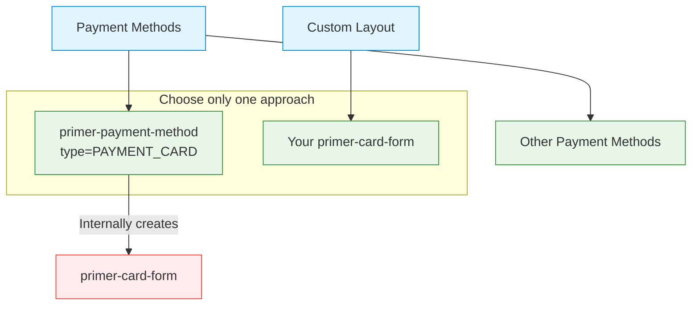

Key points about this relationship:

1. `<primer-payment-method type="PAYMENT_CARD">` internally creates its own `<primer-card-form>`
2. You should use either:
   - A custom `<primer-card-form>` (for full layout control)
   - The `<primer-payment-method type="PAYMENT_CARD">` component (for automatic handling)
3. Using both simultaneously will create duplicate forms and cause conflicts

## Best Practices

:::tip Best Practices Summary

1. **Maintain Security** - Always use the provided secure input components for card data
2. **Respect Component Hierarchy** - Keep all card input components within the `primer-card-form`
3. **Avoid Duplicate Components** - Don't use `<primer-payment-method type="PAYMENT_CARD">` with a custom card form
4. **Prioritize Clarity** - Keep layouts simple and focused on the payment task
5. **Use Consistent Styling** - Maintain visual consistency with your site's design system
6. **Handle Validation Properly** - Provide clear error messages and guidance
7. **Consider Mobile First** - Design for small screens first, then enhance for larger devices
8. **Test Thoroughly** - Validate behavior across browsers and device types
   :::

For detailed information on individual components, refer to their API documentation:

- Card Form

---

<!-- Source: layout-customizations-guide (Guide) -->

# Layout Customizations Guide

Primer Composable Checkout provides a flexible, slot-based architecture that allows you to customize the checkout layout while maintaining the core payment functionality. This guide explains the fundamental concepts behind layout customization and how to implement your own checkout experience.

## Understanding Slot-Based Architecture

The Composable Checkout SDK uses **slots** as the primary mechanism for layout customization. Slots are named placeholders in components where you can insert your own content.

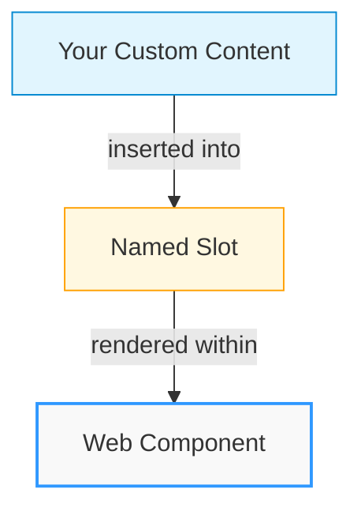

### What Are Slots?

Slots are designated areas within Web Components where custom content can be inserted. Each slot has a specific name that determines where the content will appear.

```html
<!-- This content will be inserted into the "main" slot of primer-checkout -->
<div slot="main">Your custom content goes here</div>
```

When a component renders, it replaces each slot with the content you provide. If you don't provide content for a slot, the component often uses default content instead.

:::info Key Concept
Slots allow you to customize specific parts of a component without having to recreate the entire component's functionality.
:::

## Component Hierarchy and Available Slots

The checkout layout follows a hierarchical structure with slots at each level:

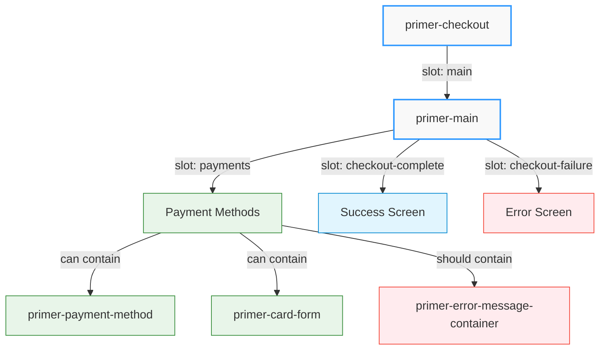

<details>
<summary><strong>1. &lt;primer-checkout&gt; Component</strong></summary>

The root component that initializes the SDK and provides the checkout context.

**Available Slots:**

- `main` - The main content area for the checkout experience

```html
<primer-checkout client-token="your-token">
  <div slot="main">
    <!-- Your custom checkout UI -->
  </div>
</primer-checkout>
```

</details>

<details>
<summary><strong>2. &lt;primer-main&gt; Component (Optional)</strong></summary>

A pre-built component that manages checkout states and provides additional slots for customization.

**Available Slots:**

- `payments` - Contains payment method components
- `checkout-complete` - Content shown on successful payment
- `checkout-fail`ure` - Content shown when payment fails

```html
<primer-checkout client-token="your-token">
  <primer-main slot="main">
    <div slot="payments">
      <!-- Your payment methods layout -->
    </div>
    <div slot="checkout-complete">
      <!-- Your success screen -->
    </div>
    <div slot="checkout-failure">
      <!-- Your error screen -->
    </div>
  </primer-main>
</primer-checkout>
```

</details>

## Customization Approaches

You can customize the checkout layout in two main ways:

### Approach 1: Using `<primer-main>` with Custom Slots

This approach allows you to customize specific parts of the checkout while relying on `<primer-main>` to handle state management:

```html
<primer-checkout client-token="your-token">
  <primer-main slot="main">
    <div slot="payments">
      <h2>Select Payment Method</h2>
      <primer-payment-method type="PAYMENT_CARD"></primer-payment-method>
      <primer-payment-method type="PAYPAL"></primer-payment-method>
    </div>
  </primer-main>
</primer-checkout>
```

:::tip Benefits of This Approach

- `<primer-main>` handles state transitions (loading, success, error)
- You only need to provide content for the slots you want to customize
- Default content is used for any slots you don't provide
  :::

### Approach 2: Fully Custom Implementation

For complete control, you can bypass `<primer-main>` entirely and provide your own implementation:

```html
<primer-checkout client-token="your-token">
  <div slot="main" id="custom-checkout">
    <!-- Your completely custom checkout implementation -->
    <div id="payment-methods">
      <primer-payment-method type="PAYMENT_CARD"></primer-payment-method>

      <!-- Option 1: Use the pre-built error container component for payment failures -->
      <primer-error-message-container></primer-error-message-container>

      <!-- Option 2: Or create your own error display element -->
      <div id="my-custom-error" class="custom-error-message"></div>
    </div>
  </div>
</primer-checkout>
```

:::warning Implementation Responsibility
When using this approach:

- You must handle state management yourself through events
- You have complete freedom over the layout and user flow
- You're responsible for showing/hiding appropriate content based on checkout state
- You need to handle payment failure display, either with the `<primer-error-message-container>` component or by implementing custom error handling with events
  :::

## Why Slot Names Matter

Slot names are crucial for several reasons:

1. **Component Targeting** - Names tell the component exactly where to insert your content
2. **Default Content** - Components can provide default content for slots that aren't filled
3. **Preventing Accidental Rendering** - Content without a matching slot won't be displayed
4. **Multiple Insertion Points** - Different named slots allow multiple insertion points

Using the wrong slot name or omitting it entirely can lead to content not appearing where expected.

## Event-Driven State Management

When implementing a custom layout without `<primer-main>`, you'll need to listen for events to manage checkout states:

```javascript
document
  .querySelector('primer-checkout')
  .addEventListener('primer-state-changed', (event) => {
    const state = event.detail;

    // Handle different checkout states
    if (state.isProcessing) {
      // Show loading indicator
    } else if (state.isSuccessful) {
      // Show success message
    } else if (state.error) {
      // Show error message
    }
  });
```

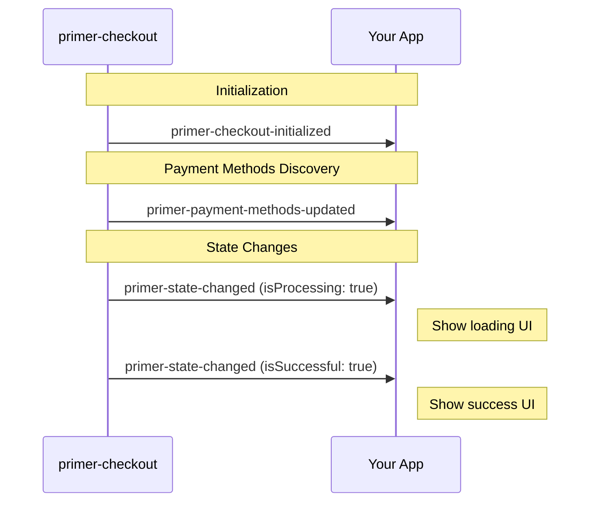

<details>
<summary><strong>Key events to listen for</strong></summary>

- `primer-state-changed` - Fired when checkout state changes
- `primer-payment-methods-updated` - Fired when available payment methods are loaded
- `primer-checkout-initialized` - Fired when the SDK is ready
</details>

## Configuring Payment Methods

When customizing the payment method layout, you can include specific payment methods:

```html
<div slot="payments">
  <primer-payment-method type="PAYMENT_CARD"></primer-payment-method>
  <primer-payment-method type="PAYPAL"></primer-payment-method>
</div>
```

The `type` attribute specifies which payment method to display. If a payment method isn't available in your configuration, it simply won't render.

### Important: Avoiding Duplicate Card Forms

:::caution Common Mistake
When customizing your checkout layout, be careful not to render duplicate card forms. This commonly happens when:

1. You create a custom card form using `<primer-card-form>`
2. You also include `<primer-payment-method type="PAYMENT_CARD">` in your layout
   :::

```html
<!-- ❌ INCORRECT: Will result in duplicate card forms -->
<div slot="payments">
  <!-- Custom card form -->
  <primer-card-form>
    <!-- Custom card form content -->
  </primer-card-form>

  <!-- This will render ANOTHER card form -->
  <primer-payment-method type="PAYMENT_CARD"></primer-payment-method>
</div>
```

If you're using a custom card form implementation, you should **not** include the `PAYMENT_CARD` payment method in your layout.

### Dynamic Payment Method Rendering

You can dynamically render payment methods by listening to the `primer-payment-methods-updated` event:

<details>
<summary><strong>Example: Dynamic Payment Method Rendering</strong></summary>

```javascript
checkout.addEventListener('primer-payment-methods-updated', (event) => {
  const availableMethods = event.detail.toArray();
  const container = document.getElementById('payment-methods');

  // Create payment method elements based on available methods
  availableMethods.forEach((method) => {
    const element = document.createElement('primer-payment-method');
    element.setAttribute('type', method.type);
    container.appendChild(element);
  });
});
```

</details>

This approach ensures you only display payment methods that are actually available.

<details>
<summary><strong>Filtering to avoid duplicate card forms</strong></summary>

**Important:** If you're using a custom card form, you should filter out the `PAYMENT_CARD` type to avoid duplicate card forms:

```javascript
checkout.addEventListener('primer-payment-methods-updated', (event) => {
  let availableMethods = event.detail.toArray();
  const container = document.getElementById('payment-methods');

  // If using a custom card form, filter out PAYMENT_CARD
  if (document.querySelector('primer-card-form')) {
    availableMethods = availableMethods.filter(
      (method) => method.type !== 'PAYMENT_CARD',
    );
  }

  // Create payment method elements based on filtered methods
  availableMethods.forEach((method) => {
    const element = document.createElement('primer-payment-method');
    element.setAttribute('type', method.type);
    container.appendChild(element);
  });
});
```

</details>

## Styling Custom Layouts

When styling custom layouts, use CSS custom properties for consistency:

```css
.payment-section {
  padding: var(--primer-space-medium);
  border-radius: var(--primer-radius-small);
  background-color: var(--primer-color-background-outlined-default);
}

.payment-section h2 {
  color: var(--primer-color-text-primary);
  font-family: var(--primer-typography-title-large-font);
  font-size: var(--primer-typography-title-large-size);
}
```

Using these properties ensures your custom layout maintains visual consistency with the checkout components.

## Handling Flash of Undefined Components

When using slot-based customizations, you might encounter a brief "flash" where your custom content appears before the Primer components are fully initialized. This occurs because web components are registered with JavaScript, which may load after your HTML is rendered.

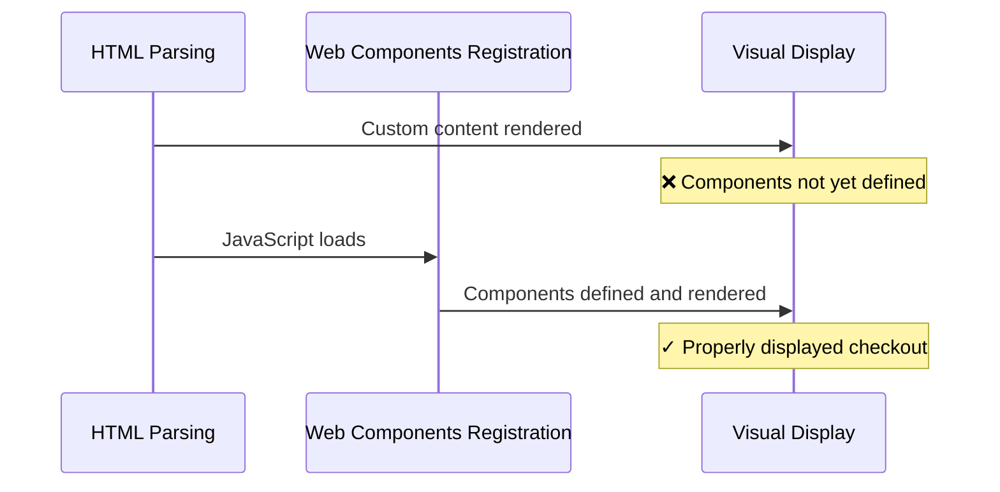

This is particularly noticeable when:

- You've added custom UI in slots
- The page loads and shows your custom content
- The components initialize and potentially hide or rearrange your content

<details>
<summary><strong>Solution: Hide components until ready</strong></summary>

To prevent this jarring visual experience, you can hide the components until they're fully defined:

```css
primer-checkout:has(:not(:defined)) {
  visibility: hidden;
}
```

This CSS rule hides the checkout container when it contains any undefined custom elements. Once all components are defined, the container becomes visible automatically. Using `visibility: hidden` instead of `display: none` preserves the layout space to minimize shifting when components appear.

For more complex implementations, you could also use JavaScript to detect when all components are ready:

```javascript
Promise.allSettled([
  customElements.whenDefined('primer-checkout'),
  customElements.whenDefined('primer-payment-method'),
  // Add other components you're using
]).then(() => {
  document.querySelector('.checkout-container').classList.add('ready');
});
```

</details>

## Handling Payment Failure Messages in Custom Layouts

When implementing custom layouts, you have two options for displaying payment failure messages:

1. Use the pre-built `<primer-error-message-container>` component
2. Implement custom error handling using the SDK events

### Option 1: Using the Error Message Container Component

The `<primer-error-message-container>` provides a convenient way to display payment failures without writing custom code:

```html
<!-- Approach 1: Using primer-main with custom content -->
<primer-checkout client-token="your-token">
  <primer-main slot="main">
    <div slot="payments">
      <!-- Your payment methods -->
      <primer-payment-method type="PAYMENT_CARD"></primer-payment-method>

      <!-- Include error message container for payment failure display -->
      <primer-error-message-container></primer-error-message-container>
    </div>
  </primer-main>
</primer-checkout>

<!-- Approach 2: Fully custom implementation -->
<primer-checkout client-token="your-token">
  <div slot="main" id="custom-checkout">
    <!-- Your completely custom checkout implementation -->
    <div id="payment-methods">
      <primer-payment-method type="PAYMENT_CARD"></primer-payment-method>

      <!-- Include error message container for payment failure messages -->
      <primer-error-message-container></primer-error-message-container>
    </div>
  </div>
</primer-checkout>
```

If using the error message container, for optimal user experience, place it:

1. Prominently where it will be visible after a payment attempt
2. Where users will naturally look for feedback after submitting payment
3. Within the same visual context as the payment method it relates to

### Option 2: Custom Payment Failure Handling

You can also implement your own payment failure handling using the SDK events:

```javascript
const checkout = document.querySelector('primer-checkout');

// Option 1: Listen for the dedicated payment failure event
checkout.addEventListener('primer-oncheckout-failure', (event) => {
  const { error, payment } = event.detail;

  // Display the payment failure using your own UI
  const customErrorElement = document.getElementById('my-custom-error');
  customErrorElement.textContent = error.message;
  customErrorElement.style.display = 'block';

  // Optionally, you can access partial payment data if available
  if (payment) {
    console.log('Partial payment data:', payment);
  }
});

// Option 2: Listen for checkout state changes
checkout.addEventListener('primer-state-changed', (event) => {
  const { error, failure } = event.detail;

  if (error || failure) {
    // Display the failure using your own UI
    const customErrorElement = document.getElementById('my-custom-error');
    customErrorElement.textContent = failure ? failure.message : error.message;
    customErrorElement.style.display = 'block';
  } else {
    // Hide error when not present
    document.getElementById('my-custom-error').style.display = 'none';
  }
});
```

This approach gives you complete control over payment failure presentation but requires you to implement the error handling logic yourself.

:::info Important Distinction
The `<primer-error-message-container>` specifically handles payment failures that occur after form submission, not card validation errors. Card validation is handled by the input components themselves and prevents form submission until valid.
:::

For more information about the error message container, see the Error Message Container Component documentation.

## Best Practices for Layout Customization

:::tip Best Practices Summary

1. **Use Named Slots Correctly** - Always use the correct slot names to ensure content appears where expected
2. **Listen for Relevant Events** - Handle checkout state through event listeners
3. **Maintain Visual Consistency** - Use CSS custom properties for styling
4. **Design Responsively** - Ensure your layout works on all device sizes
5. **Test Thoroughly** - Validate behavior across different payment methods and scenarios
6. **Prevent Component Flash** - Use CSS or JavaScript techniques to hide content until components are defined
7. **Handle Payment Failures** - Either use the `<primer-error-message-container>` component or implement custom payment failure handling using events
   :::

For detailed information on available components and their slots, refer to the component API documentation:

- Checkout Component
- Main Component
- Payment Method Component
- Error Message Container

## API Reference


---

<!-- Source: primer-checkout-doc (API Reference) -->

# Checkout Component

## \<primer-checkout\>

The `Checkout` component serves as the main container for all Primer payment components. It initializes the Primer SDK, manages the checkout state, and provides context to child components. This component can be used as a simple drop-in solution or as a foundation for a highly customized checkout experience.

## Usage

The Checkout component can be used in three ways:

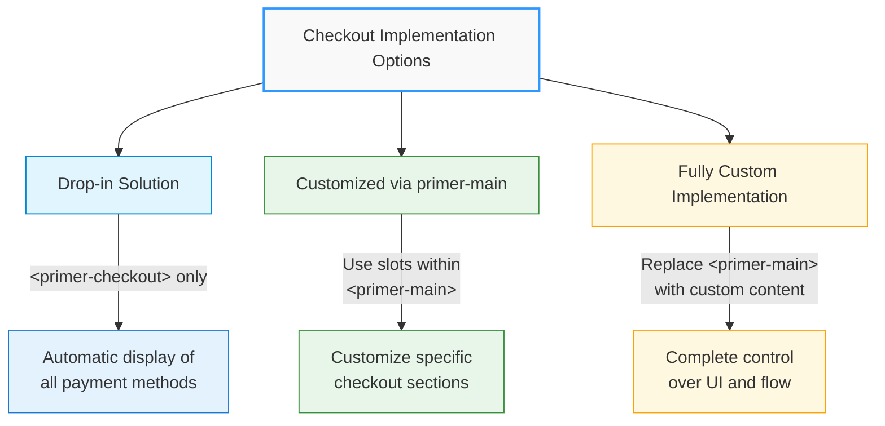

### 1. As a Drop-in Solution

Simply add the component with a client token to render a complete, ready-to-use checkout experience:

```html
<primer-checkout client-token="your-client-token"></primer-checkout>
```

This minimal implementation automatically displays all available payment methods with default styling and behavior.

### 2. With Customized primer-main Component

Use the optional `primer-main` component with slots to customize specific parts of the checkout experience:

```html
<primer-checkout client-token="your-client-token">
  <primer-main slot="main">
    <!-- Custom payment method layout -->
    <div slot="payments">
      <primer-payment-method type="PAYMENT_CARD"></primer-payment-method>
      <primer-payment-method type="PAYPAL"></primer-payment-method>
    </div>

    <!-- Custom completion screen -->
    <div slot="checkout-complete">
      <h2>Thank you for your purchase!</h2>
    </div>
  </primer-main>
</primer-checkout>
```

### 3. With Fully Custom Implementation

Replace the `primer-main` component entirely with your own custom implementation:

```html
<primer-checkout client-token="your-client-token">
  <!-- Custom implementation without using primer-main -->
  <div slot="main" id="custom-checkout">
    <h2>Select Payment Method</h2>
    <div class="payment-options">
      <primer-payment-method type="PAYMENT_CARD"></primer-payment-method>
    </div>
  </div>
</primer-checkout>
```

For comprehensive layout customization options, see the Layout Customizations Guide.

## Properties

| Attribute        | Type      | Description                                                                     | Default |
| ---------------- | --------- | ------------------------------------------------------------------------------- | ------- |
| `client-token`   | `String`  | Required. The client token obtained from your Primer backend integration.       | `''`    |
| `options`        | `Object`  | Optional. Configuration options for the Primer SDK.                             | `{}`    |
| `custom-styles`  | `String`  | Optional. Stringified JSON object containing CSS custom properties for styling. | `''`    |
| `disable-loader` | `Boolean` | Optional. When true, disables the default loading spinner.                      | `false` |

## Slots

| Name   | Description                                                                                                                                                                                                                                                  |
| ------ | ------------------------------------------------------------------------------------------------------------------------------------------------------------------------------------------------------------------------------------------------------------ |
| `main` | Main content slot for checkout components. If no content is provided, a default `<primer-main>` component is rendered with all available payment methods. You can provide either a `<primer-main>` component or your own custom implementation in this slot. |

## Events

| Event Name                       | Description                                      | Event Detail              |
| -------------------------------- | ------------------------------------------------ | ------------------------- |
| `primer-checkout-initialized`    | Fired when the SDK is successfully initialized   | SDK instance              |
| `primer-payment-methods-updated` | Fired when payment methods are loaded            | Available payment methods |
| `primer-state-changed`           | Fired when the checkout state changes            | Current state object      |
| `primer-card-network-change`     | Fired when card network detection changes        | Card network information  |
| `primer-card-submit-success`     | Fired when a card form is successfully submitted | Submission result         |
| `primer-card-submit-errors`      | Fired when card form submission has errors       | Validation errors         |
| `primer-oncheckout-complete`     | Fired when checkout is completed successfully    | Payment payload           |
| `primer-oncheckout-failure`      | Fired when checkout process fails                | Error details and payment |

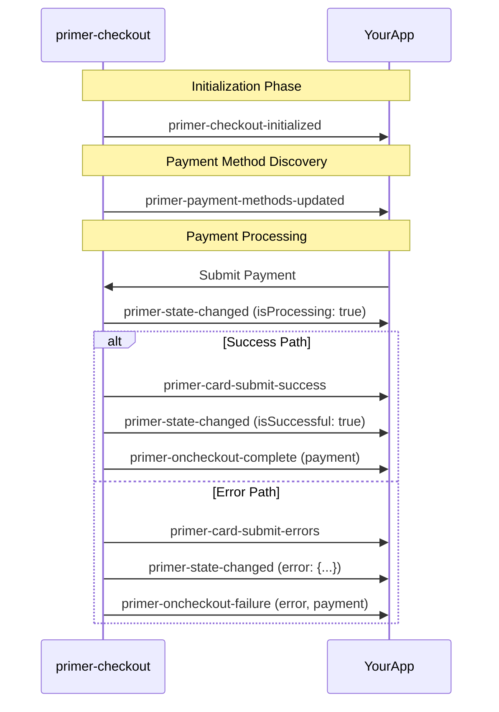

## SDK Options

:::caution Temporary Implementation
The current SDK options structure documented here is temporary and will be changing. We will be moving away from the JSON-based configuration approach as we progress with the migration of our Headless SDK.
:::

The `options` property accepts a configuration object for the Primer SDK. When used as an HTML attribute, it must be a stringified JSON object. Remember that stringified JSON must use double quotes for property names and string values.

Here's a comprehensive overview of the available options:

### Core Options

| Option       | Type                | Description                                                        | Default          |
| ------------ | ------------------- | ------------------------------------------------------------------ | ---------------- |
| `locale`     | `String`            | Forces the locale for UI elements. Formats: "en-US", "fr-FR", etc. | Browser's locale |
| `apiVersion` | `"legacy" \| "2.4"` | API version to use when interacting with Primer backend.           | `"legacy"`       |

### Payment Method-Specific Options

<details>
<summary><strong>Card Options</strong></summary>

Controls the behavior of card payment methods.

```javascript
{
  "card": {
    "cardholderName": {
      "required": true  // Whether the cardholder name is required
    },
    "allowedCardNetworks": ["visa", "mastercard", "amex"]  // Limit accepted card types
  }
}
```

</details>

<details>
<summary><strong>Apple Pay Options</strong></summary>

Configures Apple Pay payment behavior.

```javascript
{
  "applePay": {
    // Deprecated - use billingOptions.requiredBillingContactFields instead
    "captureBillingAddress": false,

    "billingOptions": {
      // Required billing information to collect during checkout
      "requiredBillingContactFields": ["postalAddress", "phoneNumber", "emailAddress"]
    },

    "shippingOptions": {
      // Required shipping information to collect during checkout
      "requiredShippingContactFields": ["postalAddress", "name", "phoneNumber", "emailAddress"]
    }
  }
}
```

</details>

<details>
<summary><strong>Google Pay Options</strong></summary>

Configures Google Pay payment behavior.

```javascript
{
  "googlePay": {
    "captureBillingAddress": false,  // Whether to prompt for billing address
    "buttonTheme": "dark",           // "dark" or "light" button theme
    "buttonType": "buy"              // "buy", "checkout", "order", "plain", etc.
  }
}
```

</details>

<details>
<summary><strong>PayPal Options</strong></summary>

Configures PayPal payment behavior.

```javascript
{
  "paypal": {
    "captureBillingAddress": false,  // Whether to capture billing address
    "captureShippingAddress": false  // Whether to capture shipping address
  }
}
```

</details>

### Example of Complete Options Object

Here's an example of a complete options object with various settings:

```html
<primer-checkout
  client-token="your-client-token"
  options='{"locale":"en-GB","apiVersion":"2.4","card":{"cardholderName":{"required":true},"allowedCardNetworks":["visa","mastercard","amex"]},"applePay":{"billingOptions":{"requiredBillingContactFields":["postalAddress","emailAddress"]}},"googlePay":{"captureBillingAddress":true,"buttonTheme":"dark"}}'
>
  <primer-main slot="main"></primer-main>
</primer-checkout>
```

When using JavaScript:

```javascript
const checkout = document.querySelector('primer-checkout');
checkout.options = {
  locale: 'en-GB',
  apiVersion: '2.4',
  card: {
    cardholderName: {
      required: true,
    },
    allowedCardNetworks: ['visa', 'mastercard', 'amex'],
  },
  applePay: {
    billingOptions: {
      requiredBillingContactFields: ['postalAddress', 'emailAddress'],
    },
  },
  googlePay: {
    captureBillingAddress: true,
    buttonTheme: 'dark',
  },
};
```

### Important Notes on JSON Formatting

:::warning
When passing options to the `primer-checkout` component as an HTML attribute:

1. The entire options object must be a valid JSON string (use `JSON.stringify()` in JavaScript)
2. Use double quotes (`"`) for property names and string values
3. Do not include trailing commas
4. Boolean values should be `true` or `false` (not strings)
   :::

<div class="tabs-container">
<div class="tabs">
<div class="tab incorrect">Incorrect ❌</div>
<div class="tab correct">Correct ✅</div>
</div>

<div class="tab-content incorrect">

```html
<!-- Invalid: Single quotes around property names, trailing comma -->
<primer-checkout
  options='{"locale": "en-GB", "apiVersion": "2.4",}'
></primer-checkout>
```

</div>

<div class="tab-content correct">

```html
<!-- Valid: Proper JSON formatting -->
<primer-checkout
  options='{"locale":"en-GB","apiVersion":"2.4"}'
></primer-checkout>
```

</div>
</div>

## States

The Checkout component manages several states:

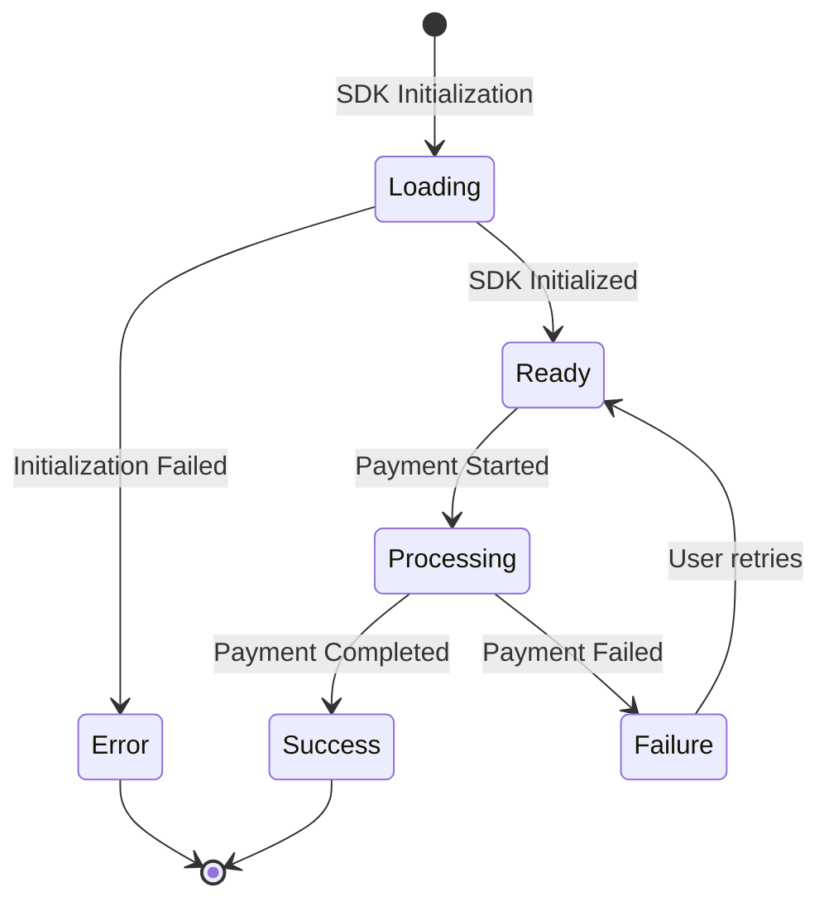

1. **Loading state**: During SDK initialization
2. **Error state**: When SDK initialization fails
3. **Ready state**: When SDK is initialized and ready to process payments
4. **Processing state**: During payment processing
5. **Success state**: When payment is completed successfully
6. **Failure state**: When payment processing fails

## CSS Custom Properties

Checkout Components use CSS Custom Properties (CSS Variables) to maintain a consistent design language across components. These tokens provide a standardized way to customize the appearance of your UI components.

You can apply tokens in two ways:

1. Using CSS Custom Properties directly in your stylesheets
2. Using JSON properties through the `custom-styles` attribute

<details>
<summary><strong>CSS Usage Example</strong></summary>

```css
/* Apply styling to all checkout components */
:root {
  --primer-color-brand: #2f98ff;
  --primer-radius-base: 4px;
  --primer-typography-brand: Inter, sans-serif;
  --primer-space-base: 4px;
  --primer-size-base: 4px;
  --primer-color-loader: #2f98ff;
  --primer-color-focus: #2f98ff;
}
```

</details>

<details>
<summary><strong>JSON Usage Example</strong></summary>

```html
<primer-checkout
  custom-styles='{"primerColorBrand":"#2f98ff","primerRadiusBase":"4px","primerTypographyBrand":"Inter, sans-serif","primerSpaceBase":"4px","primerSizeBase":"4px","primerColorLoader":"#2f98ff","primerColorFocus":"#2f98ff"}'
></primer-checkout>
```

</details>

:::tip
Choose the approach that best fits your project structure. The CSS approach offers more flexibility with selectors and media queries, while the JSON approach keeps styling concerns directly with the component instance.
:::

## Technical Implementation

The Checkout component:

1. **Initializes the Primer SDK** using the provided client token
2. **Manages locale settings** based on the options or falls back to browser default
3. **Provides context to child components** through various controllers
4. **Renders a default main component** when no content is provided
5. **Handles loading and error states** automatically

## Examples

<details>
<summary><strong>Basic Drop-in Implementation</strong></summary>

The simplest implementation with default behavior and styling:

```html
<primer-checkout client-token="your-client-token"></primer-checkout>
```

</details>

<details>
<summary><strong>Using primer-main with Customization</strong></summary>

```html
<primer-checkout client-token="your-client-token" options='{"locale":"en-GB"}'>
  <primer-main slot="main">
    <!-- Customize payment methods display -->
    <div slot="payments">
      <primer-payment-method type="PAYMENT_CARD"></primer-payment-method>
    </div>
  </primer-main>
</primer-checkout>
```

</details>

<details>
<summary><strong>Fully Custom Implementation</strong></summary>

```html
<primer-checkout client-token="your-client-token">
  <!-- Custom implementation without primer-main -->
  <div slot="main" class="custom-checkout">
    <h2>Complete Your Purchase</h2>
    <primer-payment-method type="PAYMENT_CARD"></primer-payment-method>
  </div>
</primer-checkout>
```

</details>

<details>
<summary><strong>With Custom Styling</strong></summary>

```html
<primer-checkout
  client-token="your-client-token"
  options='{"locale":"en-GB"}'
  custom-styles='{"primerColorBrand":"#4a6cf7","primerTypographyBrand":"Inter, sans-serif","primerRadiusBase":"4px","primerSpaceBase":"8px","primerSizeBase":"4px","primerColorLoader":"#4a6cf7","primerColorFocus":"#2f98ff"}'
>
  <primer-main slot="main"></primer-main>
</primer-checkout>
```

</details>

<details>
<summary><strong>With API Version and Card Options</strong></summary>

```html
<primer-checkout
  client-token="your-client-token"
  options='{"apiVersion":"2.4","locale":"en-GB","card":{"cardholderName":{"required":true}}}'
>
  <primer-main slot="main"></primer-main>
</primer-checkout>
```

</details>

<details>
<summary><strong>Complete Checkout with Event Handling</strong></summary>

```html
<primer-checkout
  id="checkout"
  client-token="your-client-token"
  options='{"locale":"en-GB"}'
>
  <primer-main slot="main">
    <div slot="payments">
      <!-- Custom payment methods layout -->
    </div>
    <div slot="checkout-complete">
      <h2>Thank you for your purchase!</h2>
      <p>Your order has been confirmed.</p>
    </div>
  </primer-main>
</primer-checkout>

<script>
  const checkout = document.getElementById('checkout');

  // Listen for payment methods loading
  checkout.addEventListener('primer-payment-methods-updated', (event) => {
    const paymentMethods = event.detail;
    console.log('Available payment methods:', paymentMethods.toArray());
  });

  // Listen for checkout state changes
  checkout.addEventListener('primer-state-changed', (event) => {
    const state = event.detail;
    if (state.isSuccessful) {
      console.log('Payment completed successfully');
    } else if (state.isProcessing) {
      console.log('Payment is processing');
    } else if (state.error) {
      console.error('Error:', state.error.message);
    }
  });

  // Listen for SDK initialization
  checkout.addEventListener('primer-checkout-initialized', (event) => {
    console.log('Checkout SDK initialized');
  });
</script>
```

</details>

<details>
<summary><strong>Dynamically Setting Options in JavaScript</strong></summary>

```html
<primer-checkout id="checkout" client-token="your-client-token">
  <primer-main slot="main"></primer-main>
</primer-checkout>

<script>
  const checkout = document.getElementById('checkout');

  // Set options directly as an object
  checkout.options = {
    locale: 'en-GB',
    apiVersion: '2.4',
    card: {
      cardholderName: {
        required: true,
      },
    },
  };
</script>
```

</details>

## Locale Support

The Checkout component supports internationalization through the `locale` option. Set the desired locale in the options object:

```html
<primer-checkout client-token="your-client-token" options='{"locale":"fr-FR"}'>
  <primer-main slot="main"></primer-main>
</primer-checkout>
```

The full list of supported locales can be found in the [Localization and languages
section](https://primer.io/docs/payments/universal-checkout/drop-in/customize-checkout/web#localization-and-languages).

:::note
If an unsupported locale is provided, the component will fall back to the default 'en-GB' locale with a warning message in the console.
:::

:::warning
At present the Checkout Components only support left-to-right (LTR) languages.
:::

## Disable Loader Option

You can disable the default loading spinner that appears during SDK initialization by using the `disable-loader` attribute:

```html
<primer-checkout client-token="your-client-token" disable-loader>
  <primer-main slot="main"></primer-main>
</primer-checkout>
```

This is useful when you want to implement your own custom loading indicator or when integrating the checkout into a page that already has a loader.

## Key Considerations

:::info Summary of Key Points

- The Checkout component functions as a complete checkout solution out of the box, requiring only a client token
- Without custom layout, the component automatically displays all available payment methods
- The `primer-main` component is optional - you can provide your own custom implementation in the `main` slot
- When using a custom implementation instead of `primer-main`, you'll need to listen to checkout events to handle different checkout states
- For custom layouts, use the `main` slot to provide your own content configuration
- The component automatically handles loading states and error messages
- All Primer payment components must be used within the Checkout component
- Unsupported locales will fall back to 'en-GB' with a console warning
- When using the `options` property directly in JavaScript, you can pass it as an object; when using it as an HTML attribute, it must be a stringified JSON object
- The `custom-styles` attribute accepts a stringified JSON object with camelCase property names that map to kebab-case CSS variables
  :::

For advanced customization, refer to the Layout Customizations Guide.

---

<!-- Source: primer-main-doc (API Reference) -->

# Main Component

## \<primer-main\>

The `primer-main` component serves as an optional container for payment methods within the checkout flow. Similar to an HTML `<main>` tag that signals the main content of a page, `primer-main` acts as the main container of your checkout application, providing organized structure for different checkout states.

This component manages the display of payment options and checkout completion states through a flexible slot system, but developers can choose to bypass it entirely for fully custom implementations.

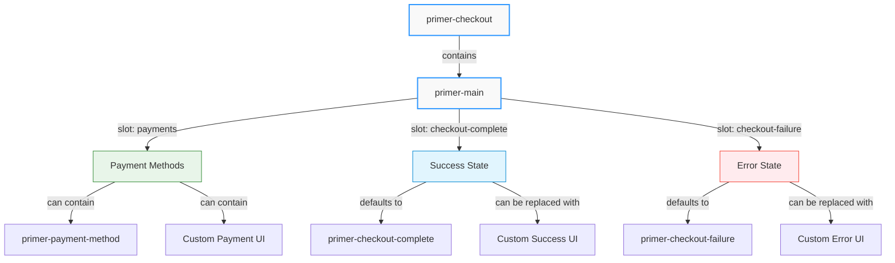

## Usage

<div class="tabs-container">
<div class="tabs">
<div class="tab default active">Basic Usage (Default Layout)</div>
<div class="tab custom">Custom Layout</div>
<div class="tab bypass">Bypassing primer-main</div>
</div>

<div class="tab-content default active">

```html
<primer-checkout client-token="your-client-token">
  <primer-main slot="main"></primer-main>
</primer-checkout>
```

This renders a complete list of all available payment methods automatically.

</div>

<div class="tab-content custom">

```html
<primer-checkout client-token="your-client-token">
  <primer-main slot="main">
    <div slot="payments">
      <primer-payment-method type="PAYMENT_CARD"></primer-payment-method>
      <primer-payment-method type="PAYPAL"></primer-payment-method>
    </div>
  </primer-main>
</primer-checkout>
```

</div>

<div class="tab-content bypass">

```html
<primer-checkout client-token="your-client-token">
  <div slot="main">
    <!-- Your completely custom checkout implementation -->
    <div class="payment-selection">
      <h2>Select Payment Method</h2>
      <primer-payment-method type="PAYMENT_CARD"></primer-payment-method>
    </div>
  </div>
</primer-checkout>
```

</div>
</div>

## Slots

| Name                | Description                                                                                                  |
| ------------------- | ------------------------------------------------------------------------------------------------------------ |
| `payments`          | Custom content slot for payment methods. When provided, it replaces the default payment methods list.        |
| `checkout-complete` | Custom content slot for the checkout completion state. Defaults to the `primer-checkout-complete` component. |
| `checkout-failure`  | Custom content slot for the checkout failure state. Defaults to the `primer-checkout-failure` component.     |

:::info
If you don't provide content for these slots, the component will use default implementations that handle common checkout scenarios automatically.
:::

## States

The Main component automatically manages different checkout states:

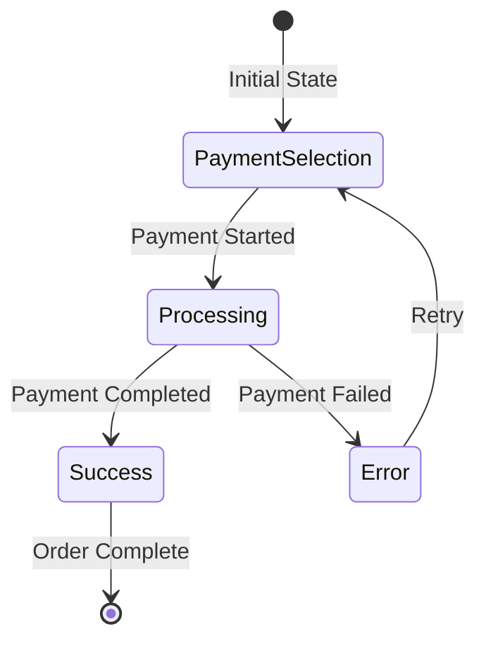

1. **Default state**: Displays payment methods
2. **Success state**: Displays checkout completion content when the payment is successful
3. **Error state**: Displays checkout failure content when an error occurs
4. **Processing state**: Applies visual feedback when the checkout is processing

:::tip
When using `primer-main`, you don't need to manually handle state transitions - the component listens to events from `primer-checkout` and updates the UI accordingly.
:::

## CSS Custom Properties

The Main component uses the following CSS custom properties for styling:

| Property               | Description                                           |
| ---------------------- | ----------------------------------------------------- |
| `--primer-space-small` | Spacing between payment method items (default: `8px`) |

## Examples

<details>
<summary><strong>Custom Completion State</strong></summary>

```html
<primer-checkout client-token="your-client-token">
  <primer-main slot="main">
    <div slot="checkout-complete">
      <h2>Thank you for your order!</h2>
      <p>Your payment has been processed successfully.</p>
      <button onclick="window.location.href='/orders'">View Your Orders</button>
    </div>
  </primer-main>
</primer-checkout>
```

This example shows how to create a custom success screen that appears after a successful payment, with a button that redirects customers to their orders page.

</details>

<details>
<summary><strong>Custom Error State</strong></summary>

```html
<primer-checkout client-token="your-client-token">
  <primer-main slot="main">
    <div slot="checkout-failure">
      <h2>Something went wrong</h2>
      <p>We couldn't process your payment. Please try again.</p>
      <button onclick="window.location.reload()">Try Again</button>
    </div>
  </primer-main>
</primer-checkout>
```

This example demonstrates how to create a custom error screen that appears when a payment fails, with a button that reloads the page for the customer to try again.

</details>

<details>
<summary><strong>Combined Custom Layout Example</strong></summary>

```html
<primer-checkout client-token="your-client-token">
  <primer-main slot="main">
    <!-- Custom payment methods layout -->
    <div slot="payments">
      <h2>Choose how you'd like to pay</h2>
      <div class="payment-options">
        <primer-payment-method type="PAYMENT_CARD"></primer-payment-method>
        <primer-payment-method type="PAYPAL"></primer-payment-method>
      </div>
    </div>

    <!-- Custom success state -->
    <div slot="checkout-complete">
      <h2>Thank you for your order!</h2>
      <p>Your payment has been processed successfully.</p>
      <button onclick="window.location.href='/orders'">View Your Orders</button>
    </div>

    <!-- Custom error state -->
    <div slot="checkout-failure">
      <h2>Something went wrong</h2>
      <p>We couldn't process your payment. Please try again.</p>
      <button onclick="window.location.reload()">Try Again</button>
    </div>
  </primer-main>
</primer-checkout>
```

This comprehensive example shows how to customize all three main slots within the `primer-main` component, creating a fully customized checkout experience while still leveraging the component's built-in state management.

</details>

## Key Considerations

:::info Summary

- `primer-main` is an optional component that acts as a structured container within the `primer-checkout` component
- When used, it automatically handles checkout completion and error states through its slot system
- It can be bypassed entirely by placing custom content directly in the `main` slot of `primer-checkout`
- For custom implementations without `primer-main`, you'll need to listen to checkout state events to manage different states
- The component must be used within a `primer-checkout` component when employed
  :::

```mermaid
sequenceDiagram
    participant Checkout as primer-checkout
    participant Main as primer-main
    participant PaymentMethod as primer-payment-method

    Note over Checkout,PaymentMethod: Initialization Phase
    Checkout->>Main: Render inside main slot
    Main->>PaymentMethod: Render payment methods

    Note over Checkout,PaymentMethod: Payment Processing
    PaymentMethod->>Checkout: Submit payment
    Checkout->>Main: Update state (isProcessing)
    Main->>Main: Show processing indicators

    alt Payment Successful
        Checkout->>Main: Update state (isSuccessful)
        Main->>Main: Show checkout-complete slot
    else Payment Failed
        Checkout->>Main: Update state (error)
        Main->>Main: Show checkout-failure slot
    end
```

---

<!-- Source: components-index (API Reference) -->

# API Components Index

This document provides a complete list of all the components that have been documented in the SDK, organized by categories.

## Main Components

- Primer Main - The main entry point for the SDK
- Primer Checkout - The checkout component for handling payment flows
- Vault Manager - Component for managing saved payment methods
- Payment Method - Component for displaying payment method options
- Show Other Payments - Component for displaying alternative payment methods
- Error Message Container - Component for displaying error messages

## Card Form Components

- Card Form - Container component for card form elements
- Card Form Name - Input field for cardholder name
- Card Form Card Number - Input field for card number
- Card Form Expiry - Input field for card expiration date
- Card Form CVV - Input field for card security code
- Card Form Submit - Submit button for card form

## Base Components

- Base Components Overview - Overview of base UI components
- Button Component - Reusable button component
- Input Component - Base input field component
- Input Label - Label component for input fields
- Input Wrapper - Wrapper component for input fields
- Input Error - Component for displaying input validation errors

## Styling

- Styling API - Documentation on how to customize component styling

---

<!-- Source: payment-method-doc (API Reference) -->

# Payment Method Component

## \<primer-payment-method\>

The `PaymentMethod` component renders the appropriate payment interface based on the specified payment method type. It automatically handles different payment method categories and only displays methods that are available in your checkout configuration.

```mermaid
flowchart TD
    A[primer-payment-method] -->|type attribute| B{Is Payment<br>Method Available?}
    B -->|Yes| C[Render Payment UI]
    B -->|No| D[Render Nothing]

    C -->|PAYMENT_CARD| E[Card Payment Form]
    C -->|APPLE_PAY| F[Apple Pay Button]
    C -->|GOOGLE_PAY| G[Google Pay Button]
    C -->|PAYPAL| H[PayPal Button]
    C -->|Other Methods| I[Method-specific UI]

    style A fill:#f9f9f9,stroke:#2f98ff,stroke-width:2px
    style B fill:#fff8e1,stroke:#ffa000,stroke-width:1px
    style C fill:#e8f5e9,stroke:#388e3c,stroke-width:1px
    style D fill:#ffebee,stroke:#f44336,stroke-width:1px
```

## Usage

```html
<primer-checkout client-token="your-client-token">
  <primer-main slot="main">
    <div slot="payments">
      <primer-payment-method type="PAYMENT_CARD"></primer-payment-method>
      <primer-payment-method type="PAYPAL"></primer-payment-method>
      <primer-payment-method type="GOOGLE_PAY"></primer-payment-method>
    </div>
  </primer-main>
</primer-checkout>
```

## Properties

| Name   | Type     | Description                                                         | Default     |
| ------ | -------- | ------------------------------------------------------------------- | ----------- |
| `type` | `String` | The payment method type identifier (e.g., "PAYMENT_CARD", "PAYPAL") | `undefined` |

## Key Concepts

### Configuration-Based Rendering

The `primer-payment-method` component only renders payment methods that are:

```mermaid
flowchart LR
    A[Payment Method<br>Request] --> B{Specified by<br>type attribute?}
    B -->|No| F[Won't Render]
    B -->|Yes| C{Available in<br>configuration?}
    C -->|No| F
    C -->|Yes| D{Returned by<br>server?}
    D -->|No| F
    D -->|Yes| E[Render Payment<br>Method]

    style A fill:#e1f5fe,stroke:#0288d1,stroke-width:1px
    style B fill:#fff8e1,stroke:#ffa000,stroke-width:1px
    style C fill:#fff8e1,stroke:#ffa000,stroke-width:1px
    style D fill:#fff8e1,stroke:#ffa000,stroke-width:1px
    style E fill:#e8f5e9,stroke:#388e3c,stroke-width:1px
    style F fill:#ffebee,stroke:#f44336,stroke-width:1px
```

1. **Specified by the type attribute** - You declare which payment method you want to display
2. **Available in your checkout configuration** - The method must be enabled in your Primer Checkout Builder settings
3. **Returned by the server** - The method must be returned in the available payment methods list

:::tip
If a payment method isn't available (not configured or not returned by the server), the component simply won't render anything rather than showing an error. This makes it safe to include multiple payment method components even if some methods might not be available in all contexts.
:::

### Dynamic Payment Method Discovery

The best way to work with payment methods is to listen for the `primer-payment-methods-updated` event, which provides the complete list of available payment methods for your checkout configuration. This approach lets you dynamically render only the methods that are actually available.

```mermaid
sequenceDiagram
    participant Checkout as primer-checkout
    participant YourApp
    participant PaymentMethod as primer-payment-method

    Checkout->>YourApp: primer-payment-methods-updated
    Note right of YourApp: Get available methods
    YourApp->>YourApp: Process available methods
    YourApp->>PaymentMethod: Create components for<br>available methods
```

## Examples

<details>
<summary><strong>Best Practice: Dynamic Payment Method Rendering</strong></summary>

This example shows how to listen for available payment methods and dynamically render them:

```html
<primer-checkout id="checkout" client-token="your-client-token">
  <primer-main slot="main">
    <div slot="payments" id="payment-methods-container">
      <!-- Payment methods will be inserted here -->
    </div>
  </primer-main>
</primer-checkout>

<script>
  const checkout = document.getElementById('checkout');

  checkout.addEventListener('primer-payment-methods-updated', (event) => {
    const paymentMethods = event.detail;
    const container = document.getElementById('payment-methods-container');

    // Clear previous content
    container.innerHTML = '';

    // Render all available payment methods
    paymentMethods.toArray().forEach((method) => {
      container.innerHTML += `
        <div class="payment-method-item">
          <primer-payment-method type="${method.type}"></primer-payment-method>
        </div>
      `;
    });
  });
</script>
```

</details>

<details>
<summary><strong>Custom Layout with Priority Ordering</strong></summary>

This example shows how to create a custom layout where certain payment methods are prioritized:

```html
<primer-checkout id="checkout" client-token="your-client-token">
  <primer-main slot="main">
    <div slot="payments">
      <!-- Prioritize card payment (only displays if available) -->
      <div class="primary-payment-method">
        <primer-payment-method type="PAYMENT_CARD"></primer-payment-method>
      </div>

      <!-- Digital wallets section -->
      <div id="wallets-container" class="payment-section">
        <h3>Quick Checkout</h3>
        <div class="wallet-methods">
          <primer-payment-method type="APPLE_PAY"></primer-payment-method>
          <primer-payment-method type="GOOGLE_PAY"></primer-payment-method>
        </div>
      </div>

      <!-- Other methods will be dynamically added here -->
      <div id="other-methods-container" class="payment-section"></div>
    </div>
  </primer-main>
</primer-checkout>

<script>
  const checkout = document.getElementById('checkout');

  // Define payment method categories
  const walletTypes = ['APPLE_PAY', 'GOOGLE_PAY'];
  const priorityTypes = ['PAYMENT_CARD', 'APPLE_PAY', 'GOOGLE_PAY'];

  checkout.addEventListener('primer-payment-methods-updated', (event) => {
    const paymentMethods = event.detail;
    const allMethods = paymentMethods.toArray();
    const otherContainer = document.getElementById('other-methods-container');
    const walletsContainer = document.getElementById('wallets-container');

    // Check if any wallet methods are available
    const hasWallets = allMethods.some((method) =>
      walletTypes.includes(method.type),
    );

    // Hide wallets container if no wallet methods are available
    if (!hasWallets) {
      walletsContainer.style.display = 'none';
    }

    // Add other payment methods (excluding priority ones)
    const otherMethods = allMethods.filter(
      (method) => !priorityTypes.includes(method.type),
    );

    if (otherMethods.length > 0) {
      otherContainer.innerHTML = '<h3>Other Payment Options</h3>';

      otherMethods.forEach((method) => {
        otherContainer.innerHTML += `
          <div class="payment-method-item">
            <primer-payment-method type="${method.type}"></primer-payment-method>
          </div>
        `;
      });
    } else {
      otherContainer.style.display = 'none';
    }
  });
</script>
```

</details>

<details>
<summary><strong>Custom Payment Method with Options Configuration</strong></summary>

```html
<primer-checkout id="checkout" client-token="your-client-token">
  <primer-main slot="main">
    <div slot="payments">
      <primer-payment-method type="PAYMENT_CARD"></primer-payment-method>
    </div>
  </primer-main>
</primer-checkout>

<script>
  const checkout = document.getElementById('checkout');

  // Configure card payment options
  checkout.options = {
    card: {
      cardholderName: {
        required: true,
      },
      allowedCardNetworks: ['visa', 'mastercard', 'amex'],
    },
  };
</script>
```

</details>

## Available Payment Method Types

The Primer SDK supports a wide range of payment methods. Here are some of the commonly used types:

<div class="tabs-container">
<div class="tabs">
<div class="tab core active">Core Payment Types</div>
<div class="tab banking">Online Banking</div>
<div class="tab bnpl">Buy Now, Pay Later</div>
<div class="tab regional">Regional Methods</div>
<div class="tab crypto">Cryptocurrency</div>
</div>

<div class="tab-content core active">

- `PAYMENT_CARD` - Standard card payments
- `APPLE_PAY` - Apple Pay
- `GOOGLE_PAY` - Google Pay
- `PAYPAL` - PayPal payments
- `KLARNA` - Klarna payments

</div>

<div class="tab-content banking">

- Various iDEAL implementations: `ADYEN_IDEAL`, etc.
- SOFORT implementations: `ADYEN_SOFORT`, `MOLLIE_SOFORT`, `PAY_NL_SOFORT_BANKING`, etc.

</div>

<div class="tab-content bnpl">

- `CLEARPAY` - Clearpay/Afterpay
- `HOOLAH` - Hoolah
- `ATOME` - Atome

</div>

<div class="tab-content regional">

- Multiple Bancontact implementations: `ADYEN_BANCONTACT_CARD`, `PAY_NL_BANCONTACT`, etc.
- GiroPay implementations: `ADYEN_GIROPAY`, `BUCKAROO_GIROPAY`, etc.
- Regional wallets: `RAPYD_GRABPAY`, `XENDIT_DANA`, etc.

</div>

<div class="tab-content crypto">

- `COINBASE` - Coinbase cryptocurrency payments
- `OPENNODE` - OpenNode Bitcoin payments

</div>
</div>

:::important Web Headless Support
At the moment, the Checkout Components support only payment methods that are compatible with Primer's Web Headless SDK. Before implementing any payment method through Checkout Components, developers should reference the [Available Payment Methods](https://primer.io/docs/payment-methods/available-payment-methods) documentation, which provides detailed information about which payment methods are supported in which regions and integrations.

The actual availability of payment methods depends on your Primer account configuration, merchant location, and the customer's country. The component will only render payment methods that are both specified in your code AND available in your checkout configuration.
:::

## Configuring Payment Methods

Each payment method type can be configured through the `options` property of the `primer-checkout` component:

```html
<primer-checkout id="checkout" client-token="your-client-token">
  <primer-main slot="main">
    <div slot="payments">
      <primer-payment-method type="PAYMENT_CARD"></primer-payment-method>
      <primer-payment-method type="GOOGLE_PAY"></primer-payment-method>
    </div>
  </primer-main>
</primer-checkout>

<script>
  document.getElementById('checkout').options = {
    // Card payment configuration
    card: {
      cardholderName: {
        required: true,
      },
    },

    // Google Pay configuration
    googlePay: {
      buttonTheme: 'dark',
      buttonType: 'buy',
    },
  };
</script>
```

## Key Considerations

:::info Summary

- Payment methods must be configured in your Primer Checkout Builder settings to be displayed
- If a payment method is specified but not available, the component won't render anything (no error)
- The component automatically determines which payment interface to render based on the payment method's type
- Always listen to the `primer-payment-methods-updated` event to get the current list of available payment methods
- The component must be used within a `primer-checkout` context to access payment methods
  :::

---

<!-- Source: card-form-card-number-docs (API Reference) -->

# Card Number Input Component

## \<primer-input-card-number\>

The Card Number Input component provides a secure, PCI-compliant field for collecting payment card numbers. It automatically detects and displays the card network (like Visa, Mastercard) as the user types, and supports validation.

```mermaid
flowchart TD
    A[primer-input-card-number] --> B[Secure Input Field]
    A --> C[Card Network Detection]
    A --> D[Validation]
    C --> E[Network Display]
    D --> F[Error Handling]

    style A fill:#f9f9f9,stroke:#2f98ff,stroke-width:2px
    style B fill:#e1f5fe,stroke:#0288d1,stroke-width:1px
    style C fill:#e1f5fe,stroke:#0288d1,stroke-width:1px
    style D fill:#e1f5fe,stroke:#0288d1,stroke-width:1px
    style E fill:#e8f5e9,stroke:#388e3c,stroke-width:1px
    style F fill:#e8f5e9,stroke:#388e3c,stroke-width:1px
```

This component extends the abstract card input class used by all card form inputs, providing consistent behavior and styling.

## Usage

The Card Number Input component must be used within a `primer-card-form` container:

```html
<primer-card-form>
  <primer-input-card-number></primer-input-card-number>
</primer-card-form>
```

## Properties

| Attribute     | Type     | Default               | Description                                |
| ------------- | -------- | --------------------- | ------------------------------------------ |
| `label`       | `string` | "Card Number"         | The label displayed above the input        |
| `placeholder` | `string` | "4111 1111 1111 1111" | Placeholder text shown when input is empty |
| `aria-label`  | `string` | "Card Number"         | Accessibility label for screen readers     |

### Property Behavior

<div class="property-behavior">

- **`label`**: If not explicitly set, uses the localized default value ("Card Number"). If set to an empty string `""`, reverts to the default.
- **`placeholder`**: If not explicitly set, uses the default value ("4111 1111 1111 1111"). If explicitly set to an empty string `""`, no placeholder will be displayed.
- **`aria-label`**: If not explicitly set, uses the value of `label`. If explicitly set to an empty string `""`, reverts to the value of `label`.

</div>

## Technical Implementation

```mermaid
sequenceDiagram
    participant CardNumber as primer-input-card-number
    participant Context as Card Form Context
    participant NetworkSelector as primer-card-network-selector

    Note over CardNumber: Component initialization
    CardNumber->>Context: Connect to context
    Context->>CardNumber: Provide hosted input

    Note over CardNumber: User enters card number
    CardNumber->>NetworkSelector: Update card digits
    NetworkSelector->>NetworkSelector: Detect network
    NetworkSelector->>CardNumber: Emit network-selected
    CardNumber->>Context: Update card network

    Note over CardNumber: Validation
    Context->>CardNumber: Validation state changes
    CardNumber->>CardNumber: Display error if needed
```

The Card Number Input component:

1. **Connects to the card form context** to access validation state and hosted inputs
2. **Uses `display: contents`** to seamlessly integrate with parent layout without creating a new box in the DOM
3. **Automatically handles validation** by detecting errors from the card form context
4. **Includes a card network selector** component that automatically identifies card types
5. **Updates the card form context** when card network changes are detected

## DOM Structure

:::caution Important
The `<primer-card-network-selector>` component is not meant to be used independently. It's designed specifically to work within the `<primer-input-card-number>` component and will not function properly as a standalone component.
:::

The component renders the following DOM structure:

```html
<primer-input-wrapper>
  <primer-input-label slot="label">Card Number</primer-input-label>
  <div slot="input" class="card-number-container">
    <div id="cardNumber">
      <!-- Secure input field rendered here -->
    </div>
    <div class="network-selector-container">
      <primer-card-network-selector></primer-card-network-selector>
    </div>
  </div>
  <!-- Error message appears here when validation fails -->
</primer-input-wrapper>
```

## Events

This component doesn't emit custom events directly, but it listens for the `network-selected` event from the `primer-card-network-selector` component and updates the card form context accordingly.

## CSS Custom Properties

| Property               | Description                                                                 |
| ---------------------- | --------------------------------------------------------------------------- |
| `--primer-space-small` | Spacing between the card number input and network selector (default: `8px`) |

## Examples

<div class="tabs-container">
<div class="tabs">
<div class="tab basic active">Basic Usage</div>
<div class="tab custom">Custom Labels</div>
<div class="tab no-placeholder">No Placeholder</div>
<div class="tab complete">Complete Form</div>
</div>

<div class="tab-content basic active">

```html
<primer-card-form>
  <primer-input-card-number></primer-input-card-number>
</primer-card-form>
```

</div>

<div class="tab-content custom">

```html
<primer-card-form>
  <primer-input-card-number
    label="Credit Card Number"
    placeholder="Enter your card number"
    aria-label="Your credit card number"
  >
  </primer-input-card-number>
</primer-card-form>
```

</div>

<div class="tab-content no-placeholder">

```html
<primer-card-form>
  <primer-input-card-number label="Card Number" placeholder="">
  </primer-input-card-number>
</primer-card-form>
```

</div>

<div class="tab-content complete">

```html
<primer-card-form>
  <div slot="card-form-content">
    <primer-input-card-number></primer-input-card-number>
    <div style="display: flex; gap: 8px;">
      <primer-input-card-expiry></primer-input-card-expiry>
      <primer-input-cvv></primer-input-cvv>
    </div>
    <primer-input-card-holder-name></primer-input-card-holder-name>
    <button type="submit">Pay Now</button>
  </div>
</primer-card-form>
```

</div>
</div>

## Card Network Detection

```mermaid
flowchart LR
    A[User Input] -->|"4xxxxxxx..."| B[Network Detection]
    A -->|"5xxxxxxx..."| B
    A -->|"3xxxxxxx..."| B
    B -->|Visa| C[Display Visa Logo]
    B -->|Mastercard| D[Display Mastercard Logo]
    B -->|Amex| E[Display Amex Logo]
    B -->|Unknown| F[Display Generic Card Icon]

    style A fill:#e1f5fe,stroke:#0288d1,stroke-width:1px
    style B fill:#fff8e1,stroke:#ffa000,stroke-width:1px
    style C fill:#e8f5e9,stroke:#388e3c,stroke-width:1px
    style D fill:#e8f5e9,stroke:#388e3c,stroke-width:1px
    style E fill:#e8f5e9,stroke:#388e3c,stroke-width:1px
    style F fill:#ffebee,stroke:#f44336,stroke-width:1px
```

The component automatically detects the card network (Visa, Mastercard, American Express, etc.) as the user enters the card number. When a network is detected:

1. The card network selector displays the appropriate card logo
2. The card form context is updated with the detected network
3. Input formatting adjusts according to the card type (e.g., different spacing for Amex)

## Key Considerations

:::info Component Dependencies

- The Card Number Input component must be placed inside a `primer-card-form` component
- It automatically includes a card network selector that shows detected card types
  :::

:::tip Implementation Details

- Input validation happens automatically when the form is submitted
- Validation errors are displayed below the input field when they occur
- The component uses a flex layout to position the card number input and network selector side by side
- The `network-selector-container` has a higher z-index to ensure proper visibility
  :::

:::caution Important Restriction
The `<primer-card-network-selector>` component is not meant to be used outside of `<primer-input-card-number>` and will not work as a standalone component
:::

---

<!-- Source: card-form-cvv-docs (API Reference) -->

# CVV Input Component

## \<primer-input-cvv\>

The CVV Input component provides a secure, PCI-compliant field for collecting payment card security codes (CVV/CVC). It integrates with the card form validation system and maintains a consistent user experience.

```mermaid
flowchart TD
    A[primer-input-cvv] --> B[Secure Iframe Input]
    A --> C[Validation Integration]
    A --> D[Focus Management]
    B --> E[PCI-Compliant Entry]
    C --> F[Error Handling]
    D --> G[Visual State Updates]

    style A fill:#f9f9f9,stroke:#2f98ff,stroke-width:2px
    style B fill:#e1f5fe,stroke:#0288d1,stroke-width:1px
    style C fill:#e1f5fe,stroke:#0288d1,stroke-width:1px
    style D fill:#e1f5fe,stroke:#0288d1,stroke-width:1px
    style E fill:#e8f5e9,stroke:#388e3c,stroke-width:1px
    style F fill:#e8f5e9,stroke:#388e3c,stroke-width:1px
    style G fill:#e8f5e9,stroke:#388e3c,stroke-width:1px
```

This component extends the `AbstractCardInputComponent` class and uses a secure iframe-based input for PCI compliance.

## Usage

The CVV Input component must be used within a `primer-card-form` container:

```html
<primer-card-form>
  <primer-input-cvv></primer-input-cvv>
</primer-card-form>
```

## Properties

| Property      | Attribute     | Type     | Default | Description                                |
| ------------- | ------------- | -------- | ------- | ------------------------------------------ |
| `label`       | `label`       | `string` | "CVV"   | The label displayed above the input        |
| `placeholder` | `placeholder` | `string` | "123"   | Placeholder text shown when input is empty |
| ``            | `aria-label`  | `string` | "CVV"   | Accessibility label for screen readers     |

### Property Behavior

<div class="property-behavior">

- **`label`**: If not explicitly set, uses the localized default value ("CVV"). If set to an empty string `""`, reverts to the default.
- **`placeholder`**: If not explicitly set, uses the default value ("123"). When explicitly set to an empty string `""`, no placeholder will be displayed.
- **`aria-label`**: If not explicitly set, uses the value of `label`. If explicitly set to an empty string `""`, reverts to using the `label` value.

</div>

## Technical Implementation

```mermaid
sequenceDiagram
    participant CVV as primer-input-cvv
    participant Context as Card Form Context
    participant Wrapper as primer-input-wrapper

    Note over CVV: Component initialization
    CVV->>Context: Connect to context
    Context->>CVV: Provide hosted input

    Note over CVV: Input focus
    CVV->>Wrapper: Update focus state

    Note over CVV: Validation
    Context->>CVV: Validation state changes
    CVV->>CVV: Display error if needed
```

The CVV Input component:

1. **Connects to the card form context** to access validation state and hosted inputs
2. **Uses `display: contents`** to seamlessly integrate with parent layout without creating a new box in the DOM
3. **Automatically handles validation** by detecting errors from the card form context

## Events

This component doesn't emit custom events directly. Card validation events are handled through the parent `primer-card-form` component. Internal focus and blur events are captured to manage visual states.

## DOM Structure

The component renders the following DOM structure:

```html
<primer-input-wrapper>
  <primer-input-label slot="label">CVV</primer-input-label>
  <div slot="input" id="cvv">
    <!-- Secure iframe-based input rendered here -->
  </div>
  <!-- Error message appears here when validation fails -->
</primer-input-wrapper>
```

## Examples

<div class="tabs-container">
<div class="tabs">
<div class="tab basic active">Basic Usage</div>
<div class="tab custom">Custom Labels</div>
<div class="tab inline">Inline with Expiry</div>
</div>

<div class="tab-content basic active">

```html
<primer-card-form>
  <primer-input-cvv></primer-input-cvv>
</primer-card-form>
```

</div>

<div class="tab-content custom">

```html
<primer-card-form>
  <primer-input-cvv
    label="Security Code"
    placeholder="CVV"
    aria-label="Your card's security code"
  >
  </primer-input-cvv>
</primer-card-form>
```

</div>

<div class="tab-content inline">

```html
<primer-card-form>
  <div slot="card-form-content">
    <primer-input-card-number></primer-input-card-number>
    <div style="display: flex; gap: 8px;">
      <primer-input-card-expiry></primer-input-card-expiry>
      <primer-input-cvv></primer-input-cvv>
    </div>
    <button type="submit">Pay Now</button>
  </div>
</primer-card-form>
```

</div>
</div>

## Key Considerations

:::info Component Dependencies

- The CVV Input component must be placed inside a `primer-card-form` component
- For best UI experience, consider pairing this component with `primer-input-card-expiry` in a flex layout
  :::

:::tip Implementation Details

- Input validation happens automatically when the form is submitted
- Validation errors are displayed below the input field when they occur
- The component handles focus events internally to update the wrapper's visual state
  :::

:::caution Security Note
The CVV input is rendered in a secure iframe to prevent exposure of sensitive payment details, ensuring PCI compliance
:::

---

<!-- Source: card-form-expiry-docs (API Reference) -->

# Card Expiry Input Component

## \<primer-input-card-expiry\>

The Card Expiry Input component provides a secure, PCI-compliant field for collecting payment card expiration dates. It formats the input automatically as MM/YY and integrates with the card form validation system.

```mermaid
flowchart TD
    A[primer-input-card-expiry] --> B[Secure Input Field]
    A --> C[Auto-Formatting]
    A --> D[Validation]
    C --> E[MM/YY Pattern]
    D --> F[Date Validation]
    D --> G[Error Handling]

    style A fill:#f9f9f9,stroke:#2f98ff,stroke-width:2px
    style B fill:#e1f5fe,stroke:#0288d1,stroke-width:1px
    style C fill:#e1f5fe,stroke:#0288d1,stroke-width:1px
    style D fill:#e1f5fe,stroke:#0288d1,stroke-width:1px
    style E fill:#e8f5e9,stroke:#388e3c,stroke-width:1px
    style F fill:#e8f5e9,stroke:#388e3c,stroke-width:1px
    style G fill:#e8f5e9,stroke:#388e3c,stroke-width:1px
```

This component extends the abstract card input class used by all card form inputs, providing consistent behavior and styling.

## Usage

The Card Expiry Input component must be used within a `primer-card-form` container:

```html
<primer-card-form>
  <primer-input-card-expiry></primer-input-card-expiry>
</primer-card-form>
```

## Properties

| Attribute     | Type     | Default       | Description                                |
| ------------- | -------- | ------------- | ------------------------------------------ |
| `label`       | `string` | "Expiry Date" | The label displayed above the input        |
| `placeholder` | `string` | "MM/YY"       | Placeholder text shown when input is empty |
| `aria-label`  | `string` | "Expiry Date" | Accessibility label for screen readers     |

### Property Behavior

<div class="property-behavior">

- **`label`**: If not explicitly set, uses the localized default value ("Expiry Date"). If set to an empty string `""`, reverts to the default.
- **`placeholder`**: If not explicitly set, uses the localized default value ("MM/YY"). If explicitly set to an empty string `""`, no placeholder will be displayed.
- **`aria-label`**: If not explicitly set, uses the value of `label`. If explicitly set to an empty string `""`, reverts to the value of `label`.

</div>

## Technical Implementation

```mermaid
sequenceDiagram
    participant Expiry as primer-input-card-expiry
    participant Context as Card Form Context
    participant Wrapper as primer-input-wrapper

    Note over Expiry: Component initialization
    Expiry->>Context: Connect to context
    Context->>Expiry: Provide hosted input

    Note over Expiry: User typing
    Expiry->>Expiry: Format as MM/YY

    Note over Expiry: Validation
    Context->>Expiry: Validation state changes
    Expiry->>Expiry: Display error if needed
```

The Card Expiry Input component:

1. **Connects to the card form context** to access validation state and hosted inputs
2. **Uses `display: contents`** to seamlessly integrate with parent layout without creating a new box in the DOM
3. **Automatically handles validation** by detecting errors from the card form context
4. **Formats user input** into the MM/YY pattern as the user types

## DOM Structure

The component renders the following DOM structure:

```html
<primer-input-wrapper>
  <primer-input-label slot="label">Expiry Date</primer-input-label>
  <div slot="input" id="expiry">
    <!-- Secure input field rendered here -->
  </div>
  <!-- Error message appears here when validation fails -->
</primer-input-wrapper>
```

## Examples

<div class="tabs-container">
<div class="tabs">
<div class="tab basic active">Basic Usage</div>
<div class="tab custom">Custom Labels</div>
<div class="tab inline">Inline with CVV</div>
</div>

<div class="tab-content basic active">

```html
<primer-card-form>
  <primer-input-card-expiry></primer-input-card-expiry>
</primer-card-form>
```

</div>

<div class="tab-content custom">

```html
<primer-card-form>
  <primer-input-card-expiry
    label="Expiration Date"
    placeholder="Month/Year"
    aria-label="Your card's expiration date"
  >
  </primer-input-card-expiry>
</primer-card-form>
```

</div>

<div class="tab-content inline">

```html
<primer-card-form>
  <div slot="card-form-content">
    <primer-input-card-number></primer-input-card-number>
    <div style="display: flex; gap: 8px;">
      <primer-input-card-expiry></primer-input-card-expiry>
      <primer-input-cvv></primer-input-cvv>
    </div>
    <button type="submit">Pay Now</button>
  </div>
</primer-card-form>
```

</div>
</div>

## Validation

```mermaid
flowchart LR
    A[Expiry Date Input] --> B{Validation Checks}
    B --> C{Format Check}
    B --> D{Month Check}
    B --> E{Date Check}
    C -->|Invalid| F[Format Error]
    D -->|Invalid| G[Month Error]
    E -->|Expired| H[Expiry Error]
    C -->|Valid| I[Valid Input]
    D -->|Valid| I
    E -->|Valid| I

    style A fill:#e1f5fe,stroke:#0288d1,stroke-width:1px
    style B fill:#fff8e1,stroke:#ffa000,stroke-width:1px
    style C fill:#fff8e1,stroke:#ffa000,stroke-width:1px
    style D fill:#fff8e1,stroke:#ffa000,stroke-width:1px
    style E fill:#fff8e1,stroke:#ffa000,stroke-width:1px
    style F fill:#ffebee,stroke:#f44336,stroke-width:1px
    style G fill:#ffebee,stroke:#f44336,stroke-width:1px
    style H fill:#ffebee,stroke:#f44336,stroke-width:1px
    style I fill:#e8f5e9,stroke:#388e3c,stroke-width:1px
```

The component validates the expiry date format and checks that:

- The date is correctly formatted as MM/YY
- The month is valid (01-12)
- The date is not in the past

Validation errors are automatically displayed when:

- The form is submitted with invalid data
- The user enters an invalid date format
- The expiry date has passed

## Key Considerations

:::info Component Dependencies

- The Card Expiry Input component must be placed inside a `primer-card-form` component
- For best UI experience, consider pairing this component with `primer-input-cvv` in a flex layout
  :::

:::tip Implementation Details

- Input validation happens automatically when the form is submitted
- Validation errors are displayed below the input field when they occur
- The input automatically inserts the slash (/) between month and year as the user types
  :::

---

<!-- Source: card-form-name-docs (API Reference) -->

# Cardholder Name Input Component

## \<primer-input-card-holder-name\>

The Cardholder Name Input component provides a field for collecting the cardholder's name on a payment form. In the current implementation, this component renders a standard input field rather than a secure iframe, though this will change in future releases.

```mermaid
flowchart TD
    A[primer-input-card-holder-name] --> B[Standard HTML Input]
    A --> C[Context Integration]
    A --> D[Validation]
    B --> E[User Data Entry]
    C --> F[Real-time Updates]
    D --> G[Error Handling]

    style A fill:#f9f9f9,stroke:#2f98ff,stroke-width:2px
    style B fill:#e1f5fe,stroke:#0288d1,stroke-width:1px
    style C fill:#e1f5fe,stroke:#0288d1,stroke-width:1px
    style D fill:#e1f5fe,stroke:#0288d1,stroke-width:1px
    style E fill:#e8f5e9,stroke:#388e3c,stroke-width:1px
    style F fill:#e8f5e9,stroke:#388e3c,stroke-width:1px
    style G fill:#e8f5e9,stroke:#388e3c,stroke-width:1px
```

This component extends the abstract card input class used by all card form inputs, providing consistent behavior and styling.

## Usage

The Cardholder Name Input component must be used within a `primer-card-form` container:

```html
<primer-card-form>
  <primer-input-card-holder-name></primer-input-card-holder-name>
</primer-card-form>
```

## Properties

| Attribute     | Type     | Default           | Description                                |
| ------------- | -------- | ----------------- | ------------------------------------------ |
| `label`       | `string` | "Cardholder Name" | The label displayed above the input        |
| `placeholder` | `string` | "Name on card"    | Placeholder text shown when input is empty |
| `aria-label`  | `string` | "Cardholder Name" | Accessibility label for screen readers     |

### Property Behavior

<div class="property-behavior">

- **`label`**: If not explicitly set, uses the localized default value ("Cardholder Name"). If set to an empty string `""`, reverts to the default.
- **`placeholder`**: If not explicitly set, uses the localized default value ("Name on card"). If explicitly set to an empty string `""`, no placeholder will be displayed.
- **``**: If not explicitly set, uses the value of `label`. If explicitly set to an empty string `""`, reverts to the value of `label`.

</div>

## Technical Implementation

```mermaid
sequenceDiagram
    participant CardholderName as primer-input-card-holder-name
    participant Context as Card Form Context
    participant HTMLInput as HTML Input Element

    Note over CardholderName: Component initialization
    CardholderName->>Context: Connect to context
    CardholderName->>HTMLInput: Create standard input

    Note over CardholderName: User typing
    HTMLInput->>CardholderName: Input value changes
    CardholderName->>Context: Update cardholder name in real-time

    Note over CardholderName: Validation
    Context->>CardholderName: Validation state changes
    CardholderName->>CardholderName: Display error if needed
```

The Cardholder Name Input component:

1. **Connects to the card form context** to access validation state and update cardholder name data
2. **Uses `display: contents`** to seamlessly integrate with parent layout without creating a new box in the DOM
3. **Currently uses a standard HTML input** instead of a secure iframe (will change in future versions)
4. **Automatically updates the card form context** as the user types, sending each input value
5. **Automatically handles validation** by detecting errors from the card form context

## DOM Structure

The component renders the following DOM structure:

```html
<primer-input-wrapper>
  <primer-input-label slot="label">Cardholder Name</primer-input-label>
  <div slot="input" id="cardFormName">
    <!-- Standard HTML input rendered here (not a secure iframe) -->
  </div>
  <!-- Error message appears here when validation fails -->
</primer-input-wrapper>
```

## Examples

<div class="tabs-container">
<div class="tabs">
<div class="tab basic active">Basic Usage</div>
<div class="tab custom">Custom Labels</div>
<div class="tab complete">Complete Form</div>
</div>

<div class="tab-content basic active">

```html
<primer-card-form>
  <primer-input-card-holder-name></primer-input-card-holder-name>
</primer-card-form>
```

</div>

<div class="tab-content custom">

```html
<primer-card-form>
  <primer-input-card-holder-name
    label="Name on Card"
    placeholder="Enter your full name"
    aria-label="Full name as it appears on your card"
  >
  </primer-input-card-holder-name>
</primer-card-form>
```

</div>

<div class="tab-content complete">

```html
<primer-card-form>
  <div slot="card-form-content">
    <primer-input-card-holder-name></primer-input-card-holder-name>
    <primer-input-card-number></primer-input-card-number>
    <div style="display: flex; gap: 8px;">
      <primer-input-card-expiry></primer-input-card-expiry>
      <primer-input-cvv></primer-input-cvv>
    </div>
    <button type="submit">Pay Now</button>
  </div>
</primer-card-form>
```

</div>
</div>

## Data Handling

```mermaid
flowchart LR
    A[User Input] --> B[Standard HTML Input]
    B --> C[Component Processing]
    C --> D[Card Form Context]

    style A fill:#e1f5fe,stroke:#0288d1,stroke-width:1px
    style B fill:#fff8e1,stroke:#ffa000,stroke-width:1px
    style C fill:#fff8e1,stroke:#ffa000,stroke-width:1px
    style D fill:#e8f5e9,stroke:#388e3c,stroke-width:1px
```

Unlike the secure card details (number, expiry, CVV), the cardholder name:

1. Is not considered sensitive payment data under PCI DSS requirements
2. Is currently collected using a standard HTML input element rather than a secure iframe
3. Is passed to the card form context in real-time as the user types

:::caution Future Implementation Change
In future iterations, the cardholder name input will be migrated to a secure iframe implementation to improve autocomplete functionality. Developers **should not** rely on the current implementation using a standard HTML input, as this will change in upcoming releases.
:::

This migration will ensure consistent behavior across all input fields and provide better support for browser autocomplete features.

## Key Considerations

:::info Component Dependencies

- The Cardholder Name Input component must be placed inside a `primer-card-form` component
- Input validation happens automatically when the form is submitted
  :::

:::tip Implementation Details

- Validation errors are displayed below the input field when they occur
- The component updates the card form context in real-time with each character the user types
  :::

:::warning Implementation Stability
While this component currently uses a standard HTML input field, it will be migrated to a secure iframe in future versions, so do not build dependencies on its current implementation
:::

---

<!-- Source: card-form-submit-docs (API Reference) -->

# Card Form Submit Button Component

## \<primer-card-form-submit\>

The Card Form Submit Button component provides a standardized submit button specifically designed for card payment forms. It includes localization support and consistent styling. Under the hood, it wraps a `primer-button` component to provide additional payment form-specific functionality.

```mermaid
flowchart TD
    A[primer-card-form-submit] --> B[primer-button]
    A --> C[Localization]
    A --> D[Form Submission]
    B --> E[Consistent Styling]
    C --> F[Localized Button Text]
    D --> G[Submit Event Handling]

    style A fill:#f9f9f9,stroke:#2f98ff,stroke-width:2px
    style B fill:#e1f5fe,stroke:#0288d1,stroke-width:1px
    style C fill:#e1f5fe,stroke:#0288d1,stroke-width:1px
    style D fill:#e1f5fe,stroke:#0288d1,stroke-width:1px
    style E fill:#e8f5e9,stroke:#388e3c,stroke-width:1px
    style F fill:#e8f5e9,stroke:#388e3c,stroke-width:1px
    style G fill:#e8f5e9,stroke:#388e3c,stroke-width:1px
```

## Usage

The Card Form Submit Button component is designed to be used within a `primer-card-form` container:

```html
<primer-card-form>
  <!-- Card form inputs -->
  <primer-card-form-submit></primer-card-form-submit>
</primer-card-form>
```

## Properties

| Property     | Attribute    | Type      | Default              | Description                                                                                                                                      |
| ------------ | ------------ | --------- | -------------------- | ------------------------------------------------------------------------------------------------------------------------------------------------ |
| `buttonText` | `buttonText` | `string`  | Localized "Pay" text | The text displayed on the button. If not explicitly set, falls back to a localized version of "Pay" based on the application's language settings |
| `variant`    | `variant`    | `string`  | "primary"            | Button variant/style ("primary", etc.)                                                                                                           |
| `disabled`   | `disabled`   | `boolean` | `false`              | Whether the button is disabled                                                                                                                   |

## Events

| Event Name           | Description                      | Event Detail                            |
| -------------------- | -------------------------------- | --------------------------------------- |
| `primer-card-submit` | Fired when the button is clicked | `{ source: 'primer-card-form-submit' }` |

## Features

```mermaid
flowchart LR
    A[Card Form Submit Button] --> B[Localization Support]
    A --> C[Consistent Styling]
    A --> D[Customization Options]
    A --> E[Automatic Integration]
    A --> F[Click Handling]

    style A fill:#f9f9f9,stroke:#2f98ff,stroke-width:2px
    style B fill:#e8f5e9,stroke:#388e3c,stroke-width:1px
    style C fill:#e8f5e9,stroke:#388e3c,stroke-width:1px
    style D fill:#e8f5e9,stroke:#388e3c,stroke-width:1px
    style E fill:#e8f5e9,stroke:#388e3c,stroke-width:1px
    style F fill:#e8f5e9,stroke:#388e3c,stroke-width:1px
```

<div class="features-list">

- **Localization Support**: Button text is automatically localized based on the application's language
- **Consistent Styling**: Ensures a consistent look and feel across all checkout forms
- **Customization Options**: Text and button variant can be customized
- **Automatic Integration**: Works seamlessly with the card form's submission logic
- **Click Handling**: Prevents default form submission to allow for custom validation and submission flow

</div>

## Technical Implementation

```mermaid
sequenceDiagram
    participant Submit as primer-card-form-submit
    participant Button as primer-button
    participant CardForm as primer-card-form

    Note over Submit: Component initialization
    Submit->>Button: Create with buttonType="submit"
    Submit->>Button: Add data-submit attribute
    Submit->>Button: Apply variant & text

    Note over Submit: User clicks button
    Button->>Submit: Click event
    Submit->>Submit: Prevent default
    Submit->>CardForm: Emit primer-card-submit
    CardForm->>CardForm: Process submission
```

## DOM Structure

This component uses `display: contents` which means it doesn't create a new box in the DOM layout. Instead, it renders the inner `primer-button` directly within the parent container. The rendered DOM looks like:

```html
<primer-button buttonType="submit" variant="primary|secondary|etc" data-submit>
  Payment Text
</primer-button>
```

## Examples

<div class="tabs-container">
<div class="tabs">
<div class="tab basic active">Basic Usage</div>
<div class="tab custom">Custom Text & Variant</div>
<div class="tab disabled">Disabled State</div>
</div>

<div class="tab-content basic active">

```html
<primer-card-form>
  <!-- Card form inputs -->
  <primer-card-form-submit></primer-card-form-submit>
</primer-card-form>
```

</div>

<div class="tab-content custom">

```html
<primer-card-form>
  <!-- Card form inputs -->
  <primer-card-form-submit buttonText="Complete Payment" variant="secondary">
  </primer-card-form-submit>
</primer-card-form>
```

</div>

<div class="tab-content disabled">

```html
<primer-card-form>
  <!-- Card form inputs -->
  <primer-card-form-submit disabled></primer-card-form-submit>
</primer-card-form>
```

</div>
</div>

## Key Considerations

:::info Default Behavior

- The Card Form Submit Button is automatically included in the default card form layout
- When using a custom layout with the `card-form-content` slot, you'll need to add this component manually
  :::

:::tip Submission Options

- You can use either this component or a standard HTML button with `type="submit"` or the `data-submit` attribute
  :::

:::note Text Localization

- The button text is automatically localized by default, falling back to a localized version of "Pay" if not explicitly set
- Setting the `buttonText` property to an empty string will revert to using the localized default text
  :::

:::tip Implementation Detail

- The component adds a `data-submit` attribute to the internal button, which can be used for styling or selection
  :::

---

<!-- Source: index (API Reference) -->

# Card Form Component

## \<primer-card-form\>

The `CardForm` component serves as a container for card input components. It handles payment card form submission, validation, and provides context to child components through a context provider system.

```mermaid
flowchart TD
    A[primer-card-form] --> B[Context Provider]
    A --> C[Form Submission]
    A --> D[Validation]
    B --> E[Hosted Inputs]
    B --> F[Child Components]
    C --> G[Multiple Submission Methods]
    D --> H[Validation Rules]

    style A fill:#f9f9f9,stroke:#2f98ff,stroke-width:2px
    style B fill:#e1f5fe,stroke:#0288d1,stroke-width:1px
    style C fill:#e1f5fe,stroke:#0288d1,stroke-width:1px
    style D fill:#e1f5fe,stroke:#0288d1,stroke-width:1px
    style E fill:#e8f5e9,stroke:#388e3c,stroke-width:1px
    style F fill:#e8f5e9,stroke:#388e3c,stroke-width:1px
    style G fill:#e8f5e9,stroke:#388e3c,stroke-width:1px
    style H fill:#e8f5e9,stroke:#388e3c,stroke-width:1px
```

## Component Architecture

The Card Form component functions as both a container and a context provider. It manages the following:

1. **Context Provision**: Creates and provides a context that contains:

   - Secure hosted input elements for card data
   - Validation state management
   - Form state information
   - Submission handlers

2. **Form Management**: Handles HTML form creation, submission events, and validation flows

3. **Component Orchestration**: Coordinates all card input components to work together seamlessly

4. **Layout Options**: Provides both default and customizable layouts through the slot system

## Component Hierarchy

The Card Form component has a specific relationship with its child components:

```mermaid
flowchart TD
    A[primer-card-form] --> B[Container]
    A --> C[Context Provider]

    B --> D[primer-input-card-number]
    B --> E[primer-input-card-expiry]
    B --> F[primer-input-cvv]
    B --> G[primer-input-card-holder-name]
    B --> H[primer-card-form-submit]

    C --> I[Provides context to all child components]
    I --> D & E & F & G

    style A fill:#f9f9f9,stroke:#2f98ff,stroke-width:2px
    style B fill:#e1f5fe,stroke:#0288d1,stroke-width:1px
    style C fill:#e8f5e9,stroke:#388e3c,stroke-width:1px
    style D fill:#e1f5fe,stroke:#0288d1,stroke-width:1px
    style E fill:#e1f5fe,stroke:#0288d1,stroke-width:1px
    style F fill:#e1f5fe,stroke:#0288d1,stroke-width:1px
    style G fill:#e1f5fe,stroke:#0288d1,stroke-width:1px
    style H fill:#e1f5fe,stroke:#0288d1,stroke-width:1px
```

The relationship is structured as follows:

1. **Parent-Child Relationship**: All card input components must be children of the `primer-card-form`, either:

   - Through the default layout (when no custom content is provided)
   - Through custom content in the `card-form-content` slot

2. **Context-Consumer Relationship**: All card input components consume the context provided by `primer-card-form`:

   - Input fields receive hosted input instances
   - Components receive validation state
   - Components can update shared card form data

3. **Coordination Role**: The card form coordinates all aspects of the payment form, including:
   - Creation of secure input fields
   - Validation of card data
   - Submission to payment processors
   - Error handling and reporting

## Technical Implementation

The Card Form component:

1. **Creates a context provider** that supplies hosted input elements to child components
2. **Uses `display: contents`** to seamlessly integrate with parent layout without creating a new box in the DOM
3. **Manages hosted inputs** by creating them through the Payment Card manager
4. **Handles form submission** through multiple detection methods (native buttons, custom buttons, and direct events)
5. **Provides default layout** when no custom content is provided

## Usage

The CardForm component can be used in two ways:

<div class="tabs-container">
<div class="tabs">
<div class="tab default active">Default Layout</div>
<div class="tab custom">Custom Layout</div>
</div>

<div class="tab-content default active">

```html
<primer-card-form></primer-card-form>
```

This renders a complete card form with:

- Card number input
- Expiry date input
- CVV input
- Cardholder name input
- Submit button

</div>

<div class="tab-content custom">

```html
<primer-card-form>
  <div slot="card-form-content">
    <primer-input-card-holder-name></primer-input-card-holder-name>
    <primer-input-card-number></primer-input-card-number>
    <div style="display: flex; gap: 8px;">
      <primer-input-card-expiry></primer-input-card-expiry>
      <primer-input-cvv></primer-input-cvv>
    </div>
    <button type="submit">Pay Now</button>
  </div>
</primer-card-form>
```

</div>
</div>

## DOM Structure

```mermaid
flowchart TD
    A[primer-card-form] -->|Default Content| B[form]
    A -->|Custom Content| C["Your slotted content<br>(replaces default)"]
    B --> D[div.card-form]
    D --> E[primer-input-card-number]
    D --> F[div.card-form-row]
    F --> G[primer-input-card-expiry]
    F --> H[primer-input-cvv]
    D --> I[primer-input-card-holder-name]
    B --> J[primer-card-form-submit]

    style A fill:#f9f9f9,stroke:#2f98ff,stroke-width:2px
    style B fill:#e8f5e9,stroke:#388e3c,stroke-width:1px
    style C fill:#fff8e1,stroke:#ffa000,stroke-width:1px
    style D fill:#e8f5e9,stroke:#388e3c,stroke-width:1px
```

When no custom content is provided, the component renders the following DOM structure:

```html
<form>
  <div class="card-form">
    <primer-input-card-number></primer-input-card-number>
    <div class="card-form-row">
      <primer-input-card-expiry></primer-input-card-expiry>
      <primer-input-cvv></primer-input-cvv>
    </div>
    <primer-input-card-holder-name></primer-input-card-holder-name>
  </div>
  <primer-card-form-submit></primer-card-form-submit>
</form>
```

With custom content, your slotted content replaces the default structure.

## Slots

| Name                | Description                                                                                     |
| ------------------- | ----------------------------------------------------------------------------------------------- |
| `card-form-content` | Custom content slot for the card form. When provided, it replaces the default card form layout. |

## Events

| Event Name                   | Description                                              | Event Detail                          |
| ---------------------------- | -------------------------------------------------------- | ------------------------------------- |
| `primer-card-submit-success` | Fired when the form is successfully submitted            | Contains the result of the submission |
| `primer-card-submit-errors`  | Fired when there are validation errors during submission | Contains validation errors            |

## Form Submission

The CardForm component handles form submission automatically. You can trigger form submission in multiple ways:

```mermaid
flowchart LR
    A[Form Submission Methods] --> B[primer-card-form-submit]
    A --> C[HTML button type=submit]
    A --> D[primer-button buttonType=submit]
    A --> E[data-submit attribute]
    A --> F[Programmatic Event]

    style A fill:#f9f9f9,stroke:#2f98ff,stroke-width:2px
    style B fill:#e8f5e9,stroke:#388e3c,stroke-width:1px
    style C fill:#e8f5e9,stroke:#388e3c,stroke-width:1px
    style D fill:#e8f5e9,stroke:#388e3c,stroke-width:1px
    style E fill:#e8f5e9,stroke:#388e3c,stroke-width:1px
    style F fill:#e8f5e9,stroke:#388e3c,stroke-width:1px
```

<details>
<summary><strong>1. Using the primer-card-form-submit component (Recommended)</strong></summary>

```html
<primer-card-form-submit></primer-card-form-submit>
```

This is the recommended approach as it provides localized button text and consistent styling.

</details>

<details>
<summary><strong>2. Using a native HTML button</strong></summary>

```html
<button type="submit">Pay Now</button>
```

</details>

<details>
<summary><strong>3. Using a primer-button component</strong></summary>

```html
<primer-button buttonType="submit">Pay Now</primer-button>
```

</details>

<details>
<summary><strong>4. Using the data-submit attribute</strong></summary>

```html
<button data-submit>Pay Now</button>
<!-- or -->
<primer-button data-submit>Pay Now</primer-button>
```

</details>

<details>
<summary><strong>5. Programmatically</strong></summary>

```javascript
// Dispatch a custom event to trigger form submission
document
  .querySelector('primer-card-form')
  .dispatchEvent(new CustomEvent('primer-card-submit'));
```

</details>

## Validation

The CardForm component automatically handles validation of all card input fields. Validation occurs when:

1. The form is submitted
2. Individual fields trigger validation events

```mermaid
sequenceDiagram
    participant Form as primer-card-form
    participant Manager as Card Manager
    participant Inputs as Card Inputs

    Form->>Manager: validate()
    alt Valid Inputs
        Manager->>Form: Validation Success
        Form->>Form: Submit Payment
    else Invalid Inputs
        Manager->>Form: Validation Errors
        Form->>Form: Update Context
        Form->>Inputs: Display Errors
        Form->>Form: Emit primer-card-submit-errors
    end
```

Validation errors are automatically passed to the respective input components to display appropriate error messages. The validation process:

1. Calls the `validate()` method on the card manager
2. If validation fails, updates the context with validation errors
3. Dispatches a `primer-card-submit-errors` event with the errors
4. Child components receive the errors and display appropriate messages

## Context Provider

The CardForm component serves as a context provider for all child input components. It provides:

:::info Key Context Items

- **Hosted Inputs**: Secure iframe-based inputs for card number, expiry, and CVV
- **Setter Methods**: Functions to update cardholder name and card network
- **Validation State**: Current validation errors for each input
- **Submission Methods**: Functions to submit the card payment
  :::

This context mechanism ensures secure handling of sensitive payment data.

## Child Components

The CardForm component is designed to work with the following child components:

- `primer-input-card-number`: For entering the card number
- `primer-input-card-expiry`: For entering the card expiry date
- `primer-input-cvv`: For entering the card CVV/security code
- `primer-input-card-holder-name`: For entering the cardholder's name
- `primer-card-form-submit`: A submit button component (used in the default layout)

### Child Component Dependencies

All card form input components have a mandatory dependency on the `primer-card-form` context. They will not function correctly if used outside this context, as they require:

1. Access to secure hosted inputs
2. The validation system
3. Card data aggregation for submission

## Examples

<details>
<summary><strong>Complete Checkout Flow with CardForm</strong></summary>

```html
<primer-checkout clientToken="your-client-token" options="{options}">
  <primer-main slot="main">
    <div slot="payments">
      <primer-card-form>
        <div slot="card-form-content">
          <primer-input-card-holder-name></primer-input-card-holder-name>
          <primer-input-card-number></primer-input-card-number>
          <div style="display: flex; gap: 8px;">
            <primer-input-card-expiry></primer-input-card-expiry>
            <primer-input-cvv></primer-input-cvv>
          </div>
          <button type="submit">Complete Payment</button>
        </div>
      </primer-card-form>
    </div>
  </primer-main>
</primer-checkout>
```

</details>

<details>
<summary><strong>Handling Form Submission Events</strong></summary>

```javascript
const cardForm = document.querySelector('primer-card-form');

// Listen for successful submissions
cardForm.addEventListener('primer-card-submit-success', (event) => {
  console.log('Payment successful!', event.detail.result);
  // Handle successful payment (e.g., show confirmation, redirect)
});

// Listen for validation errors
cardForm.addEventListener('primer-card-submit-errors', (event) => {
  console.error('Validation errors:', event.detail.errors);
  // Handle errors (e.g., scroll to error, show notification)
});
```

</details>

## CSS Custom Properties

The CardForm component uses the following CSS custom properties for styling:

| Property                | Description                                      |
| ----------------------- | ------------------------------------------------ |
| `--primer-space-small`  | Spacing between inline elements (default: `8px`) |
| `--primer-space-medium` | Spacing between block elements (default: `16px`) |

## Key Considerations

:::caution Important

- The CardForm component must be used within a `primer-checkout` component
- All card input components must be placed inside a CardForm component to function properly
- CardForm automatically manages the hosted input elements for secure card data collection
  :::

:::tip Implementation Notes

- The component uses `display: contents` to avoid creating additional DOM structure
- When no custom content is provided, a default form layout is rendered
- Submit buttons are detected based on their attributes (type="submit" or data-submit)
  :::

---

<!-- Source: vault-manager-doc (API Reference) -->

# Vault Manager Component

## \<primer-vault-manager\>

The `VaultManager` component displays and manages saved payment methods for returning customers. It provides a user interface for viewing, selecting, and managing vaulted payment methods, including the ability to delete saved payment methods. This component enhances the checkout experience for returning customers by enabling them to reuse their previously saved payment information.

## Usage

The Vault Manager component is automatically integrated with the Checkout component when the vault feature is enabled. It does not need to be manually added to your implementation when using the default layout.

```mermaid
flowchart TD
    A[Enable Vault Feature] --> B[Configure Client Session]
    B --> C[Vault Manager Component Appears]
    C --> D[User Can View Saved Methods]
    D --> E1[Select Payment Method]
    D --> E2[Delete Payment Method]
    D --> E3[Add New Payment Method]

    style A fill:#e1f5fe,stroke:#0288d1,stroke-width:1px
    style B fill:#e1f5fe,stroke:#0288d1,stroke-width:1px
    style C fill:#e8f5e9,stroke:#388e3c,stroke-width:1px
    style D fill:#e8f5e9,stroke:#388e3c,stroke-width:1px
```

### Enabling the Vault Manager

To enable the Vault Manager component, you need to:

1. Configure the `vault` option in the Primer Checkout component:

```html
<primer-checkout
  client-token="your-client-token"
  options='{"vault": {"enabled": true}}'
>
</primer-checkout>
```

2. Ensure your client session is properly configured to handle vaulted payment methods. Refer to the [Save Payment Methods documentation](https://primer.io/docs/payments/save-payment-methods) for detailed configuration requirements.

## Default Layout and Other Payment Methods

When using the default layout with the vault feature enabled:

1. The `<primer-vault-manager>` component automatically displays saved payment methods
2. The `<primer-show-other-payments>` component automatically wraps and collapses other payment methods
3. This creates a streamlined checkout flow that prioritizes saved payment methods while still providing access to alternatives

```mermaid
flowchart TD
    A[primer-checkout] -->|contains| B[primer-main]
    B -->|automatic| C[primer-vault-manager]
    B -->|automatic| D[primer-show-other-payments]
    D -->|contains| E[Other Payment Methods]

    style C fill:#e1f5fe,stroke:#0288d1,stroke-width:1px
    style D fill:#e8f5e9,stroke:#388e3c,stroke-width:1px
    style E fill:#f5f5f5,stroke:#9e9e9e,stroke-width:1px
```

For more details on the Show Other Payments component, see the Show Other Payments Component documentation.

## States and Views

The Vault Manager component manages several different views depending on the current state:

```mermaid
stateDiagram-v2
    [*] --> Loading: Loading Saved Methods
    Loading --> Empty: No Saved Methods
    Loading --> MethodsList: Has Saved Methods

    MethodsList --> EditMode: Edit Button Clicked
    EditMode --> MethodsList: Done Button Clicked

    MethodsList --> DeleteConfirmation: Delete Button Clicked
    DeleteConfirmation --> MethodsList: Cancel/Confirm

    MethodsList --> Processing: Submit Payment
    Processing --> Success: Payment Complete
    Processing --> Error: Payment Failed

```

1. **Loading state**: While fetching saved payment methods
2. **Empty state**: When no saved payment methods exist
3. **Methods List**: Displays available payment methods with submit button
4. **Edit Mode**: Allows users to delete payment methods
5. **Delete Confirmation**: Confirms before deleting a payment method
6. **Processing state**: During payment processing

## Features

### Payment Method Management

The Vault Manager component provides a comprehensive interface for managing saved payment methods:

- **View saved payment methods**: Displays a list of all saved payment methods with relevant details
- **Edit mode**: Toggle between view and edit modes to manage saved payment methods
- **Delete payment methods**: Remove saved payment methods with confirmation
- **Select and use**: Choose a saved payment method for the current transaction
- **Error handling**: Clear display of error messages with ability to dismiss

### CVV Recapture

For enhanced security, the Vault Manager can be configured to require CVV verification for saved card payments. To enable CVV recapture, refer to the [Save Payment Methods documentation](https://primer.io/docs/payments/save-payment-methods).

## Technical Implementation

The Vault Manager component:

1. **Accesses vaulted payment methods** through the Vault Manager Context
2. **Manages state** for viewing, editing, and deleting payment methods
3. **Handles animations** for smooth transitions between states
4. **Communicates with the SDK** to process payments and delete saved methods
5. **Provides error handling** for various failure scenarios

## Examples

<details>
<summary><strong>Basic Implementation with Vault Enabled</strong></summary>

Enable vault features in the Checkout component:

```html
<primer-checkout
  client-token="your-client-token"
  options='{"vault": {"enabled": true}}'
>
</primer-checkout>
```

The Vault Manager will automatically appear when saved payment methods are available.

</details>

<details>
<summary><strong>When Used With Custom Layout</strong></summary>

When implementing a custom layout, you need to manually include both the Vault Manager and Show Other Payments components:

```html
<primer-checkout
  client-token="your-client-token"
  options='{"vault": {"enabled": true}}'
>
  <primer-main slot="main">
    <div slot="payments">
      <!-- Manually add the vault manager -->
      <primer-vault-manager></primer-vault-manager>

      <!-- Manually add the show-other-payments component to maintain the optimal UX -->
      <primer-show-other-payments>
        <div slot="other-payments" class="payment-methods-list">
          <primer-payment-method type="PAYMENT_CARD"></primer-payment-method>
          <primer-payment-method type="PAYPAL"></primer-payment-method>
          <!-- Add other payment methods as needed -->
        </div>
      </primer-show-other-payments>
    </div>
  </primer-main>
</primer-checkout>
```

This example demonstrates how to maintain the same user experience as the default layout while using a custom implementation. If you prefer not to use the Show Other Payments component in your custom layout, you can simply omit it and display payment methods directly.

</details>

## Key Considerations

:::info Summary of Key Points

- The Vault Manager component is automatically integrated when the vault feature is enabled
- In the default layout, other payment methods are automatically collapsed using the Show Other Payments component
- When implementing a custom layout, you must manually add both components to maintain the same user experience
- Proper client session configuration is essential for the vault feature to work correctly
- CVV recapture can be enabled for enhanced security with saved card payments
- The component automatically handles different states: loading, empty, edit mode, and delete confirmation
- Error handling is built in with clear user feedback
  :::

## Related Documentation

For more information on configuring and using the vaulting functionality:

- [Save Payment Methods Documentation](https://primer.io/docs/payments/save-payment-methods)
- Show Other Payments Component

---

<!-- Source: show-other-payments-doc (API Reference) -->

# Show Other Payments Component

## \<primer-show-other-payments\>

The `ShowOtherPayments` component provides a collapsible container that toggles the visibility of alternative payment methods when vaulted payment methods are available. It helps optimize the checkout interface by prioritizing saved payment methods while still providing access to other payment options.

## Usage

The Show Other Payments component is automatically integrated with the default checkout layout when the vault feature is enabled. When using a custom layout, it needs to be explicitly included.

```mermaid
flowchart TD
    A[primer-vault-manager] -->|displays| B[Saved Payment Methods]
    C[primer-show-other-payments] -->|toggles| D[Other Payment Methods]

    B --- C

    style A fill:#e1f5fe,stroke:#0288d1,stroke-width:1px
    style B fill:#e1f5fe,stroke:#0288d1,stroke-width:1px
    style C fill:#e8f5e9,stroke:#388e3c,stroke-width:1px
    style D fill:#e8f5e9,stroke:#388e3c,stroke-width:1px
```

### Component Purpose

This component serves to declutter the checkout interface by:

1. Automatically collapsing alternative payment methods when saved methods are available
2. Providing a clear toggle button to view additional payment options
3. Automatically expanding other payment methods when no saved methods exist

## Slots

| Name             | Description                                                                  |
| ---------------- | ---------------------------------------------------------------------------- |
| `other-payments` | Container slot for alternative payment methods that will be made collapsible |

## Technical Implementation

The Show Other Payments component:

1. **Consumes the Vault Manager context** to access information about saved payment methods
2. **Conditionally renders** a collapsible container based on vault state
3. **Manages expansion state** based on the presence of vaulted payment methods
4. **Utilizes the Collapsable component** for smooth transitions and animations
5. **Handles loading states** to ensure proper rendering sequence

## Examples

<details>
<summary><strong>Basic Implementation (Default Layout)</strong></summary>

When using the default layout, the Show Other Payments component is automatically integrated:

```html
<primer-checkout
  client-token="your-client-token"
  options='{"vault": {"enabled": true}}'
>
</primer-checkout>
```

The component will automatically handle the toggling of alternative payment methods based on vault state.

</details>

<details>
<summary><strong>Custom Layout Implementation</strong></summary>

When using a custom layout, you need to explicitly include the component:

```html
<primer-checkout
  client-token="your-client-token"
  options='{"vault": {"enabled": true}}'
>
  <primer-main slot="main">
    <div slot="payments">
      <!-- Display vault manager for saved payment methods -->
      <primer-vault-manager></primer-vault-manager>

      <!-- Wrap other payment methods in the show-other-payments component -->
      <primer-show-other-payments>
        <div slot="other-payments" class="payment-methods-list">
          <primer-payment-method type="PAYMENT_CARD"></primer-payment-method>
          <primer-payment-method type="PAYPAL"></primer-payment-method>
          <!-- Add other payment methods as needed -->
        </div>
      </primer-show-other-payments>
    </div>
  </primer-main>
</primer-checkout>
```

This example demonstrates how to manually integrate the component in a custom layout while maintaining the desired user experience.

</details>

## States

The component handles several distinct states:

1. **Vault Manager Loading**: Renders nothing while vault data is loading
2. **No Vault or Vault Disabled**: Renders content without collapse functionality (direct passthrough)
3. **Vault with No Saved Methods**: Renders expanded collapsible container
4. **Vault with Saved Methods**: Renders collapsed collapsible container

## Key Considerations

:::info Summary of Key Points

- The Show Other Payments component helps manage checkout UI complexity when using the vault feature
- It is automatically integrated in the default layout, but needs explicit inclusion in custom layouts
- The component works in conjunction with the Vault Manager component
- It automatically expands when no saved payment methods are available
- The collapse/expand behavior provides a cleaner checkout interface while maintaining access to all payment options
  :::

## Related Documentation

For more information on related components and functionality:

- Vault Manager Component
- Payment Method Component
- Main Component

---

<!-- Source: error-message-container-doc (API Reference) -->

# Error Message Container

## \<primer-error-message-container\>

The `primer-error-message-container` component provides a convenient way to display payment failure messages during the checkout process. It automatically handles the display of payment-related errors received from the SDK without requiring you to write custom error handling code.

## Usage

<div class="tabs-container">
<div class="tabs">
<div class="tab standard active">Standard Layout</div>
<div class="tab custom">Custom Layout</div>
<div class="tab events">Custom Error Handling</div>
</div>

<div class="tab-content standard active">

```html
<primer-checkout client-token="your-client-token">
  <primer-main slot="main">
    <div slot="payments">
      <primer-payment-method type="PAYMENT_CARD"></primer-payment-method>
      <!-- Include the error message container for payment failure display -->
      <primer-error-message-container></primer-error-message-container>
    </div>
  </primer-main>
</primer-checkout>
```

</div>

<div class="tab-content custom">

```html
<primer-checkout client-token="your-client-token">
  <div slot="main">
    <!-- Your custom payment method layout -->
    <primer-payment-method type="PAYMENT_CARD"></primer-payment-method>

    <!-- Include error message container for built-in payment failure handling -->
    <primer-error-message-container></primer-error-message-container>
  </div>
</primer-checkout>
```

</div>

<div class="tab-content events">

```javascript
// Alternative approach using event listeners for custom payment failure handling
const checkout = document.querySelector('primer-checkout');

// Option 1: Listen for the dedicated payment failure event
checkout.addEventListener('primer-oncheckout-failure', (event) => {
  const { error, payment } = event.detail;

  // Display the payment failure using your own UI
  const errorElement = document.getElementById('custom-error-display');
  errorElement.textContent = error.message;
  errorElement.style.display = 'block';

  // Optionally, you can access partial payment data if available
  if (payment) {
    console.log('Partial payment data:', payment);
  }
});

// Option 2: Listen for checkout state changes
checkout.addEventListener('primer-state-changed', (event) => {
  const { error, failure } = event.detail;

  if (error || failure) {
    // Display the error using your own UI
    const errorElement = document.getElementById('custom-error-display');
    errorElement.textContent = failure ? failure.message : error.message;
    errorElement.style.display = 'block';
  } else {
    // Hide error when not present
    document.getElementById('custom-error-display').style.display = 'none';
  }
});
```

</div>
</div>

## When to Use

Include this component in your custom checkout layouts when you need to:

- Display payment processing failures
- Present server-side error responses
- Notify users about declined transactions
- Show general payment-related errors

:::tip
This component specifically handles payment failures, not card validation errors. Card validation is handled separately and prevents form submission until valid.
:::

## Properties

The component doesn't require any properties or attributes to function. It automatically connects to the checkout context and displays payment failure messages that occur during the checkout process.

## Events

This component doesn't emit any events directly, but it displays errors emitted by other components in the checkout flow:

| Event Source      | Event Name                  | What It Displays                                          |
| ----------------- | --------------------------- | --------------------------------------------------------- |
| `primer-checkout` | `primer-oncheckout-failure` | Payment failure details                                   |
| `primer-checkout` | `primer-state-changed`      | General checkout errors (via error or failure properties) |

## CSS Custom Properties

The error message container uses these CSS custom properties for styling:

| CSS Property                           | Description                           | Default     |
| -------------------------------------- | ------------------------------------- | ----------- |
| `--primer-color-background-error`      | Background color for error messages   | `#ffebee`   |
| `--primer-color-text-error`            | Text color for error messages         | `#d32f2f`   |
| `--primer-radius-small`                | Border radius for the error container | `4px`       |
| `--primer-space-small`                 | Padding inside the error container    | `8px`       |
| `--primer-typography-body-medium-font` | Font family for error text            | System font |
| `--primer-typography-body-medium-size` | Font size for error text              | `14px`      |

### Styling Example

```css
primer-error-message-container {
  --primer-color-background-error: #fff0f0;
  --primer-color-text-error: #d32f2f;
  --primer-radius-small: 8px;
}
```

## Technical Details

The error message container integrates with the SDK's state management system and automatically displays payment failure messages when they occur. It handles:

- Payment processor errors
- Network connectivity issues
- Server-side errors from the Primer API
- Declined transaction messages

```mermaid
sequenceDiagram
    participant Checkout as primer-checkout
    participant ErrorContainer as primer-error-message-container
    participant User

    Note over Checkout,ErrorContainer: Payment Failure Flow

    Checkout->>ErrorContainer: primer-oncheckout-failure (error, payment)
    ErrorContainer->>ErrorContainer: Process error message
    ErrorContainer->>User: Display formatted payment failure message

    Note over Checkout,ErrorContainer: Alternative Flow
    Checkout->>ErrorContainer: primer-state-changed (error/failure)
    ErrorContainer->>ErrorContainer: Extract failure details
    ErrorContainer->>User: Display payment error message
```

## Important Distinction

:::info
Unlike form validation errors (which prevent submission), the `primer-error-message-container` specifically handles payment failures that occur after a valid form is submitted or other payment method has been used

Card validation errors are handled by the card input components themselves and prevent form submission.
:::

## Best Practices

:::tip Best Practices Summary

1. **Strategic Placement**: Position the error container prominently where users will look after attempting payment.
2. **Visual Integration**: Use consistent styling with the rest of your checkout for a cohesive experience.
3. **Consider Alternatives**: For highly customized UIs, you may prefer implementing your own error handling with the `primer-oncheckout-failure` event.
4. **Accessibility First**: The component includes proper ARIA attributes, but ensure your layout maintains focus management for error states.
5. **Clear Messaging**: The component handles formatting error messages from the server, but consider how they fit within your overall checkout flow.
   :::

## Related Components

- `<primer-checkout>` - The main checkout container
- `<primer-main>` - The main content area component

---

<!-- Source: button-component-docs (API Reference) -->

# Button Component

## \<primer-button\>

The Button component provides a consistent, styled button for user interactions throughout the checkout experience.

```mermaid
flowchart TD
    A[primer-button] --> B[Visual Variants]
    A --> C[Functional Types]
    A --> D[State Management]

    B --> B1[Primary]
    B --> B2[Secondary]
    B --> B3[Tertiary]

    C --> C1[Button]
    C --> C2[Submit]
    C --> C3[Reset]

    D --> D1[Enabled]
    D --> D2[Disabled]

    style A fill:#f9f9f9,stroke:#2f98ff,stroke-width:2px
    style B fill:#e1f5fe,stroke:#0288d1,stroke-width:1px
    style C fill:#e1f5fe,stroke:#0288d1,stroke-width:1px
    style D fill:#e1f5fe,stroke:#0288d1,stroke-width:1px
```

## Usage

```html
<primer-button>Click me</primer-button>
```

## Properties

| Property         | Attribute         | Type                                     | Default     | Description                            |
| ---------------- | ----------------- | ---------------------------------------- | ----------- | -------------------------------------- |
| `variant`        | `variant`         | `'primary' \| 'secondary' \| 'tertiary'` | `'primary'` | The button's visual style              |
| `disabled`       | `disabled`        | `boolean`                                | `false`     | Whether the button is disabled         |
| `buttonType`     | `type`            | `'button' \| 'submit' \| 'reset'`        | `'button'`  | The button's HTML type attribute       |
| `loading`        | `loading`         | `boolean`                                | `false`     | Shows a loading spinner when true      |
| `selectionState` | `selection-state` | `'default' \| 'checked'`                 | `'default'` | Selection state for selectable buttons |
| `selectable`     | `selectable`      | `boolean`                                | `false`     | Whether button is selectable/checkable |

## Slots

| Name      | Description                          |
| --------- | ------------------------------------ |
| `default` | Content to display inside the button |

## Variants

<div class="tabs-container">
<div class="tabs">
<div class="tab primary active">Primary</div>
<div class="tab secondary">Secondary</div>
<div class="tab tertiary">Tertiary</div>
</div>

<div class="tab-content primary active">

```html
<primer-button variant="primary">Pay Now</primer-button>
```

The primary variant is used for main actions and has high visual prominence. Use this style for the most important action on a page or form, such as completing a payment.

```mermaid
flowchart LR
    A[Primary Button] --> B[High Visibility]
    A --> C[Main Action]
    A --> D[Strong Emphasis]

    style A fill:#2f98ff,stroke:#0288d1,stroke-width:1px,color:white
    style B fill:#e8f5e9,stroke:#388e3c,stroke-width:1px
    style C fill:#e8f5e9,stroke:#388e3c,stroke-width:1px
    style D fill:#e8f5e9,stroke:#388e3c,stroke-width:1px
```

</div>

<div class="tab-content secondary">

```html
<primer-button variant="secondary">Save for Later</primer-button>
```

The secondary variant is used for secondary actions with medium visual prominence. Use this style for alternative actions that are important but not the main focus.

```mermaid
flowchart LR
    A[Secondary Button] --> B[Medium Visibility]
    A --> C[Alternative Action]
    A --> D[Moderate Emphasis]

    style A fill:white,stroke:#2f98ff,stroke-width:1px,color:#2f98ff
    style B fill:#e8f5e9,stroke:#388e3c,stroke-width:1px
    style C fill:#e8f5e9,stroke:#388e3c,stroke-width:1px
    style D fill:#e8f5e9,stroke:#388e3c,stroke-width:1px
```

</div>

<div class="tab-content tertiary">

```html
<primer-button variant="tertiary">Cancel</primer-button>
```

The tertiary variant is used for minor actions with minimal visual prominence. Use this style for actions that should be available but not emphasized.

```mermaid
flowchart LR
    A[Tertiary Button] --> B[Low Visibility]
    A --> C[Minor Action]
    A --> D[Minimal Emphasis]

    style A fill:transparent,stroke:transparent,color:#2f98ff
    style B fill:#e8f5e9,stroke:#388e3c,stroke-width:1px
    style C fill:#e8f5e9,stroke:#388e3c,stroke-width:1px
    style D fill:#e8f5e9,stroke:#388e3c,stroke-width:1px
```

</div>
</div>

## Examples

<details>
<summary><strong>Submit Button in Form</strong></summary>

```html
<form>
  <!-- Form fields here -->
  <primer-button buttonType="submit">Complete Purchase</primer-button>
</form>
```

When using `buttonType="submit"`, the button will trigger form submission just like a native HTML submit button.

</details>

<details>
<summary><strong>Disabled Button</strong></summary>

```html
<primer-button disabled>Unavailable</primer-button>
```

Use the disabled state when an action is temporarily unavailable, such as when required fields are not yet complete.

</details>

<details>
<summary><strong>Loading Button</strong></summary>

```html
<primer-button loading>Processing</primer-button>
```

Use the loading state to indicate that an action is in progress. This displays a spinner while maintaining the button's position in the layout. The button will also be automatically disabled while in the loading state.

```javascript
// Example of toggling loading state
const button = document.querySelector('primer-button');
button.loading = true;

// Simulate API call
setTimeout(() => {
  button.loading = false;
}, 2000);
```

</details>

<details>
<summary><strong>Using with Card Form</strong></summary>

```html
<primer-card-form>
  <div slot="card-form-content">
    <primer-input-card-number></primer-input-card-number>
    <div style="display: flex; gap: 8px;">
      <primer-input-card-expiry></primer-input-card-expiry>
      <primer-input-cvv></primer-input-cvv>
    </div>
    <primer-input-card-holder-name></primer-input-card-holder-name>

    <primer-button buttonType="submit" variant="primary">
      Pay Now
    </primer-button>
  </div>
</primer-card-form>
```

</details>

<details>
<summary><strong>Discount Code Application</strong></summary>

```html
<primer-input-wrapper>
  <primer-input-label slot="label">Discount Code</primer-input-label>
  <div slot="input" style="display: flex; gap: 8px;">
    <primer-input id="discount-code"></primer-input>
    <primer-button variant="secondary">Apply</primer-button>
  </div>
</primer-input-wrapper>
```

</details>

## CSS Custom Properties

The Button component uses the following CSS custom properties for styling:

:::info
These properties inherit from your checkout theme, ensuring buttons maintain consistent styling with the rest of your checkout experience.
:::

<div class="row">
<div class="col col--6">

### Layout & Typography

| Property                                         | Description                         |
| ------------------------------------------------ | ----------------------------------- |
| `--primer-radius-medium`                         | Border radius for primary/secondary |
| `--primer-radius-small`                          | Border radius for tertiary          |
| `--primer-typography-title-large-weight`         | Font weight                         |
| `--primer-typography-title-large-size`           | Font size                           |
| `--primer-typography-title-large-letter-spacing` | Letter spacing                      |
| `--primer-typography-title-large-line-height`    | Line height                         |
| `--primer-typography-title-large-font`           | Font family                         |
| `--primer-space-medium`                          | Padding for primary/secondary       |
| `--primer-space-xxsmall`                         | Padding for tertiary                |

</div>
<div class="col col--6">

### Colors

| Property                                     | Description                                      |
| -------------------------------------------- | ------------------------------------------------ |
| `--primer-color-brand`                       | Background color for primary variant             |
| `--primer-color-background-outlined-default` | Text color for primary, background for secondary |
| `--primer-color-text-primary`                | Text color for secondary/tertiary                |
| `--primer-color-border-outlined-default`     | Border color for secondary variant               |
| `--primer-color-text-disabled`               | Text color when disabled                         |

</div>
</div>

```mermaid
flowchart TD
    A[Button Styling] --> B[Primary]
    A --> C[Secondary]
    A --> D[Tertiary]

    B --> B1["Background: --primer-color-brand<br>Text: --primer-color-background-outlined-default"]
    C --> C1["Background: --primer-color-background-outlined-default<br>Border: --primer-color-border-outlined-default<br>Text: --primer-color-text-primary"]
    D --> D1["Text: --primer-color-text-primary<br>No background/border"]

    style A fill:#f9f9f9,stroke:#2f98ff,stroke-width:2px
    style B fill:#2f98ff,stroke:#0288d1,stroke-width:1px,color:white
    style C fill:white,stroke:#2f98ff,stroke-width:1px,color:#2f98ff
    style D fill:transparent,stroke:transparent,stroke-width:1px,color:#2f98ff
```

## Notes

:::tip Best Practices

- For form submission, set `buttonType="submit"` when the button should submit a form
- Use the `primary` variant for the main action in a form (like payment submission)
- Use the `secondary` variant for alternative actions
- Use the `tertiary` variant for minor actions that should have minimal visual weight
  :::

---

<!-- Source: index (API Reference) -->

# Base Components

## Overview

The Base Components folder contains the fundamental UI building blocks of the Primer Composable Checkout SDK. These components are designed to be simple, reusable, and consistent across all checkout implementations.

```mermaid
flowchart TD
    A[Base Components] --> B[primer-button]
    A --> C[primer-input]
    A --> D[primer-input-error]
    A --> E[primer-input-label]
    A --> F[primer-input-wrapper]

    B & C & D & E & F --> G[Complex UI Components]
    G --> H[Complete Checkout Experience]

    style A fill:#f9f9f9,stroke:#2f98ff,stroke-width:2px
    style B fill:#e1f5fe,stroke:#0288d1,stroke-width:1px
    style C fill:#e1f5fe,stroke:#0288d1,stroke-width:1px
    style D fill:#e1f5fe,stroke:#0288d1,stroke-width:1px
    style E fill:#e1f5fe,stroke:#0288d1,stroke-width:1px
    style F fill:#e1f5fe,stroke:#0288d1,stroke-width:1px
    style G fill:#e8f5e9,stroke:#388e3c,stroke-width:1px
    style H fill:#f9f9f9,stroke:#2f98ff,stroke-width:2px
```

Think of these components as the foundation of the design system - the essential elements that combine to create more complex interfaces.

## Purpose

Base Components serve several key purposes in the SDK architecture:

<div class="row">
<div class="col col--6">

:::info Key Benefits

- **Consistency**: They ensure visual and interactive elements behave predictably throughout the checkout experience
- **Reusability**: They can be composed together to build more complex components and interfaces
- **Maintainability**: Changes to these core components automatically propagate to all implementations
- **Accessibility**: They implement accessibility best practices at the foundation level
  :::

</div>
<div class="col col--6">

```mermaid
flowchart LR
    A[Base Component Update] --> B[Automatic Propagation]
    B --> C[All Derived Components]
    B --> D[Custom Implementations]
    B --> E[Default Checkout UI]

    style A fill:#e1f5fe,stroke:#0288d1,stroke-width:1px
    style B fill:#fff8e1,stroke:#ffa000,stroke-width:1px
    style C fill:#e8f5e9,stroke:#388e3c,stroke-width:1px
    style D fill:#e8f5e9,stroke:#388e3c,stroke-width:1px
    style E fill:#e8f5e9,stroke:#388e3c,stroke-width:1px
```

</div>
</div>

## Available Components

The current Base Components collection includes:

| Component                                             | Description                                               |
| ----------------------------------------------------- | --------------------------------------------------------- |
| `<primer-button>`               | A versatile button component with multiple style variants |
| `<primer-input>`                 | A customizable input field for text and other data types  |
| `<primer-input-error>`     | A component for displaying validation error messages      |
| `<primer-input-label>`     | A label component for form elements                       |
| `<primer-input-wrapper>` | A container component that enhances input interactions    |

<details>
<summary><strong>Component Relationships</strong></summary>

These components often work together to create cohesive form experiences. For example:

```html
<primer-input-wrapper>
  <primer-input-label slot="label">Email Address</primer-input-label>
  <primer-input
    slot="input"
    type="email"
    placeholder="example@email.com"
  ></primer-input>
  <primer-input-error slot="error"
    >Please enter a valid email address</primer-input-error
  >
</primer-input-wrapper>
```

This composition pattern allows for consistent form field styling and behavior throughout the checkout experience.

</details>

Additional base components may be added in future releases to expand the design system capabilities.

## Styling

All Base Components automatically inherit styling variables from the primary checkout component, ensuring they respect your custom theme settings without additional configuration. This inheritance system means that:

<div class="tabs-container">
<div class="tabs">
<div class="tab inheritance active">CSS Inheritance</div>
<div class="tab themes">Theme Support</div>
<div class="tab custom">Custom Styling</div>
</div>

<div class="tab-content inheritance active">

```mermaid
flowchart TD
    A[":root CSS Variables"] --> B[primer-checkout Component]
    B --> C[Base Components]
    C --> D[primer-button]
    C --> E[primer-input]
    C --> F[primer-input-wrapper]

    style A fill:#e1f5fe,stroke:#0288d1,stroke-width:1px
    style B fill:#fff8e1,stroke:#ffa000,stroke-width:1px
    style C fill:#e8f5e9,stroke:#388e3c,stroke-width:1px
```

CSS Custom Properties (variables) flow down from the root to all components, ensuring consistent styling.

</div>

<div class="tab-content themes">

Base Components automatically adapt to both light and dark themes through CSS variable substitution:

```css
/* Light theme variables */
.primer-light-theme {
  --primer-color-text-primary: var(--primer-color-gray-900);
  --primer-color-background-outlined-default: var(--primer-color-gray-000);
}

/* Dark theme variables */
.primer-dark-theme {
  --primer-color-text-primary: var(--primer-color-gray-900);
  --primer-color-background-outlined-default: var(--primer-color-gray-000);
}
```

Components reference these semantic variables rather than explicit colors.

</div>

<div class="tab-content custom">

You can customize Base Components by setting CSS variables at the checkout level:

```html
<style>
  primer-checkout {
    --primer-color-brand: #4a90e2;
    --primer-radius-small: 4px;
    --primer-typography-body-large-font: 'Your-Font', sans-serif;
  }
</style>
```

These customizations will automatically propagate to all Base Components.

</div>
</div>

- Base Components maintain visual consistency with your overall checkout design
- Theme changes are automatically applied to all Base Components
- Components adapt to both light and dark modes without extra code

## Usage Patterns

Base Components can be used:

:::tip Application Patterns

- **Directly** within checkout forms when simple UI elements are needed
- As **building blocks** for creating more complex, composite components
- In **custom implementations** where standard form elements are required
  :::

```mermaid
flowchart LR
    A["Base Components<br>(Building Blocks)"] --> B["Standard Form Elements<br>(Direct Usage)"]
    A --> C["Complex Components<br>(Composition)"]
    A --> D["Custom Implementations<br>(Extensions)"]

    style A fill:#f9f9f9,stroke:#2f98ff,stroke-width:2px
    style B fill:#e1f5fe,stroke:#0288d1,stroke-width:1px
    style C fill:#e8f5e9,stroke:#388e3c,stroke-width:1px
    style D fill:#fff8e1,stroke:#ffa000,stroke-width:1px
```

For detailed implementation examples, refer to the documentation for each individual component.

---

<!-- Source: input-component-docs (API Reference) -->

# Input Component

## \<primer-input\>

The Input component is a versatile wrapper around the native HTML input element that provides consistent styling and additional functionality. It can be used to create custom fields that match the appearance of the card form fields.

```mermaid
flowchart TD
    A[primer-input] --> B[Styling]
    A --> C[Validation]
    A --> D[Interaction]
    A --> E[Integration]

    B --> B1[Consistent<br>appearance]
    B --> B2[Theme<br>inheritance]

    C --> C1[Native<br>validation]
    C --> C2[Custom<br>patterns]
    C --> C3[Required<br>fields]

    D --> D1[Focus<br>management]
    D --> D2[Selection<br>control]
    D --> D3[Event<br>handling]

    E --> E1[Card form<br>compatibility]
    E --> E2[Form<br>submission]

    style A fill:#f9f9f9,stroke:#2f98ff,stroke-width:2px
    style B fill:#e1f5fe,stroke:#0288d1,stroke-width:1px
    style C fill:#e1f5fe,stroke:#0288d1,stroke-width:1px
    style D fill:#e1f5fe,stroke:#0288d1,stroke-width:1px
    style E fill:#e1f5fe,stroke:#0288d1,stroke-width:1px
```

## Usage

```html
<primer-input type="text" placeholder="Enter value" value="Initial value">
</primer-input>
```

## Properties

### Core Properties

| Property      | Attribute     | Type        | Default  | Description                                   |
| ------------- | ------------- | ----------- | -------- | --------------------------------------------- |
| `value`       | `value`       | `string`    | `''`     | The input's current value                     |
| `placeholder` | `placeholder` | `string`    | `''`     | Placeholder text when the input is empty      |
| `disabled`    | `disabled`    | `boolean`   | `false`  | Whether the input is disabled                 |
| `name`        | `name`        | `string`    | `''`     | The name of the input for form submission     |
| `type`        | `type`        | `InputType` | `'text'` | The type of input (see supported types below) |
| `required`    | `required`    | `boolean`   | `false`  | Whether the input is required                 |
| `readonly`    | `readonly`    | `boolean`   | `false`  | Whether the input is read-only                |
| `id`          | `id`          | `string`    | `''`     | ID attribute for the input                    |

### Validation Properties

| Property       | Attribute      | Type     | Default | Description                          |
| -------------- | -------------- | -------- | ------- | ------------------------------------ |
| `pattern`      | `pattern`      | `string` | `''`    | Regex pattern for validation         |
| `minlength`    | `minlength`    | `number` | —       | Minimum input length for validation  |
| `maxlength`    | `maxlength`    | `number` | —       | Maximum input length for validation  |
| `min`          | `min`          | `string` | `''`    | Minimum value for number/date inputs |
| `max`          | `max`          | `string` | `''`    | Maximum value for number/date inputs |
| `step`         | `step`         | `string` | `''`    | Step value for number inputs         |
| `autocomplete` | `autocomplete` | `string` | `''`    | Autocomplete attribute value         |

### Supported Input Types

<div class="tabs-container">
<div class="tabs">
<div class="tab text active">Text-based</div>
<div class="tab numeric">Numeric</div>
<div class="tab date">Date & Time</div>
<div class="tab other">Other</div>
</div>

<div class="tab-content text active">

- `text` - Standard text input
- `password` - Password field with masked input
- `email` - Email address with validation
- `tel` - Telephone number
- `url` - URL with validation
- `search` - Search field

</div>

<div class="tab-content numeric">

- `number` - Numeric input with increment/decrement controls

</div>

<div class="tab-content date">

- `date` - Date picker
- `time` - Time picker
- `datetime-local` - Date and time picker
- `month` - Month picker
- `week` - Week picker

</div>

<div class="tab-content other">

- `color` - Color picker

</div>
</div>

## Events

| Event Name | Description                             | Event Detail        |
| ---------- | --------------------------------------- | ------------------- |
| `input`    | Fired when the input value changes      | Current input value |
| `change`   | Fired when the input value is committed | Current input value |
| `focus`    | Fired when the input receives focus     | Standard FocusEvent |
| `blur`     | Fired when the input loses focus        | Standard FocusEvent |
| `invalid`  | Fired when the input fails validation   | Standard Event      |

```mermaid
sequenceDiagram
    participant User
    participant Input as primer-input
    participant Parent as Parent Component

    User->>Input: Type text
    Input->>Parent: input event

    User->>Input: Tab out/click away
    Input->>Parent: blur event
    Input->>Parent: change event

    Note over Input,Parent: Form Submission
    Parent->>Input: validate
    alt Valid Input
        Input->>Parent: form data
    else Invalid Input
        Input->>Parent: invalid event
    end
```

## Methods

| Method              | Parameters                                       | Return Type | Description                              |
| ------------------- | ------------------------------------------------ | ----------- | ---------------------------------------- |
| `focus`             | `options?: FocusOptions`                         | `void`      | Focus the input element                  |
| `blur`              | —                                                | `void`      | Remove focus from the input element      |
| `select`            | —                                                | `void`      | Select all text in the input element     |
| `setSelectionRange` | `start: number, end: number, direction?: string` | `void`      | Set the selection range of the input     |
| `checkValidity`     | —                                                | `boolean`   | Check if the input element is valid      |
| `reportValidity`    | —                                                | `boolean`   | Report the validity of the input element |

## CSS Parts

| Part    | Description              |
| ------- | ------------------------ |
| `input` | The native input element |

## CSS Custom Properties

:::info Theme Integration
The Input component inherits styling from your theme variables, ensuring consistent appearance with other checkout components.
:::

| Property                                     | Description                       |
| -------------------------------------------- | --------------------------------- |
| `--primer-typography-body-large-line-height` | Line height for the input text    |
| `--primer-typography-body-large-size`        | Font size for the input text      |
| `--primer-typography-body-large-font`        | Font family for the input text    |
| `--primer-color-text-primary`                | Text color for the input          |
| `--primer-color-text-placeholder`            | Color for the placeholder text    |
| `--primer-color-text-disabled`               | Text color when input is disabled |

## Examples

<details>
<summary><strong>Basic Text Input</strong></summary>

```html
<primer-input type="text" placeholder="Enter your name" name="customer-name">
</primer-input>
```

This example shows a simple text input field with a placeholder.

</details>

<details>
<summary><strong>Custom Field in Card Form</strong></summary>

```html
<primer-card-form>
  <div slot="card-form-content">
    <primer-input-card-number></primer-input-card-number>
    <div style="display: flex; gap: 8px;">
      <primer-input-card-expiry></primer-input-card-expiry>
      <primer-input-cvv></primer-input-cvv>
    </div>

    <!-- Custom field using primer-input -->
    <primer-input-wrapper>
      <primer-input-label slot="label">Reference Number</primer-input-label>
      <primer-input
        slot="input"
        type="text"
        name="reference"
        placeholder="Enter your reference number"
      >
      </primer-input>
    </primer-input-wrapper>

    <button type="submit">Pay Now</button>
  </div>
</primer-card-form>
```

The Input component can be used to add custom fields to your payment form that match the style of the card form fields.

```mermaid
flowchart TD
    A[primer-card-form] --> B[Default Card<br>Fields]
    A --> C[Custom<br>Fields]

    B --> D[primer-input-<br>card-number]
    B --> E[primer-input-<br>card-expiry]
    B --> F[primer-input-<br>cvv]

    C --> G[primer-input-<br>wrapper]
    G --> H[primer-input-<br>label]
    G --> I[primer-<br>input]

    style A fill:#f9f9f9,stroke:#2f98ff,stroke-width:2px
    style B fill:#e1f5fe,stroke:#0288d1,stroke-width:1px
    style C fill:#e8f5e9,stroke:#388e3c,stroke-width:1px
    style D fill:#e1f5fe,stroke:#0288d1,stroke-width:1px
    style E fill:#e1f5fe,stroke:#0288d1,stroke-width:1px
    style F fill:#e1f5fe,stroke:#0288d1,stroke-width:1px
    style G fill:#e8f5e9,stroke:#388e3c,stroke-width:1px
    style H fill:#e8f5e9,stroke:#388e3c,stroke-width:1px
    style I fill:#e8f5e9,stroke:#388e3c,stroke-width:1px
```

</details>

<details>
<summary><strong>Discount Code Field</strong></summary>

```html
<primer-input-wrapper>
  <primer-input-label slot="label">Discount Code</primer-input-label>
  <div slot="input" style="display: flex; gap: 8px;">
    <primer-input id="discount-code"></primer-input>
    <primer-button>Apply</primer-button>
  </div>
</primer-input-wrapper>
```

This example shows how to create an input with an adjacent button, useful for discount code fields or search forms.

</details>

<details>
<summary><strong>Form with Validation</strong></summary>

```html
<form id="customer-details">
  <primer-input-wrapper>
    <primer-input-label slot="label">Email Address</primer-input-label>
    <primer-input
      slot="input"
      type="email"
      name="email"
      required
      pattern="[a-z0-9._%+-]+@[a-z0-9.-]+\.[a-z]{2,}$"
    >
    </primer-input>
  </primer-input-wrapper>

  <primer-input-wrapper>
    <primer-input-label slot="label">Phone Number</primer-input-label>
    <primer-input slot="input" type="tel" name="phone" pattern="[0-9]{10}">
    </primer-input>
  </primer-input-wrapper>

  <button type="submit">Submit</button>
</form>

<script>
  document
    .getElementById('customer-details')
    .addEventListener('submit', (event) => {
      event.preventDefault();
      // Collect form data
      const formData = new FormData(event.target);
      const customerData = Object.fromEntries(formData.entries());
      console.log('Customer data:', customerData);
    });
</script>
```

This example demonstrates a form with multiple input fields and validation using HTML5 validation attributes.

</details>

## Notes

:::tip Best Practices

- For a complete form control with label and error handling, wrap this component with `primer-input-wrapper` and use appropriate slots
- The input component matches the styling of card form fields when used within the same layout
- When wrapped in `primer-input-wrapper`, clicking anywhere in the wrapper area will focus the input
- Use the `invalid` event to implement custom validation behavior
- For numeric inputs, use the `type="number"` and appropriate `min`, `max`, and `step` attributes
  :::

---

<!-- Source: input-error-docs (API Reference) -->

# Input Error Component

## \<primer-input-error\>

The Input Error component displays validation error messages with consistent styling and proper accessibility features. It's designed to work with Primer form components to provide clear feedback when validation fails.

```mermaid
flowchart TD
    A[primer-input-error] --> B[Visibility<br>Control]
    A --> C[Accessibility<br>Features]
    A --> D[Error<br>Styling]
    A --> E[Form<br>Integration]

    B --> B1[active<br>property]

    C --> C1[role=alert]
    C --> C2[aria-live]
    C --> C3[for<br>attribute]

    D --> D1[Consistent<br>styling]
    D --> D2[Theme<br>variables]

    E --> E1[Slot-based<br>integration]
    E --> E2[input-wrapper<br>compatibility]

    style A fill:#f9f9f9,stroke:#2f98ff,stroke-width:2px
    style B fill:#e1f5fe,stroke:#0288d1,stroke-width:1px
    style C fill:#e1f5fe,stroke:#0288d1,stroke-width:1px
    style D fill:#e1f5fe,stroke:#0288d1,stroke-width:1px
    style E fill:#e1f5fe,stroke:#0288d1,stroke-width:1px
```

## Usage

### Basic Usage

```html
<primer-input-error for="email-input" active>
  Please enter a valid email address
</primer-input-error>
```

### Within Input Wrapper (Recommended)

```html
<primer-input-wrapper has-error>
  <primer-input-label slot="label" for="password-input"
    >Password</primer-input-label
  >
  <primer-input slot="input" id="password-input" type="password"></primer-input>
  <primer-input-error slot="error" for="password-input">
    Password must be at least 8 characters
  </primer-input-error>
</primer-input-wrapper>
```

## Properties

| Property | Attribute | Type      | Default | Description                                                  |
| -------- | --------- | --------- | ------- | ------------------------------------------------------------ |
| `for`    | `for`     | `string`  | `''`    | ID of the form control this error message is associated with |
| `active` | `active`  | `boolean` | `true`  | Whether the error is currently active/visible                |

## Slots

| Name      | Description                                 |
| --------- | ------------------------------------------- |
| `default` | Content of the error message (text content) |

## Accessibility

:::info Accessibility Support
The Input Error component includes these accessibility features:

- Uses `role="alert"` to ensure screen readers announce the error
- Uses `aria-live="polite"` to announce changes when they occur
- Correctly associates with the input via the `for` attribute
  :::

```mermaid
sequenceDiagram
    participant Input as primer-input
    participant Validator
    participant Error as primer-input-error
    participant ScreenReader

    Input->>Validator: validate() on blur
    alt Invalid Input
        Validator->>Error: set active=true
        Error->>ScreenReader: Announce error (aria-live)
    else Valid Input
        Validator->>Error: set active=false
    end
```

## CSS Custom Properties

The Input Error component uses these CSS custom properties for styling:

| Property                                     | Description                    |
| -------------------------------------------- | ------------------------------ |
| `--primer-color-text-negative`               | Text color for error messages  |
| `--primer-typography-body-small-size`        | Font size for error messages   |
| `--primer-typography-body-small-line-height` | Line height for error messages |
| `--primer-typography-body-small-font`        | Font family for error messages |

## Examples

<details>
<summary><strong>Basic Usage</strong></summary>

```html
<primer-input-error for="ccnumber" active>
  Credit card number is invalid
</primer-input-error>
```

This shows a simple error message associated with a credit card input field.

</details>

<details>
<summary><strong>Toggling Error Visibility</strong></summary>

```html
<primer-input id="email" type="email"></primer-input>
<primer-input-error id="email-error" for="email" active="false">
  Please enter a valid email address
</primer-input-error>

<script>
  const input = document.querySelector('#email');
  const error = document.querySelector('#email-error');

  input.addEventListener('blur', () => {
    const isValid = /^[^\s@]+@[^\s@]+\.[^\s@]+$/.test(input.value);
    error.active = !isValid;

    // Also update wrapper if being used
    const wrapper = input.closest('primer-input-wrapper');
    if (wrapper) {
      wrapper.hasError = !isValid;
    }
  });
</script>
```

This example shows how to programmatically toggle the visibility of an error message based on validation logic.

</details>

<details>
<summary><strong>Within Input Wrapper</strong></summary>

```html
<primer-input-wrapper id="password-wrapper">
  <primer-input-label slot="label" for="password"
    >Create Password</primer-input-label
  >
  <primer-input
    slot="input"
    id="password"
    type="password"
    minlength="8"
  ></primer-input>
  <primer-input-error
    slot="error"
    id="password-error"
    for="password"
    active="false"
  >
    Password must be at least 8 characters
  </primer-input-error>
</primer-input-wrapper>

<script>
  const input = document.querySelector('#password');
  const error = document.querySelector('#password-error');
  const wrapper = document.querySelector('#password-wrapper');

  input.addEventListener('invalid', () => {
    error.active = true;
    wrapper.hasError = true;
  });

  input.addEventListener('input', () => {
    if (input.validity.valid) {
      error.active = false;
      wrapper.hasError = false;
    }
  });
</script>
```

This example demonstrates how to integrate the error component with input wrapper and handle validation events.

</details>

<details>
<summary><strong>Multiple Errors</strong></summary>

```html
<primer-input-wrapper id="password-wrapper">
  <primer-input-label slot="label" for="password"
    >Create Password</primer-input-label
  >
  <primer-input slot="input" id="password" type="password"></primer-input>
  <div slot="error">
    <primer-input-error id="length-error" for="password" active="false">
      Password must be at least 8 characters
    </primer-input-error>
    <primer-input-error id="uppercase-error" for="password" active="false">
      Password must contain at least one uppercase letter
    </primer-input-error>
    <primer-input-error id="number-error" for="password" active="false">
      Password must contain at least one number
    </primer-input-error>
  </div>
</primer-input-wrapper>
```

This example shows how to implement multiple validation rules with separate error messages.

```mermaid
flowchart TD
    A[primer-input-wrapper] --> B[primer-input-label]
    A --> C[primer-input]
    A --> D[div slot=error]

    D --> E[primer-input-error<br>Length]
    D --> F[primer-input-error<br>Uppercase]
    D --> G[primer-input-error<br>Number]

    style A fill:#f9f9f9,stroke:#2f98ff,stroke-width:2px
    style B fill:#e1f5fe,stroke:#0288d1,stroke-width:1px
    style C fill:#e1f5fe,stroke:#0288d1,stroke-width:1px
    style D fill:#e1f5fe,stroke:#0288d1,stroke-width:1px
    style E fill:#ffebee,stroke:#d32f2f,stroke-width:1px
    style F fill:#ffebee,stroke:#d32f2f,stroke-width:1px
    style G fill:#ffebee,stroke:#d32f2f,stroke-width:1px
```

</details>

## Common Integration Patterns

<div class="tabs-container">
<div class="tabs">
<div class="tab wrapper active">With Input Wrapper</div>
<div class="tab standalone">Standalone</div>
<div class="tab multiple">Multiple Errors</div>
</div>

<div class="tab-content wrapper active">

When used with `primer-input-wrapper`, the error component appears in the proper position and automatically adds error styling to the input:

```html
<primer-input-wrapper has-error>
  <primer-input-label slot="label">Email Address</primer-input-label>
  <primer-input slot="input" type="email"></primer-input>
  <primer-input-error slot="error">
    Please enter a valid email address
  </primer-input-error>
</primer-input-wrapper>
```

:::tip
Always use the `slot="error"` attribute when placing inside a `primer-input-wrapper`
:::

</div>

<div class="tab-content standalone">

For standalone usage, place the error component near the related input:

```html
<label for="email">Email Address</label>
<input id="email" type="email" />
<primer-input-error for="email">
  Please enter a valid email address
</primer-input-error>
```

:::tip
Always set the `for` attribute to match the ID of the associated input
:::

</div>

<div class="tab-content multiple">

For complex validation rules, you can display multiple errors:

```html
<div slot="error">
  <primer-input-error id="error1" active="false">Rule 1</primer-input-error>
  <primer-input-error id="error2" active="false">Rule 2</primer-input-error>
  <primer-input-error id="error3" active="false">Rule 3</primer-input-error>
</div>
```

:::tip
Toggle each error's `active` property individually based on specific validation checks
:::

</div>
</div>

## Notes

:::tip Best Practices

- The error is displayed by default when created (`active=true`)
- Set `active="false"` to hide the error initially
- When used inside a `primer-input-wrapper`, add the `has-error` attribute to the wrapper to apply error styling to the input field
- Use the `slot="error"` attribute when placing inside a `primer-input-wrapper`
- For complex validation, toggle different error components based on specific validation rules
  :::

---

<!-- Source: input-label-docs (API Reference) -->

# Input Label Component

## \<primer-input-label\>

The Input Label component provides a standardized way to label form elements with consistent styling and proper accessibility. It's designed to work seamlessly with Primer input components to maintain design consistency across your forms.

```mermaid
flowchart TD
    A[primer-input-label] --> B[Semantic Labeling]
    A --> C[Accessibility]
    A --> D[Styling Consistency]

    B --> E[Associates with Input]
    C --> F[Screen Reader Support]
    C --> G[Focus Management]
    D --> H[Theme Variables]

    style A fill:#f9f9f9,stroke:#2f98ff,stroke-width:2px
    style B fill:#e1f5fe,stroke:#0288d1,stroke-width:1px
    style C fill:#e8f5e9,stroke:#388e3c,stroke-width:1px
    style D fill:#fff8e1,stroke:#ffa000,stroke-width:1px
```

## Usage Patterns

### Basic Label Association

```html
<primer-input-label for="email-input">Email Address</primer-input-label>
<primer-input id="email-input" type="email"></primer-input>
```

### With Input Wrapper (Recommended)

```html
<primer-input-wrapper>
  <primer-input-label slot="label" for="name-input"
    >Full Name</primer-input-label
  >
  <primer-input slot="input" id="name-input"></primer-input>
</primer-input-wrapper>
```

## Properties

| Property   | Attribute  | Type      | Default | Description                                          |
| ---------- | ---------- | --------- | ------- | ---------------------------------------------------- |
| `for`      | `for`      | `string`  | `''`    | ID of the form control this label is associated with |
| `disabled` | `disabled` | `boolean` | `false` | Whether the label should appear disabled             |

## Accessibility Features

:::info Accessibility Highlights

- Generates a semantic `<label>` element
- Properly associates with input fields via `for` attribute
- Enables screen reader support
- Allows direct input focus when label is clicked
  :::

```mermaid
sequenceDiagram
    participant User
    participant Label as primer-input-label
    participant Input as primer-input
    participant ScreenReader

    User->>Label: Click
    Label->>Input: Focus input
    Input->>ScreenReader: Announce input state
```

## Styling Customization

The Input Label component inherits styling from CSS custom properties:

<details>
<summary>Customizable Style Properties</summary>

| Property                                        | Description                       |
| ----------------------------------------------- | --------------------------------- |
| `--primer-typography-body-small-weight`         | Font weight for the label         |
| `--primer-typography-body-small-size`           | Font size for the label           |
| `--primer-typography-body-small-letter-spacing` | Letter spacing for the label      |
| `--primer-typography-body-small-line-height`    | Line height for the label         |
| `--primer-color-text-primary`                   | Text color for the label          |
| `--primer-typography-body-small-font`           | Font family for the label         |
| `--primer-color-text-disabled`                  | Text color when label is disabled |

</details>

## Example Implementations

<div class="tabs-container">
<div class="tabs">
<div class="tab basic active">Basic Label</div>
<div class="tab disabled">Disabled State</div>
<div class="tab wrapper">With Input Wrapper</div>
<div class="tab required">Required Field</div>
</div>

<div class="tab-content basic active">

```html
<primer-input-label for="email">Email Address</primer-input-label>
<primer-input id="email" type="email"></primer-input>
```

</div>

<div class="tab-content disabled">

```html
<primer-input-label for="username" disabled>Username</primer-input-label>
<primer-input id="username" disabled></primer-input>
```

</div>

<div class="tab-content wrapper">

```html
<primer-input-wrapper>
  <primer-input-label slot="label" for="phone">Phone Number</primer-input-label>
  <primer-input slot="input" id="phone" type="tel"></primer-input>
</primer-input-wrapper>
```

</div>

<div class="tab-content required">

```html
<primer-input-wrapper>
  <primer-input-label slot="label" for="email">
    Email Address <span style="color: red">*</span>
  </primer-input-label>
  <primer-input slot="input" id="email" type="email" required></primer-input>
</primer-input-wrapper>
```

</div>
</div>

## Best Practices

:::tip Key Recommendations

- Always match the `for` attribute with the input's `id`
- Use the `disabled` attribute consistently between label and input
- Prefer using the Input Label inside the `primer-input-wrapper`'s label slot
- Keep labels concise and descriptive
  :::

## Potential Pitfalls

:::warning Common Mistakes to Avoid

- Forgetting to set the `for` attribute
- Mismatching label and input IDs
- Inconsistent disabled states between label and input
- Overriding default typography without considering accessibility
  :::

---

<!-- Source: input-wrapper-docs (API Reference) -->

# Input Wrapper Component

## \<primer-input-wrapper\>

The Input Wrapper component creates a robust container for input elements, enhancing user interactions through intelligent focus management, error handling, and consistent styling.

```mermaid
flowchart TD
    A[primer-input-wrapper] --> B[Input Container]
    A --> C[Focus Management]
    A --> D[Error Handling]
    A --> E[Accessibility]

    B --> B1[Label Slot]
    B --> B2[Input Slot]
    B --> B3[Error Slot]

    C --> C1[Auto Focus]
    C --> C2[Cursor Styling]

    D --> D1[Error States]
    D --> D2[Visual Indicators]

    E --> E1[Clickable Area]
    E --> E2[Input Detection]

    style A fill:#f9f9f9,stroke:#2f98ff,stroke-width:2px
    style B fill:#e1f5fe,stroke:#0288d1,stroke-width:1px
    style C fill:#e8f5e9,stroke:#388e3c,stroke-width:1px
    style D fill:#fff8e1,stroke:#ffa000,stroke-width:1px
    style E fill:#e1f5fe,stroke:#0288d1,stroke-width:1px
```

## Key Features

:::info Component Capabilities

- **Enhanced Focus Handling**: Automatically focuses contained inputs
- **Intuitive Interaction**: Entire wrapper is clickable
- **Flexible Styling**: Supports focus and error states
- **Comprehensive Input Support**: Works with standard and hosted inputs
  :::

## Usage Patterns

### Basic Input Wrapper

```html
<primer-input-wrapper>
  <primer-input-label slot="label">Email Address</primer-input-label>
  <primer-input
    slot="input"
    type="email"
    placeholder="you@example.com"
  ></primer-input>
</primer-input-wrapper>
```

### With Error Handling

```html
<primer-input-wrapper has-error>
  <primer-input-label slot="label">Password</primer-input-label>
  <primer-input slot="input" type="password"></primer-input>
  <primer-input-error slot="error">
    Password must be at least 8 characters
  </primer-input-error>
</primer-input-wrapper>
```

## Properties

| Property      | Attribute      | Type      | Default | Description                                 |
| ------------- | -------------- | --------- | ------- | ------------------------------------------- |
| `focusWithin` | `focus-within` | `boolean` | `false` | Indicates if the contained input is focused |
| `hasError`    | `has-error`    | `boolean` | `false` | Applies error styling when true             |

## Interaction Workflow

```mermaid
sequenceDiagram
    participant User
    participant Wrapper as primer-input-wrapper
    participant Input as primer-input

    User->>Wrapper: Click anywhere
    Wrapper->>Input: Automatically focus
    Wrapper->>Wrapper: Update visual state
```

## Slots

| Name    | Description                                                    |
| ------- | -------------------------------------------------------------- |
| `label` | Container for the input label (typically `primer-input-label`) |
| `input` | Container for the input element                                |
| `error` | Container for error messages                                   |

## Advanced Examples

<div class="tabs-container">
<div class="tabs">
<div class="tab basic active">Basic Wrapper</div>
<div class="tab error">Error State</div>
<div class="tab nested">Nested Inputs</div>
</div>

<div class="tab-content basic active">

```html
<primer-input-wrapper>
  <primer-input-label slot="label">Full Name</primer-input-label>
  <primer-input slot="input" placeholder="Enter your full name"></primer-input>
</primer-input-wrapper>
```

</div>

<div class="tab-content error">

```html
<primer-input-wrapper has-error>
  <primer-input-label slot="label">Email</primer-input-label>
  <primer-input slot="input" type="email"></primer-input>
  <primer-input-error slot="error"> Invalid email address </primer-input-error>
</primer-input-wrapper>
```

</div>

<div class="tab-content nested">

```html
<primer-input-wrapper>
  <primer-input-label slot="label">Search</primer-input-label>
  <div slot="input" style="display: flex; gap: 8px;">
    <primer-input placeholder="Search products..."></primer-input>
    <primer-button>Search</primer-button>
  </div>
</primer-input-wrapper>
```

</div>
</div>

## Styling Customization

<details>
<summary>Customizable CSS Properties</summary>

| Property                                   | Description                             |
| ------------------------------------------ | --------------------------------------- |
| `--primer-color-border-outlined-focus`     | Border color when focused               |
| `--primer-color-border-outlined-error`     | Border color when in error state        |
| `--primer-color-background-outlined-error` | Background color when in error state    |
| `--primer-space-xsmall`                    | Spacing between wrapper elements        |
| `--primer-space-medium`                    | Internal padding of the input container |
| `--primer-radius-small`                    | Border radius for the input container   |

</details>

## Best Practices

:::tip Recommended Approaches

- Always use with `primer-input-label` for consistent styling
- Leverage the built-in focus and error state management
- Use the flexible slot system for complex input layouts
- Ensure proper ID matching between labels and inputs
  :::

## Potential Pitfalls

:::warning Common Mistakes

- Forgetting to set appropriate slots
- Mismatching input and label IDs
- Overriding default styling without considering accessibility
- Neglecting error state handling
  :::

## Component Behavior Notes

- Automatically detects and focuses `primer-input` elements
- Dispatches `wrapper-click` event for hosted inputs
- Changes cursor to indicate text input functionality
  - Provides visual feedback for focus and error states

<!-- DOCUMENTATION_CONTENT_END -->
