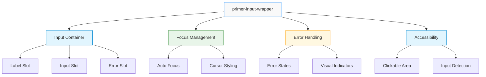
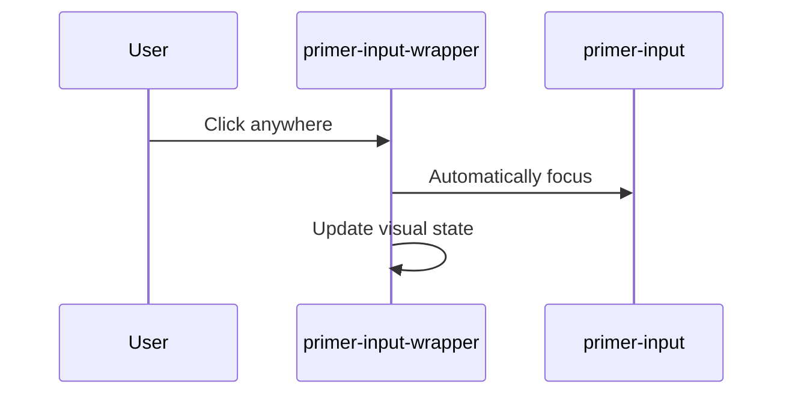

# Input Wrapper Component

## \<primer-input-wrapper\>

The Input Wrapper component creates a robust container for input elements, enhancing user interactions through intelligent focus management, error handling, and consistent styling.



## Key Features

:::info Component Capabilities

- **Enhanced Focus Handling**: Automatically focuses contained inputs
- **Intuitive Interaction**: Entire wrapper is clickable
- **Flexible Styling**: Supports focus and error states
- **Comprehensive Input Support**: Works with standard and hosted inputs
  :::

## Usage Patterns

### Basic Input Wrapper

```html
<primer-input-wrapper>
  <primer-input-label slot="label">Email Address</primer-input-label>
  <primer-input
    slot="input"
    type="email"
    placeholder="you@example.com"
  ></primer-input>
</primer-input-wrapper>
```

### With Error Handling

```html
<primer-input-wrapper has-error>
  <primer-input-label slot="label">Password</primer-input-label>
  <primer-input slot="input" type="password"></primer-input>
  <primer-input-error slot="error">
    Password must be at least 8 characters
  </primer-input-error>
</primer-input-wrapper>
```

## Properties

| Property      | Attribute      | Type      | Default | Description                                 |
| ------------- | -------------- | --------- | ------- | ------------------------------------------- |
| `focusWithin` | `focus-within` | `boolean` | `false` | Indicates if the contained input is focused |
| `hasError`    | `has-error`    | `boolean` | `false` | Applies error styling when true             |

## Interaction Workflow



## Slots

| Name    | Description                                                    |
| ------- | -------------------------------------------------------------- |
| `label` | Container for the input label (typically `primer-input-label`) |
| `input` | Container for the input element                                |
| `error` | Container for error messages                                   |

## Advanced Examples

<div class="tabs-container">
<div class="tabs">
<div class="tab basic active">Basic Wrapper</div>
<div class="tab error">Error State</div>
<div class="tab nested">Nested Inputs</div>
</div>

<div class="tab-content basic active">

```html
<primer-input-wrapper>
  <primer-input-label slot="label">Full Name</primer-input-label>
  <primer-input slot="input" placeholder="Enter your full name"></primer-input>
</primer-input-wrapper>
```

</div>

<div class="tab-content error">

```html
<primer-input-wrapper has-error>
  <primer-input-label slot="label">Email</primer-input-label>
  <primer-input slot="input" type="email"></primer-input>
  <primer-input-error slot="error"> Invalid email address </primer-input-error>
</primer-input-wrapper>
```

</div>

<div class="tab-content nested">

```html
<primer-input-wrapper>
  <primer-input-label slot="label">Search</primer-input-label>
  <div slot="input" style="display: flex; gap: 8px;">
    <primer-input placeholder="Search products..."></primer-input>
    <primer-button>Search</primer-button>
  </div>
</primer-input-wrapper>
```

</div>
</div>

## Styling Customization

<details>
<summary>Customizable CSS Properties</summary>

| Property                                   | Description                             |
| ------------------------------------------ | --------------------------------------- |
| `--primer-color-border-outlined-focus`     | Border color when focused               |
| `--primer-color-border-outlined-error`     | Border color when in error state        |
| `--primer-color-background-outlined-error` | Background color when in error state    |
| `--primer-space-xsmall`                    | Spacing between wrapper elements        |
| `--primer-space-medium`                    | Internal padding of the input container |
| `--primer-radius-small`                    | Border radius for the input container   |

</details>

## Best Practices

:::tip Recommended Approaches

- Always use with `primer-input-label` for consistent styling
- Leverage the built-in focus and error state management
- Use the flexible slot system for complex input layouts
- Ensure proper ID matching between labels and inputs
  :::

## Potential Pitfalls

:::warning Common Mistakes

- Forgetting to set appropriate slots
- Mismatching input and label IDs
- Overriding default styling without considering accessibility
- Neglecting error state handling
  :::

## Component Behavior Notes

- Automatically detects and focuses `primer-input` elements
- Dispatches `wrapper-click` event for hosted inputs
- Changes cursor to indicate text input functionality
  - Provides visual feedback for focus and error states
