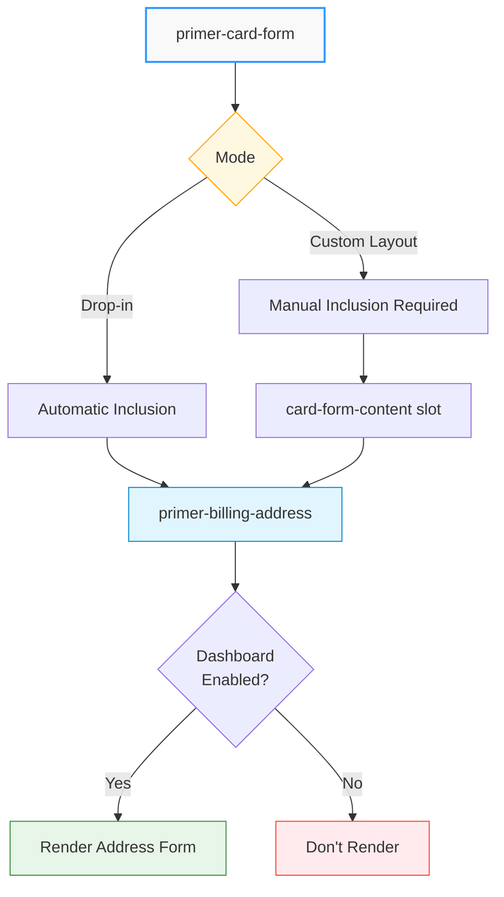

# Billing Address Component

## \<primer-billing-address\>

The `primer-billing-address` component collects customer billing address information during card payment flows. It provides a form interface for capturing address details required for payment processing and fraud prevention. The component integrates seamlessly with card forms and automatically validates address information based on your Dashboard configuration.

:::important SDK Core Requirement
The Billing Address component requires SDK Core to be enabled. This component is not available when `sdkCore: false` is set in your Primer Checkout configuration. Ensure SDK Core is initialized before using this component.
:::

## Usage

The billing address component can be used in two modes depending on your implementation approach.

### Drop-in Mode

In drop-in mode, the billing address component is automatically included in the default card form layout when enabled in your Dashboard settings. No manual inclusion is needed:

```tsx
import { PrimerCheckout } from '@primer-io/primer-js';

const checkout = await PrimerCheckout.create({
  clientToken: 'YOUR_CLIENT_TOKEN',
  sdkCore: true, // Required for billing address
});

// Billing address automatically included when enabled
<primer-card-form></primer-card-form>;
```

:::tip Automatic Inclusion
When using the default card form without custom layout, you don't need to add the billing address component manually. It will appear automatically if enabled in your Primer Dashboard checkout configuration.
:::

### Custom Layout Mode

For custom card form layouts, you must explicitly include the billing address component in the `card-form-content` slot alongside other card input components:

```tsx
import { PrimerCheckout } from '@primer-io/primer-js';

const checkout = await PrimerCheckout.create({
  clientToken: 'YOUR_CLIENT_TOKEN',
  sdkCore: true, // Required
});

<primer-card-form>
  <div slot='card-form-content'>
    <primer-billing-address></primer-billing-address>
    <primer-input-card-holder-name></primer-input-card-holder-name>
    <primer-input-card-number></primer-input-card-number>
    <primer-input-card-expiry></primer-input-card-expiry>
    <primer-input-cvv></primer-input-cvv>
    <primer-button type='submit'>Pay</primer-button>
  </div>
</primer-card-form>;
```

:::note Component Placement
The billing address component must be placed inside a `<primer-card-form>` parent component. It cannot be used independently or outside of a card form context.
:::

## Dashboard Configuration

The billing address component must be enabled in your Primer Dashboard checkout configuration. The Dashboard allows you to configure:

- Which address fields are required or optional
- Address validation rules
- Country restrictions
- Field display order

For detailed setup instructions and configuration options, see the [Primer documentation on capturing billing addresses](https://primer.io/docs/checkout/capture-billing-address#capture-billing-address).

:::warning Configuration Required
If billing address capture is not enabled in your Dashboard, the component will not render even when explicitly added to your custom layout.
:::

## Key Concepts

### Integration with Card Forms

The billing address component is designed to work exclusively within card payment flows. It captures and validates address information before submitting card payment details to ensure compliance with payment processor requirements.



### Validation and Data Collection

The component automatically handles:

- Field validation based on Dashboard configuration
- Address format validation by country
- Required field enforcement
- Error message display for invalid inputs

All validation rules are controlled through your Dashboard settings, ensuring consistency across your payment flows without requiring code changes.

## Styling

The billing address component can be customized using CSS custom properties. Below is the complete list of available CSS variables:

| Property                                      | Purpose                         |
| --------------------------------------------- | ------------------------------- |
| `--primer-space-xsmall`                       | Extra small spacing             |
| `--primer-space-small`                        | Small spacing                   |
| `--primer-space-medium`                       | Medium spacing                  |
| `--primer-space-large`                        | Large spacing                   |
| `--primer-color-text-primary`                 | Primary text color              |
| `--primer-color-text-placeholder`             | Placeholder text color          |
| `--primer-color-text-disabled`                | Disabled text color             |
| `--primer-color-border-outlined-default`      | Default border color            |
| `--primer-color-border-outlined-focus`        | Focus state border color        |
| `--primer-color-border-outlined-hover`        | Hover state border color        |
| `--primer-color-border-outlined-active`       | Active state border color       |
| `--primer-color-border-outlined-disabled`     | Disabled state border color     |
| `--primer-color-border-outlined-error`        | Error state border color        |
| `--primer-color-background-outlined-default`  | Default background color        |
| `--primer-color-background-outlined-hover`    | Hover state background color    |
| `--primer-color-background-outlined-active`   | Active state background color   |
| `--primer-color-background-outlined-disabled` | Disabled state background color |
| `--primer-color-background-outlined-error`    | Error state background color    |
| `--primer-radius-small`                       | Border radius                   |
| `--primer-typography-body-large-font`         | Large body font family          |
| `--primer-typography-body-large-size`         | Large body font size            |
| `--primer-typography-body-large-weight`       | Large body font weight          |
| `--primer-typography-body-large-line-height`  | Large body line height          |
| `--primer-typography-body-medium-font`        | Medium body font family         |

### Styling Example

Apply custom styling to the billing address component by setting CSS variables:

```css
:root {
  /* Spacing customization */
  --primer-space-small: 8px;
  --primer-space-medium: 16px;

  /* Color customization */
  --primer-color-text-primary: #1a1a1a;
  --primer-color-border-outlined-default: #d1d5db;
  --primer-color-border-outlined-focus: #2f98ff;
  --primer-color-border-outlined-error: #ef4444;

  /* Typography customization */
  --primer-typography-body-large-font: 'Inter', sans-serif;
  --primer-typography-body-large-size: 16px;
  --primer-typography-body-large-weight: 400;

  /* Border radius */
  --primer-radius-small: 8px;
}
```

## Examples

<details>
<summary><strong>Basic Card Form with Billing Address</strong></summary>

A minimal implementation using drop-in mode where billing address is automatically included:

```html
<primer-checkout client-token="your-client-token">
  <primer-main slot="main">
    <div slot="payments">
      <primer-payment-method type="PAYMENT_CARD"></primer-payment-method>
    </div>
  </primer-main>
</primer-checkout>

<script type="module">
  import { PrimerCheckout } from '@primer-io/primer-js';

  const checkout = await PrimerCheckout.create({
    clientToken: 'your-client-token',
    sdkCore: true,
  });
</script>
```

</details>

<details>
<summary><strong>Custom Card Form Layout with Billing Address</strong></summary>

A custom layout implementation where billing address is explicitly added with other card components:

```html
<primer-checkout client-token="your-client-token">
  <primer-main slot="main">
    <div slot="payments">
      <primer-card-form>
        <div slot="card-form-content" class="custom-card-form">
          <h3>Billing Address</h3>
          <primer-billing-address></primer-billing-address>

          <h3>Card Details</h3>
          <primer-input-card-holder-name></primer-input-card-holder-name>
          <primer-input-card-number></primer-input-card-number>

          <div class="card-form-row">
            <primer-input-card-expiry></primer-input-card-expiry>
            <primer-input-cvv></primer-input-cvv>
          </div>

          <primer-button type="submit">Complete Payment</primer-button>
        </div>
      </primer-card-form>
    </div>
  </primer-main>
</primer-checkout>

<script type="module">
  import { PrimerCheckout } from '@primer-io/primer-js';

  const checkout = await PrimerCheckout.create({
    clientToken: 'your-client-token',
    sdkCore: true,
  });
</script>

<style>
  .custom-card-form {
    display: flex;
    flex-direction: column;
    gap: 16px;
  }

  .card-form-row {
    display: grid;
    grid-template-columns: 1fr 1fr;
    gap: 12px;
  }
</style>
```

</details>

<details>
<summary><strong>Styled Billing Address Component</strong></summary>

Customize the appearance of the billing address component with CSS variables:

```html
<primer-checkout client-token="your-client-token">
  <primer-main slot="main">
    <div slot="payments">
      <primer-card-form>
        <div slot="card-form-content">
          <primer-billing-address></primer-billing-address>
          <primer-input-card-number></primer-input-card-number>
          <primer-input-card-expiry></primer-input-card-expiry>
          <primer-input-cvv></primer-input-cvv>
          <primer-button type="submit">Pay</primer-button>
        </div>
      </primer-card-form>
    </div>
  </primer-main>
</primer-checkout>

<script type="module">
  import { PrimerCheckout } from '@primer-io/primer-js';

  const checkout = await PrimerCheckout.create({
    clientToken: 'your-client-token',
    sdkCore: true,
  });
</script>

<style>
  :root {
    /* Spacing */
    --primer-space-small: 8px;
    --primer-space-medium: 16px;
    --primer-space-large: 24px;

    /* Colors */
    --primer-color-text-primary: #111827;
    --primer-color-text-placeholder: #9ca3af;
    --primer-color-border-outlined-default: #d1d5db;
    --primer-color-border-outlined-focus: #3b82f6;
    --primer-color-border-outlined-error: #ef4444;
    --primer-color-background-outlined-default: #ffffff;
    --primer-color-background-outlined-hover: #f9fafb;

    /* Typography */
    --primer-typography-body-large-font: 'Inter', -apple-system, sans-serif;
    --primer-typography-body-large-size: 16px;
    --primer-typography-body-large-weight: 400;
    --primer-typography-body-large-line-height: 1.5;

    /* Border radius */
    --primer-radius-small: 8px;
  }
</style>
```

</details>

## Key Considerations

:::info Summary

- The billing address component requires SDK Core to be enabled (`sdkCore: true`)
- Must be used inside a `<primer-card-form>` parent component
- Automatically included in drop-in mode when enabled in Dashboard
- Must be explicitly added in custom layouts via the `card-form-content` slot
- Configuration and validation rules are managed through the Primer Dashboard
- The component will not render if billing address is not enabled in Dashboard settings
- Supports comprehensive styling through 25 CSS custom properties
- Has no props/attributes or events to configure
- Field requirements and validation are controlled server-side through Dashboard configuration

:::

## Related Documentation

- [Card Form Component](/sdk-reference/Components/CardForm/) - Parent component for billing address
- [Layout Customizations Guide](/documentation/layout-customizations-guide) - Creating custom card form layouts
- [Primer Billing Address Documentation](https://primer.io/docs/checkout/capture-billing-address#capture-billing-address) - Dashboard configuration guide
