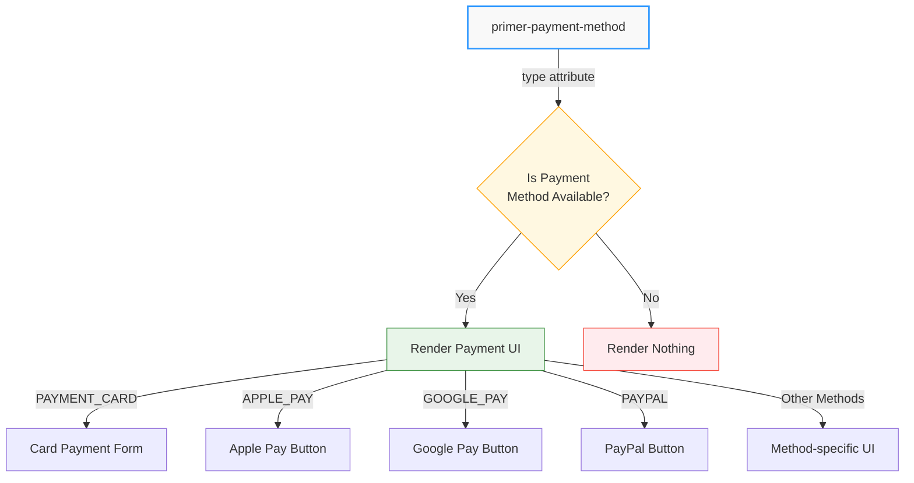
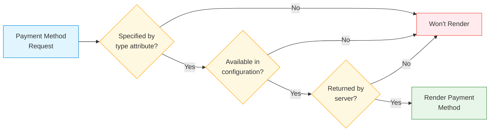
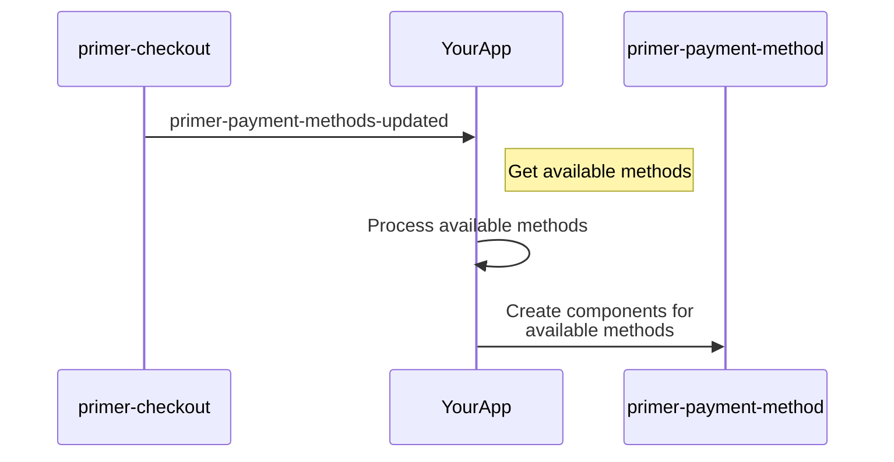

# Payment Method Component

## \<primer-payment-method\>

The `PaymentMethod` component renders the appropriate payment interface based on the specified payment method type. It automatically handles different payment method categories and only displays methods that are available in your checkout configuration.



## Usage

```html
<primer-checkout client-token="your-client-token">
  <primer-main slot="main">
    <div slot="payments">
      <primer-payment-method type="PAYMENT_CARD"></primer-payment-method>
      <primer-payment-method type="PAYPAL"></primer-payment-method>
      <primer-payment-method type="GOOGLE_PAY" disabled></primer-payment-method>
    </div>
  </primer-main>
</primer-checkout>
```

## Properties

| Name       | Type      | Description                                                         | Default     |
| ---------- | --------- | ------------------------------------------------------------------- | ----------- |
| `type`     | `String`  | The payment method type identifier (e.g., "PAYMENT_CARD", "PAYPAL") | `undefined` |
| `disabled` | `Boolean` | When true, disables the payment method making it non-interactive    | `false`     |

## Key Concepts

### Configuration-Based Rendering

The `primer-payment-method` component only renders payment methods that are:



1. **Specified by the type attribute** - You declare which payment method you want to display
2. **Available in your checkout configuration** - The method must be enabled in your Primer Checkout Builder settings
3. **Returned by the server** - The method must be returned in the available payment methods list

:::tip
If a payment method isn't available (not configured or not returned by the server), the component simply won't render anything rather than showing an error. This makes it safe to include multiple payment method components even if some methods might not be available in all contexts.
:::

### Dynamic Payment Method Discovery

The best way to work with payment methods is to listen for the `primer-payment-methods-updated` event, which provides the complete list of available payment methods for your checkout configuration. This approach lets you dynamically render only the methods that are actually available.



## Disabled State

The `disabled` attribute allows you to disable specific payment methods, making them unclickable and non-interactive. This is useful for:

- Temporarily disabling payment methods during checkout flow
- Preventing interaction while processing other payments
- Implementing conditional payment method availability

```html
<!-- Disable specific payment methods -->
<primer-payment-method type="PAYPAL" disabled></primer-payment-method>
<primer-payment-method type="GOOGLE_PAY" disabled></primer-payment-method>
<primer-payment-method type="APPLE_PAY" disabled></primer-payment-method>
```

### React Integration

In React applications, you can conditionally apply the disabled attribute:

```jsx
// Conditional disabling in React
<primer-payment-method
  type="PAYPAL"
  {...(isProcessing && { disabled: true })}
/>

// Or with explicit boolean
<primer-payment-method
  type="GOOGLE_PAY"
  disabled={!isPaymentMethodAvailable}
/>
```

### JavaScript Control

You can dynamically enable/disable payment methods using JavaScript:

```javascript
const paymentMethod = document.querySelector(
  'primer-payment-method[type="PAYPAL"]',
);

// Disable the payment method
paymentMethod.setAttribute('disabled', '');

// Enable the payment method
paymentMethod.removeAttribute('disabled');
```

## Examples

<details>
<summary><strong>Best Practice: Dynamic Payment Method Rendering</strong></summary>

This example shows how to listen for available payment methods and dynamically render them:

```html
<primer-checkout id="checkout" client-token="your-client-token">
  <primer-main slot="main">
    <div slot="payments" id="payment-methods-container">
      <!-- Payment methods will be inserted here -->
    </div>
  </primer-main>
</primer-checkout>

<script>
  const checkout = document.getElementById('checkout');

  checkout.addEventListener('primer-payment-methods-updated', (event) => {
    const paymentMethods = event.detail;
    const container = document.getElementById('payment-methods-container');

    // Clear previous content
    container.innerHTML = '';

    // Render all available payment methods
    paymentMethods.toArray().forEach((method) => {
      container.innerHTML += `
        <div class="payment-method-item">
          <primer-payment-method type="${method.type}"></primer-payment-method>
        </div>
      `;
    });
  });
</script>
```

</details>

<details>
<summary><strong>Custom Layout with Priority Ordering</strong></summary>

This example shows how to create a custom layout where certain payment methods are prioritized:

```html
<primer-checkout id="checkout" client-token="your-client-token">
  <primer-main slot="main">
    <div slot="payments">
      <!-- Prioritize card payment (only displays if available) -->
      <div class="primary-payment-method">
        <primer-payment-method type="PAYMENT_CARD"></primer-payment-method>
      </div>

      <!-- Digital wallets section -->
      <div id="wallets-container" class="payment-section">
        <h3>Quick Checkout</h3>
        <div class="wallet-methods">
          <primer-payment-method type="APPLE_PAY"></primer-payment-method>
          <primer-payment-method type="GOOGLE_PAY"></primer-payment-method>
        </div>
      </div>

      <!-- Other methods will be dynamically added here -->
      <div id="other-methods-container" class="payment-section"></div>
    </div>
  </primer-main>
</primer-checkout>

<script>
  const checkout = document.getElementById('checkout');

  // Define payment method categories
  const walletTypes = ['APPLE_PAY', 'GOOGLE_PAY'];
  const priorityTypes = ['PAYMENT_CARD', 'APPLE_PAY', 'GOOGLE_PAY'];

  checkout.addEventListener('primer-payment-methods-updated', (event) => {
    const paymentMethods = event.detail;
    const allMethods = paymentMethods.toArray();
    const otherContainer = document.getElementById('other-methods-container');
    const walletsContainer = document.getElementById('wallets-container');

    // Check if any wallet methods are available
    const hasWallets = allMethods.some((method) =>
      walletTypes.includes(method.type),
    );

    // Hide wallets container if no wallet methods are available
    if (!hasWallets) {
      walletsContainer.style.display = 'none';
    }

    // Add other payment methods (excluding priority ones)
    const otherMethods = allMethods.filter(
      (method) => !priorityTypes.includes(method.type),
    );

    if (otherMethods.length > 0) {
      otherContainer.innerHTML = '<h3>Other Payment Options</h3>';

      otherMethods.forEach((method) => {
        otherContainer.innerHTML += `
          <div class="payment-method-item">
            <primer-payment-method type="${method.type}"></primer-payment-method>
          </div>
        `;
      });
    } else {
      otherContainer.style.display = 'none';
    }
  });
</script>
```

</details>

<details>
<summary><strong>Custom Payment Method with Options Configuration</strong></summary>

```html
<primer-checkout id="checkout" client-token="your-client-token">
  <primer-main slot="main">
    <div slot="payments">
      <primer-payment-method type="PAYMENT_CARD"></primer-payment-method>
    </div>
  </primer-main>
</primer-checkout>

<script>
  const checkout = document.getElementById('checkout');

  // Configure card payment options
  checkout.options = {
    card: {
      cardholderName: {
        required: true,
      },
      allowedCardNetworks: ['visa', 'mastercard', 'amex'],
    },
  };
</script>
```

</details>

<details>
<summary><strong>Disabling Payment Methods During Processing</strong></summary>

```html
<primer-checkout id="checkout" client-token="your-client-token">
  <primer-main slot="main">
    <div slot="payments" id="payment-methods">
      <primer-payment-method
        type="PAYMENT_CARD"
        id="card-payment"
      ></primer-payment-method>
      <primer-payment-method
        type="PAYPAL"
        id="paypal-payment"
      ></primer-payment-method>
      <primer-payment-method
        type="GOOGLE_PAY"
        id="googlepay-payment"
      ></primer-payment-method>
    </div>
  </primer-main>
</primer-checkout>

<script>
  const checkout = document.getElementById('checkout');

  // Listen for payment state changes
  checkout.addEventListener('primer:state-change', (event) => {
    const state = event.detail;
    const paymentMethods = document.querySelectorAll('primer-payment-method');

    if (state.isProcessing) {
      // Disable all payment methods during processing
      paymentMethods.forEach((pm) => pm.setAttribute('disabled', ''));
    } else {
      // Re-enable payment methods when not processing
      paymentMethods.forEach((pm) => pm.removeAttribute('disabled'));
    }
  });
</script>
```

</details>

## Available Payment Method Types

The Primer SDK supports a wide range of payment methods. Here are some of the commonly used types:

<div class="tabs-container">
<div class="tabs">
<div class="tab core active">Core Payment Types</div>
<div class="tab banking">Online Banking</div>
<div class="tab bnpl">Buy Now, Pay Later</div>
<div class="tab regional">Regional Methods</div>
<div class="tab crypto">Cryptocurrency</div>
</div>

<div class="tab-content core active">

- `PAYMENT_CARD` - Standard card payments
- `APPLE_PAY` - Apple Pay
- `GOOGLE_PAY` - Google Pay
- `PAYPAL` - PayPal payments
- `KLARNA` - Klarna payments

</div>

<div class="tab-content banking">

- Various iDEAL implementations: `ADYEN_IDEAL`, etc.
- SOFORT implementations: `ADYEN_SOFORT`, `MOLLIE_SOFORT`, `PAY_NL_SOFORT_BANKING`, etc.

</div>

<div class="tab-content bnpl">

- `CLEARPAY` - Clearpay/Afterpay
- `HOOLAH` - Hoolah
- `ATOME` - Atome

</div>

<div class="tab-content regional">

- Multiple Bancontact implementations: `ADYEN_BANCONTACT_CARD`, `PAY_NL_BANCONTACT`, etc.
- GiroPay implementations: `ADYEN_GIROPAY`, `BUCKAROO_GIROPAY`, etc.
- Regional wallets: `RAPYD_GRABPAY`, `XENDIT_DANA`, etc.

</div>

<div class="tab-content crypto">

- `COINBASE` - Coinbase cryptocurrency payments
- `OPENNODE` - OpenNode Bitcoin payments

</div>
</div>

:::important Web Headless Support
At the moment, Primer Checkout supports only payment methods that are compatible with Primer's Web Headless SDK. Before implementing any payment method through Primer Checkout, developers should reference the [Available Payment Methods](https://primer.io/docs/payment-methods/available-payment-methods) documentation, which provides detailed information about which payment methods are supported in which regions and integrations.

The actual availability of payment methods depends on your Primer account configuration, merchant location, and the customer's country. The component will only render payment methods that are both specified in your code AND available in your checkout configuration.
:::

## Configuring Payment Methods

Each payment method type can be configured through the `options` property of the `primer-checkout` component:

```html
<primer-checkout id="checkout" client-token="your-client-token">
  <primer-main slot="main">
    <div slot="payments">
      <primer-payment-method type="PAYMENT_CARD"></primer-payment-method>
      <primer-payment-method type="GOOGLE_PAY"></primer-payment-method>
    </div>
  </primer-main>
</primer-checkout>

<script>
  document.getElementById('checkout').options = {
    // Card payment configuration
    card: {
      cardholderName: {
        required: true,
      },
    },

    // Google Pay configuration
    googlePay: {
      buttonTheme: 'dark',
      buttonType: 'buy',
    },
  };
</script>
```

## Key Considerations

:::info Summary

- Payment methods must be configured in your Primer Checkout Builder settings to be displayed
- If a payment method is specified but not available, the component won't render anything (no error)
- The component automatically determines which payment interface to render based on the payment method's type
- Always listen to the `primer-payment-methods-updated` event to get the current list of available payment methods
- The component must be used within a `primer-checkout` context to access payment methods
- The `disabled` attribute makes payment methods non-interactive but they remain visible
- Disabled payment methods prevent user interaction and form submission
- Visual feedback for disabled state is handled by individual button components
  :::
