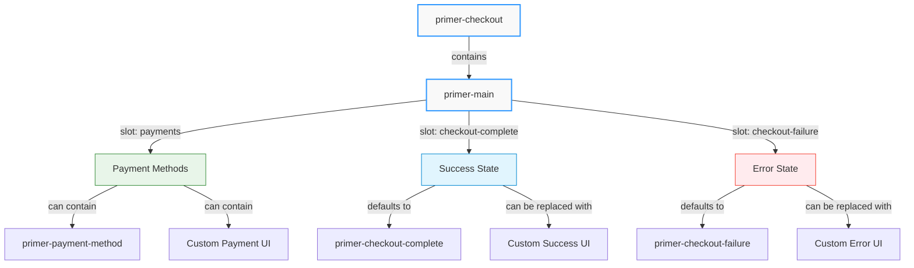
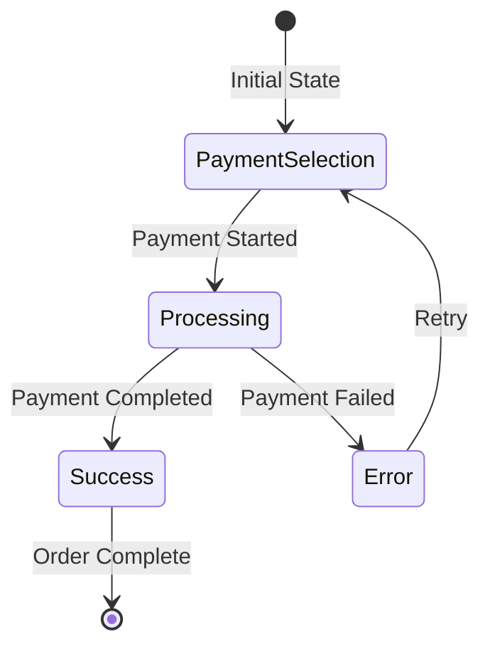
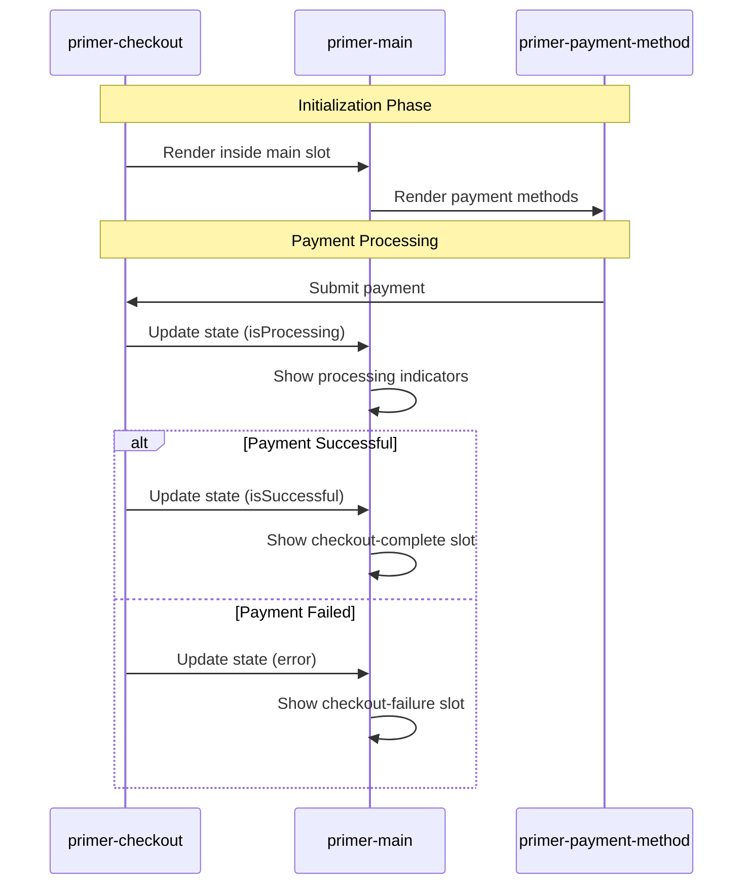

# Main Component

## \<primer-main\>

The `primer-main` component serves as an optional container for payment methods within the checkout flow. Similar to an HTML `<main>` tag that signals the main content of a page, `primer-main` acts as the main container of your checkout application, providing organized structure for different checkout states.

This component manages the display of payment options and checkout completion states through a flexible slot system, but developers can choose to bypass it entirely for fully custom implementations.



## Usage

<div class="tabs-container">
<div class="tabs">
<div class="tab default active">Basic Usage (Default Layout)</div>
<div class="tab custom">Custom Layout</div>
<div class="tab bypass">Bypassing primer-main</div>
</div>

<div class="tab-content default active">

```html
<primer-checkout client-token="your-client-token">
  <primer-main slot="main"></primer-main>
</primer-checkout>
```

This renders a complete list of all available payment methods automatically.

</div>

<div class="tab-content custom">

```html
<primer-checkout client-token="your-client-token">
  <primer-main slot="main">
    <div slot="payments">
      <primer-payment-method type="PAYMENT_CARD"></primer-payment-method>
      <primer-payment-method type="PAYPAL"></primer-payment-method>
    </div>
  </primer-main>
</primer-checkout>
```

</div>

<div class="tab-content bypass">

```html
<primer-checkout client-token="your-client-token">
  <div slot="main">
    <!-- Your completely custom checkout implementation -->
    <div class="payment-selection">
      <h2>Select Payment Method</h2>
      <primer-payment-method type="PAYMENT_CARD"></primer-payment-method>
    </div>
  </div>
</primer-checkout>
```

</div>
</div>

## Slots

| Name                | Description                                                                                                  |
| ------------------- | ------------------------------------------------------------------------------------------------------------ |
| `payments`          | Custom content slot for payment methods. When provided, it replaces the default payment methods list.        |
| `checkout-complete` | Custom content slot for the checkout completion state. Defaults to the `primer-checkout-complete` component. |
| `checkout-failure`  | Custom content slot for the checkout failure state. Defaults to the `primer-checkout-failure` component.     |

:::info
If you don't provide content for these slots, the component will use default implementations that handle common checkout scenarios automatically.
:::

## States

The Main component automatically manages different checkout states:



1. **Default state**: Displays payment methods
2. **Success state**: Displays checkout completion content when the payment is successful
3. **Error state**: Displays checkout failure content when an error occurs
4. **Processing state**: Applies visual feedback when the checkout is processing

:::tip
When using `primer-main`, you don't need to manually handle state transitions - the component listens to events from `primer-checkout` and updates the UI accordingly.
:::

## CSS Custom Properties

The Main component uses the following CSS custom properties for styling:

| Property               | Description                                           |
| ---------------------- | ----------------------------------------------------- |
| `--primer-space-small` | Spacing between payment method items (default: `8px`) |

## Examples

<details>
<summary><strong>Custom Completion State</strong></summary>

```html
<primer-checkout client-token="your-client-token">
  <primer-main slot="main">
    <div slot="checkout-complete">
      <h2>Thank you for your order!</h2>
      <p>Your payment has been processed successfully.</p>
      <button onclick="window.location.href='/orders'">View Your Orders</button>
    </div>
  </primer-main>
</primer-checkout>
```

This example shows how to create a custom success screen that appears after a successful payment, with a button that redirects customers to their orders page.

</details>

<details>
<summary><strong>Custom Error State</strong></summary>

```html
<primer-checkout client-token="your-client-token">
  <primer-main slot="main">
    <div slot="checkout-failure">
      <h2>Something went wrong</h2>
      <p>We couldn't process your payment. Please try again.</p>
      <button onclick="window.location.reload()">Try Again</button>
    </div>
  </primer-main>
</primer-checkout>
```

This example demonstrates how to create a custom error screen that appears when a payment fails, with a button that reloads the page for the customer to try again.

</details>

<details>
<summary><strong>Combined Custom Layout Example</strong></summary>

```html
<primer-checkout client-token="your-client-token">
  <primer-main slot="main">
    <!-- Custom payment methods layout -->
    <div slot="payments">
      <h2>Choose how you'd like to pay</h2>
      <div class="payment-options">
        <primer-payment-method type="PAYMENT_CARD"></primer-payment-method>
        <primer-payment-method type="PAYPAL"></primer-payment-method>
      </div>
    </div>

    <!-- Custom success state -->
    <div slot="checkout-complete">
      <h2>Thank you for your order!</h2>
      <p>Your payment has been processed successfully.</p>
      <button onclick="window.location.href='/orders'">View Your Orders</button>
    </div>

    <!-- Custom error state -->
    <div slot="checkout-failure">
      <h2>Something went wrong</h2>
      <p>We couldn't process your payment. Please try again.</p>
      <button onclick="window.location.reload()">Try Again</button>
    </div>
  </primer-main>
</primer-checkout>
```

This comprehensive example shows how to customize all three main slots within the `primer-main` component, creating a fully customized checkout experience while still leveraging the component's built-in state management.

</details>

## Key Considerations

:::info Summary

- `primer-main` is an optional component that acts as a structured container within the `primer-checkout` component
- When used, it automatically handles checkout completion and error states through its slot system
- It can be bypassed entirely by placing custom content directly in the `main` slot of `primer-checkout`
- For custom implementations without `primer-main`, you'll need to listen to checkout state events to manage different states
- The component must be used within a `primer-checkout` component when employed
  :::


